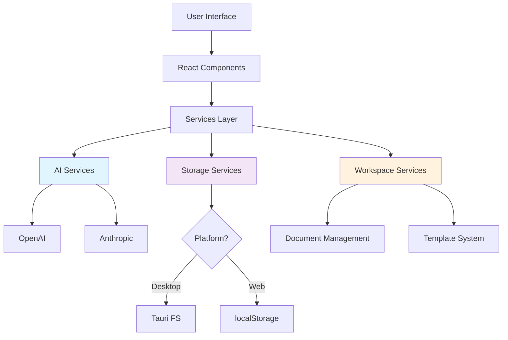

# 📊 Repository Analysis - Quick Summary

> **TL;DR**: High-quality AI-native office suite with excellent architecture, comprehensive docs, but needs tests, route consolidation, and deployment pipeline before production launch.

---

## 🎯 At a Glance

```
Project Health: 🟢🟢🟢🟢⚪ 4/5
Code Quality:   🟢🟢🟢🟢🟢 5/5
Documentation:  🟢🟢🟢🟢🟢 5/5
Testing:        🔴⚪⚪⚪⚪ 1/5 (NEEDS WORK)
Production:     🟡🟡🟡⚪⚪ 3/5 (GETTING THERE)
```

---

## 📈 Stats

| Metric | Value |
|--------|-------|
| **Code Files** | 136 TS/TSX files |
| **Lines of Code** | ~30,440 |
| **Documentation** | 65+ markdown files |
| **Components** | 50+ UI components |
| **Services** | 11 service modules |
| **Dependencies** | 77 packages |
| **Tech Debt** | Low-Medium |

---

## ✅ What's Great

### 🌟 **Innovation**
- ✨ Dual-mode AI chat (Brainstorm vs Command)
- ✨ AI context memory (understands "them", "those")
- ✨ Proactive suggestions (detects empty nodes)
- ✨ Hybrid storage (desktop files + web localStorage)

### 💪 **Technical Excellence**
- ✅ 100% TypeScript
- ✅ Modern React patterns
- ✅ Clean service architecture
- ✅ Production-ready error handling
- ✅ Comprehensive documentation

### 🎨 **User Experience**
- ✅ Beautiful UI (shadcn + Tailwind)
- ✅ Dark/light mode
- ✅ Guest mode (no signup required)
- ✅ Desktop + Web parity

---

## ⚠️ What Needs Work

### 🔴 **Critical Issues**

1. **No Automated Tests**
   - Impact: HIGH - Refactoring risk
   - Fix: Add Vitest + React Testing Library
   - Time: 2 weeks

2. **Route Confusion**
   - `/workspace` (new) vs `/dashboard` (old)
   - 3 mindmap versions (studio, studio1, studio2)
   - Impact: MEDIUM - User confusion
   - Fix: Consolidate routes
   - Time: 1 week

### 🟡 **Medium Issues**

3. **Documentation Mismatch**
   - Docs mention Vue.js/Pinia
   - Code is React/TypeScript
   - Impact: MEDIUM - Developer confusion
   - Fix: Audit docs
   - Time: 3 days

4. **Generic Package Name**
   - `"vite_react_shadcn_ts"`
   - Impact: LOW - Branding
   - Fix: Rename to `md-mindmap`
   - Time: 1 hour

5. **No Deployment Pipeline**
   - Impact: MEDIUM - Manual releases
   - Fix: GitHub Actions CI/CD
   - Time: 1 week

---

## 🚀 Feature Status

| Feature | Status | Quality |
|---------|--------|---------|
| **Markdown Editor** | ✅ Complete | ⭐⭐⭐⭐⭐ |
| **Mindmap Studio** | ✅ Complete | ⭐⭐⭐⭐⭐ |
| **AI Integration** | ✅ Complete | ⭐⭐⭐⭐⭐ |
| **Presentations** | 🟡 Partial | ⭐⭐⭐⭐ |
| **Workspace** | ✅ Complete | ⭐⭐⭐⭐ |
| **Desktop App** | ✅ Complete | ⭐⭐⭐⭐ |
| **Guest Mode** | ✅ Complete | ⭐⭐⭐⭐⭐ |
| **Authentication** | ❌ Missing | - |
| **Collaboration** | ❌ Missing | - |
| **Mobile** | ❌ Missing | - |

---

## 📊 Architecture Diagram



---

## 🎯 Tech Stack

### **Frontend**
```
React 18 + TypeScript 5.8
├─ UI: shadcn + Radix + Tailwind
├─ Routing: React Router 6
├─ State: TanStack Query
├─ Mindmap: React Flow + D3 + elkjs
└─ Markdown: markdown-it + Mermaid
```

### **Desktop**
```
Tauri 2.8 (Rust)
├─ File System Access
├─ Native Dialogs
└─ Small Binary (~5-10MB)
```

### **AI**
```
Multi-Provider
├─ OpenAI (gpt-4, gpt-3.5-turbo)
└─ Anthropic (claude-3-sonnet/opus)
```

---

## 💡 Unique Innovations

### **1. Conversational Brainstorming** 🌟
```
💬 Brainstorm Mode:
User: "I'm building a mobile app"
AI: "What type of app? Who's your target audience?"
User: "Fitness tracking for runners"
AI: "Great! Should I add nodes for: User Auth, 
     Activity Tracking, Social Features?"
User: "Yes, add them"
AI: [Creates 3 nodes]
```

### **2. AI Context Memory** 🌟
```
User: "Add Marketing, Sales, and Dev nodes"
AI: [Creates 3 nodes]
User: "Enhance them with details"
AI: [Remembers "them" = those 3 nodes]
```

### **3. Proactive Suggestions** 🌟
```
[System detects empty node]
💡 "This node looks empty. Would you like me 
    to add content based on its title?"
```

---

## 🏆 Competitive Advantage

| Feature | MD Mindmap | Notion | Obsidian | Miro |
|---------|------------|--------|----------|------|
| **AI-Native** | ✅ | 🟡 | ❌ | 🟡 |
| **Markdown** | ✅ | 🟡 | ✅ | ❌ |
| **Mindmaps** | ✅ | ❌ | 🟡 | ✅ |
| **Desktop App** | ✅ | ✅ | ✅ | ✅ |
| **Offline** | ✅ | 🟡 | ✅ | ❌ |
| **Git-Friendly** | ✅ | ❌ | ✅ | ❌ |
| **Free Tier** | ✅ (3/day) | ✅ | ✅ | ✅ |

---

## 📅 Roadmap to Production

### **Phase 1: Quality (Weeks 1-2)**
- [ ] Add Vitest testing framework
- [ ] Write tests for AI services
- [ ] Write tests for guest credits
- [ ] Set up GitHub Actions CI

### **Phase 2: Consolidation (Weeks 3-4)**
- [ ] Merge /workspace and /dashboard
- [ ] Remove old mindmap versions
- [ ] Update all documentation
- [ ] Rename package to md-mindmap

### **Phase 3: Production (Month 2)**
- [ ] Add user authentication
- [ ] Set up error tracking (Sentry)
- [ ] Performance optimization
- [ ] Security audit
- [ ] Desktop app signing

### **Phase 4: Launch (Month 3)**
- [ ] Beta testing program (50 users)
- [ ] Marketing website
- [ ] App store distribution
- [ ] Product Hunt launch

**Total Timeline**: 3 months to stable 1.0

---

## 🎓 For New Developers

### **Quick Start** (10 minutes)
```bash
# 1. Clone & install
git clone https://github.com/NaumSimi11/md-mindmap.git
cd md-mindmap
npm install

# 2. Set up environment
cp .env.example .env.local
# Edit .env.local - add your OpenAI key

# 3. Run development server
npm run dev
# Opens at http://localhost:8080

# 4. Or run desktop app
npm run tauri:dev
```

### **Key Files to Understand**
1. `src/App.tsx` - Routing structure
2. `src/config/aiConfig.ts` - AI configuration
3. `src/services/ai/AIService.ts` - AI providers
4. `src/services/mindmap/MindmapAIService.ts` - Mindmap AI
5. `src/contexts/PlatformContext.tsx` - Desktop vs Web

### **Development Workflow**
1. Pick a feature from recommendations
2. Create a branch: `git checkout -b feature/your-feature`
3. Make changes
4. Test manually (no automated tests yet 😢)
5. Open PR with description

---

## 📚 Documentation

### **Must-Read**
1. [AI Setup Guide](docs/AI_SETUP.md)
2. [Brainstorm Mode](docs/BRAINSTORM_MODE_COMPLETE.md)
3. [Architecture](docs/architecture/ai-integration.md)

### **Feature Docs** (65+ files)
- AI features (10 docs)
- Mindmap features (8 docs)
- Workspace features (5 docs)
- Architecture (4 docs)
- Development guides (6 docs)

---

## 🤝 Contributing

### **Good First Issues**
1. Add Vitest configuration
2. Write tests for `guestCredits.ts`
3. Update package.json name
4. Fix documentation Vue.js references
5. Add GitHub Actions workflow

### **Advanced Issues**
1. Consolidate routes
2. Add user authentication
3. Implement real-time collaboration
4. Mobile responsive layout
5. Plugin system architecture

---

## 🔗 Resources

- **Repository**: https://github.com/NaumSimi11/md-mindmap
- **Full Analysis**: See `REPOSITORY_ANALYSIS.md`
- **Documentation**: See `docs/` directory
- **AI Setup**: See `docs/AI_SETUP.md`
- **Environment**: See `.env.example`

---

## 📞 Support

**Found Issues?** Open a GitHub issue  
**Questions?** Check `docs/README.md`  
**Want to Contribute?** See Contributing section above

---

**Last Updated**: October 7, 2025  
**Analysis Version**: 1.0  
**Status**: ✅ Repository Ready for Development
