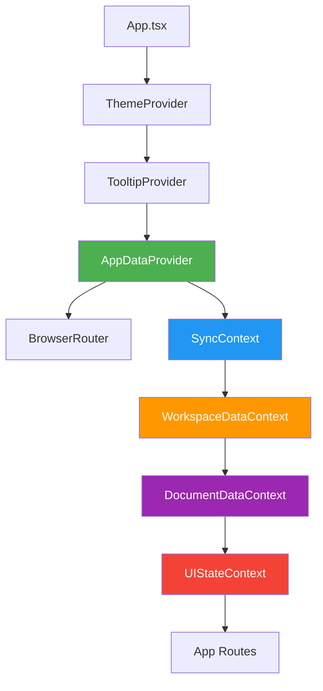
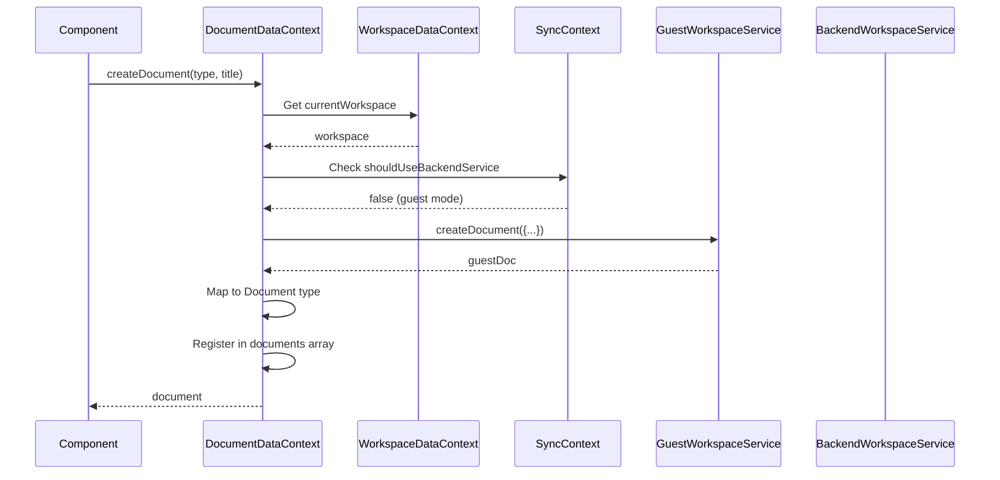
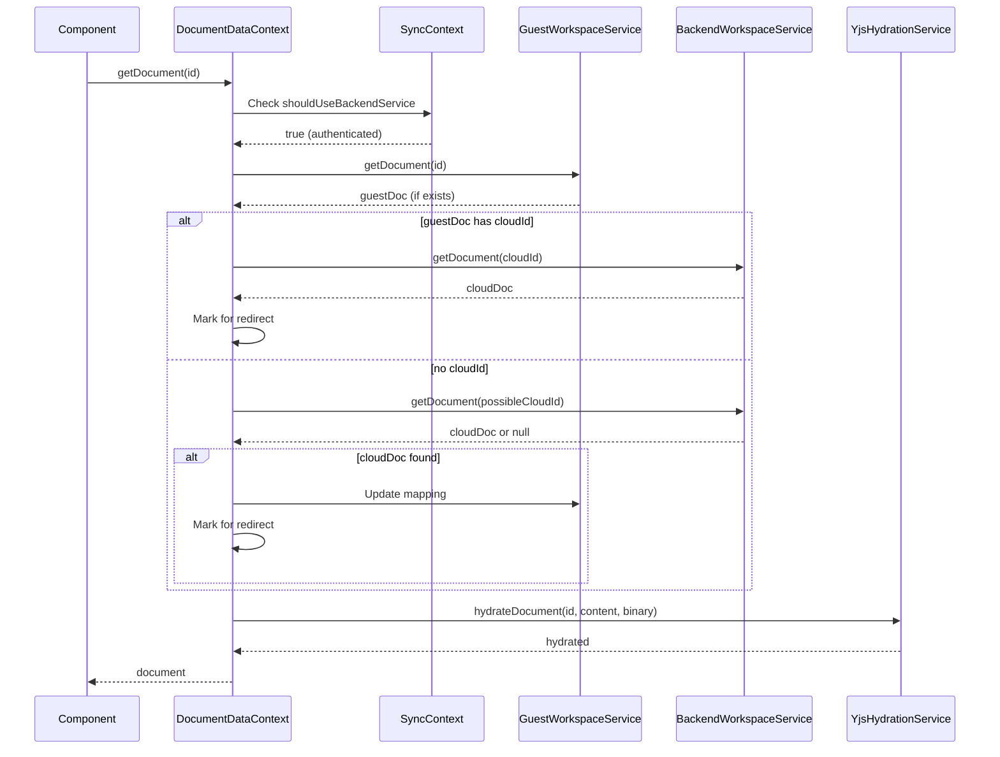
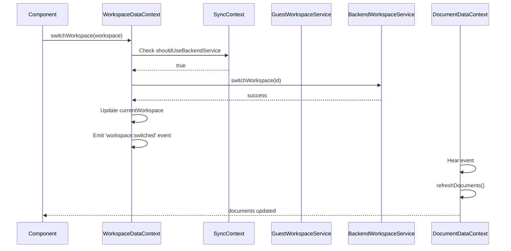

# MDReader Context Architecture

## 🏗️ Provider Hierarchy



---

## 📦 Context Responsibilities

### 1. SyncContext (Blue Layer)

```
┌─────────────────────────────────────┐
│         SyncContext                 │
│  (Dual Storage Orchestration)       │
├─────────────────────────────────────┤
│ • Auth state monitoring             │
│ • Service selection:                │
│   - Guest (local IndexedDB)         │
│   - Backend (cloud + cache)         │
│ • Re-initialization triggers        │
│ • Login event handling              │
└─────────────────────────────────────┘
```

**Exported State:**
- `shouldUseBackendService: boolean`
- `isBackendInitialized: boolean`
- `initCounter: number`
- `forceReinit: () => void`

---

### 2. WorkspaceDataContext (Orange Layer)

```
┌─────────────────────────────────────┐
│      WorkspaceDataContext           │
│     (Workspace State)               │
├─────────────────────────────────────┤
│ • Current workspace                 │
│ • Workspace list (local + cloud)    │
│ • Workspace CRUD                    │
│ • Canonical key deduplication       │
│ • Guest/backend merge               │
└─────────────────────────────────────┘
```

**Exported State:**
- `workspaces: Workspace[]`
- `currentWorkspace: Workspace | null`
- `isLoading: boolean`
- `error: string | null`
- `switchWorkspace(workspace) => Promise<void>`
- `createWorkspace(data) => Promise<Workspace>`
- `reloadWorkspaces() => Promise<void>`

**Events Emitted:**
- `workspace:switched`
- `workspace:created`

---

### 3. DocumentDataContext (Purple Layer)

```
┌─────────────────────────────────────┐
│     DocumentDataContext             │
│      (Document State)               │
├─────────────────────────────────────┤
│ • Document list for workspace       │
│ • Document CRUD                     │
│ • Document fetching (with content)  │
│ • Yjs hydration                     │
│ • Auto-save logic                   │
│ • Canonical key deduplication       │
│ • Sync event handling               │
└─────────────────────────────────────┘
```

**Exported State:**
- `documents: Document[]`
- `getDocument(id) => Promise<Document | undefined>`
- `createDocument(...) => Promise<Document>`
- `updateDocument(id, updates) => Promise<void>`
- `deleteDocument(id) => Promise<void>`
- `refreshDocuments() => Promise<void>`
- `autoSaveDocument(id, content) => void`

**Events Listened:**
- `workspace:switched`
- `workspace:created`
- `document-synced`
- `document-sync-status-changed`
- `offline-data-loaded`

---

### 4. UIStateContext (Red Layer)

```
┌─────────────────────────────────────┐
│         UIStateContext              │
│      (Modal & Prompt UI)            │
├─────────────────────────────────────┤
│ • Reload prompt (file watcher)      │
│ • Guest doc migration prompt        │
│ • Guest mode explainer toast        │
│ • Modal rendering logic             │
└─────────────────────────────────────┘
```

**Exported State:**
- `reloadPrompt: {...} | null`
- `dismissReloadPrompt() => void`
- `guestDocumentPrompt: {...} | null`
- `handlePushGuestDocuments() => Promise<void>`
- `dismissGuestDocumentPrompt() => void`
- `showGuestExplainer: boolean`
- `dismissGuestExplainer() => void`

**Events Listened:**
- `auth:login` (to show migration prompt)
- `first-guest-document-created` (to show explainer)
- File watcher events (Tauri)

**UI Rendered:**
- `<ReloadModalWrapper />`
- Guest document migration modal
- Guest explainer toast

---

## 🔄 Data Flow

### Document Creation Flow



### Authenticated Document Fetch Flow



### Workspace Switch Flow



---

## 🧩 Service Layer

### YjsHydrationService (Pure Service)

```
┌─────────────────────────────────────┐
│      YjsHydrationService            │
│       (Pure Service)                │
├─────────────────────────────────────┤
│ NO React Dependencies               │
│ NO Context                          │
│ Just pure Yjs operations            │
├─────────────────────────────────────┤
│ • hydrateDocument(...)              │
│   Priority:                         │
│   1. Yjs binary (authoritative)     │
│   2. Markdown (legacy fallback)     │
│                                     │
│ • snapshotBeforeReload(...)         │
│   Save state vector for debugging   │
└─────────────────────────────────────┘
```

**Rules:**
- Only hydrate when `fragment.length === 0`
- Never hydrate while `HocuspocusProvider` is active
- Binary state always takes precedence

---

## 🔗 Dependencies

### Context Dependencies

```
SyncContext
├── Depends on: AuthContext (via useAuth)
└── Used by: WorkspaceDataContext, DocumentDataContext

WorkspaceDataContext
├── Depends on: SyncContext
└── Used by: DocumentDataContext, Components

DocumentDataContext
├── Depends on: SyncContext, WorkspaceDataContext
└── Used by: Components

UIStateContext
├── Depends on: WorkspaceDataContext, DocumentDataContext
└── Used by: Components (for state only, renders UI itself)
```

### Service Dependencies

```
YjsHydrationService
├── Depends on: Yjs, YjsDocumentManager, markdownToHtml
└── Used by: DocumentDataContext
```

---

## 📡 Event System

### Custom Events

```
auth:login
├── Emitted by: Login flow
├── Listened by: SyncContext, UIStateContext
└── Payload: { user }

workspace:switched
├── Emitted by: WorkspaceDataContext
├── Listened by: DocumentDataContext
└── Payload: { workspace }

workspace:created
├── Emitted by: WorkspaceDataContext
├── Listened by: DocumentDataContext
└── Payload: { workspace }

document-synced
├── Emitted by: SelectiveSyncService
├── Listened by: DocumentDataContext
└── Payload: { oldId, newId, doc }

document-sync-status-changed
├── Emitted by: SelectiveSyncService
├── Listened by: DocumentDataContext
└── Payload: { documentId, syncStatus, cloudId, ... }

offline-data-loaded
├── Emitted by: SyncManager
├── Listened by: DocumentDataContext
└── Payload: none

first-guest-document-created
├── Emitted by: DocumentDataContext
├── Listened by: UIStateContext
└── Payload: { title }
```

---

## 🎯 Backward Compatibility

### WorkspaceContext (Compatibility Shim)

```typescript
// Old: WorkspaceContext (monolith)
const { workspaces, documents, createDocument } = useWorkspace();

// New: Composed from specialized contexts
const useWorkspace = () => {
  const workspaceData = useWorkspaceData();
  const documentData = useDocumentData();
  const uiState = useUIState();
  
  return {
    ...workspaceData,
    ...documentData,
    ...uiState,
  };
};
```

All 21 dependent files continue working without changes.

---

## 🔍 State Flow Example

### Creating a Document While Logged Out

```
User clicks "New Document"
    ↓
Component calls: createDocument(type, title)
    ↓
DocumentDataContext.createDocument()
    ↓
Check: shouldUseBackendService? → false (guest mode)
    ↓
Call: guestWorkspaceService.createDocument()
    ↓
Write to: IndexedDB "MDReaderGuest"
    ↓
Map to: Document type
    ↓
Register in: documents state array
    ↓
Check: First document? → true
    ↓
Emit: 'first-guest-document-created' event
    ↓
UIStateContext hears event
    ↓
Show: Guest explainer toast
    ↓
Component receives: Document object
    ↓
Navigate to editor
```

### Logging In With Guest Documents

```
User clicks "Login"
    ↓
Login succeeds
    ↓
Emit: 'auth:login' event
    ↓
SyncContext hears event
    ↓
Update: shouldUseBackendService = true
    ↓
Trigger: Re-initialization (initCounter++)
    ↓
UIStateContext hears event
    ↓
Check: guestWorkspaceService.getDocuments()
    ↓
Found: 3 guest documents
    ↓
Show: Migration prompt modal (blocking)
    ↓
User clicks: "Push to Cloud"
    ↓
For each document:
    Call: selectiveSyncService.pushDocument(id)
    ↓
    API: POST /api/v1/documents
    ↓
    Emit: 'document-synced' event
    ↓
    DocumentDataContext updates state
    ↓
Refresh: documents list
    ↓
Close: Migration prompt
    ↓
Show: Documents with "synced" status
```

---

## 💾 Storage Architecture

```
┌─────────────────────────────────────────────────────────┐
│                   Storage Layer                         │
├─────────────────────────────────────────────────────────┤
│                                                         │
│  Guest Mode (Logged Out):                              │
│  ┌────────────────────────────────────────┐            │
│  │  IndexedDB: "MDReaderGuest"            │            │
│  │  ├── workspaces (local-only)           │            │
│  │  ├── documents (local-only)            │            │
│  │  └── folders (local-only)              │            │
│  └────────────────────────────────────────┘            │
│                                                         │
│  Authenticated Mode (Logged In):                       │
│  ┌────────────────────────────────────────┐            │
│  │  IndexedDB: "MDReaderBackendCache"     │            │
│  │  ├── workspaces (cloud cache)          │            │
│  │  ├── documents (cloud cache)           │            │
│  │  └── folders (cloud cache)             │            │
│  └────────────────────────────────────────┘            │
│  ┌────────────────────────────────────────┐            │
│  │  Backend API (PostgreSQL)              │            │
│  │  └── Source of truth for cloud data    │            │
│  └────────────────────────────────────────┘            │
│                                                         │
│  Local-First (Both Modes):                             │
│  ┌────────────────────────────────────────┐            │
│  │  IndexedDB: "mdreader-yjs-{docId}"     │            │
│  │  └── Yjs CRDT binary state             │            │
│  └────────────────────────────────────────┘            │
│                                                         │
└─────────────────────────────────────────────────────────┘
```

---

## 🎓 Key Concepts

### 1. Canonical Document Key

**Problem**: Same logical document can have different IDs:
- Local: `doc_123e4567-e89b-12d3-a456-426614174000`
- Cloud: `123e4567-e89b-12d3-a456-426614174000`

**Solution**: `getCanonicalDocKey()`
- Extracts UUID part
- Uses `cloudId` if available
- Deduplicates by UUID

```typescript
function getCanonicalDocKey(doc: {
  id: string;
  sync?: { cloudId?: string };
}): string {
  const cloudId = doc.sync?.cloudId;
  if (cloudId) return extractUuid(cloudId); // "123e..."
  return extractUuid(doc.id);              // "123e..."
}
```

### 2. Dual Storage Orchestration

Every operation checks: **Guest service or Backend service?**

```typescript
if (!shouldUseBackendService) {
  // Guest mode: local IndexedDB only
  await guestWorkspaceService.createDocument(...);
} else {
  // Authenticated: backend API + cache
  await backendWorkspaceService.createDocument(...);
}
```

### 3. Yjs Hydration Rules

**THE GATE**: `fragment.length === 0`
- Only hydrate empty documents
- Never re-hydrate populated documents

**THE GUARD**: `websocketProvider === null`
- Never hydrate while WebSocket is active
- Snapshots are WRITE-ONLY during live collaboration

**THE PRIORITY**: Binary > Markdown
- Yjs binary state is authoritative
- Markdown is legacy fallback only

---

## 📊 Performance Considerations

### Context Re-renders

**Before**: Single context meant ANY change re-rendered ALL consumers

**After**: Specialized contexts mean:
- Workspace change → only workspace consumers re-render
- Document change → only document consumers re-render
- UI state change → only UI consumers re-render

### Optimization Opportunities

1. **Memoize selectors** in contexts
2. **Use React.memo** on large component trees
3. **Lazy load** UIStateContext (only when modals needed)
4. **Debounce** auto-save operations
5. **Virtualize** large document lists

---

## 🔮 Future Improvements

### Phase 1: Testing
- [ ] Unit tests for each context
- [ ] Integration tests for provider composition
- [ ] E2E tests for critical flows

### Phase 2: State Machine
- [ ] Replace event-driven sync with XState
- [ ] Explicit state transitions
- [ ] Predictable state flow

### Phase 3: Observability
- [ ] Add telemetry for context operations
- [ ] Track sync health metrics
- [ ] Performance monitoring

### Phase 4: Further Decoupling
- [ ] Extract ID mapping logic to dedicated service
- [ ] Create EventBus for custom events
- [ ] Replace localStorage with proper persistence layer

---

*Architecture documented by: AI Assistant*  
*Date: December 24, 2025*

