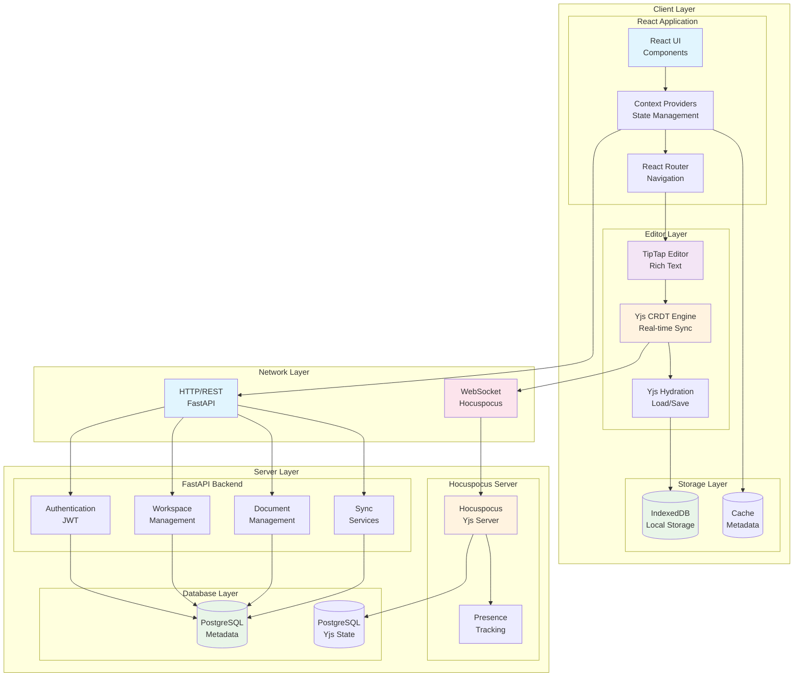
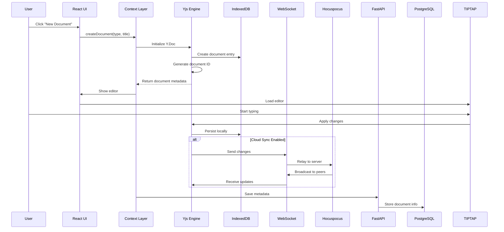
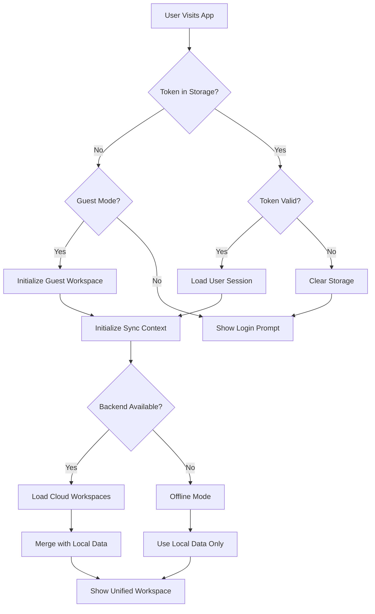
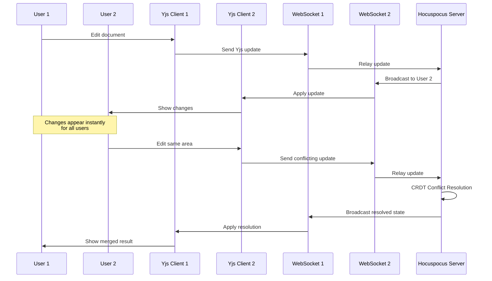
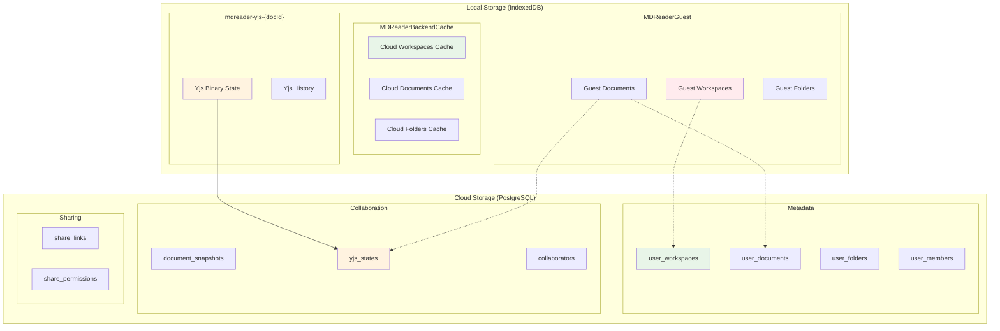
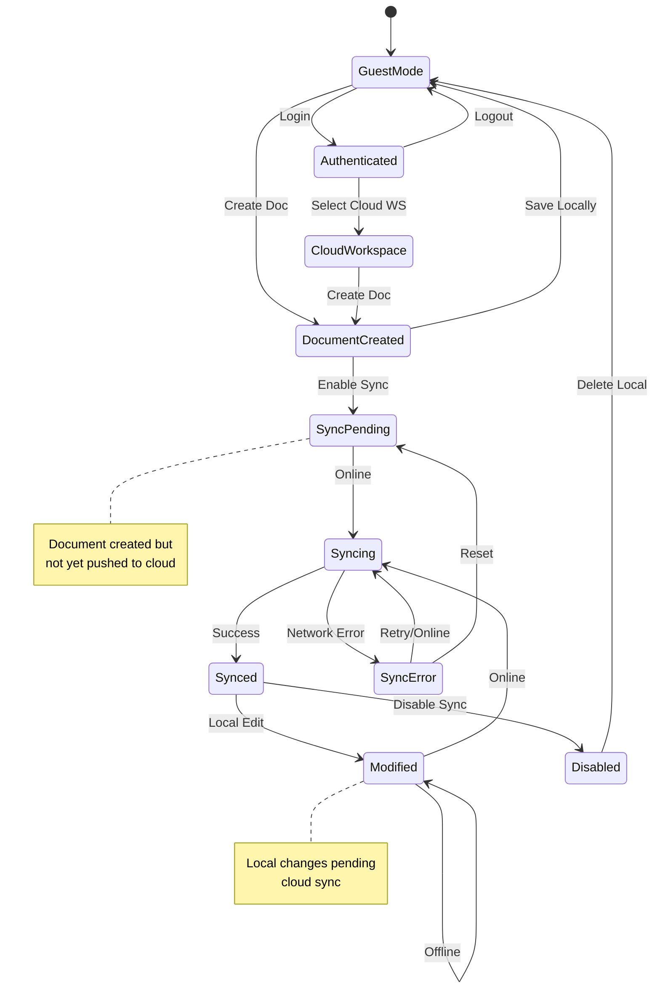
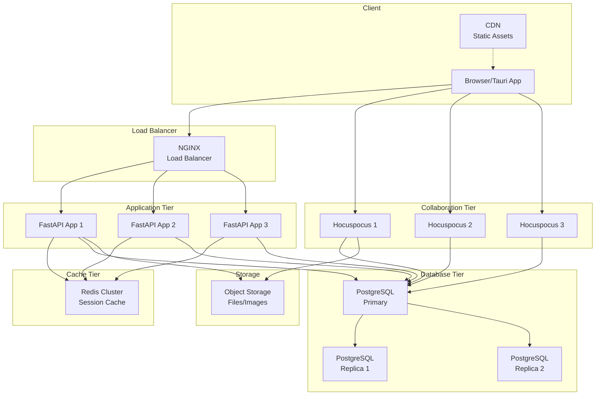
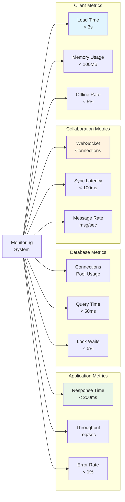
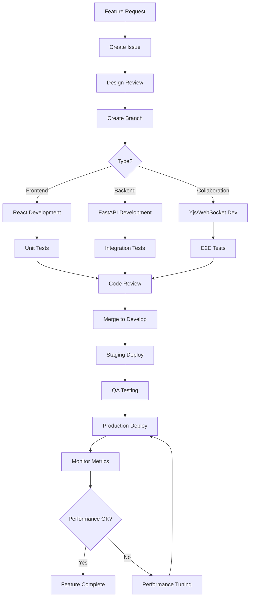

# MDReader Architecture Diagrams

## 🏗️ System Overview

## 🔄 Data Flow: Document Creation

## 🔐 Authentication Flow

## 🤝 Real-Time Collaboration Flow

## 💾 Storage Architecture

## 🔄 Sync State Machine

## 🚀 Deployment Architecture

## 📊 Performance Monitoring

## 🔧 Development Workflow

---

## 📋 Legend

| Symbol | Meaning |
|--------|---------|
| 🔵 | Client-side component |
| 🟡 | Server-side component |
| 🟢 | Storage/database |
| 🔴 | Network communication |
| 📦 | External service |
| 💾 | File/data storage |
| 🔄 | Data flow/sync |
| 👥 | User interaction |
| ⚙️ | Configuration/processing |

---

*Architecture diagrams generated: December 30, 2025*
*MDReader Version: 1.0.0*
