# 🏗️ AWS Architecture for MDReader

**MDReader** - A collaborative markdown editor with real-time sync, local-first architecture, and cloud backup.

---

## 📋 Project Overview

**MDReader** is a sophisticated markdown editor featuring:
- **Local-first architecture** (IndexedDB + Yjs CRDT)
- **Real-time collaboration** (WebSocket + Hocuspocus)
- **Cloud sync** (PostgreSQL + Redis)
- **Multi-platform** (Web + Desktop via Tauri)
- **Advanced features** (workspaces, sharing, snapshots, audit logs)

---

## 🎯 AWS Architecture Overview

```mermaid
graph TB
    %% Users
    User[👥 Users<br/>Web + Desktop]

    %% Edge Layer
    CloudFront[☁️ CloudFront<br/>CDN + WAF]
    Route53[🔀 Route53<br/>DNS]

    %% Frontend Layer
    S3_Frontend[(📦 S3<br/>Frontend Assets)]
    Amplify[⚡ Amplify<br/>Web Hosting<br/>Optional]

    %% API Gateway Layer
    APIGateway[🚪 API Gateway<br/>REST + WebSocket]
    Cognito[🔐 Cognito<br/>User Pool]

    %% Compute Layer
    Lambda_Backend[λ Lambda<br/>Backend API]
    ECS_Hocuspocus[🐳 ECS Fargate<br/>Hocuspocus<br/>WebSocket Server]
    Lambda_FileUpload[λ Lambda<br/>File Processing]

    %% Data Layer
    RDS_PostgreSQL[(🗄️ RDS PostgreSQL<br/>Metadata + Yjs State)]
    ElastiCache_Redis[(⚡ ElastiCache Redis<br/>Caching + Sessions)]
    S3_Storage[(📦 S3<br/>File Attachments<br/>Snapshots)]

    %% Supporting Services
    SES[📧 SES<br/>Email Service]
    CloudWatch[📊 CloudWatch<br/>Monitoring]
    SecretsManager[🔑 Secrets Manager<br/>Secrets]
    Backup[💾 AWS Backup<br/>Automated Backups]

    %% Networking
    VPC[VPC<br/>Private Network]
    ALB[🔄 ALB<br/>Load Balancer<br/>Optional]

    %% Connections
    User --> Route53
    Route53 --> CloudFront
    CloudFront --> S3_Frontend
    CloudFront --> APIGateway
    APIGateway --> Cognito
    APIGateway --> Lambda_Backend
    APIGateway --> ECS_Hocuspocus
    Lambda_Backend --> RDS_PostgreSQL
    Lambda_Backend --> ElastiCache_Redis
    Lambda_Backend --> S3_Storage
    Lambda_Backend --> SES
    Lambda_Backend --> SecretsManager
    Lambda_FileUpload --> S3_Storage
    ECS_Hocuspocus --> RDS_PostgreSQL
    ECS_Hocuspocus --> ElastiCache_Redis

    %% Monitoring
    Lambda_Backend --> CloudWatch
    ECS_Hocuspocus --> CloudWatch
    RDS_PostgreSQL --> CloudWatch
    ElastiCache_Redis --> CloudWatch

    %% Backup
    RDS_PostgreSQL --> Backup
    S3_Storage --> Backup
```



---

## 🏛️ Core AWS Services

### 1. **Authentication & Authorization**
**Service**: Amazon Cognito User Pools + Identity Pools

**Why Cognito?**
- JWT token generation (replaces current FastAPI JWT)
- Social login support (Google, GitHub, etc.)
- User management (registration, password reset, MFA)
- Integration with API Gateway for authorization

**Configuration**:
```yaml
# Cognito User Pool
UserPool:
  Name: MDReaderUsers
  Policies:
    PasswordPolicy:
      MinimumLength: 8
      RequireUppercase: true
      RequireLowercase: true
      RequireNumbers: true
      RequireSymbols: true
  AutoVerifiedAttributes:
    - email
  MfaConfiguration: OPTIONAL
  DeviceConfiguration:
    ChallengeRequiredOnNewDevice: false
    DeviceOnlyRememberedOnUserPrompt: true

# App Client
UserPoolClient:
  UserPoolId: !Ref UserPool
  GenerateSecret: false
  ExplicitAuthFlows:
    - ADMIN_NO_SRP_AUTH
    - USER_SRP_AUTH
  SupportedIdentityProviders:
    - COGNITO
  CallbackURLs:
    - https://mdreader.app/auth/callback
  LogoutURLs:
    - https://mdreader.app/
```

### 2. **Database Layer**
**Primary**: Amazon RDS PostgreSQL
**Cache**: Amazon ElastiCache Redis

**Why RDS PostgreSQL?**
- ACID compliance for metadata
- JSON support for flexible schemas
- PostGIS for future spatial features
- Automated backups and read replicas

**Configuration**:
```yaml
RDSDB:
  Engine: postgres
  EngineVersion: "15.4"
  InstanceClass: db.t3.micro  # Start small, scale up
  AllocatedStorage: 20
  MaxAllocatedStorage: 1000   # Auto-scaling
  MultiAZ: true              # Production HA
  BackupRetentionPeriod: 30
  EnableCloudwatchLogsExports:
    - postgresql
  DBSubnetGroupName: !Ref DBSubnetGroup
  VPCSecurityGroups:
    - !Ref RDSSecurityGroup

ElastiCacheRedis:
  Engine: redis
  EngineVersion: "7.0"
  CacheNodeType: cache.t3.micro
  NumCacheClusters: 2  # Multi-AZ
  AutomaticFailoverEnabled: true
  SnapshotRetentionLimit: 7
```

### 3. **Real-Time Collaboration**
**Service**: Amazon ECS Fargate + API Gateway WebSocket API

**Why ECS Fargate for Hocuspocus?**
- Containerized Node.js application
- Auto-scaling based on connections
- WebSocket support via API Gateway
- Cost-effective (pay per usage)

**Architecture**:
```yaml
HocuspocusService:
  Type: AWS::ECS::Service
  Properties:
    ServiceName: mdreader-hocuspocus
    Cluster: !Ref ECSCluster
    TaskDefinition: !Ref HocuspocusTaskDefinition
    DesiredCount: 2
    DeploymentConfiguration:
      MaximumPercent: 200
      MinimumHealthyPercent: 50

WebSocketAPI:
  Type: AWS::ApiGatewayV2::Api
  Properties:
    Name: MDReaderWebSocket
    ProtocolType: WEBSOCKET
    RouteSelectionExpression: $request.body.action
    RouteKey: $connect
    RouteKey: $disconnect
    RouteKey: $default
```

### 4. **Backend API**
**Service**: AWS Lambda + API Gateway

**Why Serverless?**
- Cost-effective (pay per request)
- Auto-scaling to zero
- FastAPI can run on Lambda
- Easy deployment with SAM/CloudFormation

**Configuration**:
```yaml
BackendAPI:
  Type: AWS::Serverless::Function
  Properties:
    FunctionName: MDReaderBackend
    Runtime: python3.11
    Handler: app.main.handler
    CodeUri: backendv2/
    MemorySize: 1024
    Timeout: 30
    Environment:
      Variables:
        ENVIRONMENT: !Ref Environment
        DATABASE_URL: !Ref DatabaseURL
        REDIS_URL: !Ref RedisURL
    Events:
      ApiEvent:
        Type: Api
        Properties:
          Path: /{proxy+}
          Method: ANY
          RestApiId: !Ref APIGateway
```

### 5. **File Storage & CDN**
**Service**: Amazon S3 + CloudFront

**Why S3 + CloudFront?**
- Scalable object storage
- Global CDN for fast delivery
- Versioning for document snapshots
- Cost-effective storage tiers

**Configuration**:
```yaml
S3Bucket:
  Type: AWS::S3::Bucket
  Properties:
    BucketName: mdreader-uploads-prod
    VersioningConfiguration:
      Status: Enabled
    PublicAccessBlockConfiguration:
      BlockPublicAcls: true
      BlockPublicPolicy: true
      IgnorePublicAcls: true
      RestrictPublicBuckets: true
    CorsConfiguration:
      CorsRules:
        - AllowedOrigins: ['*']
          AllowedMethods: [GET, PUT, POST, DELETE]
          AllowedHeaders: ['*']

CloudFrontDistribution:
  Type: AWS::CloudFront::Distribution
  Properties:
    DistributionConfig:
      Origins:
        - DomainName: !GetAtt S3Bucket.RegionalDomainName
          Id: S3Origin
          S3OriginConfig:
            OriginAccessIdentity: !Ref OriginAccessIdentity
      Enabled: true
      DefaultCacheBehavior:
        TargetOriginId: S3Origin
        ViewerProtocolPolicy: redirect-to-https
        CachePolicyId: !Ref CachePolicy
        AllowedMethods: [GET, HEAD, OPTIONS, PUT, POST, PATCH, DELETE]
      PriceClass: PriceClass_100  # Use only US, Canada, Europe
```

### 6. **Frontend Hosting**
**Options**:
1. **Amazon S3 + CloudFront** (static hosting)
2. **AWS Amplify** (managed hosting with CI/CD)

**Why Amplify?**
- Automatic deployments from Git
- Global CDN built-in
- SSL certificates
- Environment management
- Cost monitoring

```yaml
AmplifyApp:
  Type: AWS::Amplify::App
  Properties:
    Name: MDReaderWeb
    Repository: https://github.com/yourorg/mdreader
    Branch: main
    BuildSpec: |
      version: 1
      frontend:
        phases:
          preBuild:
            commands:
              - npm ci
          build:
            commands:
              - npm run build
        artifacts:
          baseDirectory: dist
          files:
            - '**/*'
    CustomRules:
      - Source: /api/<*>
        Target: https://api.mdreader.app/api/<*>
        Status: 200
      - Source: /ws/<*>
        Target: wss://websocket.mdreader.app/ws/<*>
        Status: 200
```

---

## 🌐 Networking & Security

### VPC Configuration

```yaml
VPC:
  Type: AWS::EC2::VPC
  Properties:
    CidrBlock: 10.0.0.0/16
    EnableDnsHostnames: true
    EnableDnsSupport: true
    Tags:
      - Key: Name
        Value: mdreader-vpc

# Public Subnets (ALB, NAT Gateway)
PublicSubnetA:
  Type: AWS::EC2::Subnet
  Properties:
    VpcId: !Ref VPC
    CidrBlock: 10.0.1.0/24
    AvailabilityZone: us-east-1a

# Private Subnets (RDS, ECS, Lambda)
PrivateSubnetA:
  Type: AWS::EC2::Subnet
  Properties:
    VpcId: !Ref VPC
    CidrBlock: 10.0.10.0/24
    AvailabilityZone: us-east-1a

# Security Groups
RDSSecurityGroup:
  Type: AWS::EC2::SecurityGroup
  Properties:
    GroupDescription: RDS PostgreSQL
    VpcId: !Ref VPC
    SecurityGroupIngress:
      - IpProtocol: tcp
        FromPort: 5432
        ToPort: 5432
        SourceSecurityGroupId: !Ref LambdaSecurityGroup

LambdaSecurityGroup:
  Type: AWS::EC2::SecurityGroup
  Properties:
    GroupDescription: Lambda Functions
    VpcId: !Ref VPC
```

### Security Services

**AWS WAF** (Web Application Firewall):
```yaml
WebACL:
  Type: AWS::WAFv2::WebACL
  Properties:
    Name: MDReaderWAF
    Scope: CLOUDFRONT
    DefaultAction:
      Allow: {}
    Rules:
      # Rate limiting
      - Name: RateLimit
        Priority: 1
        Action:
          Block: {}
        Statement:
          RateBasedStatement:
            Limit: 1000
            AggregateKeyType: IP
      # SQL Injection protection
      - Name: SQLInjection
        Priority: 2
        Action:
          Block: {}
        Statement:
          SQLiMatchStatement:
            FieldToMatch:
              Body: {}
            TextTransformations:
              - Priority: 1
                Type: NONE
```

---

## 📊 Monitoring & Observability

### Amazon CloudWatch

**Dashboards**:
- API Performance (latency, error rates)
- Database Metrics (connections, slow queries)
- WebSocket Connections (active users)
- Cost Monitoring (budget alerts)

**Alarms**:
```yaml
APILatencyAlarm:
  Type: AWS::CloudWatch::Alarm
  Properties:
    AlarmName: MDReader-API-Latency
    ComparisonOperator: GreaterThanThreshold
    EvaluationPeriods: 2
    MetricName: Duration
    Namespace: AWS/Lambda
    Period: 300
    Statistic: Average
    Threshold: 5000  # 5 seconds
    AlarmActions:
      - !Ref AlertTopic

DatabaseConnectionAlarm:
  Type: AWS::CloudWatch::Alarm
  Properties:
    AlarmName: MDReader-DB-Connections
    ComparisonOperator: GreaterThanThreshold
    EvaluationPeriods: 2
    MetricName: DatabaseConnections
    Namespace: AWS/RDS
    Period: 300
    Statistic: Maximum
    Threshold: 80  # 80% of max connections
    AlarmActions:
      - !Ref AlertTopic
```

### AWS X-Ray

**Distributed Tracing**:
- Lambda function traces
- API Gateway latency
- Database query performance
- WebSocket connection tracing

---

## 🚀 Deployment Strategy

### CI/CD Pipeline

**GitHub Actions + AWS CodePipeline**:

```yaml
# .github/workflows/deploy.yml
name: Deploy to AWS
on:
  push:
    branches: [main]
  pull_request:
    branches: [main]

jobs:
  test:
    runs-on: ubuntu-latest
    steps:
      - uses: actions/checkout@v3
      - name: Setup Node.js
        uses: actions/setup-node@v3
        with:
          node-version: '18'
      - name: Install dependencies
        run: npm ci
      - name: Run tests
        run: npm test

  deploy-backend:
    needs: test
    runs-on: ubuntu-latest
    steps:
      - uses: actions/checkout@v3
      - name: Configure AWS credentials
        uses: aws-actions/configure-aws-credentials@v2
        with:
          aws-access-key-id: ${{ secrets.AWS_ACCESS_KEY_ID }}
          aws-secret-access-key: ${{ secrets.AWS_SECRET_ACCESS_KEY }}
          aws-region: us-east-1
      - name: Deploy Backend
        run: |
          sam build
          sam deploy --no-confirm-changeset

  deploy-frontend:
    needs: test
    runs-on: ubuntu-latest
    steps:
      - uses: actions/checkout@v3
      - name: Deploy to Amplify
        run: |
          aws amplify start-deployment \
            --app-id ${{ secrets.AMPLIFY_APP_ID }} \
            --branch-name main \
            --source-dir frontend/dist
```

### Infrastructure as Code

**AWS CloudFormation/SAM Templates**:
- `infrastructure/vpc.yml` - Network configuration
- `infrastructure/database.yml` - RDS + ElastiCache
- `infrastructure/backend.yml` - Lambda + API Gateway
- `infrastructure/frontend.yml` - S3 + CloudFront
- `infrastructure/monitoring.yml` - CloudWatch + X-Ray

---

## 💰 Cost Optimization

### Estimated Monthly Costs (Production)

| Service | Configuration | Monthly Cost |
|---------|---------------|--------------|
| **RDS PostgreSQL** | t3.micro, 20GB | $15-25 |
| **ElastiCache Redis** | cache.t3.micro, 2 nodes | $20-30 |
| **Lambda** | 1M requests, 1GB RAM | $5-15 |
| **API Gateway** | 1M requests | $3-5 |
| **S3** | 100GB storage + transfers | $5-10 |
| **CloudFront** | 1TB transfer | $80-100 |
| **ECS Fargate** | 2 tasks, 0.5 vCPU | $30-50 |
| **Cognito** | 1K users | $5 |
| **CloudWatch** | Basic monitoring | $5-10 |
| **Route 53** | 1 hosted zone | $0.50 |
| **SES** | 10K emails | $1 |
| **TOTAL** | | **$170-250/month** |

### Cost Optimization Strategies

1. **Lambda Provisioned Concurrency**: Reduce cold starts for frequently used functions
2. **RDS Reserved Instances**: 1-3 year commitment for 30-60% savings
3. **S3 Storage Classes**: Move old data to Glacier
4. **CloudFront Price Classes**: Use regional distribution initially
5. **Auto Scaling**: Scale down during off-peak hours
6. **Monitoring**: Set up cost alerts and budgets

---

## 🔧 Migration Strategy

### Phase 1: Foundation (Week 1-2)
- [ ] Set up AWS account and IAM
- [ ] Create VPC and networking
- [ ] Deploy RDS PostgreSQL
- [ ] Configure Cognito User Pool
- [ ] Set up CloudFormation templates

### Phase 2: Backend Migration (Week 3-4)
- [ ] Migrate FastAPI to Lambda
- [ ] Update database connections
- [ ] Configure API Gateway
- [ ] Implement Cognito integration
- [ ] Set up monitoring

### Phase 3: Real-Time Features (Week 5-6)
- [ ] Deploy Hocuspocus on ECS
- [ ] Configure WebSocket API Gateway
- [ ] Test collaboration features
- [ ] Performance optimization

### Phase 4: Frontend & CDN (Week 7-8)
- [ ] Deploy frontend to S3/Amplify
- [ ] Configure CloudFront
- [ ] Set up CI/CD pipeline
- [ ] DNS configuration

### Phase 5: Production Readiness (Week 9-10)
- [ ] Security hardening
- [ ] Performance testing
- [ ] Backup configuration
- [ ] Documentation

---

## 📈 Scaling Strategy

### Horizontal Scaling
- **API Gateway**: Auto-scaling Lambda functions
- **ECS**: Auto-scaling Hocuspocus based on WebSocket connections
- **RDS**: Read replicas for read-heavy workloads

### Global Distribution
- **CloudFront**: Global CDN for assets and API responses
- **Multi-region**: RDS Global Database for low-latency reads
- **Route 53**: Geo-based routing

### Performance Optimization
- **Caching**: ElastiCache Redis for session and metadata
- **CDN**: CloudFront for static assets
- **Database**: Query optimization and indexing
- **Lambda**: Provisioned concurrency for critical paths

---

## 🔒 Security Considerations

### Data Protection
- **Encryption at Rest**: RDS, S3, Redis encryption enabled
- **Encryption in Transit**: SSL/TLS for all services
- **Secrets Management**: AWS Secrets Manager for credentials

### Access Control
- **IAM Roles**: Least privilege for all services
- **Cognito**: User authentication and authorization
- **API Gateway**: Request validation and throttling
- **WAF**: Protection against common attacks

### Compliance
- **GDPR**: Data residency and deletion capabilities
- **SOC 2**: Audit logging and monitoring
- **Security Headers**: CORS, CSP, HSTS configuration

---

## 📝 Next Steps

1. **Infrastructure Setup**
   - Create AWS account and billing alerts
   - Set up multi-factor authentication
   - Configure AWS CLI and CDK

2. **Development Environment**
   - Deploy development environment
   - Set up CI/CD pipeline
   - Configure monitoring and alerts

3. **Migration Planning**
   - Database migration strategy
   - API compatibility testing
   - User data migration plan

4. **Production Deployment**
   - Blue-green deployment strategy
   - Rollback procedures
   - Disaster recovery plan

---

**Last Updated**: December 31, 2025
**Version**: 1.0.0
**Author**: AI Assistant
