# 🚀 MDReader AWS Architecture Summary

**Complete AWS cloud infrastructure for collaborative markdown editing platform with real-time sync.**

---

## 🎯 Executive Summary

**MDReader** is a sophisticated markdown editor featuring:
- **Local-first architecture** (IndexedDB + Yjs CRDT)
- **Real-time collaboration** (WebSocket + Hocuspocus)
- **Cloud synchronization** (PostgreSQL + Redis)
- **Multi-platform support** (Web + Desktop via Tauri)

**AWS Migration Benefits:**
- **Scalability**: Auto-scale from 0 to millions of users
- **Reliability**: 99.9% uptime with multi-AZ deployment
- **Security**: Enterprise-grade security with Cognito + WAF
- **Cost Efficiency**: 35% cost reduction through optimization ($70/month savings)
- **Developer Experience**: Serverless deployment with CI/CD

---

## 🏗️ Architecture Overview

```mermaid
graph TB
    subgraph "Users"
        Web[👥 Web Users]
        Desktop[💻 Desktop Users]
    end

    subgraph "Edge Layer"
        CloudFront[☁️ CloudFront<br/>CDN + WAF]
        Route53[🔀 Route 53<br/>DNS]
    end

    subgraph "Frontend Layer"
        Amplify[⚡ Amplify<br/>React App Hosting]
    end

    subgraph "API Layer"
        APIGateway[🚪 API Gateway<br/>REST + WebSocket]
        Cognito[🔐 Cognito<br/>Authentication]
    end

    subgraph "Compute Layer"
        Lambda[λ Lambda<br/>Backend API<br/>Python/FastAPI]
        ECS[🐳 ECS Fargate<br/>Hocuspocus<br/>Node.js WebSocket]
    end

    subgraph "Data Layer"
        RDS[(🗄️ RDS PostgreSQL<br/>Metadata + Yjs State)]
        Redis[(⚡ ElastiCache Redis<br/>Caching + Sessions)]
        S3[(📦 S3<br/>File Storage<br/>Snapshots)]
    end

    subgraph "Security & Monitoring"
        WAF[AWS WAF<br/>Protection]
        CloudWatch[📊 CloudWatch<br/>Monitoring]
        SecretsManager[🔑 Secrets Manager<br/>Credentials]
    end

    Web --> CloudFront
    Desktop --> CloudFront
    CloudFront --> Amplify
    CloudFront --> APIGateway
    Amplify --> Cognito
    APIGateway --> Cognito
    APIGateway --> Lambda
    APIGateway --> ECS
    Lambda --> RDS
    Lambda --> Redis
    Lambda --> S3
    ECS --> RDS
    ECS --> Redis
    Lambda --> SecretsManager
    ECS --> SecretsManager
    Lambda --> CloudWatch
    ECS --> CloudWatch
    RDS --> CloudWatch
    Redis --> CloudWatch
```



---

## 📊 Service Mapping & Costs

| Component | Current Tech | AWS Service | Monthly Cost | Optimization |
|-----------|--------------|-------------|--------------|--------------|
| **Authentication** | FastAPI JWT | Amazon Cognito | $5 | N/A (usage-based) |
| **API Backend** | FastAPI | AWS Lambda + API Gateway | $5-15 | 60% optimization |
| **Database** | PostgreSQL | Amazon RDS | $15-25 | 40% with Reserved Instance |
| **Caching** | Redis | Amazon ElastiCache | $20-30 | 30% with Reserved Nodes |
| **Real-time Sync** | Hocuspocus | Amazon ECS Fargate | $30-50 | 70% with Spot Instances |
| **File Storage** | Local FS | Amazon S3 + CloudFront | $85-110 | 20% with lifecycle |
| **Frontend Hosting** | Vite | AWS Amplify | $1 | N/A |
| **Security** | Basic | AWS WAF + Shield | $10-20 | N/A |
| **Monitoring** | Basic | Amazon CloudWatch | $5-10 | 40% optimization |
| **TOTAL** | | | **$170-260** | **35% reduction to $110-170** |

---

## 🔧 Core AWS Services Configuration

### 1. **Authentication & Authorization**
**Service**: Amazon Cognito User Pools + Identity Pools
- JWT token generation and validation
- Social login support (Google, GitHub)
- User management with MFA
- Password policies and security

### 2. **Backend API**
**Service**: AWS Lambda + API Gateway
- Serverless FastAPI deployment
- Auto-scaling to zero
- Pay-per-request pricing
- Built-in monitoring and logging

### 3. **Real-Time Collaboration**
**Service**: Amazon ECS Fargate + API Gateway WebSocket
- Containerized Hocuspocus server
- Auto-scaling based on connections
- WebSocket API for real-time sync
- Cost-effective with Spot instances

### 4. **Database Layer**
**Service**: Amazon RDS PostgreSQL + ElastiCache Redis
- Multi-AZ PostgreSQL for metadata
- Redis cluster for caching and sessions
- Read replicas for scaling
- Automated backups and monitoring

### 5. **File Storage & CDN**
**Service**: Amazon S3 + CloudFront
- Scalable object storage
- Global CDN distribution
- Versioning for document snapshots
- Intelligent lifecycle policies

### 6. **Frontend Hosting**
**Service**: AWS Amplify
- Managed React application hosting
- Automatic deployments from Git
- SSL certificates and custom domains
- Environment management

---

## 🌐 Networking Architecture

### VPC Design
- **Multi-tier architecture**: Public (DMZ) → Private (Application) → Private (Data)
- **High availability**: Three AZ deployment (us-east-1a, us-east-1b, us-east-1c)
- **Security first**: Zero-trust networking with security groups and NACLs
- **Scalability**: Subnet sizing for 10x growth

### Security Implementation
- **Security Groups**: Least-privilege access control
- **Network ACLs**: Stateless packet filtering
- **AWS WAF**: Application layer protection
- **VPC Endpoints**: Private AWS service access

---

## 🚀 Deployment Strategy

### CI/CD Pipeline
- **GitHub Actions**: Automated testing and deployment
- **Multi-environment**: dev → staging → production
- **Blue-Green deployments**: Zero-downtime releases
- **Security scanning**: Automated vulnerability checks
- **Performance testing**: Load and stress testing

### Infrastructure as Code
- **AWS CloudFormation**: Infrastructure templates
- **AWS SAM**: Serverless application deployment
- **GitOps workflow**: Infrastructure changes via PR
- **Drift detection**: Automated configuration monitoring

### Monitoring & Alerting
- **CloudWatch**: Comprehensive monitoring
- **X-Ray**: Distributed tracing
- **Cost Explorer**: Budget monitoring
- **SNS**: Alert notifications

---

## 💰 Cost Optimization

### Current vs Optimized Costs

| Category | Current Monthly | Optimized Monthly | Savings |
|----------|-----------------|-------------------|---------|
| **Compute (Lambda/ECS)** | $35-65 | $16-25 | $19-40 (55%) |
| **Database (RDS/Redis)** | $35-55 | $29-37 | $6-18 (25%) |
| **Storage + CDN (S3/CloudFront)** | $90-120 | $78-102 | $12-18 (15%) |
| **Security + Monitoring** | $10-20 | $7-14 | $3-6 (30%) |
| **TOTAL** | **$170-260** | **$110-170** | **$35-70 (25%)** |

### Optimization Strategies
1. **Reserved Instances**: 30-40% savings on RDS/Redis
2. **Lambda Rightsizing**: 50% reduction through memory optimization
3. **ECS Spot Instances**: 70% savings for WebSocket servers
4. **S3 Intelligent Tiering**: Automatic cost optimization
5. **CloudFront Price Classes**: Regional distribution

### Cost Monitoring
- **Real-time dashboards**: CloudWatch cost widgets
- **Budget alerts**: Multi-threshold notifications
- **Anomaly detection**: Automated cost anomaly alerts
- **Monthly reports**: Detailed cost analysis and recommendations

---

## 🔒 Security Implementation

### Authentication & Authorization
- **Cognito User Pools**: Managed user authentication
- **JWT tokens**: Secure API access
- **MFA support**: Enhanced security
- **Social login**: Google/GitHub integration

### Network Security
- **AWS WAF**: DDoS and application layer protection
- **Security Groups**: Instance-level firewall
- **Network ACLs**: Subnet-level security
- **VPC Flow Logs**: Network traffic monitoring

### Data Protection
- **Encryption at rest**: All data encrypted
- **Encryption in transit**: SSL/TLS everywhere
- **Secrets Manager**: Secure credential storage
- **Backup encryption**: Protected backups

### Compliance
- **GDPR ready**: Data residency and deletion
- **SOC 2 aligned**: Audit logging and monitoring
- **Security scanning**: Automated vulnerability checks
- **Access control**: Least-privilege IAM policies

---

## 📈 Scaling Strategy

### Horizontal Scaling
- **API Gateway**: Auto-scaling Lambda functions
- **ECS**: Auto-scaling WebSocket servers
- **RDS**: Read replicas for read-heavy workloads
- **CloudFront**: Global edge network

### Performance Optimization
- **Caching**: ElastiCache Redis for session/data caching
- **CDN**: CloudFront for static asset delivery
- **Database**: Query optimization and indexing
- **Lambda**: Provisioned concurrency for critical paths

### Global Distribution
- **Multi-region**: RDS Global Database option
- **CloudFront**: Worldwide CDN
- **Route 53**: Geo-based routing
- **Global Accelerator**: Improved global performance

---

## 🛠️ Implementation Roadmap

### Phase 1: Foundation (Week 1-2)
- [ ] AWS account setup and IAM configuration
- [ ] VPC and networking infrastructure
- [ ] Basic security groups and monitoring
- [ ] Cost monitoring and budget alerts

### Phase 2: Core Services (Week 3-4)
- [ ] Cognito User Pool configuration
- [ ] RDS PostgreSQL and ElastiCache Redis
- [ ] S3 bucket and CloudFront distribution
- [ ] Basic Lambda and API Gateway setup

### Phase 3: Application Deployment (Week 5-6)
- [ ] Backend API migration to Lambda
- [ ] Hocuspocus deployment on ECS
- [ ] Frontend deployment to Amplify
- [ ] WebSocket API configuration

### Phase 4: Production Readiness (Week 7-8)
- [ ] Security hardening and WAF setup
- [ ] Performance testing and optimization
- [ ] Monitoring and alerting configuration
- [ ] Backup and disaster recovery setup

### Phase 5: Optimization (Month 2+)
- [ ] Reserved instance purchases
- [ ] Advanced cost optimization
- [ ] Auto-scaling policy refinement
- [ ] Performance monitoring and tuning

---

## 🎯 Success Metrics

### Technical Metrics
- **Availability**: >99.9% uptime
- **Performance**: <500ms API response time
- **Scalability**: Support 10,000+ concurrent users
- **Security**: Zero security incidents

### Business Metrics
- **Cost**: <$150/month AWS spend
- **User Experience**: <2 second page load times
- **Development**: Weekly releases without downtime
- **Satisfaction**: >95% user satisfaction score

### Operational Metrics
- **Deployment**: <15 minute deployment time
- **Monitoring**: <5 minute incident detection
- **Recovery**: <1 hour disaster recovery
- **Efficiency**: 95% infrastructure utilization

---

## 📚 Documentation Structure

### Architecture Documents
- [`AWS_ARCHITECTURE.md`](AWS_ARCHITECTURE.md) - Complete architecture overview
- [`AWS_SERVICES_MAPPING.md`](AWS_SERVICES_MAPPING.md) - Detailed service configurations
- [`AWS_NETWORKING.md`](AWS_NETWORKING.md) - VPC and security design
- [`AWS_DEPLOYMENT_STRATEGY.md`](AWS_DEPLOYMENT_STRATEGY.md) - CI/CD and operations
- [`AWS_COST_OPTIMIZATION.md`](AWS_COST_OPTIMIZATION.md) - Cost monitoring and optimization

### Infrastructure Templates
- `infrastructure/` - CloudFormation and SAM templates
- `infrastructure/vpc.yml` - Networking configuration
- `infrastructure/database.yml` - RDS and Redis setup
- `infrastructure/backend.yml` - Lambda and API Gateway
- `infrastructure/frontend.yml` - Amplify configuration

### Deployment Scripts
- `scripts/deploy.sh` - Infrastructure deployment
- `scripts/test.sh` - Automated testing
- `scripts/rollback.sh` - Rollback procedures

---

## 🚀 Getting Started

### Prerequisites
1. **AWS Account**: With appropriate permissions
2. **Domain**: Registered domain name
3. **GitHub**: Repository with CI/CD setup
4. **SSL Certificate**: For custom domain (optional, Amplify provides)

### Quick Start
```bash
# 1. Clone and setup
git clone https://github.com/yourorg/mdreader.git
cd mdreader

# 2. Configure AWS credentials
aws configure

# 3. Deploy foundation infrastructure
make deploy-infrastructure ENVIRONMENT=dev

# 4. Deploy application
make deploy-backend ENVIRONMENT=dev
make deploy-frontend ENVIRONMENT=dev

# 5. Test deployment
make test-integration ENVIRONMENT=dev
```

### Development Workflow
1. **Code Changes**: Push to feature branch
2. **Testing**: Automated CI/CD pipeline
3. **Review**: Pull request with infrastructure changes
4. **Deploy**: Automated deployment to staging
5. **Validation**: Integration and E2E testing
6. **Production**: Manual approval for production deployment

---

## 💡 Key Benefits

### For Developers
- **Serverless**: Focus on code, not infrastructure
- **Auto-scaling**: Handle any load automatically
- **Fast deployment**: Minutes, not hours
- **Built-in monitoring**: Comprehensive observability

### For Users
- **Reliability**: 99.9% uptime guarantee
- **Performance**: Global CDN and edge computing
- **Security**: Enterprise-grade protection
- **Scalability**: Support millions of users

### For Business
- **Cost-effective**: Pay only for what you use
- **Secure**: AWS security best practices
- **Compliant**: GDPR and SOC 2 ready
- **Future-proof**: Easy scaling and feature additions

---

## 📞 Support & Resources

### AWS Resources
- **AWS Well-Architected Framework**: Best practices guide
- **AWS Solutions Library**: Reference architectures
- **AWS Support**: 24/7 technical support
- **AWS Training**: Free online courses

### MDReader Resources
- **Architecture Docs**: Complete technical documentation
- **Infrastructure Code**: Reusable CloudFormation templates
- **CI/CD Pipeline**: Automated deployment workflows
- **Monitoring Dashboards**: Cost and performance monitoring

### Community
- **GitHub Issues**: Bug reports and feature requests
- **Documentation**: Wiki and README files
- **Discussions**: Architecture and implementation discussions

---

**Ready to deploy MDReader on AWS?**

This architecture provides a production-ready, scalable, and cost-effective cloud infrastructure for your collaborative markdown editor.

**Next Steps:**
1. Review the detailed architecture documents
2. Set up your AWS account and domain
3. Deploy the foundation infrastructure
4. Migrate your application components
5. Optimize for cost and performance

---

**Last Updated**: December 31, 2025
**Version**: 1.0.0
**Author**: AI Assistant
