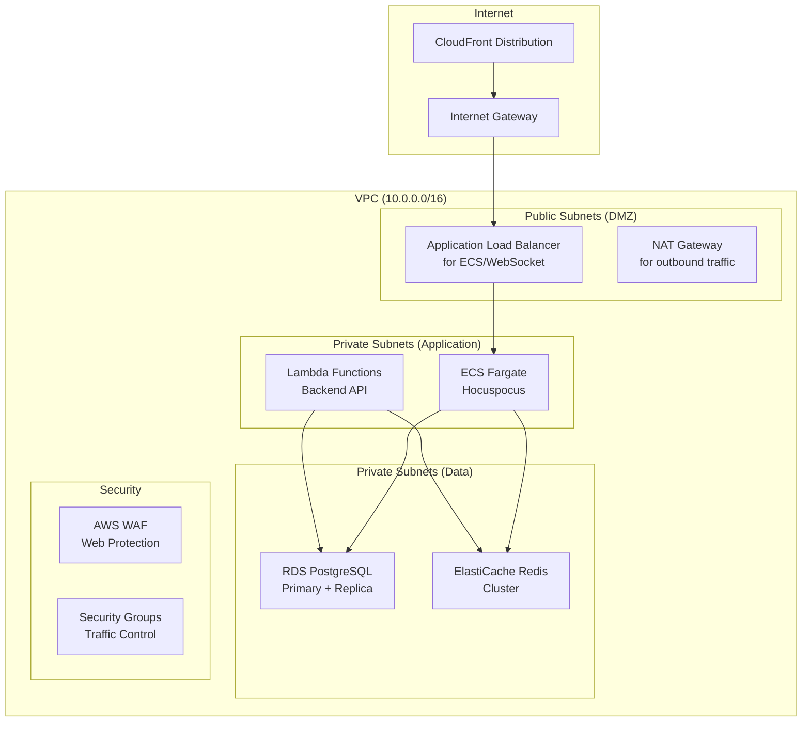

# 🌐 AWS Networking Design for MDReader

**Comprehensive VPC, subnet, and security group design for production-ready MDReader infrastructure.**

---

## 📋 Networking Overview

**MDReader** requires a secure, scalable network architecture supporting:
- **Multi-tier architecture** (Web → API → Database)
- **Real-time collaboration** (WebSocket connections)
- **Global CDN distribution** (CloudFront)
- **High availability** (Multi-AZ deployment)
- **Security best practices** (Zero-trust networking)

---

## 🏗️ VPC Architecture

### Core VPC Configuration



### VPC Design Principles

**1. Multi-Tier Architecture**
- **Public Tier**: Load balancers, CDN origins
- **Application Tier**: Lambda, ECS (private subnets)
- **Data Tier**: RDS, Redis (isolated subnets)

**2. High Availability**
- Multi-AZ deployment across 3 AZs
- Redundant NAT gateways
- Auto-scaling groups

**3. Security First**
- No direct internet access to application/data tiers
- Security groups with least privilege
- Network ACLs as secondary defense

**4. Scalability**
- Subnet sizing for growth (10.0.x.0/24 per AZ per tier)
- Elastic IPs for static resources
- VPC endpoints for AWS services

---

## 📊 Detailed VPC Configuration

### VPC and Subnets

```yaml
# Main VPC
MDReaderVPC:
  Type: AWS::EC2::VPC
  Properties:
    CidrBlock: 10.0.0.0/16
    EnableDnsHostnames: true
    EnableDnsSupport: true
    InstanceTenancy: default
    Tags:
      - Key: Name
        Value: mdreader-vpc
      - Key: Environment
        Value: !Ref Environment
      - Key: Project
        Value: MDReader

# Internet Gateway
MDReaderIGW:
  Type: AWS::EC2::InternetGateway
  Properties:
    Tags:
      - Key: Name
        Value: mdreader-igw

# Attach IGW to VPC
IGWAttachment:
  Type: AWS::EC2::VPCGatewayAttachment
  Properties:
    VpcId: !Ref MDReaderVPC
    InternetGatewayId: !Ref MDReaderIGW

# Availability Zones Configuration
# We'll deploy across 3 AZs for high availability
Parameters:
  AZ1:
    Type: String
    Default: us-east-1a
    Description: First Availability Zone
  AZ2:
    Type: String
    Default: us-east-1b
    Description: Second Availability Zone
  AZ3:
    Type: String
    Default: us-east-1c
    Description: Third Availability Zone
```

### Public Subnets (DMZ Layer)

```yaml
# Public Subnet AZ1
PublicSubnetAZ1:
  Type: AWS::EC2::Subnet
  Properties:
    VpcId: !Ref MDReaderVPC
    CidrBlock: 10.0.1.0/24
    AvailabilityZone: !Ref AZ1
    MapPublicIpOnLaunch: true
    Tags:
      - Key: Name
        Value: mdreader-public-az1
      - Key: Tier
        Value: Public
      - Key: Type
        Value: DMZ

# Public Subnet AZ2
PublicSubnetAZ2:
  Type: AWS::EC2::Subnet
  Properties:
    VpcId: !Ref MDReaderVPC
    CidrBlock: 10.0.2.0/24
    AvailabilityZone: !Ref AZ2
    MapPublicIpOnLaunch: true
    Tags:
      - Key: Name
        Value: mdreader-public-az2
      - Key: Tier
        Value: Public
      - Key: Type
        Value: DMZ

# Public Subnet AZ3
PublicSubnetAZ3:
  Type: AWS::EC2::Subnet
  Properties:
    VpcId: !Ref MDReaderVPC
    CidrBlock: 10.0.3.0/24
    AvailabilityZone: !Ref AZ3
    MapPublicIpOnLaunch: true
    Tags:
      - Key: Name
        Value: mdreader-public-az3
      - Key: Tier
        Value: Public
      - Key: Type
        Value: DMZ

# Public Route Table
PublicRouteTable:
  Type: AWS::EC2::RouteTable
  Properties:
    VpcId: !Ref MDReaderVPC
    Tags:
      - Key: Name
        Value: mdreader-public-rt

# Public Route to Internet
PublicRoute:
  Type: AWS::EC2::Route
  Properties:
    RouteTableId: !Ref PublicRouteTable
    DestinationCidrBlock: 0.0.0.0/0
    GatewayId: !Ref MDReaderIGW

# Associate Public Subnets with Route Table
PublicSubnetAZ1Association:
  Type: AWS::EC2::SubnetRouteTableAssociation
  Properties:
    SubnetId: !Ref PublicSubnetAZ1
    RouteTableId: !Ref PublicRouteTable

PublicSubnetAZ2Association:
  Type: AWS::EC2::SubnetRouteTableAssociation
  Properties:
    SubnetId: !Ref PublicSubnetAZ2
    RouteTableId: !Ref PublicRouteTable

PublicSubnetAZ3Association:
  Type: AWS::EC2::SubnetRouteTableAssociation
  Properties:
    SubnetId: !Ref PublicSubnetAZ3
    RouteTableId: !Ref PublicRouteTable
```

### Private Application Subnets

```yaml
# Private App Subnet AZ1
PrivateAppSubnetAZ1:
  Type: AWS::EC2::Subnet
  Properties:
    VpcId: !Ref MDReaderVPC
    CidrBlock: 10.0.10.0/24
    AvailabilityZone: !Ref AZ1
    MapPublicIpOnLaunch: false
    Tags:
      - Key: Name
        Value: mdreader-private-app-az1
      - Key: Tier
        Value: Application
      - Key: Type
        Value: Private

# Private App Subnet AZ2
PrivateAppSubnetAZ2:
  Type: AWS::EC2::Subnet
  Properties:
    VpcId: !Ref MDReaderVPC
    CidrBlock: 10.0.11.0/24
    AvailabilityZone: !Ref AZ2
    MapPublicIpOnLaunch: false
    Tags:
      - Key: Name
        Value: mdreader-private-app-az2
      - Key: Tier
        Value: Application
      - Key: Type
        Value: Private

# Private App Subnet AZ3
PrivateAppSubnetAZ3:
  Type: AWS::EC2::Subnet
  Properties:
    VpcId: !Ref MDReaderVPC
    CidrBlock: 10.0.12.0/24
    AvailabilityZone: !Ref AZ3
    MapPublicIpOnLaunch: false
    Tags:
      - Key: Name
        Value: mdreader-private-app-az3
      - Key: Tier
        Value: Application
      - Key: Type
        Value: Private

# NAT Gateways for outbound traffic
NATGatewayAZ1:
  Type: AWS::EC2::NatGateway
  Properties:
    AllocationId: !GetAtt NATGatewayEIPAZ1.AllocationId
    SubnetId: !Ref PublicSubnetAZ1
    Tags:
      - Key: Name
        Value: mdreader-nat-az1

NATGatewayEIPAZ1:
  Type: AWS::EC2::EIP
  Properties:
    Domain: vpc

# Private Route Table for App Tier
PrivateAppRouteTable:
  Type: AWS::EC2::RouteTable
  Properties:
    VpcId: !Ref MDReaderVPC
    Tags:
      - Key: Name
        Value: mdreader-private-app-rt

# Route to NAT Gateway
PrivateAppRoute:
  Type: AWS::EC2::Route
  Properties:
    RouteTableId: !Ref PrivateAppRouteTable
    DestinationCidrBlock: 0.0.0.0/0
    NatGatewayId: !Ref NATGatewayAZ1

# Associate Private App Subnets
PrivateAppSubnetAZ1Association:
  Type: AWS::EC2::SubnetRouteTableAssociation
  Properties:
    SubnetId: !Ref PrivateAppSubnetAZ1
    RouteTableId: !Ref PrivateAppRouteTable

PrivateAppSubnetAZ2Association:
  Type: AWS::EC2::SubnetRouteTableAssociation
  Properties:
    SubnetId: !Ref PrivateAppSubnetAZ2
    RouteTableId: !Ref PrivateAppRouteTable

PrivateAppSubnetAZ3Association:
  Type: AWS::EC2::SubnetRouteTableAssociation
  Properties:
    SubnetId: !Ref PrivateAppSubnetAZ3
    RouteTableId: !Ref PrivateAppRouteTable
```

### Private Data Subnets

```yaml
# Private Data Subnet AZ1 (RDS, Redis)
PrivateDataSubnetAZ1:
  Type: AWS::EC2::Subnet
  Properties:
    VpcId: !Ref MDReaderVPC
    CidrBlock: 10.0.20.0/24
    AvailabilityZone: !Ref AZ1
    MapPublicIpOnLaunch: false
    Tags:
      - Key: Name
        Value: mdreader-private-data-az1
      - Key: Tier
        Value: Data
      - Key: Type
        Value: Private

# Private Data Subnet AZ2
PrivateDataSubnetAZ2:
  Type: AWS::EC2::Subnet
  Properties:
    VpcId: !Ref MDReaderVPC
    CidrBlock: 10.0.21.0/24
    AvailabilityZone: !Ref AZ2
    MapPublicIpOnLaunch: false
    Tags:
      - Key: Name
        Value: mdreader-private-data-az2
      - Key: Tier
        Value: Data
      - Key: Type
        Value: Private

# Private Data Subnet AZ3
PrivateDataSubnetAZ3:
  Type: AWS::EC2::Subnet
  Properties:
    VpcId: !Ref MDReaderVPC
    CidrBlock: 10.0.22.0/24
    AvailabilityZone: !Ref AZ3
    MapPublicIpOnLaunch: false
    Tags:
      - Key: Name
        Value: mdreader-private-data-az3
      - Key: Tier
        Value: Data
      - Key: Type
        Value: Private

# Private Route Table for Data Tier (No internet access)
PrivateDataRouteTable:
  Type: AWS::EC2::RouteTable
  Properties:
    VpcId: !Ref MDReaderVPC
    Tags:
      - Key: Name
        Value: mdreader-private-data-rt

# Associate Private Data Subnets
PrivateDataSubnetAZ1Association:
  Type: AWS::EC2::SubnetRouteTableAssociation
  Properties:
    SubnetId: !Ref PrivateDataSubnetAZ1
    RouteTableId: !Ref PrivateDataRouteTable

PrivateDataSubnetAZ2Association:
  Type: AWS::EC2::SubnetRouteTableAssociation
  Properties:
    SubnetId: !Ref PrivateDataSubnetAZ2
    RouteTableId: !Ref PrivateDataRouteTable

PrivateDataSubnetAZ3Association:
  Type: AWS::EC2::SubnetRouteTableAssociation
  Properties:
    SubnetId: !Ref PrivateDataSubnetAZ3
    RouteTableId: !Ref PrivateDataRouteTable
```

---

## 🔒 Security Groups

### Security Group Design Principles

**1. Least Privilege Access**
- Only allow necessary ports
- Source-based restrictions
- No unrestricted inbound rules

**2. Layered Defense**
- Security Groups (stateful)
- Network ACLs (stateless)
- WAF Rules (application layer)

**3. Service-Specific Groups**
- Separate SGs per service type
- Named for easy identification
- Consistent naming convention

### Application Load Balancer Security Group

```yaml
ALBSecurityGroup:
  Type: AWS::EC2::SecurityGroup
  Properties:
    GroupDescription: ALB for MDReader WebSocket and API
    VpcId: !Ref MDReaderVPC
    SecurityGroupIngress:
      # HTTPS from CloudFront
      - IpProtocol: tcp
        FromPort: 443
        ToPort: 443
        CidrIpv6: 2400:cb00::/32  # CloudFront IPv6
      - IpProtocol: tcp
        FromPort: 443
        ToPort: 443
        CidrIp: 0.0.0.0/0        # CloudFront IPv4 (restricted by WAF)
      # WebSocket (optional direct access for development)
      - IpProtocol: tcp
        FromPort: 80
        ToPort: 80
        CidrIp: 0.0.0.0/0
    SecurityGroupEgress:
      # Allow all outbound (to private subnets)
      - IpProtocol: -1
        FromPort: -1
        ToPort: -1
        CidrIp: 0.0.0.0/0
    Tags:
      - Key: Name
        Value: mdreader-alb-sg
```

### Lambda Functions Security Group

```yaml
LambdaSecurityGroup:
  Type: AWS::EC2::SecurityGroup
  Properties:
    GroupDescription: Lambda functions for MDReader backend
    VpcId: !Ref MDReaderVPC
    SecurityGroupIngress:
      # No inbound rules (Lambda doesn't listen)
    SecurityGroupEgress:
      # HTTPS outbound (for external APIs)
      - IpProtocol: tcp
        FromPort: 443
        ToPort: 443
        CidrIp: 0.0.0.0/0
      # PostgreSQL to RDS
      - IpProtocol: tcp
        FromPort: 5432
        ToPort: 5432
        CidrIp: 10.0.20.0/24
      - IpProtocol: tcp
        FromPort: 5432
        ToPort: 5432
        CidrIp: 10.0.21.0/24
      - IpProtocol: tcp
        FromPort: 5432
        ToPort: 5432
        CidrIp: 10.0.22.0/24
      # Redis to ElastiCache
      - IpProtocol: tcp
        FromPort: 6379
        ToPort: 6379
        CidrIp: 10.0.20.0/24
      - IpProtocol: tcp
        FromPort: 6379
        ToPort: 6379
        CidrIp: 10.0.21.0/24
      - IpProtocol: tcp
        FromPort: 6379
        ToPort: 6379
        CidrIp: 10.0.22.0/24
    Tags:
      - Key: Name
        Value: mdreader-lambda-sg
```

### ECS Fargate Security Group

```yaml
ECSSecurityGroup:
  Type: AWS::EC2::SecurityGroup
  Properties:
    GroupDescription: ECS Fargate tasks for Hocuspocus WebSocket server
    VpcId: !Ref MDReaderVPC
    SecurityGroupIngress:
      # HTTP from ALB
      - IpProtocol: tcp
        FromPort: 80
        ToPort: 80
        SourceSecurityGroupId: !Ref ALBSecurityGroup
    SecurityGroupEgress:
      # HTTPS outbound
      - IpProtocol: tcp
        FromPort: 443
        ToPort: 443
        CidrIp: 0.0.0.0/0
      # PostgreSQL to RDS
      - IpProtocol: tcp
        FromPort: 5432
        ToPort: 5432
        CidrIp: 10.0.20.0/24
      - IpProtocol: tcp
        FromPort: 5432
        ToPort: 5432
        CidrIp: 10.0.21.0/24
      - IpProtocol: tcp
        FromPort: 5432
        ToPort: 5432
        CidrIp: 10.0.22.0/24
      # Redis to ElastiCache
      - IpProtocol: tcp
        FromPort: 6379
        ToPort: 6379
        CidrIp: 10.0.20.0/24
      - IpProtocol: tcp
        FromPort: 6379
        ToPort: 6379
        CidrIp: 10.0.21.0/24
      - IpProtocol: tcp
        FromPort: 6379
        ToPort: 6379
        CidrIp: 10.0.22.0/24
    Tags:
      - Key: Name
        Value: mdreader-ecs-sg
```

### RDS Security Group

```yaml
RDSSecurityGroup:
  Type: AWS::EC2::SecurityGroup
  Properties:
    GroupDescription: RDS PostgreSQL database for MDReader
    VpcId: !Ref MDReaderVPC
    SecurityGroupIngress:
      # PostgreSQL from Lambda
      - IpProtocol: tcp
        FromPort: 5432
        ToPort: 5432
        SourceSecurityGroupId: !Ref LambdaSecurityGroup
      # PostgreSQL from ECS
      - IpProtocol: tcp
        FromPort: 5432
        ToPort: 5432
        SourceSecurityGroupId: !Ref ECSSecurityGroup
      # PostgreSQL from bastion (for maintenance)
      - IpProtocol: tcp
        FromPort: 5432
        ToPort: 5432
        SourceSecurityGroupId: !Ref BastionSecurityGroup
    SecurityGroupEgress:
      # No outbound rules needed for database
    Tags:
      - Key: Name
        Value: mdreader-rds-sg
```

### Redis Security Group

```yaml
RedisSecurityGroup:
  Type: AWS::EC2::SecurityGroup
  Properties:
    GroupDescription: ElastiCache Redis for MDReader
    VpcId: !Ref MDReaderVPC
    SecurityGroupIngress:
      # Redis from Lambda
      - IpProtocol: tcp
        FromPort: 6379
        ToPort: 6379
        SourceSecurityGroupId: !Ref LambdaSecurityGroup
      # Redis from ECS
      - IpProtocol: tcp
        FromPort: 6379
        ToPort: 6379
        SourceSecurityGroupId: !Ref ECSSecurityGroup
    SecurityGroupEgress:
      # No outbound rules needed for cache
    Tags:
      - Key: Name
        Value: mdreader-redis-sg
```

### Bastion Host Security Group (Optional)

```yaml
BastionSecurityGroup:
  Type: AWS::EC2::SecurityGroup
  Properties:
    GroupDescription: Bastion host for administrative access
    VpcId: !Ref MDReaderVPC
    SecurityGroupIngress:
      # SSH from specific IP ranges
      - IpProtocol: tcp
        FromPort: 22
        ToPort: 22
        CidrIp: 203.0.113.0/24  # Replace with your IP range
    SecurityGroupEgress:
      # SSH to private subnets
      - IpProtocol: tcp
        FromPort: 22
        ToPort: 22
        CidrIp: 10.0.0.0/16
      # HTTPS outbound
      - IpProtocol: tcp
        FromPort: 443
        ToPort: 443
        CidrIp: 0.0.0.0/0
    Tags:
      - Key: Name
        Value: mdreader-bastion-sg
```

---

## 🛡️ Network ACLs (Secondary Defense)

### Public Subnet NACL

```yaml
PublicNACL:
  Type: AWS::EC2::NetworkAcl
  Properties:
    VpcId: !Ref MDReaderVPC
    Tags:
      - Key: Name
        Value: mdreader-public-nacl

# Inbound Rules
PublicNACLEntryInboundHTTPS:
  Type: AWS::EC2::NetworkAclEntry
  Properties:
    NetworkAclId: !Ref PublicNACL
    RuleNumber: 100
    Protocol: 6  # TCP
    RuleAction: allow
    CidrBlock: 0.0.0.0/0
    PortRange:
      From: 443
      To: 443

PublicNACLEntryInboundHTTP:
  Type: AWS::EC2::NetworkAclEntry
  Properties:
    NetworkAclId: !Ref PublicNACL
    RuleNumber: 101
    Protocol: 6  # TCP
    RuleAction: allow
    CidrBlock: 0.0.0.0/0
    PortRange:
      From: 80
      To: 80

# Outbound Rules
PublicNACLEntryOutbound:
  Type: AWS::EC2::NetworkAclEntry
  Properties:
    NetworkAclId: !Ref PublicNACL
    RuleNumber: 100
    Protocol: -1
    RuleAction: allow
    CidrBlock: 0.0.0.0/0
    Egress: true

# Associate with Public Subnets
PublicNACLAssociationAZ1:
  Type: AWS::EC2::SubnetNetworkAclAssociation
  Properties:
    SubnetId: !Ref PublicSubnetAZ1
    NetworkAclId: !Ref PublicNACL
```

### Private Application NACL

```yaml
PrivateAppNACL:
  Type: AWS::EC2::NetworkAcl
  Properties:
    VpcId: !Ref MDReaderVPC
    Tags:
      - Key: Name
        Value: mdreader-private-app-nacl

# Inbound Rules (from ALB and within VPC)
PrivateAppNACLEntryInboundHTTP:
  Type: AWS::EC2::NetworkAclEntry
  Properties:
    NetworkAclId: !Ref PrivateAppNACL
    RuleNumber: 100
    Protocol: 6
    RuleAction: allow
    CidrBlock: 10.0.0.0/16

# Outbound Rules
PrivateAppNACLEntryOutbound:
  Type: AWS::EC2::NetworkAclEntry
  Properties:
    NetworkAclId: !Ref PrivateAppNACL
    RuleNumber: 100
    Protocol: -1
    RuleAction: allow
    CidrBlock: 0.0.0.0/0
    Egress: true
```

### Private Data NACL

```yaml
PrivateDataNACL:
  Type: AWS::EC2::NetworkAcl
  Properties:
    VpcId: !Ref MDReaderVPC
    Tags:
      - Key: Name
        Value: mdreader-private-data-nacl

# Inbound Rules (only from application tier)
PrivateDataNACLEntryInboundPostgreSQL:
  Type: AWS::EC2::NetworkAclEntry
  Properties:
    NetworkAclId: !Ref PrivateDataNACL
    RuleNumber: 100
    Protocol: 6
    RuleAction: allow
    CidrBlock: 10.0.10.0/24  # Private App Subnet AZ1

PrivateDataNACLEntryInboundRedis:
  Type: AWS::EC2::NetworkAclEntry
  Properties:
    NetworkAclId: !Ref PrivateDataNACL
    RuleNumber: 101
    Protocol: 6
    RuleAction: allow
    CidrBlock: 10.0.10.0/24
    PortRange:
      From: 6379
      To: 6379

# Outbound Rules (deny all - databases don't initiate connections)
# No outbound rules for data tier
```

---

## 🌐 DNS and Global Distribution

### Route 53 Configuration

```yaml
# Hosted Zone
MDReaderHostedZone:
  Type: AWS::Route53::HostedZone
  Properties:
    Name: mdreader.com
    HostedZoneConfig:
      Comment: Hosted zone for MDReader application

# A Record for CloudFront
MDReaderARecord:
  Type: AWS::Route53::RecordSet
  Properties:
    HostedZoneId: !Ref MDReaderHostedZone
    Name: app.mdreader.com
    Type: A
    AliasTarget:
      DNSName: !GetAtt CloudFrontDistribution.DomainName
      HostedZoneId: Z2FDTNDATAQYW2  # CloudFront hosted zone ID

# CNAME for API
MDReaderAPIRecord:
  Type: AWS::Route53::RecordSet
  Properties:
    HostedZoneId: !Ref MDReaderHostedZone
    Name: api.mdreader.com
    Type: CNAME
    TTL: 300
    ResourceRecords:
      - !GetAtt APIGateway.RegionalDomainName

# CNAME for WebSocket
MDReaderWebSocketRecord:
  Type: AWS::Route53::RecordSet
  Properties:
    HostedZoneId: !Ref MDReaderHostedZone
    Name: websocket.mdreader.com
    Type: CNAME
    TTL: 300
    ResourceRecords:
      - !GetAtt WebSocketAPI.RegionalDomainName
```

### CloudFront Origin Access Control

```yaml
OriginAccessControl:
  Type: AWS::CloudFront::OriginAccessControl
  Properties:
    OriginAccessControlConfig:
      Name: MDReaderS3OriginAccess
      OriginAccessControlOriginType: s3
      SigningBehavior: always
      SigningProtocol: sigv4
```

---

## 🔗 VPC Endpoints

### Interface Endpoints (for private access to AWS services)

```yaml
# Secrets Manager VPC Endpoint
SecretsManagerEndpoint:
  Type: AWS::EC2::VPCEndpoint
  Properties:
    VpcId: !Ref MDReaderVPC
    ServiceName: com.amazonaws.us-east-1.secretsmanager
    VpcEndpointType: Interface
    SubnetIds:
      - !Ref PrivateAppSubnetAZ1
      - !Ref PrivateAppSubnetAZ2
      - !Ref PrivateAppSubnetAZ3
    SecurityGroupIds:
      - !Ref VPCEndpointSecurityGroup

# CloudWatch Logs VPC Endpoint
CloudWatchLogsEndpoint:
  Type: AWS::EC2::VPCEndpoint
  Properties:
    VpcId: !Ref MDReaderVPC
    ServiceName: com.amazonaws.us-east-1.logs
    VpcEndpointType: Interface
    SubnetIds:
      - !Ref PrivateAppSubnetAZ1
      - !Ref PrivateAppSubnetAZ2
      - !Ref PrivateAppSubnetAZ3
    SecurityGroupIds:
      - !Ref VPCEndpointSecurityGroup

# S3 Gateway Endpoint (for S3 access)
S3GatewayEndpoint:
  Type: AWS::EC2::VPCEndpoint
  Properties:
    VpcId: !Ref MDReaderVPC
    ServiceName: com.amazonaws.us-east-1.s3
    VpcEndpointType: Gateway
    RouteTableIds:
      - !Ref PrivateAppRouteTable
      - !Ref PrivateDataRouteTable

VPCEndpointSecurityGroup:
  Type: AWS::EC2::SecurityGroup
  Properties:
    GroupDescription: Security group for VPC endpoints
    VpcId: !Ref MDReaderVPC
    SecurityGroupIngress:
      - IpProtocol: tcp
        FromPort: 443
        ToPort: 443
        CidrIp: 10.0.0.0/16
    Tags:
      - Key: Name
        Value: mdreader-vpc-endpoint-sg
```

---

## 📊 Network Monitoring

### VPC Flow Logs

```yaml
VPCFlowLogs:
  Type: AWS::EC2::FlowLog
  Properties:
    ResourceId: !Ref MDReaderVPC
    ResourceType: VPC
    TrafficType: ALL
    LogDestinationType: cloud-watch-logs
    LogGroupName: /aws/vpc/flowlogs/mdreader
    LogFormat: |
      ${version} ${account-id} ${interface-id} ${srcaddr} ${dstaddr} ${srcport} ${dstport} ${protocol} ${packets} ${bytes} ${start} ${end} ${action} ${log-status}
    MaxAggregationInterval: 60

VPCFlowLogsGroup:
  Type: AWS::Logs::LogGroup
  Properties:
    LogGroupName: /aws/vpc/flowlogs/mdreader
    RetentionInDays: 30
```

### Network Load Balancer Access Logs

```yaml
NLBAccessLogsBucket:
  Type: AWS::S3::Bucket
  Properties:
    BucketName: mdreader-nlb-access-logs
    AccessControl: LogDeliveryWrite
    LifecycleConfiguration:
      Rules:
        - Id: DeleteOldLogs
          Status: Enabled
          ExpirationInDays: 30

NLBAccessLogs:
  Type: AWS::ElasticLoadBalancingV2::LoadBalancer
  Properties:
    Name: mdreader-nlb
    Type: network
    Scheme: internal
    Subnets:
      - !Ref PrivateAppSubnetAZ1
      - !Ref PrivateAppSubnetAZ2
      - !Ref PrivateAppSubnetAZ3
    LoadBalancerAttributes:
      - Key: access_logs.s3.enabled
        Value: true
      - Key: access_logs.s3.bucket
        Value: !Ref NLBAccessLogsBucket
      - Key: access_logs.s3.prefix
        Value: nlb
```

---

## 🚀 Network Scaling Considerations

### Auto Scaling Groups

```yaml
# ECS Auto Scaling
HocuspocusAutoScaling:
  Type: AWS::ApplicationAutoScaling::ScalableTarget
  Properties:
    ServiceNamespace: ecs
    ResourceId: service/mdreader-cluster/mdreader-hocuspocus
    ScalableDimension: ecs:service:DesiredCount
    MinCapacity: 2
    MaxCapacity: 20
    RoleARN: !GetAtt ECSAutoScalingRole.Arn

HocuspocusCPUScalingPolicy:
  Type: AWS::ApplicationAutoScaling::ScalingPolicy
  Properties:
    PolicyName: HocuspocusCPUUtilization
    PolicyType: TargetTrackingScaling
    ScalingTargetId: !Ref HocuspocusAutoScaling
    TargetTrackingScalingPolicyConfiguration:
      TargetValue: 70.0
      PredefinedMetricSpecification:
        PredefinedMetricType: ECSServiceAverageCPUUtilization
      ScaleInCooldown: 300
      ScaleOutCooldown: 60
```

### Global Accelerator (Optional)

```yaml
GlobalAccelerator:
  Type: AWS::GlobalAccelerator::Accelerator
  Properties:
    Name: MDReaderGlobalAccelerator
    IpAddressType: IPV4
    Enabled: true

GlobalAcceleratorListener:
  Type: AWS::GlobalAccelerator::Listener
  Properties:
    AcceleratorArn: !Ref GlobalAccelerator
    ClientAffinity: SOURCE_IP
    Protocol: TCP
    PortRanges:
      - FromPort: 443
        ToPort: 443

GlobalAcceleratorEndpointGroup:
  Type: AWS::GlobalAccelerator::EndpointGroup
  Properties:
    ListenerArn: !Ref GlobalAcceleratorListener
    EndpointGroupRegion: us-east-1
    EndpointConfigurations:
      - EndpointId: !Ref CloudFrontDistribution
        Weight: 100
```

---

## 🔍 Network Security Best Practices

### 1. **Zero Trust Networking**
- No direct internet access to application/data tiers
- All traffic flows through controlled entry points
- Service-to-service communication via security groups

### 2. **Defense in Depth**
- **Perimeter**: WAF + Security Groups
- **Network**: NACLs + VPC Flow Logs
- **Application**: Input validation + rate limiting
- **Data**: Encryption at rest + in transit

### 3. **Monitoring & Alerting**
- VPC Flow Logs analysis
- Security group change notifications
- NACL violation alerts
- DDoS attack detection

### 4. **Incident Response**
- Automated quarantine for compromised instances
- Network isolation procedures
- Traffic mirroring for forensics
- Backup network paths

---

## 📋 Network Checklist

### Pre-Deployment
- [ ] VPC CIDR range allocated (10.0.0.0/16)
- [ ] Subnet sizing calculated (growth planning)
- [ ] Security groups designed (least privilege)
- [ ] Route tables configured
- [ ] NAT gateways provisioned
- [ ] VPC endpoints configured

### Deployment
- [ ] CloudFormation templates validated
- [ ] Network ACLs applied
- [ ] Security groups attached
- [ ] Route tables associated
- [ ] VPC endpoints tested

### Post-Deployment
- [ ] Connectivity tested (service-to-service)
- [ ] DNS resolution verified
- [ ] SSL certificates installed
- [ ] Monitoring enabled
- [ ] Backup configured

### Maintenance
- [ ] Flow logs analyzed weekly
- [ ] Security groups audited monthly
- [ ] NACL rules reviewed quarterly
- [ ] Network performance monitored

---

## 💰 Network Cost Optimization

### Estimated Monthly Costs

| Component | Configuration | Cost |
|-----------|---------------|------|
| **VPC** | 1 VPC, 9 subnets | $0 |
| **NAT Gateway** | 1 NAT Gateway | $32 |
| **VPC Endpoints** | 3 Interface + 1 Gateway | $15 |
| **Elastic IPs** | 1 for NAT Gateway | $0 |
| **VPC Flow Logs** | All traffic | $5 |
| **Data Transfer** | Inter-AZ traffic | Variable |
| **TOTAL** | | **$52/month** |

### Cost Optimization Strategies

1. **Use Single NAT Gateway**: Instead of one per AZ
2. **Gateway Endpoints**: Free for S3 and DynamoDB
3. **Interface Endpoint Optimization**: Only for frequently used services
4. **Flow Logs Filtering**: Use metric filters instead of full logs
5. **Data Transfer**: Keep traffic within same AZ where possible

---

**Last Updated**: December 31, 2025
**Version**: 1.0.0
**Author**: AI Assistant
