# Batch Document Sync - Complete Documentation

## 📋 Overview

**Batch Document Sync** enables efficient bulk synchronization of multiple documents in a single API call. This is critical for offline-first workflows where users create/edit multiple documents offline and then sync them all when coming back online.

### Benefits
- ✅ **Reduced Network Requests**: 1 request instead of N requests
- ✅ **Faster Sync**: Batch processing is more efficient
- ✅ **Atomic Operations**: Optional all-or-nothing mode
- ✅ **Conflict Detection**: Built-in version conflict handling
- ✅ **Progress Tracking**: Real-time progress updates for UI

---

## 🏗️ Architecture

### Backend Components

```
┌─────────────────────────────────────────────────────────────┐
│                      Backend Architecture                    │
├─────────────────────────────────────────────────────────────┤
│                                                              │
│  POST /api/v1/documents/batch                               │
│         │                                                     │
│         ▼                                                     │
│  ┌──────────────────┐                                       │
│  │  BatchRouter     │  (HTTP Layer)                         │
│  │  - Validation    │                                       │
│  │  - Auth check    │                                       │
│  │  - Error mapping │                                       │
│  └────────┬─────────┘                                       │
│           │                                                   │
│           ▼                                                   │
│  ┌──────────────────┐                                       │
│  │  BatchService    │  (Business Logic)                     │
│  │  - Sort ops      │                                       │
│  │  - Process batch │                                       │
│  │  - Handle errors │                                       │
│  │  - Track results │                                       │
│  └────────┬─────────┘                                       │
│           │                                                   │
│           ▼                                                   │
│  ┌──────────────────┐                                       │
│  │ DocumentService  │  (CRUD Operations)                    │
│  │  - Create doc    │                                       │
│  │  - Update doc    │                                       │
│  │  - Delete doc    │                                       │
│  │  - Version check │                                       │
│  └────────┬─────────┘                                       │
│           │                                                   │
│           ▼                                                   │
│  ┌──────────────────┐                                       │
│  │   PostgreSQL     │  (Data Layer)                         │
│  │  - Documents     │                                       │
│  │  - Versions      │                                       │
│  │  - Yjs states    │                                       │
│  └──────────────────┘                                       │
└─────────────────────────────────────────────────────────────┘
```

### Frontend Components

```
┌─────────────────────────────────────────────────────────────┐
│                     Frontend Architecture                    │
├─────────────────────────────────────────────────────────────┤
│                                                              │
│  ┌──────────────────┐                                       │
│  │   User Login     │                                       │
│  └────────┬─────────┘                                       │
│           │                                                   │
│           ▼                                                   │
│  ┌──────────────────┐                                       │
│  │   SyncContext    │  (Triggers batch sync)                │
│  │  - Listen login  │                                       │
│  │  - Call batch    │                                       │
│  │  - Emit events   │                                       │
│  └────────┬─────────┘                                       │
│           │                                                   │
│           ▼                                                   │
│  ┌──────────────────┐                                       │
│  │ BatchSyncService │  (Orchestration)                      │
│  │  - Collect ops   │                                       │
│  │  - Push batch    │                                       │
│  │  - Process results│                                      │
│  │  - Update local  │                                       │
│  └────────┬─────────┘                                       │
│           │                                                   │
│           ▼                                                   │
│  ┌──────────────────┐                                       │
│  │ GuestWorkspace   │  (Local IndexedDB)                    │
│  │  - Read pending  │                                       │
│  │  - Update status │                                       │
│  │  - Store results │                                       │
│  └────────┬─────────┘                                       │
│           │                                                   │
│           ▼                                                   │
│  ┌──────────────────┐                                       │
│  │   IndexedDB      │  (Browser Storage)                    │
│  │  - Documents     │                                       │
│  │  - Sync status   │                                       │
│  │  - Yjs states    │                                       │
│  └──────────────────┘                                       │
└─────────────────────────────────────────────────────────────┘
```

---

## 🔄 Sync Flow

### Complete Sync Sequence

```mermaid
sequenceDiagram
    participant User
    participant Frontend
    participant IndexedDB
    participant Backend
    participant PostgreSQL

    Note over User,PostgreSQL: Offline Phase
    User->>Frontend: Create Doc 1 (offline)
    Frontend->>IndexedDB: Save (syncStatus: 'local')
    User->>Frontend: Create Doc 2 (offline)
    Frontend->>IndexedDB: Save (syncStatus: 'local')
    User->>Frontend: Edit Doc 3 (offline)
    Frontend->>IndexedDB: Update (syncStatus: 'modified')

    Note over User,PostgreSQL: Login & Sync Phase
    User->>Frontend: Login
    Frontend->>Frontend: Authenticate
    Frontend->>IndexedDB: Collect pending ops
    IndexedDB-->>Frontend: [create_doc1, create_doc2, update_doc3]
    
    Frontend->>Backend: POST /api/v1/documents/batch
    Note right of Backend: {<br/>  operations: [<br/>    {op: create, data: doc1},<br/>    {op: create, data: doc2},<br/>    {op: update, data: doc3}<br/>  ]<br/>}
    
    Backend->>Backend: Sort ops (create→update→delete)
    Backend->>PostgreSQL: BEGIN TRANSACTION
    
    loop For each operation
        Backend->>PostgreSQL: Execute operation
        PostgreSQL-->>Backend: Result (success/conflict/error)
    end
    
    Backend->>PostgreSQL: COMMIT
    Backend-->>Frontend: Batch results
    Note right of Frontend: {<br/>  total: 3,<br/>  successful: 3,<br/>  failed: 0,<br/>  results: [...]<br/>}
    
    Frontend->>IndexedDB: Update sync status
    Note right of IndexedDB: syncStatus: 'synced'<br/>cloudId: '...'<br/>version: 1
    
    Frontend->>User: Show success notification
```



---

## 📡 API Reference

### Request Schema

```typescript
POST /api/v1/documents/batch

{
  "workspace_id": "550e8400-e29b-41d4-a716-446655440000",
  "operations": [
    {
      "operation": "create",
      "client_id": "op_1",
      "data": {
        "id": "doc_abc123",
        "title": "New Document",
        "content": "# Hello",
        "yjs_state_b64": "AQOojaKCBAAH..."
      }
    },
    {
      "operation": "update",
      "client_id": "op_2",
      "document_id": "doc_xyz789",
      "data": {
        "title": "Updated Title"
      },
      "expected_version": 2
    },
    {
      "operation": "delete",
      "client_id": "op_3",
      "document_id": "doc_def456"
    }
  ],
  "atomic": false
}
```

### Response Schema

```typescript
200 OK

{
  "total": 3,
  "successful": 2,
  "failed": 1,
  "results": [
    {
      "client_id": "op_1",
      "status": "success",
      "document_id": "doc_abc123",
      "version": 1
    },
    {
      "client_id": "op_2",
      "status": "conflict",
      "document_id": "doc_xyz789",
      "error": "Version mismatch: expected 2, got 3",
      "conflict_data": {
        "expected_version": 2,
        "current_version": 3
      }
    },
    {
      "client_id": "op_3",
      "status": "success",
      "document_id": "doc_def456"
    }
  ],
  "processing_time_ms": 245
}
```

---

## 🎯 Operation Types

### CREATE
Creates a new document.

**Required Fields**:
- `operation`: `"create"`
- `client_id`: Unique operation ID
- `data`: Document data (title, content, yjs_state_b64, etc.)

**Optional Fields**:
- `document_id`: Client-generated UUID (for local-first sync)

### UPDATE
Updates an existing document.

**Required Fields**:
- `operation`: `"update"`
- `client_id`: Unique operation ID
- `document_id`: Document ID to update
- `data`: Fields to update

**Optional Fields**:
- `expected_version`: For optimistic locking

### DELETE
Soft-deletes a document.

**Required Fields**:
- `operation`: `"delete"`
- `client_id`: Unique operation ID
- `document_id`: Document ID to delete

---

## 🔒 Operation Modes

### Non-Atomic (Default)
```json
{
  "atomic": false
}
```
- Each operation is independent
- Failures don't affect other operations
- Returns mixed results (some success, some failure)
- **Use case**: Best-effort sync

### Atomic
```json
{
  "atomic": true
}
```
- All operations succeed or all fail
- Database transaction is rolled back on any failure
- Returns 409 Conflict if any operation fails
- **Use case**: Critical operations that must be consistent

---

## 🚦 Operation Status

| Status | Description | Action |
|--------|-------------|--------|
| `success` | Operation completed successfully | Update local sync status |
| `conflict` | Version conflict detected | Show conflict resolution UI |
| `error` | Operation failed (validation, permissions) | Show error message |
| `skipped` | Operation skipped (atomic mode failure) | Retry later |

---

## 🧪 Usage Examples

### Frontend: Auto-Sync on Login

```typescript
import { batchSyncService } from '@/services/sync/BatchSyncService';

// Automatically triggered on login
const results = await batchSyncService.syncAllWorkspaces();

// Log results
for (const [workspaceId, result] of results.entries()) {
  console.log(`Workspace ${workspaceId}: ${result.successful}/${result.total} synced`);
}
```

### Frontend: Manual Sync with Progress

```typescript
import { batchSyncService } from '@/services/sync/BatchSyncService';

// Set progress callback
batchSyncService.setProgressCallback((progress) => {
  console.log(`Progress: ${progress.completed}/${progress.total}`);
  // Update UI progress bar
});

// Sync specific workspace
const result = await batchSyncService.syncWorkspace(workspaceId);

console.log(`Synced ${result.successful}/${result.total} documents`);
```

### Backend: Process Batch

The backend automatically handles batch processing when you call the endpoint. No additional code needed!

---

## ⚠️ Conflict Resolution

### Detecting Conflicts

Conflicts occur when:
- `expected_version` doesn't match current version
- Document was modified by another user
- Concurrent edits detected

### Handling Conflicts

```typescript
for (const result of batchResults.results) {
  if (result.status === 'conflict') {
    console.warn('Conflict detected:', result.conflict_data);
    
    // Option 1: Show conflict resolution UI
    showConflictDialog(result);
    
    // Option 2: Auto-resolve (use server version)
    await resolveConflict(result.document_id, 'server');
    
    // Option 3: Auto-resolve (use local version)
    await resolveConflict(result.document_id, 'local');
  }
}
```

---

## 📊 Performance Metrics

### Benchmarks

| Scenario | Individual Requests | Batch Request | Improvement |
|----------|-------------------|---------------|-------------|
| 10 documents | ~2000ms | ~300ms | **6.7x faster** |
| 50 documents | ~10000ms | ~800ms | **12.5x faster** |
| 100 documents | ~20000ms | ~1500ms | **13.3x faster** |

### Limits

- **Max operations per batch**: 100
- **Max request size**: 10MB
- **Timeout**: 30 seconds

---

## 🐛 Troubleshooting

### Issue: Batch sync not triggered on login

**Solution**: Check console for `auth:login` event and ensure `SyncContext` is mounted.

### Issue: Operations failing with 403 Forbidden

**Solution**: Verify user has access to the workspace. Check workspace permissions.

### Issue: Conflicts not being detected

**Solution**: Ensure `expected_version` is set in UPDATE operations.

### Issue: Slow batch processing

**Solution**: 
- Reduce batch size (split into multiple batches)
- Check database indexes
- Monitor backend logs for slow queries

---

## 🎉 Summary

Batch Document Sync provides:
- ✅ **Efficient bulk operations** (1 request vs N)
- ✅ **Automatic sync on login** (seamless UX)
- ✅ **Conflict detection** (version control)
- ✅ **Progress tracking** (real-time feedback)
- ✅ **Atomic operations** (optional consistency)

**Result**: Fast, reliable offline-first sync! 🚀

