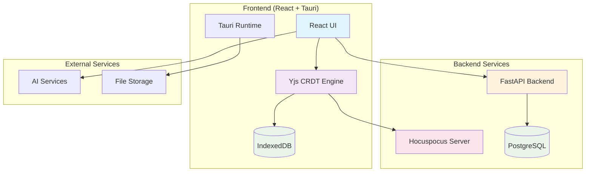
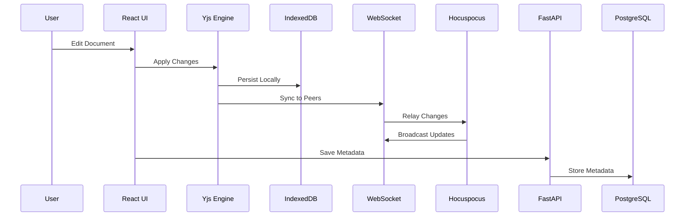
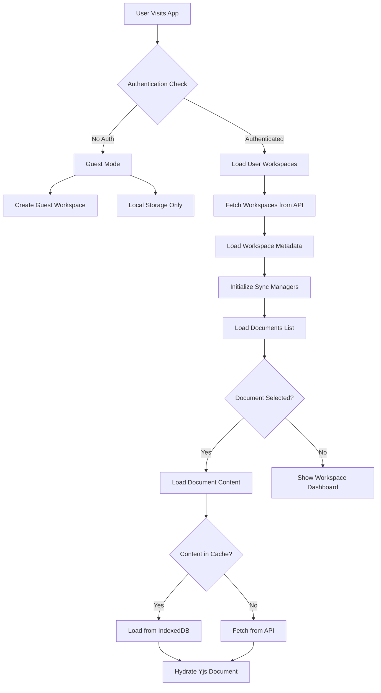
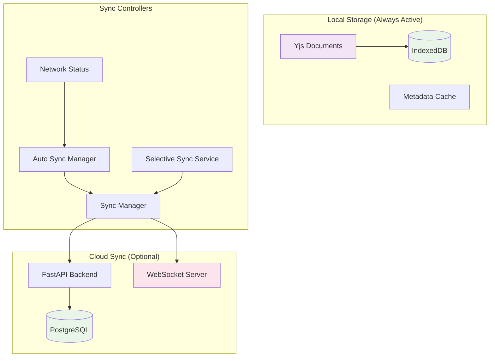
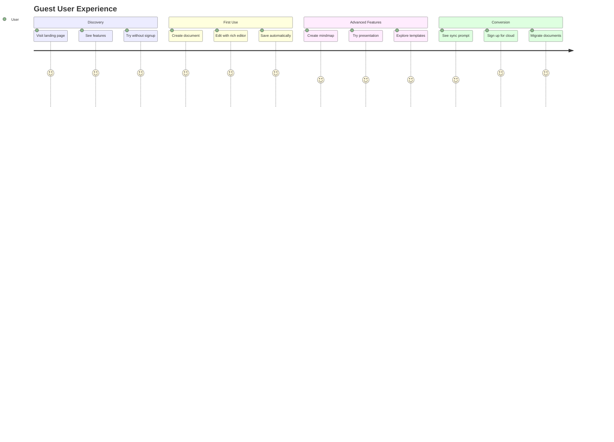
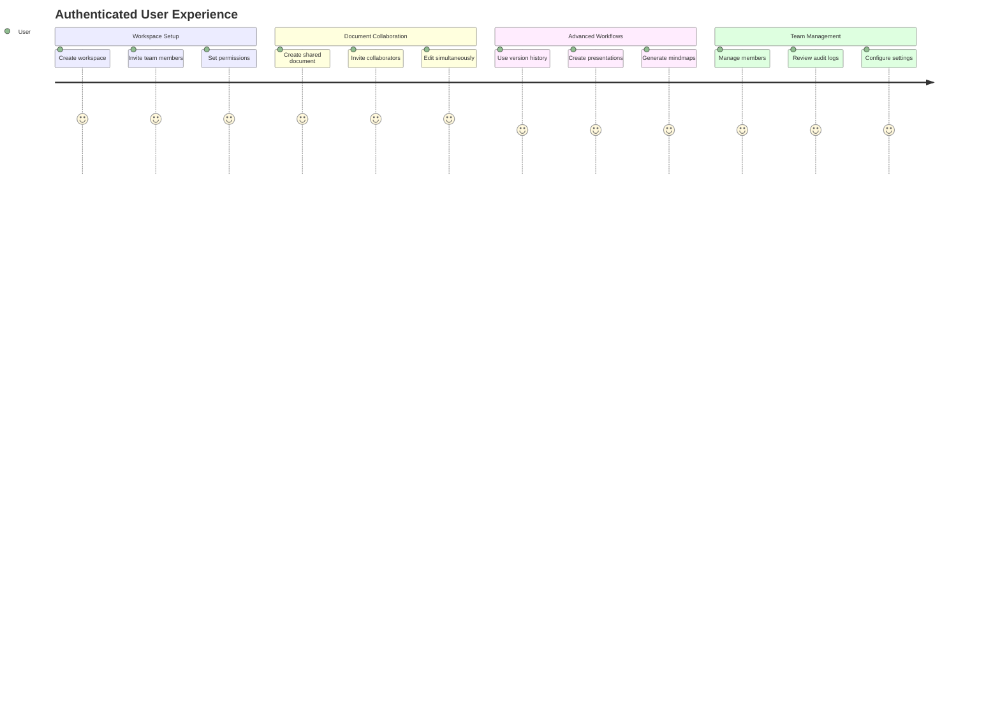
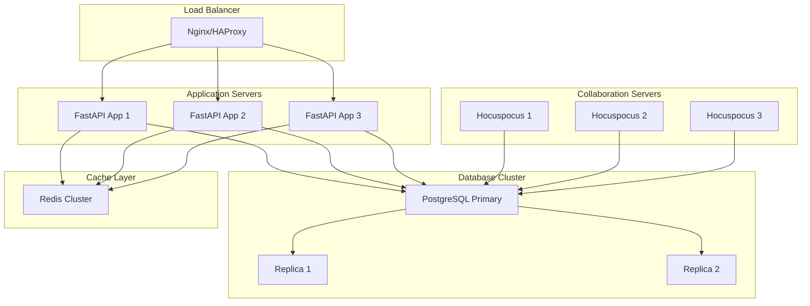
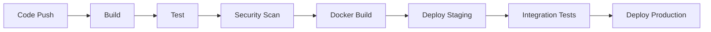

# MDReader: Comprehensive Documentation & Architecture

## 📋 Overview

**MDReader** is a sophisticated local-first collaborative markdown editor and workspace platform that combines the power of real-time collaboration, advanced document management, and seamless offline capabilities. It's designed as a modern writing workspace that works both online and offline, with optional cloud synchronization.

### 🎯 Core Philosophy

- **Local-First**: Every edit works offline and persists immediately to local storage
- **Real-Time Collaboration**: Multi-user editing with conflict-free replicated data types (CRDT)
- **Unified Workspace**: Single interface for documents, mindmaps, presentations, and templates
- **Flexible Sync**: User-controlled cloud synchronization with automatic background sync

---

## 🚀 Key Features

### 📝 Document Management
- **Rich Text Editor**: TipTap-based WYSIWYG markdown editor
- **Multiple Formats**: Support for markdown, mindmaps, and presentations
- **Version History**: Snapshot-based version control with diff viewing
- **Templates**: Pre-built document templates for quick start

### 🤝 Collaboration & Sharing
- **Real-Time Editing**: Simultaneous multi-user editing with live cursors
- **Presence Indicators**: See who's online and where they're editing
- **Share Links**: Public sharing with granular permissions
- **Workspace Members**: Team collaboration with role-based access

### 🔄 Synchronization
- **Dual Storage**: Local IndexedDB + optional cloud PostgreSQL
- **Selective Sync**: Choose which documents sync to cloud
- **Offline Resilience**: Full functionality without internet
- **Conflict Resolution**: Automatic merging with manual override

### 🏢 Workspace Organization
- **Hierarchical Structure**: Workspaces → Folders → Documents
- **Tagging System**: Flexible document categorization
- **Search & Filter**: Full-text search across all content
- **Favorites**: Star important documents for quick access

### 🎨 Rich Content Types
- **Markdown Documents**: Full-featured markdown with live preview
- **Mind Maps**: Visual thinking with automatic layout algorithms
- **Presentations**: Slide-based presentations with presenter mode
- **Code Blocks**: Syntax highlighting for 100+ languages
- **Tables**: Rich table editing with formatting
- **Images**: Drag-and-drop image insertion

### 🔧 Developer Features
- **Desktop App**: Tauri-based native desktop application
- **File System Integration**: Direct file operations on desktop
- **AI Integration**: AI-powered content assistance
- **API Access**: RESTful API for integrations

---

## 🏗️ System Architecture

### High-Level Architecture



### Component Communication Flow



---

## 🔧 Technology Stack

### Frontend
- **React 18**: Modern React with hooks and concurrent features
- **TypeScript**: Full type safety and developer experience
- **Vite**: Fast build tool and development server
- **Tailwind CSS**: Utility-first CSS framework
- **TipTap**: Rich text editor framework
- **Yjs**: Conflict-free replicated data types
- **Tauri**: Desktop application framework

### Backend
- **FastAPI**: High-performance async web framework
- **SQLAlchemy**: Async ORM with PostgreSQL
- **Pydantic**: Data validation and serialization
- **Hocuspocus**: Yjs WebSocket server for collaboration

### Storage & Sync
- **IndexedDB**: Local browser storage (Dexie.js)
- **PostgreSQL**: Cloud metadata storage
- **Yjs CRDT**: Real-time collaboration protocol
- **WebSocket**: Real-time communication

### Development Tools
- **Vitest**: Fast unit testing
- **Playwright**: E2E testing
- **ESLint**: Code linting
- **Prettier**: Code formatting

---

## 📊 Data Flow Architecture

### Document Creation & Editing Flow

```mermaid
flowchart TD
    A[User Clicks "New Document"] --> B{Authentication Status}

    B -->|Guest| C[Create Guest Document]
    B -->|Authenticated| D[Create Cloud Document]

    C --> E[Initialize Yjs Document]
    D --> E

    E --> F[Open TipTap Editor]
    F --> G[User Types Content]

    G --> H[Yjs Applies Changes]
    H --> I[Persist to IndexedDB]
    H --> J{Sync Mode}

    J -->|Cloud Enabled| K[Send to Hocuspocus]
    J -->|Local Only| L[Skip Cloud Sync]

    K --> M[Real-time Broadcast]
    M --> N[Update Other Users]

    H --> O[Auto-save Metadata]
    O --> P{User Authenticated?}

    P -->|Yes| Q[Sync to Backend API]
    P -->|No| R[Store Locally Only]
```

### Authentication & Workspace Flow



### Sync Architecture



---

## 🎯 Core User Flows

### 1. Guest User Journey



### 2. Authenticated User Journey



---

## 🔐 Security & Permissions

### Authentication System
- **JWT Tokens**: Secure token-based authentication
- **Guest Mode**: Anonymous usage with local-only storage
- **Social Login**: OAuth integration (future)
- **Session Management**: Automatic token refresh

### Permission Levels

| Role | Workspace Access | Document Access | Admin Features |
|------|------------------|-----------------|----------------|
| Owner | Full CRUD | Full CRUD | All features |
| Admin | Full CRUD | Full CRUD | User management |
| Editor | Read/Write | Read/Write | None |
| Viewer | Read Only | Read Only | None |
| Guest | None | Link-based access | None |

### Data Security
- **End-to-End Encryption**: Content encryption at rest
- **API Security**: OWASP-compliant security headers
- **Input Validation**: Pydantic schemas for all inputs
- **SQL Injection Prevention**: Parameterized queries

---

## 📈 Performance Characteristics

### Response Times
- **Local Edits**: < 10ms (IndexedDB)
- **Cloud Sync**: < 200ms (WebSocket)
- **API Calls**: < 100ms (FastAPI + async)
- **Search**: < 50ms (local IndexedDB)

### Storage Limits
- **Local Storage**: Browser limits (~50MB typical)
- **Cloud Storage**: Unlimited (configurable)
- **Document Size**: Unlimited (streaming support)
- **Concurrent Users**: Unlimited (WebSocket scaling)

### Offline Capabilities
- **Full Editing**: All features work offline
- **Auto-Sync**: Automatic sync when online
- **Conflict Resolution**: CRDT-based merging
- **Queue Management**: Offline action queuing

---

## 🔌 API Architecture

### REST API Endpoints

#### Authentication
```
POST   /api/v1/auth/login
POST   /api/v1/auth/signup
POST   /api/v1/auth/refresh
GET    /api/v1/auth/me
```

#### Workspaces
```
GET    /api/v1/workspaces
POST   /api/v1/workspaces
GET    /api/v1/workspaces/{id}
PUT    /api/v1/workspaces/{id}
DELETE /api/v1/workspaces/{id}
```

#### Documents
```
GET    /api/v1/documents
POST   /api/v1/documents
GET    /api/v1/documents/{id}
PUT    /api/v1/documents/{id}
DELETE /api/v1/documents/{id}
POST   /api/v1/documents/{id}/star
```

#### Collaboration
```
GET    /api/v1/documents/{id}/collaborators
POST   /api/v1/documents/{id}/collaborators
DELETE /api/v1/documents/{id}/collaborators/{userId}
```

#### Sharing
```
POST   /api/v1/share-links
GET    /api/v1/share-links/{token}
DELETE /api/v1/share-links/{id}
```

### WebSocket Events

#### Document Sync
```javascript
// Client → Server
{
  type: 'sync',
  documentId: 'doc_123',
  changes: {...}
}

// Server → Clients
{
  type: 'update',
  documentId: 'doc_123',
  changes: {...},
  userId: 'user_456'
}
```

#### Presence
```javascript
// User joins document
{
  type: 'presence:join',
  documentId: 'doc_123',
  user: { id: 'user_456', name: 'John' }
}

// User moves cursor
{
  type: 'presence:cursor',
  documentId: 'doc_123',
  userId: 'user_456',
  position: { line: 10, column: 5 }
}
```

---

## 🧪 Testing Strategy

### Unit Tests
- **Frontend**: Vitest for React components and hooks
- **Backend**: Pytest for FastAPI endpoints and services
- **Coverage**: >90% target for critical paths

### Integration Tests
- **API Integration**: Full request/response testing
- **Database**: SQLAlchemy session testing
- **WebSocket**: Real-time sync testing

### E2E Tests
- **Playwright**: User journey testing
- **Collaboration**: Multi-user editing scenarios
- **Offline**: Network disruption testing

### Performance Tests
- **Load Testing**: Concurrent user simulation
- **Memory Usage**: Long-running session testing
- **Sync Performance**: Large document sync testing

---

## 🚀 Deployment & Scaling

### Development Environment
```bash
# Start all services
./start-services.sh

# Frontend: http://localhost:5173
# Backend: http://localhost:7001
# Hocuspocus: ws://localhost:1234
# PostgreSQL: localhost:5432
```

### Production Architecture


### Scaling Considerations
- **Horizontal Scaling**: Stateless application servers
- **WebSocket Scaling**: Sticky sessions or Redis pub/sub
- **Database Scaling**: Read replicas for collaboration data
- **Cache Strategy**: Redis for session and metadata caching

---

## 🔄 Development Workflow

### Branch Strategy
```
main                    # Production releases
├── develop            # Integration branch
├── feature/auth       # Feature branches
├── feature/collaboration
├── bugfix/sync-issues
└── release/v1.2.0     # Release branches
```

### Code Quality
- **Linting**: ESLint + Prettier (frontend), Black + isort (backend)
- **Type Checking**: TypeScript strict mode, mypy (backend)
- **Testing**: Pre-commit hooks for test execution
- **Documentation**: Auto-generated API docs with OpenAPI

### CI/CD Pipeline


---

## 📚 Key Concepts & Terminology

### Core Concepts

| Term | Definition |
|------|------------|
| **Local-First** | Data lives locally first, cloud is optional |
| **CRDT** | Conflict-free replicated data types for collaboration |
| **Hydration** | Loading Yjs state from storage into memory |
| **Selective Sync** | User chooses which documents sync to cloud |
| **Workspace** | Top-level organizational unit for documents |
| **Guest Mode** | Anonymous usage with local-only storage |

### Technical Terms

| Term | Definition |
|------|------------|
| **Yjs Document** | CRDT data structure for collaborative editing |
| **Hocuspocus** | Yjs WebSocket server for real-time sync |
| **IndexedDB** | Browser-based NoSQL database |
| **TipTap** | Rich text editor framework built on ProseMirror |
| **WebSocket** | Real-time bidirectional communication protocol |

### User-Facing Terms

| Term | Definition |
|------|------------|
| **Document** | Markdown file with rich editing capabilities |
| **Mindmap** | Visual diagram for brainstorming and organization |
| **Presentation** | Slide-based presentation with presenter mode |
| **Template** | Pre-built document structure for quick start |
| **Share Link** | Public URL for document access without login |
| **Workspace** | Container for organizing documents and team members |

---

## 🎯 Success Metrics

### User Experience
- **Time to First Edit**: < 3 seconds
- **Offline Functionality**: 100% feature parity
- **Collaboration Latency**: < 100ms
- **Search Speed**: < 50ms for full workspace

### Technical Metrics
- **Uptime**: 99.9% availability
- **API Response Time**: < 200ms p95
- **WebSocket Connections**: Support 10k+ concurrent
- **Storage Efficiency**: < 2x storage overhead for sync

### Business Metrics
- **User Retention**: > 70% monthly active users
- **Collaboration Usage**: > 30% of documents shared
- **Cloud Migration**: > 50% of guest users convert
- **Team Adoption**: > 20% multi-user workspaces

---

## 🚀 Roadmap & Future Features

### Phase 1: Core Enhancement (Q1 2025)
- [ ] Advanced collaboration features (comments, mentions)
- [ ] Enhanced presentation editor
- [ ] Mobile app (React Native)
- [ ] Plugin system for extensions

### Phase 2: Enterprise Features (Q2 2025)
- [ ] Advanced permissions (field-level access)
- [ ] Audit logs and compliance
- [ ] SSO integration
- [ ] Advanced search and filtering

### Phase 3: AI Integration (Q3 2025)
- [ ] AI-powered content suggestions
- [ ] Automatic summarization
- [ ] Smart templates
- [ ] Voice-to-text integration

### Phase 4: Ecosystem (Q4 2025)
- [ ] API for third-party integrations
- [ ] Zapier integration
- [ ] Public API marketplace
- [ ] White-label solutions

---

*Documentation generated: December 30, 2025*
*MDReader Version: 1.0.0*
*Architecture: Local-first collaborative editing platform*
