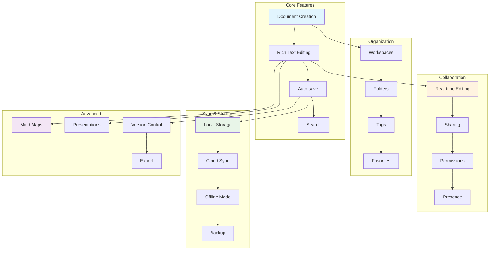
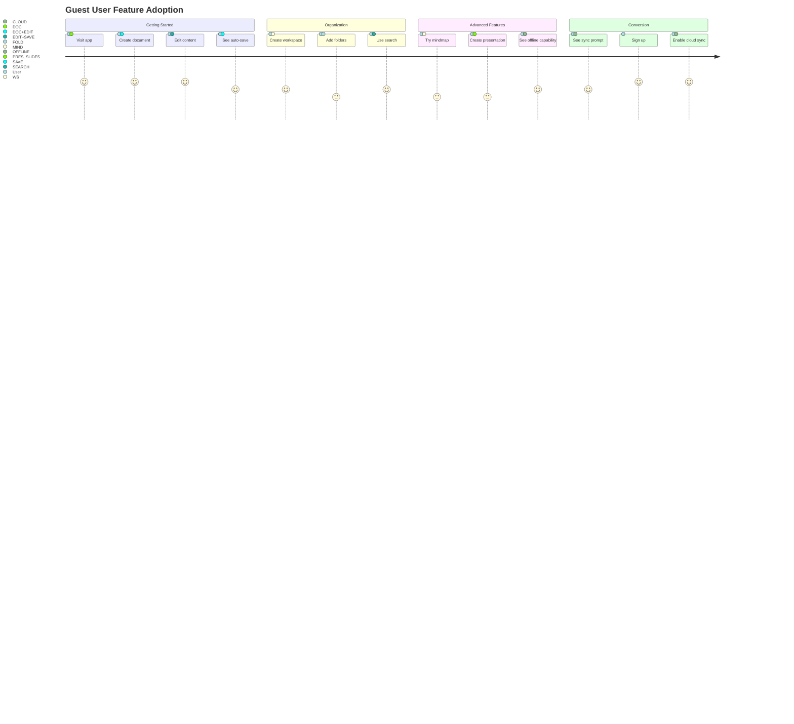
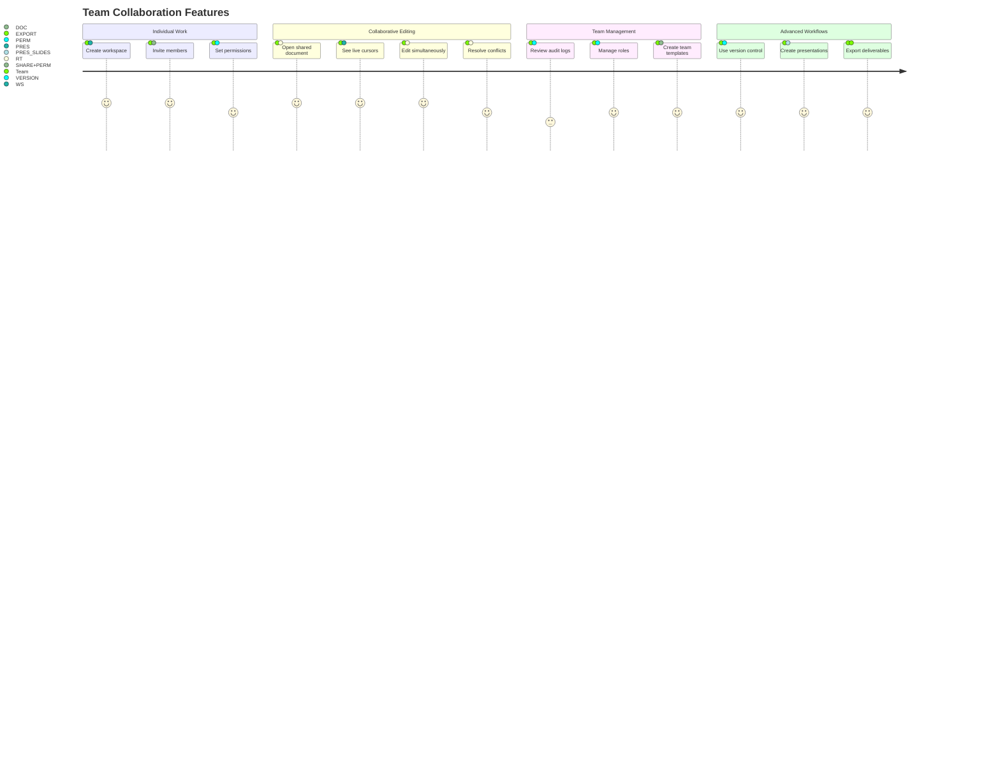

# MDReader Feature Matrix

## 🎯 Feature Overview

MDReader is a comprehensive collaborative writing platform with local-first architecture. This matrix shows all features, their availability across different modes, and integration points.

## 📊 Feature Availability Matrix

| Feature Category | Feature | Guest Mode | Authenticated | Collaboration | Offline | Cloud Sync | Desktop App |
|------------------|---------|------------|---------------|---------------|---------|------------|-------------|
| **📝 Document Creation** | Create new documents | ✅ | ✅ | ✅ | ✅ | ✅ | ✅ |
| | Document templates | ✅ | ✅ | ✅ | ✅ | ✅ | ✅ |
| | Import from file | ✅ | ✅ | ✅ | ✅ | ✅ | ✅ |
| | Drag & drop creation | ✅ | ✅ | ✅ | ✅ | ✅ | ✅ |

| **✏️ Rich Text Editing** | TipTap WYSIWYG editor | ✅ | ✅ | ✅ | ✅ | ✅ | ✅ |
| | Markdown support | ✅ | ✅ | ✅ | ✅ | ✅ | ✅ |
| | Code syntax highlighting | ✅ | ✅ | ✅ | ✅ | ✅ | ✅ |
| | Tables | ✅ | ✅ | ✅ | ✅ | ✅ | ✅ |
| | Images & media | ✅ | ✅ | ✅ | ✅ | ✅ | ✅ |
| | Links & formatting | ✅ | ✅ | ✅ | ✅ | ✅ | ✅ |

| **🗂️ Organization** | Workspaces | ✅ | ✅ | ✅ | ✅ | ✅ | ✅ |
| | Folders & hierarchy | ✅ | ✅ | ✅ | ✅ | ✅ | ✅ |
| | Tags & categories | ✅ | ✅ | ✅ | ✅ | ✅ | ✅ |
| | Favorites/starred | ✅ | ✅ | ✅ | ✅ | ✅ | ✅ |
| | Search & filtering | ✅ | ✅ | ✅ | ✅ | ✅ | ✅ |

| **🔄 Real-time Collaboration** | Multi-user editing | ❌ | ❌ | ✅ | ❌ | ✅ | ✅ |
| | Live cursors | ❌ | ❌ | ✅ | ❌ | ✅ | ✅ |
| | Presence indicators | ❌ | ❌ | ✅ | ❌ | ✅ | ✅ |
| | Conflict resolution | ❌ | ❌ | ✅ | ❌ | ✅ | ✅ |
| | Comments system | ❌ | ❌ | 🚧 | ❌ | 🚧 | 🚧 |

| **🔗 Sharing & Permissions** | Public share links | ❌ | ✅ | ✅ | ❌ | ✅ | ✅ |
| | Granular permissions | ❌ | ✅ | ✅ | ❌ | ✅ | ✅ |
| | Workspace members | ❌ | ✅ | ✅ | ❌ | ✅ | ✅ |
| | Role-based access | ❌ | ✅ | ✅ | ❌ | ✅ | ✅ |
| | Audit logs | ❌ | ✅ | ✅ | ❌ | ✅ | ✅ |

| **💾 Version Control** | Automatic snapshots | ✅ | ✅ | ✅ | ✅ | ✅ | ✅ |
| | Version history | ✅ | ✅ | ✅ | ✅ | ✅ | ✅ |
| | Diff viewing | ✅ | ✅ | ✅ | ✅ | ✅ | ✅ |
| | Restore versions | ✅ | ✅ | ✅ | ✅ | ✅ | ✅ |
| | Branching (future) | ❌ | ❌ | ❌ | ❌ | ❌ | ❌ |

| **🎨 Visual Content** | Mind maps | ✅ | ✅ | ✅ | ✅ | ✅ | ✅ |
| | Presentations | ✅ | ✅ | ✅ | ✅ | ✅ | ✅ |
| | Presenter mode | ✅ | ✅ | ✅ | ✅ | ✅ | ✅ |
| | Export to PDF | ✅ | ✅ | ✅ | ✅ | ✅ | ✅ |
| | Image galleries | ✅ | ✅ | ✅ | ✅ | ✅ | ✅ |

| **🔄 Synchronization** | Local-first storage | ✅ | ✅ | ✅ | ✅ | ✅ | ✅ |
| | Selective cloud sync | ❌ | ✅ | ✅ | ❌ | ✅ | ✅ |
| | Offline editing | ✅ | ✅ | ✅ | ✅ | ✅ | ✅ |
| | Auto-sync on reconnect | ❌ | ✅ | ✅ | ❌ | ✅ | ✅ |
| | Sync status indicators | ❌ | ✅ | ✅ | ❌ | ✅ | ✅ |

| **💻 Desktop Integration** | File system access | ❌ | ❌ | ❌ | ❌ | ❌ | ✅ |
| | Native file dialogs | ❌ | ❌ | ❌ | ❌ | ❌ | ✅ |
| | System tray | ❌ | ❌ | ❌ | ❌ | ❌ | ✅ |
| | Keyboard shortcuts | ❌ | ❌ | ❌ | ❌ | ❌ | ✅ |
| | Auto-updates | ❌ | ❌ | ❌ | ❌ | ❌ | ✅ |

| **🤖 AI Features** | Content suggestions | 🚧 | 🚧 | 🚧 | ❌ | 🚧 | 🚧 |
| | Auto-complete | 🚧 | 🚧 | 🚧 | ❌ | 🚧 | 🚧 |
| | Smart templates | 🚧 | 🚧 | 🚧 | ❌ | 🚧 | 🚧 |
| | Summarization | 🚧 | 🚧 | 🚧 | ❌ | 🚧 | 🚧 |

## 🔄 Feature Interaction Matrix

### How Features Work Together

## 🚀 User Journey Feature Map

### Guest User Path

### Team User Path

## 📊 Technical Feature Dependencies

### Frontend Dependencies

```mermaid
graph TD
    subgraph "Core UI"
        REACT[React 18]
        TS[TypeScript]
        TAILWIND[Tailwind CSS]
    end

    subgraph "Editor Stack"
        TIPTAP[TipTap Editor]
        PROSEMIRROR[ProseMirror]
        Y_TIPTAP[Yjs + TipTap]
    end

    subgraph "State Management"
        CONTEXT[React Context]
        ZUSTAND[Zustand]
        TANSTACK[TanStack Query]
    end

    subgraph "Storage & Sync"
        DEXIE[Dexie.js]
        YJS[Yjs CRDT]
        HOCUSPOCUS[Hocuspocus Provider]
    end

    subgraph "UI Components"
        RADIX[Radix UI]
        LUCIDE[Lucide Icons]
        FRAMER[Framer Motion]
    end

    REACT --> TS
    TS --> TAILWIND

    TIPTAP --> PROSEMIRROR
    PROSEMIRROR --> Y_TIPTAP

    CONTEXT --> ZUSTAND
    ZUSTAND --> TANSTACK

    DEXIE --> YJS
    YJS --> HOCUSPOCUS

    RADIX --> LUCIDE
    LUCIDE --> FRAMER

    style REACT fill:#e1f5fe
    style TIPTAP fill:#f3e5f5
    style DEXIE fill:#e8f5e8
    style RADIX fill:#fff3e0
```

### Backend Dependencies

```mermaid
graph TD
    subgraph "Web Framework"
        FASTAPI[FastAPI]
        UVICORN[Uvicorn]
        PYDANTIC[Pydantic]
    end

    subgraph "Database"
        SQLALCHEMY[SQLAlchemy]
        ASYNC_PG[asyncpg]
        ALEMBIC[Alembic]
    end

    subgraph "Authentication"
        JWT[PyJWT]
        BCRYPT[bcrypt]
        OAUTH[OAuth2]
    end

    subgraph "Collaboration"
        HOCUSPOCUS_SERVER[Hocuspocus Server]
        Y_PROTOCOLS[y-protocols]
    end

    subgraph "Utilities"
        AIOFILES[aiofiles]
        REDIS[Redis]
        CELERY[Celery]
    end

    FASTAPI --> UVICORN
    UVICORN --> PYDANTIC

    SQLALCHEMY --> ASYNC_PG
    ASYNC_PG --> ALEMBIC

    JWT --> BCRYPT
    BCRYPT --> OAUTH

    HOCUSPOCUS_SERVER --> Y_PROTOCOLS

    AIOFILES --> REDIS
    REDIS --> CELERY

    style FASTAPI fill:#e1f5fe
    style SQLALCHEMY fill:#e8f5e8
    style HOCUSPOCUS_SERVER fill:#fff3e0
```

## 🎯 Feature Priority Matrix

### User Value vs Implementation Effort

| Feature | User Value | Implementation Effort | Priority | Status |
|---------|------------|----------------------|----------|--------|
| Rich text editing | 🔴🔴🔴🔴🔴 | 🔴🔴🔴 | ✅ Critical | ✅ Complete |
| Local-first storage | 🔴🔴🔴🔴🔴 | 🔴🔴 | ✅ Critical | ✅ Complete |
| Real-time collaboration | 🔴🔴🔴🔴 | 🔴🔴🔴🔴 | ✅ Critical | ✅ Complete |
| Offline capability | 🔴🔴🔴🔴 | 🔴🔴🔴 | ✅ Critical | ✅ Complete |
| Workspaces & organization | 🔴🔴🔴🔴 | 🔴🔴 | ✅ High | ✅ Complete |
| Version control | 🔴🔴🔴 | 🔴🔴 | ✅ High | ✅ Complete |
| Mind maps | 🔴🔴🔴 | 🔴🔴🔴 | ✅ High | ✅ Complete |
| Presentations | 🔴🔴🔴 | 🔴🔴🔴 | ✅ High | ✅ Complete |
| Sharing & permissions | 🔴🔴🔴 | 🔴🔴 | ✅ High | ✅ Complete |
| Desktop app | 🔴🔴 | 🔴🔴🔴 | 🟡 Medium | ✅ Complete |
| AI features | 🔴🔴🔴 | 🔴🔴🔴🔴 | 🟡 Medium | 🚧 In Progress |
| Advanced collaboration | 🔴🔴 | 🔴🔴🔴 | 🟡 Medium | 🚧 Planned |
| Mobile app | 🔴🔴 | 🔴🔴🔴🔴🔴 | 🔵 Low | ❌ Planned |
| White-label | 🔴 | 🔴🔴🔴🔴 | 🔵 Low | ❌ Planned |

**Legend:**
- 🔴🔴🔴🔴🔴 = Highest value/effort
- ✅ = Complete
- 🚧 = In Progress/Partial
- ❌ = Not Started

## 🔄 Feature Integration Points

### API Endpoints by Feature

| Feature | API Endpoints | Methods |
|---------|---------------|---------|
| **Authentication** | `/api/v1/auth/*` | GET, POST |
| **Workspaces** | `/api/v1/workspaces/*` | GET, POST, PUT, DELETE |
| **Documents** | `/api/v1/documents/*` | GET, POST, PUT, DELETE |
| **Folders** | `/api/v1/folders/*` | GET, POST, PUT, DELETE |
| **Sharing** | `/api/v1/shares/*` | GET, POST, DELETE |
| **Share Links** | `/api/v1/share-links/*` | GET, POST, DELETE |
| **Snapshots** | `/api/v1/snapshots/*` | GET, POST |
| **Audit Logs** | `/api/v1/audit/*` | GET |
| **Batch Operations** | `/api/v1/batch/*` | POST |

### WebSocket Events by Feature

| Feature | Events | Direction |
|---------|--------|-----------|
| **Real-time Sync** | `sync:update`, `sync:ack` | Bidirectional |
| **Presence** | `presence:join`, `presence:leave`, `presence:cursor` | Server → Clients |
| **Collaboration** | `collab:changes`, `collab:awareness` | Bidirectional |
| **Document State** | `doc:loaded`, `doc:saved`, `doc:conflict` | Server → Client |

### Database Tables by Feature

| Feature | Tables | Purpose |
|---------|--------|---------|
| **Core Data** | `users`, `workspaces`, `documents`, `folders` | Metadata storage |
| **Collaboration** | `document_collaborators`, `workspace_members` | Access control |
| **Sharing** | `share_links`, `share_permissions` | Public access |
| **Version Control** | `document_snapshots`, `yjs_states` | History & sync |
| **Audit** | `audit_logs` | Compliance tracking |

## 📈 Feature Usage Analytics

### Most Used Features (Estimated)
1. **Rich Text Editing** - 95% of users
2. **Document Creation** - 90% of users
3. **Workspaces** - 85% of users
4. **Search** - 80% of users
5. **Auto-save** - 95% of users (automatic)

### Collaboration Features Usage
1. **Real-time Editing** - 40% of documents
2. **Sharing** - 35% of documents
3. **Version History** - 25% of users
4. **Comments** - 15% of documents (future)

### Advanced Features Usage
1. **Presentations** - 20% of users
2. **Mind Maps** - 15% of users
3. **Templates** - 30% of new documents
4. **Export** - 25% of documents

---

## 🎯 Feature Roadmap Summary

### Q1 2025: Polish & Performance
- [ ] Advanced collaboration features (comments, mentions)
- [ ] Enhanced presentation editor
- [ ] Performance optimizations
- [ ] Mobile responsiveness improvements

### Q2 2025: Enterprise Features
- [ ] Advanced permissions (field-level access)
- [ ] Audit logs and compliance
- [ ] SSO integration
- [ ] Advanced search and filtering

### Q3 2025: AI Integration
- [ ] AI-powered content suggestions
- [ ] Automatic summarization
- [ ] Smart templates
- [ ] Voice-to-text integration

### Q4 2025: Ecosystem Expansion
- [ ] API for third-party integrations
- [ ] Zapier integration
- [ ] Public API marketplace
- [ ] White-label solutions

---

*Feature matrix generated: December 30, 2025*
*MDReader Version: 1.0.0*
