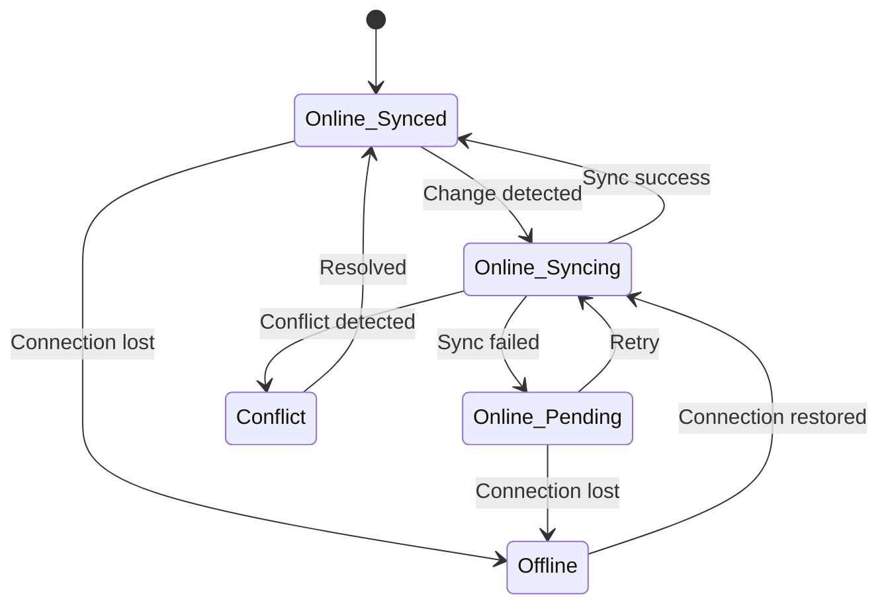

# 🔄 Offline/Online Sync Strategy

## 📊 **User Mode Matrix**

| Mode | Logged In? | Storage | Sync | Use Case |
|------|-----------|---------|------|----------|
| **Online + Guest** | ❌ | localStorage | None | Quick notes, demos |
| **Online + Logged** | ✅ | Backend + localStorage | Real-time | Primary mode (current) |
| **Offline + Guest** | ❌ | IndexedDB | None | Plane, no account |
| **Offline + Logged** | ✅ | IndexedDB | Queue → Sync on reconnect | Plane with account |

---

## 🎯 **3 User Tiers**

### **Tier 1: Guest (Not Logged In)**

**Online:**
- Store in `localStorage` (5-10MB limit)
- Banner: "Sign up to sync across devices"
- On signup: Migrate localStorage → Backend

**Offline:**
- Store in `IndexedDB` (unlimited)
- Banner: "Working offline. Data stored locally."
- On reconnect: Prompt "Sign up to backup your work"

**⚠️ Risk**: Browser data clear = data lost

---

### **Tier 2: Logged In User (Current Implementation)**

**Online:**
- Every change → Immediate POST to backend
- `localStorage` as write-through cache
- Backend is source of truth

**Offline (To Implement):**
- All changes → `IndexedDB` pending queue
- UI shows "⚠️ Offline - Changes will sync when online"
- On reconnect → Sync queue automatically

**Conflict Resolution:**
- Last-write-wins (simple)
- OR: Show conflict modal (complex but safer)

---

### **Tier 3: Desktop App (Tauri - Future)**
- Always offline-first
- Local SQLite database
- Optional backend sync
- Full filesystem access

---

## 🔧 **Sync Manager Architecture**

```typescript
interface SyncManager {
  // Queue management
  queueChange(change: Change): void
  getPendingChanges(): Change[]
  clearQueue(): void
  
  // Sync execution
  syncNow(): Promise<SyncResult>
  syncOnReconnect(): void
  startAutoSync(intervalMs: number): void
  stopAutoSync(): void
  
  // Conflict handling
  detectConflicts(): Conflict[]
  resolveConflict(conflictId: string, strategy: 'local' | 'remote' | 'merge'): void
  
  // State tracking
  getLastSyncTime(): Date
  isSyncing(): boolean
  hasPendingChanges(): boolean
  getSyncStatus(): SyncStatus
}

interface Change {
  id: string
  type: 'create' | 'update' | 'delete'
  entity: 'document' | 'folder' | 'workspace'
  entityId: string
  data: any
  timestamp: Date
  synced: boolean
  retryCount: number
  lastError?: string
}

interface SyncResult {
  success: boolean
  synced: number
  failed: number
  conflicts: Conflict[]
  errors: SyncError[]
}

interface Conflict {
  id: string
  entity: 'document' | 'folder'
  entityId: string
  localVersion: any
  remoteVersion: any
  localTimestamp: Date
  remoteTimestamp: Date
}

type SyncStatus = 
  | 'online_synced'      // Online, no pending changes
  | 'online_syncing'     // Online, syncing now
  | 'online_pending'     // Online but has pending changes
  | 'offline'            // Offline, changes queued
  | 'conflict'           // Has unresolved conflicts
  | 'error';             // Sync failed
```

---

## 💡 **User Scenarios**

### **Scenario 1: Guest → Offline → Back Online**
```
1. User works as guest (localStorage)
2. Goes offline (data moves to IndexedDB)
3. Comes back online
4. Banner: "You have unsaved work. Sign up to backup?"
5. On signup → Upload all local data to backend
```

### **Scenario 2: Logged In → Offline → Online**
```
1. User edits doc while online (saves to backend)
2. Loses connection (switches to IndexedDB queue)
3. UI shows "⚠️ Offline" badge
4. Makes 5 more edits (queued)
5. Reconnects → Auto-sync queue → "✓ Synced"
```

### **Scenario 3: Offline First, Never Login**
```
1. User works offline in browser
2. Never logs in
3. Data stays in IndexedDB forever
4. Persistent banner: "Sign up to backup"
```

### **Scenario 4: Multi-Device Conflict**
```
Device A (offline): Edit doc at 10:00
Device B (offline): Edit doc at 10:05
Both reconnect at 10:10

Conflict detected!

Resolution Options:
A. Last-write-wins (Device B overwrites A) ← MVP
B. Show conflict modal (let user choose)
C. Merge changes (complex, error-prone)
```

---

## 🚨 **Problems & Solutions**

### **Problem 1: Concurrent Edits on 2 Devices**
**Scenario**: User edits same doc on laptop (offline) and phone (online)

**Solution (MVP)**: 
- Last-write-wins based on timestamp
- Show notification: "Document updated from another device"

**Solution (Advanced)**:
- Operational Transform (like Google Docs)
- Requires: WebSocket, CRDT, conflict-free merge

---

### **Problem 2: Guest with 50 Docs Wants to Login**
**Scenario**: 
```
localStorage: 50 docs
User signs up
Need to bulk upload 50 docs → backend
What if upload fails halfway?
```

**Solution**:
```typescript
async function migrateGuestData(userId: string) {
  const guestDocs = getGuestDocuments();
  const queue = new UploadQueue();
  
  for (const doc of guestDocs) {
    queue.add(async () => {
      await uploadDocument(userId, doc);
      markAsMigrated(doc.id);
    });
  }
  
  await queue.processWithRetry();
  clearGuestStorage();
}
```
- Batch upload with retry
- Keep localStorage until all confirmed
- Progress: "Uploading 27/50..."

---

### **Problem 3: Offline Delete vs Online Edit**
**Scenario**:
```
Online: User B edits doc
Offline: User A deletes doc
User A reconnects
```

**Solution**:
- Server wins (doc exists, reject delete)
- Notify: "Document was modified online, delete cancelled"
- Alternative: Move to trash instead of hard delete

---

### **Problem 4: Network Flakiness**
**Scenario**: Connection drops mid-save, then reconnects

**Solution**:
```typescript
class NetworkManager {
  private isOnline = navigator.onLine;
  
  constructor() {
    window.addEventListener('online', this.handleOnline);
    window.addEventListener('offline', this.handleOffline);
  }
  
  handleOnline = async () => {
    this.isOnline = true;
    showNotification('Back online. Syncing...');
    await syncManager.syncNow();
  }
  
  handleOffline = () => {
    this.isOnline = false;
    showNotification('Offline. Changes will sync when online.');
  }
}
```

---

## 🎯 **Implementation Phases**

### **Phase 1: MVP (Current + 2 weeks)**
- [x] Online + Logged In
- [ ] Document upload (.md, .txt)
- [ ] Auto-save every 3 seconds
- [ ] Offline detection + UI indicator
- [ ] Basic IndexedDB storage

**Goal**: Users can work online and upload documents

---

### **Phase 2: Offline Support (2 weeks)**
- [ ] IndexedDB storage layer
- [ ] Sync queue manager
- [ ] Auto-sync on reconnect
- [ ] Last-write-wins conflict resolution
- [ ] Sync status indicator

**Goal**: Users can work offline and sync when back online

---

### **Phase 3: Guest Mode (1 week)**
- [ ] localStorage for guests
- [ ] Migration flow (guest → logged in)
- [ ] Persistent "Sign up" banner
- [ ] Local-only mode toggle

**Goal**: Users can try without account

---

### **Phase 4: Advanced Sync (2 weeks)**
- [ ] Manual conflict resolution UI
- [ ] Sync history / version control
- [ ] Selective sync (large workspaces)
- [ ] Sync settings page

**Goal**: Professional-grade sync experience

---

## 🔍 **Competitor Analysis**

| Product | Guest Mode | Offline | Sync Strategy | Conflict Resolution |
|---------|-----------|---------|---------------|---------------------|
| **Notion** | ❌ Login required | ✅ Full offline | Auto-sync | Last-write-wins |
| **Google Docs** | ⚠️ View-only | ✅ With Drive | Real-time OT | Automatic merge |
| **Obsidian** | ✅ Fully local | ✅ Always | Optional plugin | Manual |
| **Dropbox Paper** | ❌ Login required | ❌ Online-only | Real-time | N/A |
| **Bear** | ❌ Login required | ✅ Full offline | iCloud sync | Last-write-wins |

**MDReader Target**: Notion-like (offline-first with smart sync)

---

## 🏗️ **Technical Stack**

### **Storage**
```typescript
// Online (logged in)
Backend (PostgreSQL) → Source of truth
localStorage → Write-through cache (5MB)

// Offline (logged in)
IndexedDB → Queue changes (unlimited)
  └─ documents
  └─ folders
  └─ pending_changes
  └─ sync_metadata

// Guest
localStorage → Temporary storage
IndexedDB → If >5MB or offline
```

### **Sync Strategy**
```typescript
1. User makes change
2. If online:
   - POST to backend
   - If success: Update localStorage
   - If fail: Queue in IndexedDB
3. If offline:
   - Save to IndexedDB
   - Add to sync queue
4. On reconnect:
   - Process queue FIFO
   - Retry failed items
   - Resolve conflicts
```

---

## 📊 **Sync State Machine**



---

## 🎨 **UI Indicators**

### **Sync Status Badge**
```tsx
// Top-right corner of workspace
{status === 'online_synced' && <Badge>✓ Synced</Badge>}
{status === 'online_syncing' && <Badge>↻ Syncing...</Badge>}
{status === 'offline' && <Badge>⚠️ Offline (3 pending)</Badge>}
{status === 'conflict' && <Badge>⚠️ 2 Conflicts</Badge>}
```

### **Document-Level Status**
```tsx
// Next to document title
{doc.needsSync && <Icon>↻</Icon>}
{doc.hasConflict && <Icon>⚠️</Icon>}
{doc.synced && <Icon>✓</Icon>}
```

---

## 🔐 **Security Considerations**

1. **Guest Data**: 
   - Never persist sensitive data for guests
   - Clear after 30 days of inactivity

2. **Encryption**: 
   - Encrypt IndexedDB data with user's key
   - Don't store unencrypted docs in localStorage

3. **Sync Auth**:
   - Refresh JWT before sync
   - Handle expired tokens gracefully

---

## 🧪 **Testing Strategy**

### **Unit Tests**
- SyncManager queue operations
- Conflict detection logic
- Network state transitions

### **Integration Tests**
- Online → Offline → Online flow
- Concurrent edits from 2 devices
- Failed sync retry logic

### **E2E Tests**
- Upload 100 docs while offline
- Simulate network flakiness
- Guest → Logged in migration

---

## 📝 **Open Questions**

1. **Storage Limits**: What's max size for IndexedDB on mobile browsers?
2. **Sync Frequency**: How often to auto-sync? (Every 30s? On change?)
3. **Conflict UI**: Show modal immediately or in notification center?
4. **Version History**: Keep how many versions? (3? 10? Unlimited?)
5. **Batch Uploads**: Process how many concurrent uploads? (5? 10?)

---

## 🚀 **Next Steps**

1. **Implement document upload** (this week)
   - Button in sidebar
   - Drag-and-drop zone
   - Support .md, .txt, batch

2. **Add offline detection** (next week)
   - Listen to online/offline events
   - Show status indicator
   - Basic IndexedDB setup

3. **Build SyncManager** (week after)
   - Queue implementation
   - Sync on reconnect
   - Last-write-wins logic

---

## 💬 **Discussion Topics**

- Should we support **real-time collaboration** (Google Docs style)?
- What about **version history** / **document snapshots**?
- Should **guest mode be read-only** or full edit?
- How to handle **large file uploads** (images, attachments)?
- What if user has **slow/metered connection**?

---

**Last Updated**: 2024-12-09  
**Status**: Phase 1 in progress  
**Next Review**: After upload feature ships

