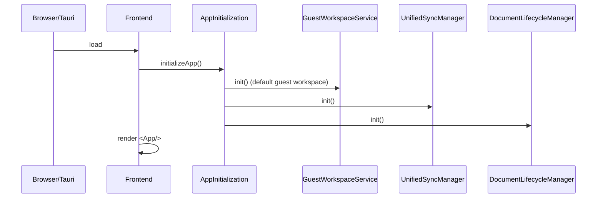
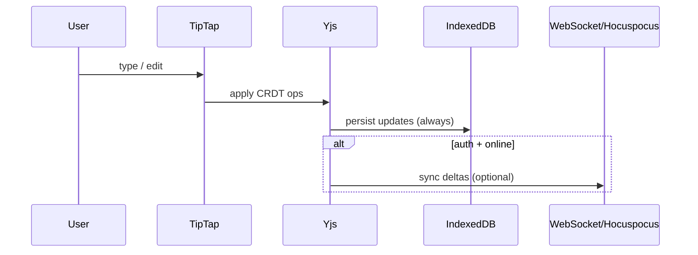

### MDReader / MD Creator

**MDReader** is a local‑first writing workspace: a TipTap-based WYSIWYG editor backed by **Yjs CRDT** for instant local persistence (IndexedDB) and optional real‑time collaboration (WebSocket / Hocuspocus). Metadata (workspaces/folders/doc list) is handled separately from content.

This repository is actively evolving and contains **legacy/experimental paths**. This documentation is the curated, high‑level “map” of the system for both humans and LLMs.

### The One Thing We Optimize For
- **Local-first**: every edit works offline and persists immediately.
- **One source of truth for content**: **Yjs `Y.Doc`**.
- **Separation of planes**:
  - **Content plane**: Yjs → IndexedDB (always) → WebSocket (optional)
  - **Metadata plane**: REST API (optional) → PostgreSQL

### System at a Glance (circles)

```mermaid
flowchart TB
  UI((User)) --> APP((Frontend
React/Vite + TipTap))

  APP -->|edits| YJS((Yjs CRDT
Y.Doc))
  YJS -->|always| IDB[(IndexedDB
(y-indexeddb))]

  APP -->|metadata REST| API((Backend API
FastAPI))
  API --> PG[(PostgreSQL
metadata)]

  YJS -->|if auth+online| WS((WebSocket))
  WS --> H((Hocuspocus
Collab Server))
  H -. optional persistence .-> YPG[(PostgreSQL
Yjs state/snapshots)]

  APP -. desktop only .-> TAURI((Tauri runtime))
  TAURI -. file ops .-> FS[(Local filesystem)]
```

### Core Processes

#### App start


#### Open/edit a document (content plane)


### What Runs Where
- **Frontend**: `frontend/` (React + Vite + Tailwind + TipTap + Yjs)
- **Backend API (v2)**: `backendv2/` (FastAPI on `:7001` — currently wires auth first, other routers staged)
- **Backend API (legacy)**: `backend/` (older FastAPI tree; treat as legacy unless you are intentionally working there)
- **Collaboration server**: `hocuspocus-server/` (Node on `:1234`; persistence can be in-memory in dev, DB-backed in prod)

### Quick Start (the project entrypoint)
- **Start all services**: see `START_PROJECT.md`

### “Do Not Break” Invariants
- **Content is not transported via REST** (REST is for metadata; content sync is Yjs/WS).
- **Local persistence must stay always-on** (IndexedDB is not a cache; it’s the baseline).
- **Guest mode must remain functional** (no-auth workflow should still let users create/edit locally).

### LLM Map (where to look first)

#### Frontend entrypoints
- `frontend/src/main.tsx` — initialization + renders App
- `frontend/src/App.tsx` — routing + providers
- `frontend/src/infrastructure/config/AppInitialization.ts` — bootstraps services (guest init, DI, desktop init)

#### Core frontend subsystems
- **Workspace state**: `frontend/src/contexts/WorkspaceContext.tsx`
- **Editor**: `frontend/src/components/editor/WYSIWYGEditor.tsx`
- **Editor wiring**: `frontend/src/hooks/useTipTapEditor.ts`
- **Yjs layer**: `frontend/src/services/yjs/` and hooks like `frontend/src/hooks/useYjsDocument.ts`
- **Sync layer**: `frontend/src/services/sync/` (e.g. `UnifiedSyncManager`)
- **Workspace services**:
  - `frontend/src/services/workspace/GuestWorkspaceService.ts`
  - `frontend/src/services/workspace/BackendWorkspaceService.ts`

#### Backend v2 entrypoints
- `backendv2/app/main.py` — FastAPI lifespan + router wiring

### Diagrams & Deep Dives
- **Main architecture (visual)**: `ARCHITECTURE_VISUAL.md`
- **Workspace model**: `WORKSPACE_ARCHITECTURE.md`
- **Sync strategy**: `planning_docs/SYNC_ARCHITECTURE_COMPLETE.md`
- **Yjs architecture**: `planning_docs/YJS_ARCHITECTURE_FINAL.md`
- **Backend architecture**: `planning_docs/BACKEND_ARCHITECTURE_BRIEF.md`

### New “single source of truth” docs (curated)
- `docs/ARCHITECTURE.md` — system boundaries + diagrams
- `docs/PROCESSES.md` — key flows (guest/auth, sync, collaboration)
- `docs/LLM_CONTEXT.md` — compact, machine-friendly map & invariants
- `docs/TECH_DECISIONS.md` — tech choices, rationale, trade-offs (senior architect)
- `docs/TEST_MATRIX.md` — scenario coverage → tests to write
- `docs/EDGE_CASE_CATALOG.md` — exhaustive edge cases to turn into tests
