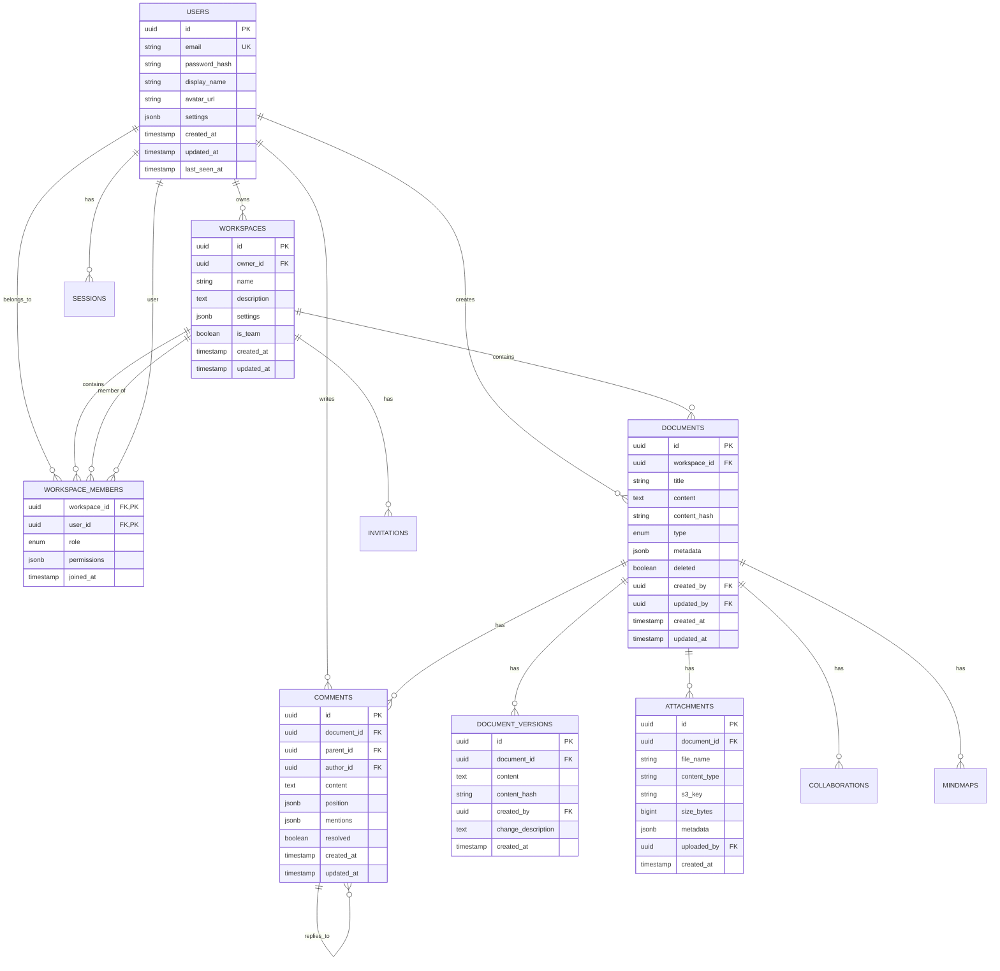

# MD Creator Backend - Part 2: Complete Database Schema

**Continuation of BACKEND_ARCHITECTURE_BLUEPRINT.md**

---

## 3. Complete Data Model & Database Schema

### 3.1 Entity Relationship Diagram



### 3.2 Full PostgreSQL Schema (Production-Ready)

**NOTE**: This schema is production-grade with indexes, triggers, constraints, and optimizations.

```sql
-- ==============================================================================
-- MD CREATOR - PRODUCTION DATABASE SCHEMA
-- PostgreSQL 16
-- ==============================================================================

-- Enable required extensions
CREATE EXTENSION IF NOT EXISTS "uuid-ossp";
CREATE EXTENSION IF NOT EXISTS "pgcrypto";
CREATE EXTENSION IF NOT EXISTS "pg_trgm"; -- For fuzzy search

-- ==============================================================================
-- CUSTOM TYPES
-- ==============================================================================

CREATE TYPE workspace_role AS ENUM ('owner', 'admin', 'editor', 'commenter', 'viewer');
CREATE TYPE document_type AS ENUM ('markdown', 'mindmap', 'presentation', 'mixed');
CREATE TYPE sync_operation AS ENUM ('create', 'update', 'delete');
CREATE TYPE invitation_status AS ENUM ('pending', 'accepted', 'declined', 'expired');
CREATE TYPE ai_provider AS ENUM ('openai', 'anthropic', 'cohere', 'local');
CREATE TYPE metric_type AS ENUM ('api_request', 'ai_token', 'storage', 'bandwidth');

-- ==============================================================================
-- USERS TABLE
-- ==============================================================================
CREATE TABLE users (
    id UUID PRIMARY KEY DEFAULT uuid_generate_v4(),
    
    -- Authentication (Cognito integration)
    cognito_sub VARCHAR(255) UNIQUE NOT NULL,
    email VARCHAR(255) UNIQUE NOT NULL,
    email_verified BOOLEAN DEFAULT FALSE,
    
    -- Profile
    display_name VARCHAR(255),
    avatar_url TEXT,
    bio TEXT,
    
    -- Settings (preferences, theme, editor config)
    settings JSONB DEFAULT '{
        "theme": "system",
        "editor_mode": "wysiwyg",
        "ai_enabled": true,
        "notifications_enabled": true,
        "language": "en"
    }'::jsonb,
    
    -- Feature flags
    features JSONB DEFAULT '{
        "collaboration": true,
        "ai_proxy": false,
        "advanced_permissions": false
    }'::jsonb,
    
    -- Subscription & billing
    subscription_tier VARCHAR(50) DEFAULT 'free', -- free, pro, team, enterprise
    subscription_status VARCHAR(50) DEFAULT 'active',
    subscription_expires_at TIMESTAMPTZ,
    
    -- Timestamps
    created_at TIMESTAMPTZ DEFAULT NOW(),
    updated_at TIMESTAMPTZ DEFAULT NOW(),
    last_seen_at TIMESTAMPTZ DEFAULT NOW(),
    
    -- Soft delete
    deleted_at TIMESTAMPTZ,
    
    -- Constraints
    CONSTRAINT email_format CHECK (email ~* '^[A-Za-z0-9._%+-]+@[A-Za-z0-9.-]+\.[A-Z|a-z]{2,}$')
);

-- Indexes
CREATE INDEX idx_users_email ON users(email) WHERE deleted_at IS NULL;
CREATE INDEX idx_users_cognito_sub ON users(cognito_sub);
CREATE INDEX idx_users_last_seen ON users(last_seen_at DESC);
CREATE INDEX idx_users_subscription ON users(subscription_tier, subscription_status);

-- ==============================================================================
-- WORKSPACES TABLE
-- ==============================================================================
CREATE TABLE workspaces (
    id UUID PRIMARY KEY DEFAULT uuid_generate_v4(),
    
    -- Ownership
    owner_id UUID NOT NULL REFERENCES users(id) ON DELETE CASCADE,
    
    -- Basic info
    name VARCHAR(255) NOT NULL,
    slug VARCHAR(100) UNIQUE, -- URL-friendly identifier
    description TEXT,
    icon VARCHAR(50), -- Emoji or icon ID
    color VARCHAR(20), -- Hex color
    
    -- Type
    is_personal BOOLEAN DEFAULT TRUE,
    is_team BOOLEAN DEFAULT FALSE,
    
    -- Settings
    settings JSONB DEFAULT '{
        "default_permissions": "editor",
        "require_invitation": true,
        "allow_guest_access": false,
        "ai_enabled": true
    }'::jsonb,
    
    -- Limits
    storage_used_bytes BIGINT DEFAULT 0,
    storage_limit_bytes BIGINT DEFAULT 1073741824, -- 1GB
    member_limit INTEGER DEFAULT 10,
    
    -- Timestamps
    created_at TIMESTAMPTZ DEFAULT NOW(),
    updated_at TIMESTAMPTZ DEFAULT NOW(),
    archived_at TIMESTAMPTZ,
    deleted_at TIMESTAMPTZ,
    
    -- Constraints
    CONSTRAINT name_not_empty CHECK (length(trim(name)) > 0)
);

-- Indexes
CREATE INDEX idx_workspaces_owner ON workspaces(owner_id) WHERE deleted_at IS NULL;
CREATE INDEX idx_workspaces_slug ON workspaces(slug) WHERE deleted_at IS NULL;
CREATE INDEX idx_workspaces_updated ON workspaces(updated_at DESC);
CREATE INDEX idx_workspaces_team ON workspaces(is_team) WHERE is_team = TRUE AND deleted_at IS NULL;

-- ==============================================================================
-- WORKSPACE_MEMBERS TABLE
-- ==============================================================================
CREATE TABLE workspace_members (
    workspace_id UUID NOT NULL REFERENCES workspaces(id) ON DELETE CASCADE,
    user_id UUID NOT NULL REFERENCES users(id) ON DELETE CASCADE,
    
    -- Role
    role workspace_role NOT NULL DEFAULT 'viewer',
    
    -- Fine-grained permissions
    permissions JSONB DEFAULT '{
        "can_create_documents": true,
        "can_edit_documents": true,
        "can_delete_documents": false,
        "can_comment": true,
        "can_invite_members": false,
        "can_manage_workspace": false
    }'::jsonb,
    
    -- Invitation metadata
    invited_by UUID REFERENCES users(id),
    invitation_accepted_at TIMESTAMPTZ,
    
    -- Status
    is_active BOOLEAN DEFAULT TRUE,
    
    -- Timestamps
    joined_at TIMESTAMPTZ DEFAULT NOW(),
    last_accessed_at TIMESTAMPTZ,
    
    -- Primary key
    PRIMARY KEY (workspace_id, user_id)
);

-- Indexes
CREATE INDEX idx_workspace_members_user ON workspace_members(user_id);
CREATE INDEX idx_workspace_members_role ON workspace_members(workspace_id, role);
CREATE INDEX idx_workspace_members_active ON workspace_members(workspace_id, is_active) WHERE is_active = TRUE;

-- ==============================================================================
-- DOCUMENTS TABLE
-- ==============================================================================
CREATE TABLE documents (
    id UUID PRIMARY KEY DEFAULT uuid_generate_v4(),
    
    -- Workspace relationship
    workspace_id UUID NOT NULL REFERENCES workspaces(id) ON DELETE CASCADE,
    
    -- Document identity
    title VARCHAR(500) NOT NULL,
    type document_type DEFAULT 'markdown',
    
    -- Content
    content TEXT NOT NULL DEFAULT '',
    
    -- Content hash for ETag and conflict detection
    content_hash VARCHAR(64) GENERATED ALWAYS AS (
        encode(digest(content, 'sha256'), 'hex')
    ) STORED,
    
    -- Metadata
    metadata JSONB DEFAULT '{
        "tags": [],
        "category": null,
        "priority": "normal",
        "status": "draft"
    }'::jsonb,
    
    -- Settings
    settings JSONB DEFAULT '{
        "editor_mode": "wysiwyg",
        "ai_enabled": true,
        "auto_save": true,
        "collaboration_enabled": true
    }'::jsonb,
    
    -- Collaboration state (Yjs CRDT)
    yjs_state BYTEA, -- Binary Yjs state vector
    yjs_clock BIGINT DEFAULT 0, -- Logical clock for ordering
    
    -- Access tracking
    view_count INTEGER DEFAULT 0,
    last_viewed_at TIMESTAMPTZ,
    last_edited_at TIMESTAMPTZ,
    
    -- Ownership
    created_by UUID NOT NULL REFERENCES users(id),
    updated_by UUID REFERENCES users(id),
    
    -- Timestamps
    created_at TIMESTAMPTZ DEFAULT NOW(),
    updated_at TIMESTAMPTZ DEFAULT NOW(),
    
    -- Soft delete (tombstone for sync)
    deleted BOOLEAN DEFAULT FALSE,
    deleted_at TIMESTAMPTZ,
    deleted_by UUID REFERENCES users(id),
    
    -- Full-text search
    search_vector tsvector GENERATED ALWAYS AS (
        setweight(to_tsvector('english', coalesce(title, '')), 'A') ||
        setweight(to_tsvector('english', coalesce(content, '')), 'B') ||
        setweight(to_tsvector('english', coalesce(metadata->>'tags', '')), 'C')
    ) STORED,
    
    -- Constraints
    CONSTRAINT title_not_empty CHECK (length(trim(title)) > 0)
);

-- Indexes
CREATE INDEX idx_documents_workspace ON documents(workspace_id, deleted) WHERE deleted = FALSE;
CREATE INDEX idx_documents_workspace_updated ON documents(workspace_id, updated_at DESC) WHERE deleted = FALSE;
CREATE INDEX idx_documents_created_by ON documents(created_by);
CREATE INDEX idx_documents_updated_by ON documents(updated_by);
CREATE INDEX idx_documents_content_hash ON documents(content_hash);
CREATE INDEX idx_documents_search ON documents USING GIN(search_vector);
CREATE INDEX idx_documents_type ON documents(workspace_id, type) WHERE deleted = FALSE;
CREATE INDEX idx_documents_metadata ON documents USING GIN(metadata);

-- Fuzzy search support
CREATE INDEX idx_documents_title_trgm ON documents USING GIN(title gin_trgm_ops);

-- ==============================================================================
-- DOCUMENT_VERSIONS TABLE
-- ==============================================================================
CREATE TABLE document_versions (
    id UUID PRIMARY KEY DEFAULT uuid_generate_v4(),
    document_id UUID NOT NULL REFERENCES documents(id) ON DELETE CASCADE,
    
    -- Version tracking
    version_number INTEGER NOT NULL,
    
    -- Snapshot
    title VARCHAR(500) NOT NULL,
    content TEXT NOT NULL,
    content_hash VARCHAR(64),
    
    -- Change tracking
    change_description TEXT,
    changes_summary JSONB, -- { added: 10, removed: 5, modified: 2 }
    diff_patch TEXT, -- Optional: unified diff format
    
    -- Metadata snapshot
    metadata_snapshot JSONB,
    
    -- Author
    created_by UUID NOT NULL REFERENCES users(id),
    created_at TIMESTAMPTZ DEFAULT NOW(),
    
    -- Size
    size_bytes INTEGER GENERATED ALWAYS AS (length(content)) STORED,
    
    -- Unique constraint
    UNIQUE(document_id, version_number)
);

-- Indexes
CREATE INDEX idx_versions_document ON document_versions(document_id, version_number DESC);
CREATE INDEX idx_versions_created_at ON document_versions(document_id, created_at DESC);
CREATE INDEX idx_versions_author ON document_versions(created_by);

-- Auto-increment version number
CREATE OR REPLACE FUNCTION auto_version_number()
RETURNS TRIGGER AS $$
BEGIN
    NEW.version_number = COALESCE(
        (SELECT MAX(version_number) + 1 FROM document_versions WHERE document_id = NEW.document_id),
        1
    );
    RETURN NEW;
END;
$$ LANGUAGE plpgsql;

CREATE TRIGGER trigger_auto_version_number
    BEFORE INSERT ON document_versions
    FOR EACH ROW
    EXECUTE FUNCTION auto_version_number();

-- ==============================================================================
-- ATTACHMENTS TABLE
-- ==============================================================================
CREATE TABLE attachments (
    id UUID PRIMARY KEY DEFAULT uuid_generate_v4(),
    
    -- Relationships
    document_id UUID REFERENCES documents(id) ON DELETE CASCADE,
    workspace_id UUID NOT NULL REFERENCES workspaces(id) ON DELETE CASCADE,
    
    -- File info
    file_name VARCHAR(500) NOT NULL,
    original_name VARCHAR(500),
    content_type VARCHAR(100),
    size_bytes BIGINT NOT NULL,
    
    -- S3 storage
    s3_bucket VARCHAR(255) NOT NULL,
    s3_key VARCHAR(1000) NOT NULL,
    s3_region VARCHAR(50) DEFAULT 'us-east-1',
    
    -- CDN
    cdn_url TEXT,
    
    -- Image-specific metadata
    metadata JSONB DEFAULT '{}'::jsonb, -- width, height, exif, etc.
    
    -- Processing
    processing_status VARCHAR(50) DEFAULT 'pending', -- pending, processing, complete, failed
    thumbnail_s3_key VARCHAR(1000),
    thumbnail_url TEXT,
    
    -- Ownership
    uploaded_by UUID NOT NULL REFERENCES users(id),
    uploaded_at TIMESTAMPTZ DEFAULT NOW(),
    
    -- Access tracking
    download_count INTEGER DEFAULT 0,
    last_accessed_at TIMESTAMPTZ,
    
    -- Soft delete
    deleted_at TIMESTAMPTZ,
    
    -- Unique S3 key
    UNIQUE(s3_bucket, s3_key)
);

-- Indexes
CREATE INDEX idx_attachments_document ON attachments(document_id) WHERE deleted_at IS NULL;
CREATE INDEX idx_attachments_workspace ON attachments(workspace_id);
CREATE INDEX idx_attachments_uploader ON attachments(uploaded_by);
CREATE INDEX idx_attachments_s3_key ON attachments(s3_bucket, s3_key);
CREATE INDEX idx_attachments_processing ON attachments(processing_status) WHERE processing_status != 'complete';

-- ==============================================================================
-- COMMENTS TABLE
-- ==============================================================================
CREATE TABLE comments (
    id UUID PRIMARY KEY DEFAULT uuid_generate_v4(),
    document_id UUID NOT NULL REFERENCES documents(id) ON DELETE CASCADE,
    
    -- Thread structure
    parent_id UUID REFERENCES comments(id) ON DELETE CASCADE,
    thread_id UUID,
    depth INTEGER DEFAULT 0,
    
    -- Author
    author_id UUID NOT NULL REFERENCES users(id) ON DELETE CASCADE,
    
    -- Content
    content TEXT NOT NULL,
    content_html TEXT, -- Cached rendered content
    
    -- Position (inline comments)
    position JSONB, -- { "from": 100, "to": 150, "blockId": "abc" }
    anchor_text TEXT, -- Original text that comment refers to
    
    -- Mentions
    mentions UUID[], -- User IDs
    
    -- Status
    resolved BOOLEAN DEFAULT FALSE,
    resolved_by UUID REFERENCES users(id),
    resolved_at TIMESTAMPTZ,
    
    -- Reactions
    reactions JSONB DEFAULT '[]'::jsonb, -- [{ "emoji": "👍", "users": [uuid1, uuid2] }]
    
    -- Edit tracking
    edited BOOLEAN DEFAULT FALSE,
    edit_history JSONB DEFAULT '[]'::jsonb,
    
    -- Timestamps
    created_at TIMESTAMPTZ DEFAULT NOW(),
    updated_at TIMESTAMPTZ DEFAULT NOW(),
    deleted_at TIMESTAMPTZ,
    
    -- Constraints
    CONSTRAINT content_not_empty CHECK (length(trim(content)) > 0)
);

-- Indexes
CREATE INDEX idx_comments_document ON comments(document_id, created_at) WHERE deleted_at IS NULL;
CREATE INDEX idx_comments_thread ON comments(thread_id, depth) WHERE deleted_at IS NULL;
CREATE INDEX idx_comments_author ON comments(author_id);
CREATE INDEX idx_comments_mentions ON comments USING GIN(mentions);
CREATE INDEX idx_comments_resolved ON comments(document_id, resolved) WHERE deleted_at IS NULL;

-- Thread ID auto-assignment
CREATE OR REPLACE FUNCTION set_comment_thread_id()
RETURNS TRIGGER AS $$
BEGIN
    IF NEW.parent_id IS NULL THEN
        NEW.thread_id = NEW.id;
        NEW.depth = 0;
    ELSE
        SELECT thread_id, depth + 1 INTO NEW.thread_id, NEW.depth
        FROM comments WHERE id = NEW.parent_id;
    END IF;
    RETURN NEW;
END;
$$ LANGUAGE plpgsql;

CREATE TRIGGER trigger_comment_thread_id
    BEFORE INSERT ON comments
    FOR EACH ROW
    EXECUTE FUNCTION set_comment_thread_id();

-- ==============================================================================
-- PRESENCE TABLE (Real-Time)
-- ==============================================================================
CREATE TABLE presence (
    id UUID PRIMARY KEY DEFAULT uuid_generate_v4(),
    
    -- Session
    user_id UUID NOT NULL REFERENCES users(id) ON DELETE CASCADE,
    document_id UUID NOT NULL REFERENCES documents(id) ON DELETE CASCADE,
    
    -- Connection
    connection_id VARCHAR(255) NOT NULL UNIQUE,
    device_type VARCHAR(50), -- 'web', 'desktop', 'mobile'
    device_name VARCHAR(255),
    
    -- Cursor state
    cursor_position JSONB,
    selection_range JSONB,
    
    -- Activity
    is_active BOOLEAN DEFAULT TRUE,
    is_typing BOOLEAN DEFAULT FALSE,
    current_block_id VARCHAR(255),
    
    -- Timestamps
    connected_at TIMESTAMPTZ DEFAULT NOW(),
    last_activity_at TIMESTAMPTZ DEFAULT NOW(),
    disconnected_at TIMESTAMPTZ,
    
    -- TTL
    expires_at TIMESTAMPTZ DEFAULT NOW() + INTERVAL '5 minutes'
);

-- Indexes
CREATE INDEX idx_presence_document_active ON presence(document_id, is_active) WHERE is_active = TRUE;
CREATE INDEX idx_presence_user_document ON presence(user_id, document_id);
CREATE INDEX idx_presence_expires ON presence(expires_at);
CREATE INDEX idx_presence_connection ON presence(connection_id);

-- ==============================================================================
-- SYNC_LOG TABLE
-- ==============================================================================
CREATE TABLE sync_log (
    id UUID PRIMARY KEY DEFAULT uuid_generate_v4(),
    
    -- Entity
    entity_type VARCHAR(50) NOT NULL,
    entity_id UUID NOT NULL,
    workspace_id UUID NOT NULL REFERENCES workspaces(id) ON DELETE CASCADE,
    
    -- Operation
    operation sync_operation NOT NULL,
    
    -- Changes
    changes JSONB,
    content_hash VARCHAR(64),
    
    -- Actor
    changed_by UUID REFERENCES users(id),
    device_id VARCHAR(255),
    client_version VARCHAR(50),
    
    -- Timestamp
    timestamp TIMESTAMPTZ DEFAULT NOW(),
    
    -- Sync cursor (for pagination)
    cursor BIGSERIAL UNIQUE
);

-- Indexes (critical for sync performance)
CREATE INDEX idx_sync_log_workspace_cursor ON sync_log(workspace_id, cursor DESC);
CREATE INDEX idx_sync_log_entity ON sync_log(entity_type, entity_id, cursor DESC);
CREATE INDEX idx_sync_log_timestamp ON sync_log(timestamp DESC);
CREATE INDEX idx_sync_log_cursor ON sync_log(cursor DESC);

-- ==============================================================================
-- INVITATIONS TABLE
-- ==============================================================================
CREATE TABLE invitations (
    id UUID PRIMARY KEY DEFAULT uuid_generate_v4(),
    
    -- Workspace
    workspace_id UUID NOT NULL REFERENCES workspaces(id) ON DELETE CASCADE,
    
    -- Inviter
    invited_by UUID NOT NULL REFERENCES users(id),
    
    -- Invitee
    email VARCHAR(255) NOT NULL,
    user_id UUID REFERENCES users(id),
    
    -- Role
    role workspace_role NOT NULL DEFAULT 'viewer',
    
    -- Token
    token VARCHAR(64) UNIQUE NOT NULL DEFAULT encode(gen_random_bytes(32), 'hex'),
    
    -- Status
    status invitation_status DEFAULT 'pending',
    
    -- Message
    message TEXT,
    
    -- Timestamps
    created_at TIMESTAMPTZ DEFAULT NOW(),
    expires_at TIMESTAMPTZ DEFAULT NOW() + INTERVAL '7 days',
    accepted_at TIMESTAMPTZ,
    declined_at TIMESTAMPTZ,
    
    -- Unique constraint
    UNIQUE(workspace_id, email) WHERE status = 'pending'
);

-- Indexes
CREATE INDEX idx_invitations_workspace ON invitations(workspace_id, status);
CREATE INDEX idx_invitations_email ON invitations(email, status);
CREATE INDEX idx_invitations_token ON invitations(token) WHERE status = 'pending';
CREATE INDEX idx_invitations_expires ON invitations(expires_at) WHERE status = 'pending';

-- ==============================================================================
-- MINDMAPS TABLE
-- ==============================================================================
CREATE TABLE mindmaps (
    id UUID PRIMARY KEY DEFAULT uuid_generate_v4(),
    document_id UUID UNIQUE NOT NULL REFERENCES documents(id) ON DELETE CASCADE,
    
    -- Structure
    nodes JSONB NOT NULL DEFAULT '[]'::jsonb,
    edges JSONB NOT NULL DEFAULT '[]'::jsonb,
    
    -- Layout
    layout_type VARCHAR(50) DEFAULT 'tree',
    layout_settings JSONB DEFAULT '{}'::jsonb,
    
    -- AI metadata
    ai_generated BOOLEAN DEFAULT FALSE,
    ai_prompt TEXT,
    ai_model VARCHAR(100),
    
    -- Timestamps
    created_at TIMESTAMPTZ DEFAULT NOW(),
    updated_at TIMESTAMPTZ DEFAULT NOW()
);

-- Indexes
CREATE INDEX idx_mindmaps_document ON mindmaps(document_id);

-- ==============================================================================
-- API_KEYS TABLE (User-Provided AI Keys)
-- ==============================================================================
CREATE TABLE api_keys (
    id UUID PRIMARY KEY DEFAULT uuid_generate_v4(),
    user_id UUID NOT NULL REFERENCES users(id) ON DELETE CASCADE,
    
    -- Provider
    provider ai_provider NOT NULL,
    
    -- Encrypted key
    encrypted_key TEXT NOT NULL,
    key_hash VARCHAR(64) NOT NULL,
    
    -- Metadata
    name VARCHAR(100),
    description TEXT,
    
    -- Usage
    last_used_at TIMESTAMPTZ,
    usage_count INTEGER DEFAULT 0,
    
    -- Status
    is_active BOOLEAN DEFAULT TRUE,
    is_valid BOOLEAN DEFAULT TRUE,
    validation_error TEXT,
    
    -- Timestamps
    created_at TIMESTAMPTZ DEFAULT NOW(),
    updated_at TIMESTAMPTZ DEFAULT NOW(),
    revoked_at TIMESTAMPTZ,
    
    -- Unique constraint
    UNIQUE(user_id, provider, key_hash)
);

-- Indexes
CREATE INDEX idx_api_keys_user_provider ON api_keys(user_id, provider, is_active);

-- ==============================================================================
-- USAGE_METRICS TABLE
-- ==============================================================================
CREATE TABLE usage_metrics (
    id UUID PRIMARY KEY DEFAULT uuid_generate_v4(),
    user_id UUID NOT NULL REFERENCES users(id) ON DELETE CASCADE,
    workspace_id UUID REFERENCES workspaces(id) ON DELETE CASCADE,
    
    -- Metric
    metric_type metric_type NOT NULL,
    value BIGINT NOT NULL,
    
    -- Context
    metadata JSONB DEFAULT '{}'::jsonb,
    
    -- Time window
    recorded_at TIMESTAMPTZ DEFAULT NOW(),
    period_start TIMESTAMPTZ NOT NULL,
    period_end TIMESTAMPTZ NOT NULL
);

-- Indexes
CREATE INDEX idx_usage_metrics_user_period ON usage_metrics(user_id, metric_type, period_start DESC, period_end DESC);
CREATE INDEX idx_usage_metrics_workspace ON usage_metrics(workspace_id, metric_type, period_start DESC);
CREATE INDEX idx_usage_metrics_period ON usage_metrics(period_start, period_end);

-- Partitioning by month (for performance)
-- CREATE TABLE usage_metrics_2025_01 PARTITION OF usage_metrics FOR VALUES FROM ('2025-01-01') TO ('2025-02-01');
-- ... (continue for each month)

-- ==============================================================================
-- GLOBAL TRIGGERS
-- ==============================================================================

-- Update updated_at automatically
CREATE OR REPLACE FUNCTION update_updated_at_column()
RETURNS TRIGGER AS $$
BEGIN
    NEW.updated_at = NOW();
    RETURN NEW;
END;
$$ LANGUAGE plpgsql;

CREATE TRIGGER update_users_updated_at
    BEFORE UPDATE ON users
    FOR EACH ROW
    EXECUTE FUNCTION update_updated_at_column();

CREATE TRIGGER update_workspaces_updated_at
    BEFORE UPDATE ON workspaces
    FOR EACH ROW
    EXECUTE FUNCTION update_updated_at_column();

CREATE TRIGGER update_documents_updated_at
    BEFORE UPDATE ON documents
    FOR EACH ROW
    EXECUTE FUNCTION update_updated_at_column();

CREATE TRIGGER update_comments_updated_at
    BEFORE UPDATE ON comments
    FOR EACH ROW
    EXECUTE FUNCTION update_updated_at_column();

CREATE TRIGGER update_mindmaps_updated_at
    BEFORE UPDATE ON mindmaps
    FOR EACH ROW
    EXECUTE FUNCTION update_updated_at_column();

-- Log all document changes to sync_log
CREATE OR REPLACE FUNCTION log_document_change()
RETURNS TRIGGER AS $$
DECLARE
    operation_type sync_operation;
    change_data JSONB;
BEGIN
    -- Determine operation type
    IF TG_OP = 'INSERT' THEN
        operation_type = 'create';
        change_data = to_jsonb(NEW);
    ELSIF TG_OP = 'UPDATE' THEN
        operation_type = 'update';
        change_data = jsonb_build_object('old', to_jsonb(OLD), 'new', to_jsonb(NEW));
    ELSIF TG_OP = 'DELETE' THEN
        operation_type = 'delete';
        change_data = to_jsonb(OLD);
    END IF;
    
    -- Insert into sync_log
    INSERT INTO sync_log (
        entity_type,
        entity_id,
        workspace_id,
        operation,
        changes,
        content_hash,
        changed_by
    ) VALUES (
        'document',
        COALESCE(NEW.id, OLD.id),
        COALESCE(NEW.workspace_id, OLD.workspace_id),
        operation_type,
        change_data,
        COALESCE(NEW.content_hash, OLD.content_hash),
        COALESCE(NEW.updated_by, OLD.updated_by, NEW.created_by, OLD.created_by)
    );
    
    RETURN COALESCE(NEW, OLD);
END;
$$ LANGUAGE plpgsql;

CREATE TRIGGER trigger_log_document_change
    AFTER INSERT OR UPDATE OR DELETE ON documents
    FOR EACH ROW
    EXECUTE FUNCTION log_document_change();

-- Update workspace storage usage
CREATE OR REPLACE FUNCTION update_workspace_storage()
RETURNS TRIGGER AS $$
DECLARE
    storage_delta BIGINT;
BEGIN
    IF TG_OP = 'INSERT' THEN
        storage_delta = NEW.size_bytes;
    ELSIF TG_OP = 'UPDATE' THEN
        storage_delta = NEW.size_bytes - OLD.size_bytes;
    ELSIF TG_OP = 'DELETE' THEN
        storage_delta = -OLD.size_bytes;
    END IF;
    
    UPDATE workspaces
    SET storage_used_bytes = GREATEST(0, storage_used_bytes + storage_delta)
    WHERE id = COALESCE(NEW.workspace_id, OLD.workspace_id);
    
    RETURN COALESCE(NEW, OLD);
END;
$$ LANGUAGE plpgsql;

CREATE TRIGGER trigger_update_workspace_storage
    AFTER INSERT OR UPDATE OF size_bytes OR DELETE ON attachments
    FOR EACH ROW
    EXECUTE FUNCTION update_workspace_storage();

-- Cleanup expired presence records (run periodically)
CREATE OR REPLACE FUNCTION cleanup_expired_presence()
RETURNS INTEGER AS $$
DECLARE
    deleted_count INTEGER;
BEGIN
    DELETE FROM presence
    WHERE expires_at < NOW() OR disconnected_at < NOW() - INTERVAL '1 hour';
    
    GET DIAGNOSTICS deleted_count = ROW_COUNT;
    RETURN deleted_count;
END;
$$ LANGUAGE plpgsql;

-- Cleanup expired invitations
CREATE OR REPLACE FUNCTION cleanup_expired_invitations()
RETURNS INTEGER AS $$
DECLARE
    updated_count INTEGER;
BEGIN
    UPDATE invitations
    SET status = 'expired'
    WHERE status = 'pending' AND expires_at < NOW();
    
    GET DIAGNOSTICS updated_count = ROW_COUNT;
    RETURN updated_count;
END;
$$ LANGUAGE plpgsql;

-- ==============================================================================
-- VIEWS (Performance Optimization)
-- ==============================================================================

-- Active documents view (most common query)
CREATE VIEW active_documents AS
SELECT
    d.*,
    u.display_name as creator_name,
    u.avatar_url as creator_avatar,
    w.name as workspace_name,
    (SELECT COUNT(*) FROM comments c WHERE c.document_id = d.id AND c.deleted_at IS NULL) as comment_count,
    (SELECT COUNT(*) FROM document_versions dv WHERE dv.document_id = d.id) as version_count
FROM documents d
JOIN users u ON d.created_by = u.id
JOIN workspaces w ON d.workspace_id = w.id
WHERE d.deleted = FALSE AND w.deleted_at IS NULL;

-- User workspace summary
CREATE VIEW user_workspace_summary AS
SELECT
    wm.user_id,
    wm.workspace_id,
    w.name as workspace_name,
    w.owner_id,
    wm.role,
    wm.joined_at,
    COUNT(DISTINCT d.id) as document_count,
    MAX(d.updated_at) as last_activity,
    w.storage_used_bytes,
    w.storage_limit_bytes
FROM workspace_members wm
JOIN workspaces w ON wm.workspace_id = w.id
LEFT JOIN documents d ON d.workspace_id = w.id AND d.deleted = FALSE
WHERE w.deleted_at IS NULL AND wm.is_active = TRUE
GROUP BY wm.user_id, wm.workspace_id, w.name, w.owner_id, wm.role, wm.joined_at, w.storage_used_bytes, w.storage_limit_bytes;

-- ==============================================================================
-- MATERIALIZED VIEWS (For Analytics)
-- ==============================================================================

-- Daily active users (refresh periodically)
CREATE MATERIALIZED VIEW daily_active_users AS
SELECT
    DATE(last_seen_at) as activity_date,
    COUNT(DISTINCT id) as active_users
FROM users
WHERE last_seen_at >= NOW() - INTERVAL '90 days'
GROUP BY DATE(last_seen_at)
ORDER BY activity_date DESC;

CREATE INDEX idx_dau_date ON daily_active_users(activity_date DESC);

-- Workspace activity summary
CREATE MATERIALIZED VIEW workspace_activity_summary AS
SELECT
    w.id as workspace_id,
    w.name as workspace_name,
    w.owner_id,
    COUNT(DISTINCT d.id) as total_documents,
    COUNT(DISTINCT d.id) FILTER (WHERE d.updated_at >= NOW() - INTERVAL '7 days') as recent_documents,
    COUNT(DISTINCT wm.user_id) as member_count,
    COUNT(DISTINCT c.id) as total_comments,
    MAX(d.updated_at) as last_activity
FROM workspaces w
LEFT JOIN documents d ON d.workspace_id = w.id AND d.deleted = FALSE
LEFT JOIN workspace_members wm ON wm.workspace_id = w.id AND wm.is_active = TRUE
LEFT JOIN comments c ON c.document_id = d.id AND c.deleted_at IS NULL
WHERE w.deleted_at IS NULL
GROUP BY w.id, w.name, w.owner_id;

CREATE INDEX idx_workspace_activity_workspace ON workspace_activity_summary(workspace_id);

-- Refresh materialized views (run via cron or manually)
-- REFRESH MATERIALIZED VIEW CONCURRENTLY daily_active_users;
-- REFRESH MATERIALIZED VIEW CONCURRENTLY workspace_activity_summary;

-- ==============================================================================
-- SECURITY POLICIES (Row-Level Security)
-- ==============================================================================

-- Enable RLS on sensitive tables
ALTER TABLE documents ENABLE ROW LEVEL SECURITY;
ALTER TABLE comments ENABLE ROW LEVEL SECURITY;
ALTER TABLE workspace_members ENABLE ROW LEVEL SECURITY;

-- Documents: Users can only access documents in their workspaces
CREATE POLICY documents_access_policy ON documents
    FOR ALL
    USING (
        workspace_id IN (
            SELECT workspace_id FROM workspace_members WHERE user_id = current_setting('app.current_user_id')::uuid
        )
    );

-- Comments: Users can only access comments on documents they can access
CREATE POLICY comments_access_policy ON comments
    FOR ALL
    USING (
        document_id IN (
            SELECT d.id FROM documents d
            JOIN workspace_members wm ON wm.workspace_id = d.workspace_id
            WHERE wm.user_id = current_setting('app.current_user_id')::uuid
        )
    );

-- ==============================================================================
-- PERFORMANCE MONITORING
-- ==============================================================================

-- Slow query logging (configure in postgresql.conf)
-- log_min_duration_statement = 1000  -- Log queries taking > 1 second

-- Track query statistics
CREATE EXTENSION IF NOT EXISTS pg_stat_statements;

-- ==============================================================================
-- BACKUP & MAINTENANCE
-- ==============================================================================

-- Backup strategy:
-- 1. Automated snapshots: Daily (AWS RDS)
-- 2. Transaction logs: Continuous (AWS RDS)
-- 3. Manual backups: Before major updates

-- Vacuum and analyze (run weekly)
-- VACUUM ANALYZE;

-- Reindex (run monthly)
-- REINDEX DATABASE mdcreator;

-- ==============================================================================
-- SEED DATA (Development/Testing)
-- ==============================================================================

-- Insert default admin user (replace with real data)
-- INSERT INTO users (cognito_sub, email, email_verified, display_name, subscription_tier)
-- VALUES ('admin-cognito-sub', 'admin@mdcreator.app', TRUE, 'Admin User', 'enterprise');

-- ==============================================================================
-- DATABASE FUNCTIONS (API Helpers)
-- ==============================================================================

-- Get user's workspaces with permissions
CREATE OR REPLACE FUNCTION get_user_workspaces(p_user_id UUID)
RETURNS TABLE (
    workspace_id UUID,
    workspace_name VARCHAR,
    role workspace_role,
    permissions JSONB,
    is_owner BOOLEAN,
    document_count BIGINT,
    member_count BIGINT
) AS $$
BEGIN
    RETURN QUERY
    SELECT
        w.id,
        w.name,
        wm.role,
        wm.permissions,
        (w.owner_id = p_user_id) as is_owner,
        COUNT(DISTINCT d.id) as document_count,
        COUNT(DISTINCT wm2.user_id) as member_count
    FROM workspaces w
    JOIN workspace_members wm ON wm.workspace_id = w.id
    LEFT JOIN documents d ON d.workspace_id = w.id AND d.deleted = FALSE
    LEFT JOIN workspace_members wm2 ON wm2.workspace_id = w.id
    WHERE wm.user_id = p_user_id
        AND w.deleted_at IS NULL
        AND wm.is_active = TRUE
    GROUP BY w.id, w.name, wm.role, wm.permissions, w.owner_id;
END;
$$ LANGUAGE plpgsql;

-- Search documents with full-text search
CREATE OR REPLACE FUNCTION search_documents(
    p_workspace_id UUID,
    p_query TEXT,
    p_limit INTEGER DEFAULT 20,
    p_offset INTEGER DEFAULT 0
)
RETURNS TABLE (
    id UUID,
    title VARCHAR,
    content TEXT,
    rank REAL,
    created_at TIMESTAMPTZ,
    updated_at TIMESTAMPTZ
) AS $$
BEGIN
    RETURN QUERY
    SELECT
        d.id,
        d.title,
        d.content,
        ts_rank(d.search_vector, websearch_to_tsquery('english', p_query)) as rank,
        d.created_at,
        d.updated_at
    FROM documents d
    WHERE d.workspace_id = p_workspace_id
        AND d.deleted = FALSE
        AND d.search_vector @@ websearch_to_tsquery('english', p_query)
    ORDER BY rank DESC, d.updated_at DESC
    LIMIT p_limit OFFSET p_offset;
END;
$$ LANGUAGE plpgsql;

-- ==============================================================================
-- INITIALIZATION COMPLETE
-- ==============================================================================
```

### 3.3 Database Indexing Strategy

**Critical Performance Indexes:**

1. **Workspace Queries**:
   - `idx_documents_workspace_updated`: Fast workspace document listing
   - `idx_workspace_members_user`: User workspace lookups

2. **Search**:
   - `idx_documents_search`: Full-text search with GIN index
   - `idx_documents_title_trgm`: Fuzzy title search

3. **Sync**:
   - `idx_sync_log_workspace_cursor`: Cursor-based pagination for sync
   - `idx_sync_log_cursor`: Global sync timeline

4. **Real-Time**:
   - `idx_presence_document_active`: Active collaborators query
   - `idx_comments_document`: Comment threads loading

### 3.4 Storage Optimization

**Data Retention Policies:**

```sql
-- Archive old document versions (keep last 10 per document)
CREATE OR REPLACE FUNCTION archive_old_versions()
RETURNS void AS $$
BEGIN
    WITH ranked_versions AS (
        SELECT id,
               ROW_NUMBER() OVER (PARTITION BY document_id ORDER BY version_number DESC) as rank
        FROM document_versions
    )
    DELETE FROM document_versions
    WHERE id IN (SELECT id FROM ranked_versions WHERE rank > 10);
END;
$$ LANGUAGE plpgsql;

-- Delete old sync_log entries (keep 90 days)
DELETE FROM sync_log WHERE timestamp < NOW() - INTERVAL '90 days';

-- Compress old attachments to Glacier (S3 lifecycle policy)
```

---

**Next**: Continue to Part 3 - Authentication & Authorization System

