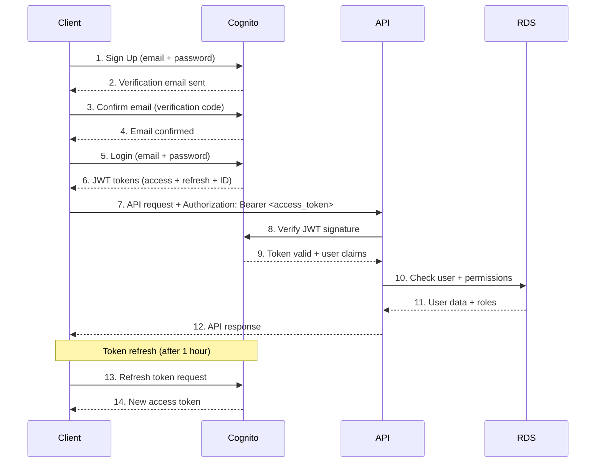
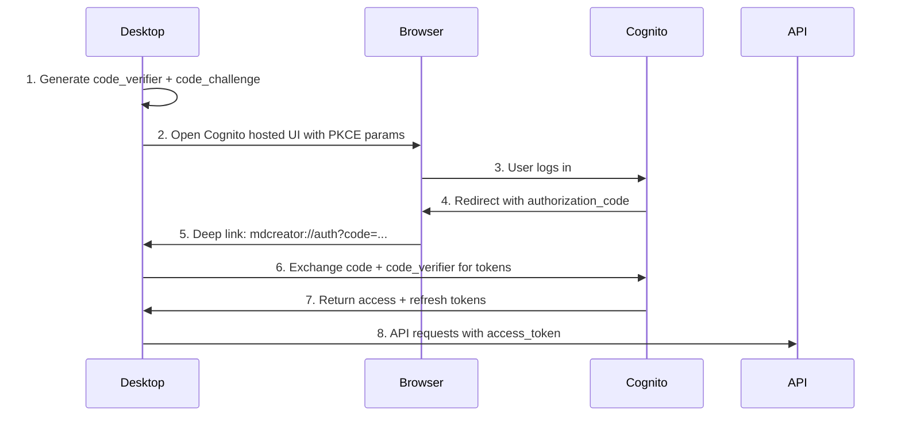
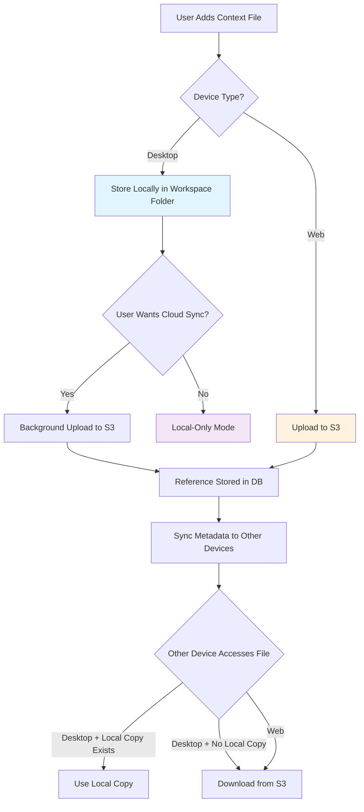
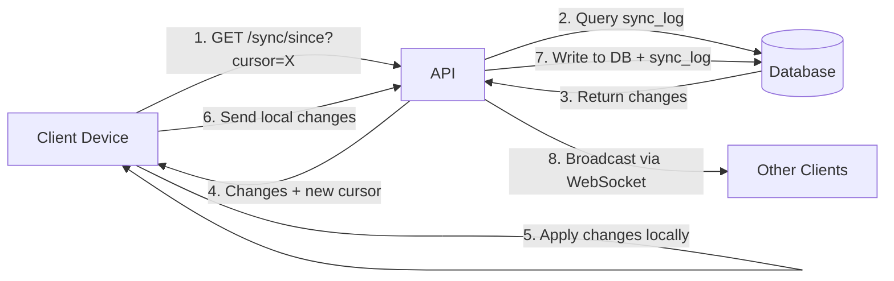

# MD Creator Backend - Part 3: Authentication, Context Files & Sync

**Continuation of BACKEND_ARCHITECTURE_BLUEPRINT.md**

---

## 4. Authentication & Authorization System

### 4.1 Authentication Architecture (AWS Cognito + JWT)

**Design Decision: Use AWS Cognito**

**Why Cognito Over Custom JWT:**
- ✅ Managed service (no auth server maintenance)
- ✅ Built-in user pool management
- ✅ OAuth 2.0 / OIDC support (Google, GitHub, etc.)
- ✅ MFA and password policies out-of-the-box
- ✅ Email verification flows handled
- ✅ Token refresh logic managed
- ✅ SDKs for web + mobile

**Authentication Flow Diagram:**



### 4.2 Cognito User Pool Configuration

```yaml
User Pool Settings:
  Name: mdcreator-users-{env}
  
  Sign-in Options:
    - Email address ✅
    - Username ❌ (keep it simple)
  
  Required Attributes:
    - email (verified) ✅
    - name (optional)
  
  Custom Attributes:
    - avatar_url (string)
    - onboarding_completed (boolean)
  
  Password Policy:
    Minimum Length: 8
    Require Uppercase: Yes
    Require Lowercase: Yes
    Require Numbers: Yes
    Require Symbols: No
    Temporary Password Validity: 7 days
  
  MFA Configuration:
    MFA: Optional (user choice)
    MFA Methods: SMS, TOTP
  
  Email Configuration:
    Provider: Amazon SES
    From: noreply@mdcreator.app
    Reply-To: support@mdcreator.app
    
  Token Expiration:
    Access Token: 1 hour
    ID Token: 1 hour
    Refresh Token: 30 days
  
  Advanced Security:
    Compromised Credentials: Enabled
    Adaptive Authentication: Enabled
    Device Tracking: Always
```

### 4.3 Backend Auth Integration (FastAPI)

**Dependencies:**

```python
# requirements.txt
fastapi==0.109.0
python-jose[cryptography]==3.3.0
boto3==1.34.0
pydantic==2.5.0
passlib[bcrypt]==1.7.4  # For future local dev
```

**Auth Service Implementation:**

```python
# app/services/auth_service.py

import boto3
from jose import jwt, JWTError
from datetime import datetime, timedelta
from typing import Optional
import requests
from functools import lru_cache

class CognitoAuthService:
    """AWS Cognito authentication service"""
    
    def __init__(self, config):
        self.region = config.AWS_REGION
        self.user_pool_id = config.COGNITO_USER_POOL_ID
        self.client_id = config.COGNITO_CLIENT_ID
        self.client_secret = config.COGNITO_CLIENT_SECRET
        
        # Cognito client
        self.cognito = boto3.client('cognito-idp', region_name=self.region)
        
        # JWKs URL for token verification
        self.jwks_url = f"https://cognito-idp.{self.region}.amazonaws.com/{self.user_pool_id}/.well-known/jwks.json"
        self.jwks_cache = None
        self.jwks_cache_time = None
        
    @lru_cache(maxsize=128)
    def get_jwks(self) -> dict:
        """Fetch and cache Cognito JSON Web Key Set"""
        response = requests.get(self.jwks_url, timeout=10)
        response.raise_for_status()
        return response.json()
    
    def verify_token(self, token: str) -> dict:
        """
        Verify JWT access token from Cognito
        
        Returns:
            dict: User claims from token
        
        Raises:
            JWTError: If token is invalid
        """
        try:
            # Get JWKs
            jwks = self.get_jwks()
            
            # Decode token header to get key ID
            unverified_header = jwt.get_unverified_header(token)
            kid = unverified_header['kid']
            
            # Find matching key
            key = None
            for jwk in jwks['keys']:
                if jwk['kid'] == kid:
                    key = jwk
                    break
            
            if not key:
                raise JWTError("Public key not found in JWKs")
            
            # Verify and decode token
            claims = jwt.decode(
                token,
                key,
                algorithms=['RS256'],
                audience=self.client_id,
                issuer=f"https://cognito-idp.{self.region}.amazonaws.com/{self.user_pool_id}"
            )
            
            # Validate token expiration
            if claims.get('exp', 0) < datetime.utcnow().timestamp():
                raise JWTError("Token has expired")
            
            return claims
            
        except JWTError as e:
            raise JWTError(f"Token verification failed: {str(e)}")
    
    def signup(self, email: str, password: str, display_name: str) -> dict:
        """Register new user in Cognito"""
        try:
            response = self.cognito.sign_up(
                ClientId=self.client_id,
                Username=email,
                Password=password,
                UserAttributes=[
                    {'Name': 'email', 'Value': email},
                    {'Name': 'name', 'Value': display_name}
                ]
            )
            return {
                'user_sub': response['UserSub'],
                'email': email,
                'confirmation_required': not response.get('UserConfirmed', False)
            }
        except self.cognito.exceptions.UsernameExistsException:
            raise ValueError("User with this email already exists")
        except Exception as e:
            raise RuntimeError(f"Signup failed: {str(e)}")
    
    def confirm_signup(self, email: str, confirmation_code: str) -> bool:
        """Confirm user email with verification code"""
        try:
            self.cognito.confirm_sign_up(
                ClientId=self.client_id,
                Username=email,
                ConfirmationCode=confirmation_code
            )
            return True
        except Exception as e:
            raise RuntimeError(f"Email confirmation failed: {str(e)}")
    
    def login(self, email: str, password: str) -> dict:
        """Authenticate user and return tokens"""
        try:
            response = self.cognito.initiate_auth(
                ClientId=self.client_id,
                AuthFlow='USER_PASSWORD_AUTH',
                AuthParameters={
                    'USERNAME': email,
                    'PASSWORD': password
                }
            )
            
            auth_result = response['AuthenticationResult']
            return {
                'access_token': auth_result['AccessToken'],
                'refresh_token': auth_result['RefreshToken'],
                'id_token': auth_result['IdToken'],
                'expires_in': auth_result['ExpiresIn'],
                'token_type': auth_result['TokenType']
            }
        except self.cognito.exceptions.UserNotFoundException:
            raise ValueError("User not found")
        except self.cognito.exceptions.NotAuthorizedException:
            raise ValueError("Incorrect email or password")
        except Exception as e:
            raise RuntimeError(f"Login failed: {str(e)}")
    
    def refresh_token(self, refresh_token: str) -> dict:
        """Refresh access token using refresh token"""
        try:
            response = self.cognito.initiate_auth(
                ClientId=self.client_id,
                AuthFlow='REFRESH_TOKEN_AUTH',
                AuthParameters={
                    'REFRESH_TOKEN': refresh_token
                }
            )
            
            auth_result = response['AuthenticationResult']
            return {
                'access_token': auth_result['AccessToken'],
                'id_token': auth_result['IdToken'],
                'expires_in': auth_result['ExpiresIn'],
                'token_type': auth_result['TokenType']
            }
        except Exception as e:
            raise RuntimeError(f"Token refresh failed: {str(e)}")
    
    def forgot_password(self, email: str) -> bool:
        """Initiate password reset flow"""
        try:
            self.cognito.forgot_password(
                ClientId=self.client_id,
                Username=email
            )
            return True
        except Exception as e:
            raise RuntimeError(f"Password reset initiation failed: {str(e)}")
    
    def confirm_forgot_password(self, email: str, confirmation_code: str, new_password: str) -> bool:
        """Confirm password reset with code"""
        try:
            self.cognito.confirm_forgot_password(
                ClientId=self.client_id,
                Username=email,
                ConfirmationCode=confirmation_code,
                Password=new_password
            )
            return True
        except Exception as e:
            raise RuntimeError(f"Password reset confirmation failed: {str(e)}")
    
    def change_password(self, access_token: str, old_password: str, new_password: str) -> bool:
        """Change user password (requires current password)"""
        try:
            self.cognito.change_password(
                AccessToken=access_token,
                PreviousPassword=old_password,
                ProposedPassword=new_password
            )
            return True
        except Exception as e:
            raise RuntimeError(f"Password change failed: {str(e)}")
    
    def get_user(self, access_token: str) -> dict:
        """Get user info from Cognito"""
        try:
            response = self.cognito.get_user(AccessToken=access_token)
            
            # Parse user attributes
            user_info = {'username': response['Username']}
            for attr in response['UserAttributes']:
                user_info[attr['Name']] = attr['Value']
            
            return user_info
        except Exception as e:
            raise RuntimeError(f"Failed to get user info: {str(e)}")
```

### 4.4 FastAPI Dependencies (Middleware)

```python
# app/dependencies/auth.py

from fastapi import Depends, HTTPException, status
from fastapi.security import HTTPBearer, HTTPAuthorizationCredentials
from sqlalchemy.orm import Session
from typing import Optional
from app.services.auth_service import CognitoAuthService
from app.database import get_db
from app.models import User

# Security scheme
security = HTTPBearer()

async def get_current_user(
    credentials: HTTPAuthorizationCredentials = Depends(security),
    db: Session = Depends(get_db),
    auth_service: CognitoAuthService = Depends()
) -> User:
    """
    Verify JWT token and return current user
    
    Usage:
        @router.get("/me")
        async def get_me(user: User = Depends(get_current_user)):
            return user
    """
    token = credentials.credentials
    
    try:
        # Verify token with Cognito
        claims = auth_service.verify_token(token)
        
        # Extract user identifier (sub = Cognito user ID)
        cognito_sub = claims['sub']
        email = claims.get('email')
        
        # Find or create user in our database
        user = db.query(User).filter(User.cognito_sub == cognito_sub).first()
        
        if not user:
            # First-time login - create user record
            user = User(
                cognito_sub=cognito_sub,
                email=email,
                display_name=claims.get('name', email.split('@')[0]),
                email_verified=claims.get('email_verified', False)
            )
            db.add(user)
            db.commit()
            db.refresh(user)
        else:
            # Update last seen
            user.last_seen_at = datetime.utcnow()
            db.commit()
        
        return user
        
    except Exception as e:
        raise HTTPException(
            status_code=status.HTTP_401_UNAUTHORIZED,
            detail=f"Invalid authentication credentials: {str(e)}",
            headers={"WWW-Authenticate": "Bearer"},
        )

async def get_current_user_optional(
    credentials: Optional[HTTPAuthorizationCredentials] = Depends(HTTPBearer(auto_error=False)),
    db: Session = Depends(get_db),
    auth_service: CognitoAuthService = Depends()
) -> Optional[User]:
    """
    Optional authentication (allows guest access)
    
    Returns None if no token provided (guest mode)
    """
    if not credentials:
        return None
    
    return await get_current_user(credentials, db, auth_service)
```

### 4.5 Authorization & Permissions System

**Role-Based Access Control (RBAC):**

```python
# app/dependencies/permissions.py

from fastapi import Depends, HTTPException, status
from sqlalchemy.orm import Session
from app.models import User, Workspace, WorkspaceMember
from app.database import get_db
from typing import Optional
from enum import Enum

class WorkspaceRole(str, Enum):
    OWNER = "owner"
    ADMIN = "admin"
    EDITOR = "editor"
    COMMENTER = "commenter"
    VIEWER = "viewer"

class Permission(str, Enum):
    CREATE_DOCUMENT = "can_create_documents"
    EDIT_DOCUMENT = "can_edit_documents"
    DELETE_DOCUMENT = "can_delete_documents"
    COMMENT = "can_comment"
    INVITE_MEMBER = "can_invite_members"
    MANAGE_WORKSPACE = "can_manage_workspace"

# Role hierarchy (higher roles inherit lower role permissions)
ROLE_HIERARCHY = {
    WorkspaceRole.VIEWER: [],
    WorkspaceRole.COMMENTER: [Permission.COMMENT],
    WorkspaceRole.EDITOR: [Permission.CREATE_DOCUMENT, Permission.EDIT_DOCUMENT, Permission.COMMENT],
    WorkspaceRole.ADMIN: [Permission.CREATE_DOCUMENT, Permission.EDIT_DOCUMENT, Permission.DELETE_DOCUMENT, Permission.COMMENT, Permission.INVITE_MEMBER],
    WorkspaceRole.OWNER: [Permission.CREATE_DOCUMENT, Permission.EDIT_DOCUMENT, Permission.DELETE_DOCUMENT, Permission.COMMENT, Permission.INVITE_MEMBER, Permission.MANAGE_WORKSPACE]
}

async def check_workspace_access(
    workspace_id: str,
    user: User = Depends(get_current_user),
    db: Session = Depends(get_db)
) -> WorkspaceMember:
    """
    Verify user has access to workspace
    Returns workspace membership
    """
    membership = db.query(WorkspaceMember).filter(
        WorkspaceMember.workspace_id == workspace_id,
        WorkspaceMember.user_id == user.id,
        WorkspaceMember.is_active == True
    ).first()
    
    if not membership:
        raise HTTPException(
            status_code=status.HTTP_403_FORBIDDEN,
            detail="You don't have access to this workspace"
        )
    
    return membership

async def require_permission(
    permission: Permission,
    workspace_id: str,
    user: User = Depends(get_current_user),
    db: Session = Depends(get_db)
) -> bool:
    """
    Check if user has specific permission in workspace
    """
    membership = await check_workspace_access(workspace_id, user, db)
    
    # Check role-based permissions
    role_permissions = ROLE_HIERARCHY.get(WorkspaceRole(membership.role), [])
    
    if permission not in role_permissions:
        # Check custom permissions (from membership.permissions JSON)
        custom_permissions = membership.permissions or {}
        if not custom_permissions.get(permission.value, False):
            raise HTTPException(
                status_code=status.HTTP_403_FORBIDDEN,
                detail=f"You don't have permission: {permission.value}"
            )
    
    return True

# Convenience decorators
def require_editor(workspace_id: str):
    """Require at least EDITOR role"""
    return Depends(lambda user=Depends(get_current_user), db=Depends(get_db): 
        require_permission(Permission.EDIT_DOCUMENT, workspace_id, user, db))

def require_admin(workspace_id: str):
    """Require at least ADMIN role"""
    return Depends(lambda user=Depends(get_current_user), db=Depends(get_db): 
        require_permission(Permission.MANAGE_WORKSPACE, workspace_id, user, db))
```

### 4.6 Desktop Auth Flow

**Challenge**: Desktop apps can't securely store client secrets.

**Solution**: Use PKCE (Proof Key for Code Exchange) flow with Cognito.



**Desktop Implementation** (Tauri Rust):

```rust
// src-tauri/src/auth.rs

use oauth2::pkce::{PkceCodeChallenge, PkceCodeVerifier};
use oauth2::{AuthorizationCode, TokenResponse};
use serde::{Deserialize, Serialize};

#[derive(Serialize, Deserialize)]
pub struct AuthTokens {
    pub access_token: String,
    pub refresh_token: String,
    pub id_token: String,
    pub expires_in: u64,
}

#[tauri::command]
pub async fn start_oauth_login() -> Result<String, String> {
    // Generate PKCE challenge
    let (pkce_challenge, pkce_verifier) = PkceCodeChallenge::new_random_sha256();
    
    // Store verifier securely (in-memory, will be used in next step)
    // In production: Use secure keyring storage
    
    // Build Cognito OAuth URL
    let auth_url = format!(
        "https://{}.auth.{}.amazoncognito.com/oauth2/authorize?response_type=code&client_id={}&redirect_uri={}&scope=openai+email+profile&code_challenge={}&code_challenge_method=S256",
        "mdcreator-users",
        "us-east-1",
        env::var("COGNITO_CLIENT_ID").unwrap(),
        "mdcreator://auth/callback",
        pkce_challenge.as_str()
    );
    
    Ok(auth_url)
}

#[tauri::command]
pub async fn exchange_auth_code(code: String, code_verifier: String) -> Result<AuthTokens, String> {
    let client = reqwest::Client::new();
    
    let params = [
        ("grant_type", "authorization_code"),
        ("client_id", &env::var("COGNITO_CLIENT_ID").unwrap()),
        ("code", &code),
        ("redirect_uri", &"mdcreator://auth/callback".to_string()),
        ("code_verifier", &code_verifier),
    ];
    
    let response = client
        .post(format!("https://{}.auth.{}.amazoncognito.com/oauth2/token", "mdcreator-users", "us-east-1"))
        .form(&params)
        .send()
        .await
        .map_err(|e| e.to_string())?;
    
    let tokens: AuthTokens = response.json().await.map_err(|e| e.to_string())?;
    
    Ok(tokens)
}
```

---

## 5. Context File Strategy & Sync Model

### 5.1 Context Files: What Are They?

**From Frontend Analysis:**
- Context files = Additional reference files (MD, TXT, XLSX) that users can attach to documents
- Used for AI context, documentation, data imports
- Currently: Local-only (no cloud storage)

**Requirements Inferred:**
1. Users should be able to upload context files
2. Files should sync across devices (web + desktop)
3. Desktop users may prefer local files (no upload)
4. Need intelligent sync strategy (don't upload large files unnecessarily)

### 5.2 Context File Architecture Decision

**Design Choice: Hybrid Local-First + Cloud Sync**



**Storage Model:**

```sql
-- CONTEXT_FILES TABLE (extends attachments)
CREATE TABLE context_files (
    id UUID PRIMARY KEY DEFAULT uuid_generate_v4(),
    document_id UUID REFERENCES documents(id) ON DELETE CASCADE,
    workspace_id UUID NOT NULL REFERENCES workspaces(id) ON DELETE CASCADE,
    
    -- File info
    file_name VARCHAR(500) NOT NULL,
    file_type VARCHAR(50), -- 'md', 'txt', 'xlsx', 'pdf', 'docx'
    size_bytes BIGINT NOT NULL,
    
    -- Storage strategy
    storage_mode VARCHAR(20) DEFAULT 'hybrid', -- 'local', 's3', 'hybrid'
    
    -- S3 storage (optional)
    s3_key VARCHAR(1000),
    s3_etag VARCHAR(100), -- For cache validation
    
    -- Local path (desktop only, not synced)
    local_path TEXT, -- Client-side only
    
    -- Content hash (for deduplication and change detection)
    content_hash VARCHAR(64) NOT NULL,
    
    -- Metadata
    metadata JSONB DEFAULT '{}'::jsonb, -- File type-specific metadata
    
    -- Sync state
    sync_status VARCHAR(20) DEFAULT 'pending', -- 'pending', 'uploading', 'synced', 'local_only'
    last_synced_at TIMESTAMPTZ,
    
    -- Owner
    created_by UUID NOT NULL REFERENCES users(id),
    created_at TIMESTAMPTZ DEFAULT NOW(),
    updated_at TIMESTAMPTZ DEFAULT NOW(),
    
    -- Access tracking
    last_accessed_at TIMESTAMPTZ,
    access_count INTEGER DEFAULT 0
);

CREATE INDEX idx_context_files_document ON context_files(document_id);
CREATE INDEX idx_context_files_workspace ON context_files(workspace_id);
CREATE INDEX idx_context_files_hash ON context_files(content_hash);
CREATE INDEX idx_context_files_sync_status ON context_files(sync_status) WHERE sync_status != 'synced';
```

### 5.3 Context File Sync Logic

**Sync Rules:**

1. **Desktop → Cloud**:
   - User adds local file
   - Calculate hash
   - Check if hash exists in S3 (deduplication)
   - If new: Upload to S3 (background)
   - Store metadata + S3 reference in DB
   
2. **Web → S3**:
   - User uploads file
   - Store in S3 immediately
   - Record metadata in DB
   
3. **Cloud → Desktop**:
   - Desktop syncs metadata first
   - Downloads files on-demand (lazy loading)
   - Caches locally for future use
   - Uses content_hash to avoid re-downloading

**Conflict Resolution:**
- If same filename but different hash: Keep both (rename one)
- If same hash: De-duplicate (reference same S3 object)

**API Endpoints:**

```python
# app/routers/context_files.py

@router.post("/workspaces/{workspace_id}/documents/{document_id}/context-files")
async def upload_context_file(
    workspace_id: str,
    document_id: str,
    file: UploadFile = File(...),
    user: User = Depends(get_current_user),
    db: Session = Depends(get_db)
):
    """
    Upload context file (web) or register local file (desktop)
    """
    # Calculate hash
    content = await file.read()
    content_hash = hashlib.sha256(content).hexdigest()
    
    # Check for duplicate
    existing = db.query(ContextFile).filter(
        ContextFile.workspace_id == workspace_id,
        ContextFile.content_hash == content_hash
    ).first()
    
    if existing:
        # Deduplicate: Reference existing S3 object
        return {"message": "File already exists", "file_id": existing.id}
    
    # Upload to S3
    s3_key = f"context-files/{workspace_id}/{uuid.uuid4()}/{file.filename}"
    s3_client.put_object(
        Bucket=S3_BUCKET,
        Key=s3_key,
        Body=content,
        ContentType=file.content_type
    )
    
    # Store metadata
    context_file = ContextFile(
        document_id=document_id,
        workspace_id=workspace_id,
        file_name=file.filename,
        size_bytes=len(content),
        s3_key=s3_key,
        content_hash=content_hash,
        storage_mode='s3',
        sync_status='synced',
        created_by=user.id
    )
    db.add(context_file)
    db.commit()
    
    return {"file_id": context_file.id, "s3_key": s3_key}

@router.get("/workspaces/{workspace_id}/documents/{document_id}/context-files/{file_id}/download")
async def download_context_file(
    workspace_id: str,
    document_id: str,
    file_id: str,
    user: User = Depends(get_current_user),
    db: Session = Depends(get_db)
):
    """
    Get presigned URL for downloading context file
    """
    context_file = db.query(ContextFile).filter(ContextFile.id == file_id).first()
    
    if not context_file:
        raise HTTPException(status_code=404, detail="File not found")
    
    # Generate presigned URL (valid for 1 hour)
    presigned_url = s3_client.generate_presigned_url(
        'get_object',
        Params={'Bucket': S3_BUCKET, 'Key': context_file.s3_key},
        ExpiresIn=3600
    )
    
    return {"download_url": presigned_url}
```

---

## 6. Multi-Device Sync Engine

### 6.1 Sync Architecture

**Requirements:**
- Bidirectional sync (web ↔ desktop, desktop ↔ desktop)
- Offline-first (queue changes locally)
- Conflict resolution (last-write-wins with merge options)
- Efficient (only sync changes, not full documents)

**Sync Strategy: Event-Sourcing with Cursor-Based Pagination**



**Sync Process:**

1. **Initial Sync** (Device opens app):
   ```
   GET /api/sync/workspaces/{workspace_id}/since?cursor=0
   Response: {
     "documents": [...],
     "comments": [...],
     "attachments": [...],
     "cursor": 12345,
     "has_more": false
   }
   ```

2. **Incremental Sync** (Periodic polling or on app focus):
   ```
   GET /api/sync/workspaces/{workspace_id}/since?cursor=12345
   Response: {
     "documents": [{ operation: "update", ... }],
     "cursor": 12450,
     "has_more": false
   }
   ```

3. **Conflict Detection**:
   - Client sends `If-Match: <content_hash>` header
   - Server checks current hash
   - If mismatch: Return `409 Conflict` with server version
   - Client merges (user choice or auto-merge)

### 6.2 Sync API Implementation

```python
# app/routers/sync.py

@router.get("/sync/workspaces/{workspace_id}/since")
async def sync_workspace(
    workspace_id: str,
    cursor: int = Query(0, description="Last sync cursor (0 for initial sync)"),
    limit: int = Query(100, description="Max changes to return"),
    user: User = Depends(get_current_user),
    db: Session = Depends(get_db)
):
    """
    Get all changes since cursor for workspace
    Returns changes + new cursor for next sync
    """
    # Verify access
    await check_workspace_access(workspace_id, user, db)
    
    # Query sync log
    changes = db.query(SyncLog).filter(
        SyncLog.workspace_id == workspace_id,
        SyncLog.cursor > cursor
    ).order_by(SyncLog.cursor.asc()).limit(limit + 1).all()
    
    has_more = len(changes) > limit
    if has_more:
        changes = changes[:limit]
    
    # Group changes by entity type
    documents = []
    comments = []
    attachments = []
    
    for change in changes:
        entity = {
            "operation": change.operation,
            "entity_id": change.entity_id,
            "timestamp": change.timestamp.isoformat(),
            "changed_by": change.changed_by,
            "changes": change.changes
        }
        
        if change.entity_type == 'document':
            documents.append(entity)
        elif change.entity_type == 'comment':
            comments.append(entity)
        elif change.entity_type == 'attachment':
            attachments.append(entity)
    
    # New cursor = last change cursor
    new_cursor = changes[-1].cursor if changes else cursor
    
    return {
        "documents": documents,
        "comments": comments,
        "attachments": attachments,
        "cursor": new_cursor,
        "has_more": has_more,
        "timestamp": datetime.utcnow().isoformat()
    }

@router.post("/sync/workspaces/{workspace_id}/push")
async def push_changes(
    workspace_id: str,
    changes: List[SyncChangeSchema],
    user: User = Depends(get_current_user),
    db: Session = Depends(get_db)
):
    """
    Push local changes to server
    Handles conflicts with optimistic locking
    """
    results = []
    
    for change in changes:
        try:
            if change.entity_type == 'document':
                result = await sync_document_change(change, workspace_id, user, db)
            elif change.entity_type == 'comment':
                result = await sync_comment_change(change, workspace_id, user, db)
            # ... other entity types
            
            results.append({"entity_id": change.entity_id, "status": "success", "result": result})
            
        except ConflictError as e:
            results.append({
                "entity_id": change.entity_id,
                "status": "conflict",
                "server_version": e.server_version,
                "message": str(e)
            })
    
    return {"results": results}

async def sync_document_change(change: SyncChangeSchema, workspace_id: str, user: User, db: Session):
    """Handle document sync with conflict detection"""
    
    if change.operation == 'create':
        # Create new document
        document = Document(
            id=change.entity_id,  # Client-generated UUID
            workspace_id=workspace_id,
            title=change.data['title'],
            content=change.data['content'],
            created_by=user.id
        )
        db.add(document)
        db.commit()
        return {"id": document.id}
    
    elif change.operation == 'update':
        # Check for conflicts
        document = db.query(Document).filter(Document.id == change.entity_id).first()
        
        if not document:
            raise HTTPException(status_code=404, detail="Document not found")
        
        client_base_hash = change.data.get('base_content_hash')
        if client_base_hash and document.content_hash != client_base_hash:
            # Conflict detected!
            raise ConflictError(
                "Document was modified by another device",
                server_version={
                    "title": document.title,
                    "content": document.content,
                    "content_hash": document.content_hash,
                    "updated_at": document.updated_at.isoformat()
                }
            )
        
        # Apply update
        document.title = change.data.get('title', document.title)
        document.content = change.data.get('content', document.content)
        document.updated_by = user.id
        db.commit()
        
        return {"content_hash": document.content_hash}
    
    elif change.operation == 'delete':
        # Soft delete
        document = db.query(Document).filter(Document.id == change.entity_id).first()
        document.deleted = True
        document.deleted_by = user.id
        document.deleted_at = datetime.utcnow()
        db.commit()
        return {"deleted": True}
```

### 6.3 Offline Queue (Client-Side)

```typescript
// Frontend: src/services/sync/OfflineSyncQueue.ts

interface PendingChange {
  id: string;
  entityType: 'document' | 'comment' | 'attachment';
  entityId: string;
  operation: 'create' | 'update' | 'delete';
  data: any;
  timestamp: string;
  retries: number;
}

class OfflineSyncQueue {
  private queue: PendingChange[] = [];
  private syncing = false;
  
  async addChange(change: Omit<PendingChange, 'id' | 'timestamp' | 'retries'>) {
    const pendingChange: PendingChange = {
      ...change,
      id: uuid(),
      timestamp: new Date().toISOString(),
      retries: 0
    };
    
    this.queue.push(pendingChange);
    await this.saveQueueToStorage();
    
    // Try immediate sync if online
    if (navigator.onLine) {
      await this.syncQueue();
    }
  }
  
  async syncQueue() {
    if (this.syncing || this.queue.length === 0) return;
    
    this.syncing = true;
    
    try {
      // Send all pending changes
      const response = await api.post(`/sync/workspaces/${workspaceId}/push`, {
        changes: this.queue
      });
      
      // Handle results
      for (const result of response.results) {
        if (result.status === 'success') {
          // Remove from queue
          this.queue = this.queue.filter(c => c.entityId !== result.entity_id);
        } else if (result.status === 'conflict') {
          // Show conflict resolution UI
          await this.handleConflict(result);
        } else {
          // Retry later
          const change = this.queue.find(c => c.entityId === result.entity_id);
          if (change) {
            change.retries++;
            if (change.retries > 3) {
              // Give up after 3 retries
              console.error('Sync failed after 3 retries', change);
              this.queue = this.queue.filter(c => c.id !== change.id);
            }
          }
        }
      }
      
      await this.saveQueueToStorage();
      
    } catch (error) {
      console.error('Sync queue error:', error);
    } finally {
      this.syncing = false;
    }
  }
  
  private async handleConflict(conflict: any) {
    // Show merge UI to user
    const choice = await showConflictDialog({
      local: conflict.local_version,
      remote: conflict.server_version
    });
    
    if (choice === 'use-server') {
      // Discard local changes, accept server version
      await this.discardLocalChange(conflict.entity_id);
    } else if (choice === 'use-local') {
      // Force push local version
      await this.forcePushChange(conflict.entity_id);
    } else if (choice === 'merge') {
      // Manual merge
      const merged = await showMergeEditor(conflict);
      await this.pushMergedChange(conflict.entity_id, merged);
    }
  }
  
  private async saveQueueToStorage() {
    localStorage.setItem('sync_queue', JSON.stringify(this.queue));
  }
  
  async loadQueueFromStorage() {
    const stored = localStorage.getItem('sync_queue');
    if (stored) {
      this.queue = JSON.parse(stored);
    }
  }
}
```

---

**Next**: Part 4 - API Specification & AI Integration

