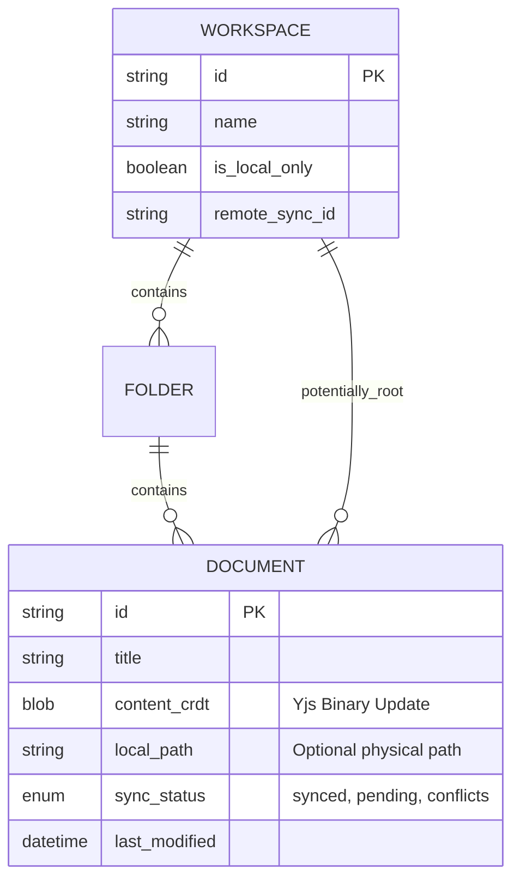
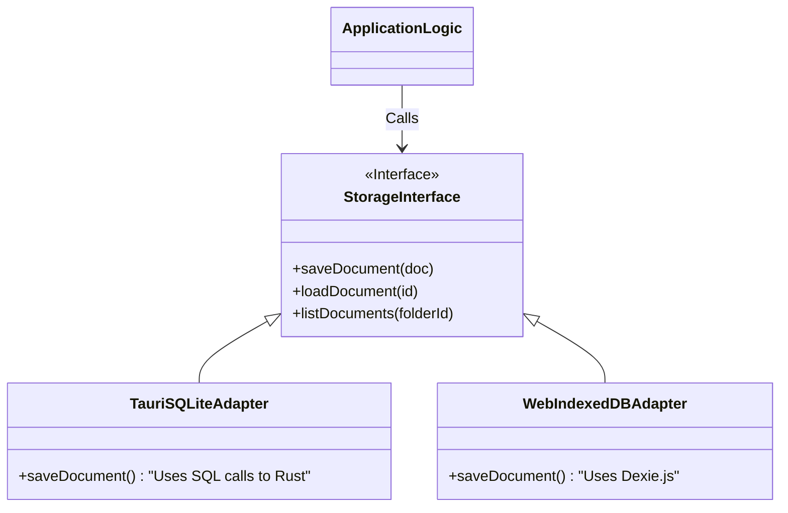
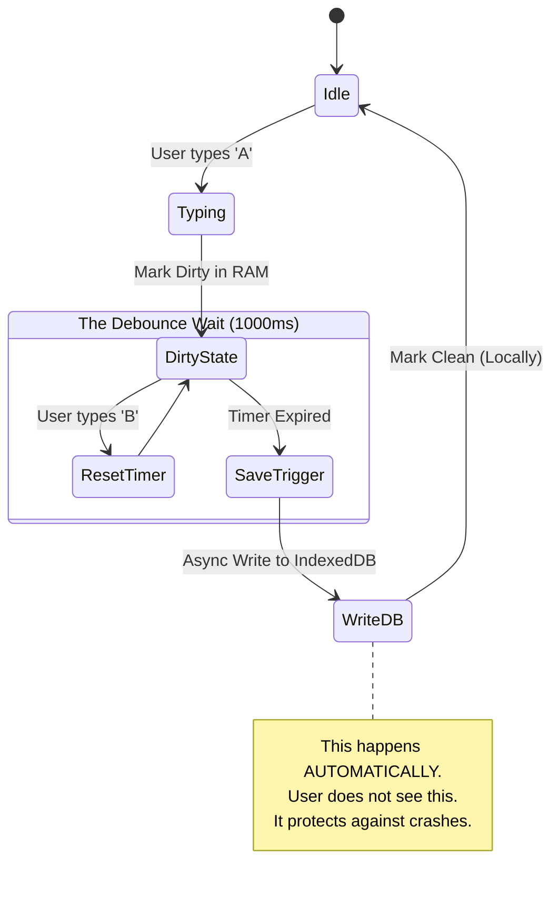
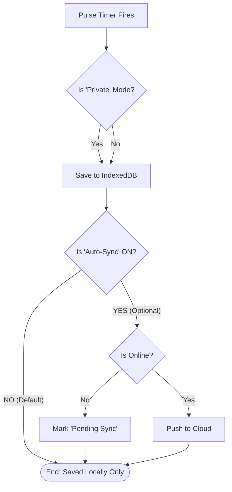
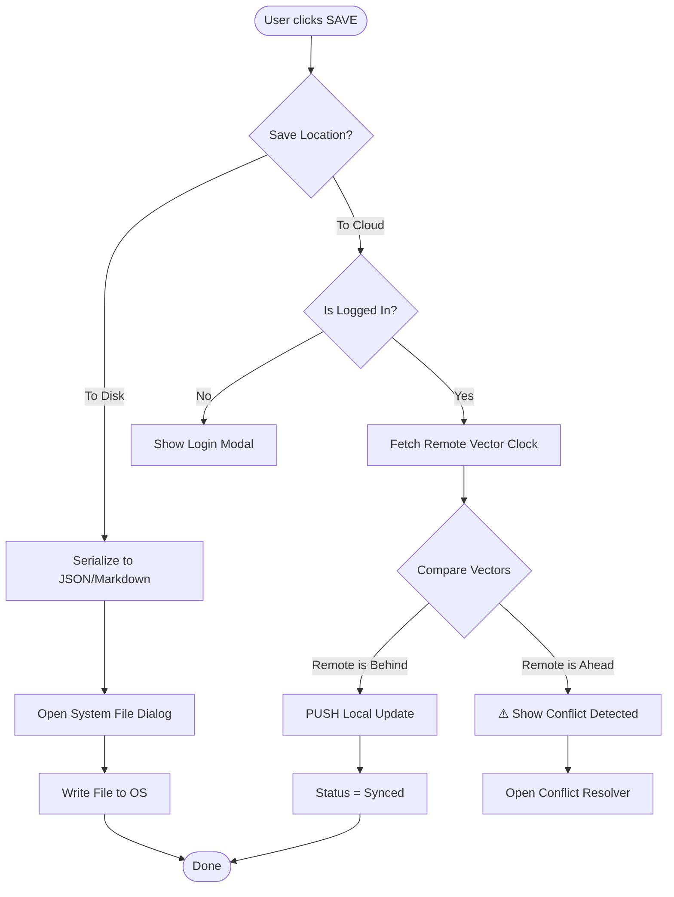
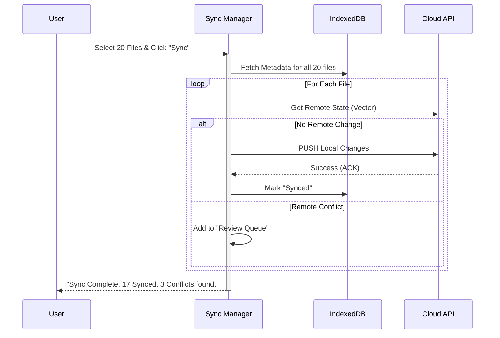
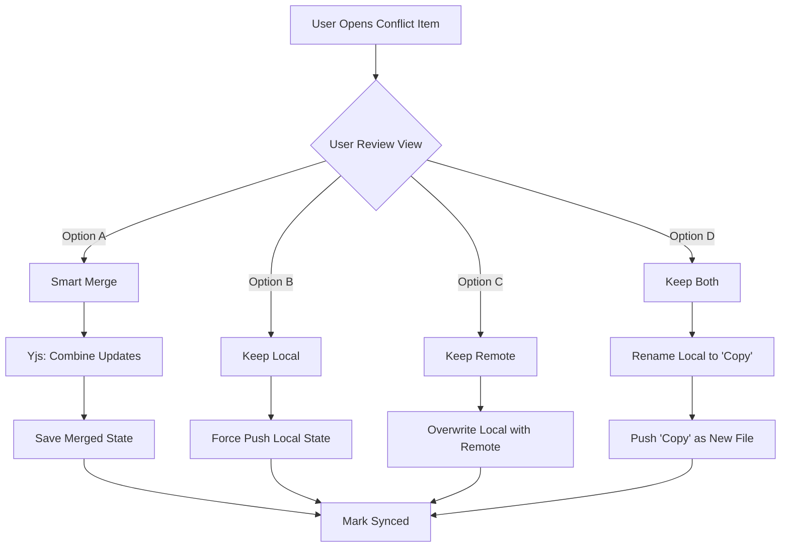

# Local-First Document Editor: System Architecture

## 1. Executive Summary
This document outlines the architecture for a **Local-First Document Editor** designed to run seamlessly as a Desktop Application (**Tauri**) and a Web Application (**PWA**).

**Core Philosophy:** "Your data is yours, on your device, first." Cloud sync is a secondary utility, not a dependency.

### Key Features
*   **Offline-First**: Zero latency. All writes happen locally immediately.
*   **Hybrid Runtime**: Optimizes storage based on environment (SQLite for Desktop, IndexedDB for Web).
*   **Hierarchical Structure**: Workspaces > Folders > Documents.
*   **Dual-Persistence**: Automatic database syncing + Manual file system exports.

---

## 2. Technology Stack

| Layer | Desktop (Tauri) | Web (PWA) |
| :--- | :--- | :--- |
| **Logic Core** | React + Rust (Backend) | React |
| **Local Storage** | **SQLite** (High Perf, Relational) | **IndexedDB** (Dexie.js / RxDB) |
| **Sync Engine** | CRDTs (**Yjs** or **Automerge**) | CRDTs (**Yjs** or **Automerge**) |
| **Cloud Database** | PostgreSQL / Supabase | PostgreSQL / Supabase |
| **Processing** | Rust Threads | Web Workers |

---

## 3. Data Architecture

### 3.1 Hierarchical Model
The application uses a strict hierarchy managed by a local relational schema.



### 3.2 Storage Abstraction Layer (SAL)
To support both Tauri and Web, we implement an interface adapter pattern.



---

## 4. Synchronization Strategy (The "Pooling" Logic)

We use a **State-Based Sync** approach using CRDTs. This allows "Pooling" indexing (merging updates) rather than simple overwriting.

### 4.1 Sync States
1.  **Local (Clean)**: All changes saved to disk.
2.  **Pending (Dirty)**: Changes saved locally but not yet pushed to cloud.
3.  **Synced**: Cloud confirms receipt of latest vector clock.
4.  **Local-Only**: User specifically disabled sync for this workspace.

---

## 4. The "Pulse" Engine (Constant Saving)
This logic controls the "constant saving" you asked about. It answers: *Who saves? When? Is it mandatory?*

### 4.1 The Core Rule: "Local Save is Mandatory, Cloud Save is Voluntary"
*   **Mandatory (The Pulse)**: Every keystroke must be saved to the Local Database (IndexedDB/SQLite) eventually. We cannot lose data if the browser crashes.
*   **Voluntary (The Check-in)**: Pushing to the Cloud or Disk is an explicit user choice.

### 4.2 The Debounce Loop (Who & How)
The **`PersistenceManager`** is a background service that watches the editor.

1.  **Trigger**: User types a character.
2.  **State**: File marked `is_dirty = true` in memory.
3.  **Debounce Timer**: Wait **1000ms** (configurable).
    *   *If user types again*: Reset timer.
    *   *If timer expires*: **FIRE SAVE**.
4.  **Action**: Write CRDT Blob to IndexedDB.

### 4.3 Logic Matrix (Who controls the path?)

| User State | Is "Pulse" (DB) Saving? | Is Cloud Syncing? | "Save Button" Action |
| :--- | :--- | :--- | :--- |
| **Logged Out** | ✅ **YES** (Standard) | ❌ NO | Prompts "Save to Disk" |
| **Offline** | ✅ **YES** (Standard) | ❌ NO (Queued) | Prompts "Save to Disk" |
| **Logged In (Standard)** | ✅ **YES** (Standard) | ❌ NO (Manual Only) | Prompts "Cloud" or "Disk" |
| **Logged In (Private Mode)** | ✅ **YES** (Encrypted) | ❌ **DISABLED** | Prompts "Save to Disk" **ONLY** |
| **Browser "Incognito"** | ✅ **YES** (Temp DB) | ❌ NO | warn: "Data lost on close!" |

---

## 5. Visual Workflows (Revised)

### 5.1 The "Pulse" Diagram (Debounce Logic)
How the system handles constant keystrokes without freezing the UI.



### 5.2 The "Save vs Sync" Decider
Logic flow determining if a save is Local, Cloud, or Blocked.



### 5.3 User Scenarios & Workflows (Revised: Manual & Batch Priority)

### 5.1 The "Local Sovereign" Workflow (Default)
User is online/logged-in, but the system **DOES NOT** touch the cloud until asked.

1.  **Creation**: User creates "Note 101". It resides **ONLY in IndexedDB**. Sync status: `Local (Unsaved)`.
2.  **Work**: User edits freely. Auto-save is to **IndexedDB only**.
3.  **Storage Limits**: System monitors IndexedDB usage. If > 500MB or > 50 files unsaved, UI shows "⚠️ Recommended: Back up your work".

### 5.2 Explicit "Save" Actions
The "Save" button is a split-decision action:
*   **Option A: Export to Disk** (Tauri/Web): Dumps the CRDT state to a JSON/Binary file on the physical HD.
*   **Option B: Push to Cloud**:
    1.  User clicks "Cloud Save".
    2.  System checks Cloud for existing version.
    3.  **No Conflict**: Pushes local state. Status -> `Synced`.
    4.  **Conflict Detected**: (See 5.4).

### 5.3 Batch Operations (The "End of Day" Flow)
User has accumulated 20 new files in IndexedDB.
1.  **Selection**: User goes to "Workspace Manager", selects 20 files.
2.  **Action**: Clicks "Batch Sync to Cloud".
3.  **Process**:
    *   System iterates through selected files.
    *   **Queue**: Pushes valid non-conflicting files immediately.
    *   **Hold**: Flags conflicting files for user review.
4.  **Result**: "17 Files Synced, 3 Require Review".

### 5.4 Conflict Resolution & History
Sync is NOT automatic merging in the background. It is a transactional "Check-in".

**When User Pushes a File that was modified on Cloud:**
1.  **Fetch**: Application pulls the remote state.
2.  **CRDT Merge**: Yjs merges the binary updates in memory.
3.  **Preview**: User is shown the "Merged Result" vs "My Local Version" vs "Cloud Version".
4.  **Decision**:
    *   *Accept Merge*: Saves the combined state.
    *   *Overwrite*: Force pushes local state (Cloud version moves to history).
    *   *Fork*: Save local as "File Copy 2".

**History Tracker**:
*   Every successful sync creates a "Checkpoint".
*   User can browse "History" tab: "Version 5 (Local Request), Version 6 (Merged with Cloud)".
*   **Revert**: One-click restore to any previous checkpoint state.

---

## 11. Document Versioning System (Comprehensive History)

### 11.1 Version Creation Strategy
**Hybrid Approach**: Store both Yjs diffs AND full snapshots for optimal performance and reliability.

| Version Type | Storage Method | Purpose | Retention |
|--------------|----------------|---------|-----------|
| **Auto-save** | Yjs diff only | Keystroke recovery | 24 hours |
| **Manual Save** | Yjs diff + snapshot | User checkpoints | Permanent |
| **Sync Checkpoint** | Yjs diff + snapshot | Collaboration points | Permanent |
| **Conflict Resolution** | Full snapshot | Merge decisions | Permanent |

### 11.2 Version Metadata Tracking
Every version captures comprehensive change information:

```typescript
interface DocumentVersion {
  id: string;
  document_id: string;
  version_number: number;
  version_type: 'auto' | 'manual' | 'sync' | 'conflict' | 'merge';
  
  // Change Attribution
  created_by_id: string;
  created_by_name: string;
  change_summary: string;  // "Added 3 paragraphs, deleted 1 image"
  
  // Content Storage
  yjs_diff: Uint8Array;     // Yjs binary update (always)
  content_snapshot?: string; // Full markdown (checkpoints only)
  
  // Collaboration Context
  collaborators: string[];   // Who was editing at this time
  merge_source?: 'local' | 'remote' | 'manual_merge';
  conflict_resolved?: boolean;
  
  // Timestamps
  created_at: Date;
  size_bytes: number;
}
```

### 11.3 Change Attribution System
**Who Did What**: Track granular changes for collaboration transparency.

```typescript
interface ChangeAttribution {
  user_id: string;
  user_name: string;
  change_type: 'insert' | 'delete' | 'format' | 'move';
  content_preview: string;  // First 50 chars of change
  position: number;         // Document position
  timestamp: Date;
}
```

### 11.4 Version History UI Requirements

#### **History Browser Interface**
- **Timeline View**: Chronological list with change previews
- **Diff Visualization**: Side-by-side comparison with highlights
- **Attribution Labels**: "John added paragraph 3" / "Sarah deleted image"
- **Quick Actions**: Restore, Compare, Download

#### **Revert Capabilities**
- **One-Click Restore**: Instant revert to any checkpoint
- **Selective Restore**: Choose specific changes to revert
- **Branch Creation**: "Restore as Copy" to avoid data loss
- **Undo Revert**: Ability to undo accidental reverts

### 11.5 Performance Optimization

#### **Storage Efficiency**
- **Diff Compression**: Yjs diffs are naturally compact
- **Snapshot Deduplication**: Store only changed content blocks
- **Cleanup Policy**: Auto-delete auto-save versions after 24h
- **Archive Old Versions**: Move old versions to cold storage

#### **Loading Performance**
- **Lazy Loading**: Load version metadata first, content on demand
- **Diff Streaming**: Stream large diffs progressively
- **Cache Strategy**: Keep recent versions in IndexedDB
- **Background Sync**: Sync version history in background

### 11.6 API Endpoints for Versioning

```typescript
// Version Management
GET    /api/v1/documents/{id}/versions           // List all versions
GET    /api/v1/documents/{id}/versions/{vid}     // Get specific version
POST   /api/v1/documents/{id}/versions           // Create manual checkpoint
DELETE /api/v1/documents/{id}/versions/{vid}     // Delete version (admin only)

// Version Operations  
POST   /api/v1/documents/{id}/versions/{vid}/restore    // Restore to version
GET    /api/v1/documents/{id}/versions/{vid}/diff       // Get diff from current
POST   /api/v1/documents/{id}/versions/{vid}/branch     // Create branch from version

// Change Attribution
GET    /api/v1/documents/{id}/changes           // Get change attribution log
GET    /api/v1/documents/{id}/contributors      // Get list of contributors
```

### 11.7 Collaboration Integration
**Future-Proof Design**: Ready for multi-user collaboration.

- **Real-time Attribution**: Track changes as they happen via Yjs
- **Presence Indicators**: Show who's editing what section
- **Conflict Prevention**: Warn before editing recently changed content
- **Merge Assistance**: AI-powered merge suggestions for conflicts

---

## 6. Performance Requirements & System Limits

### 6.1 Target Performance Metrics
| Operation | Target Time | Notes |
|-----------|-------------|-------|
| **Keystroke to IndexedDB** | < 50ms | After debounce timer |
| **Document Load** | < 200ms | Documents up to 1MB |
| **CRDT Merge** | < 100ms | Typical conflicts |
| **Single File Sync** | < 2 seconds | Network dependent |
| **Batch Sync (20 files)** | < 30 seconds | With progress feedback |
| **Conflict Detection** | < 500ms | Per file comparison |

### 6.2 Storage Limits & Monitoring
| Platform | Soft Limit | Hard Limit | Action |
|----------|------------|------------|--------|
| **IndexedDB (Web)** | 500MB | Browser quota | Show backup warning |
| **SQLite (Tauri)** | 2GB | Disk space | Suggest cleanup |
| **Pending Sync Queue** | 50 files | 100 files | Block new operations |
| **Document Size** | 10MB | 50MB | Warn about performance |

### 6.3 Error Handling & Retry Logic
- **Sync Failures**: 3 attempts with exponential backoff (1s, 4s, 16s)
- **Network Timeouts**: 30 second timeout per operation
- **Storage Quota**: Graceful degradation with user notification
- **CRDT Conflicts**: Always resolvable, never data loss

---

## 7. Authentication & Security

### 7.1 Authentication System
- **JWT Tokens**: Standard bearer token authentication
- **Session Management**: Persistent across app restarts
- **Guest Mode**: Full local functionality without account
- **Private Mode**: Client-side encryption before any storage

### 7.2 Security Modes
| Mode | Local Storage | Cloud Sync | Encryption |
|------|---------------|------------|------------|
| **Guest** | IndexedDB/SQLite | ❌ Disabled | None |
| **Standard** | IndexedDB/SQLite | ✅ Manual | Transport only |
| **Private** | Encrypted Blob | ❌ Disabled | AES-256 client-side |
| **Incognito** | Temporary DB | ❌ Disabled | Session only |

---

## 8. File System Integration & Migration

### 8.1 Import/Export Capabilities
- **Import**: Drag & drop .md files → Convert to Yjs documents
- **Export**: Any document → .md, .json, or Yjs binary format
- **Bulk Import**: Folder structures preserved in workspace hierarchy
- **Watch Mode**: (Tauri only) Monitor external file changes

### 8.2 Migration Strategy
Migration is handled through the same CRDT merge logic as sync:

1. **Existing Files**: Import → Convert to Yjs → Store locally
2. **Cloud Documents**: Fetch → Merge with local → Resolve conflicts
3. **Cross-Device**: Yjs vector clocks automatically handle merging
4. **Backup Restoration**: Import previous exports seamlessly

**Key Principle**: Migration = Sync. The CRDT system treats all incoming data as potential merge candidates.

---

## 9. User Interface Design Patterns

### 9.1 Conflict Resolution UI Strategy
**Progressive Complexity Approach**:

| Conflict Type | UI Pattern | Platform Optimization |
|---------------|------------|----------------------|
| **Simple** (text-only) | Modal Dialog | Works on mobile + desktop |
| **Complex** (large docs) | Dedicated Page | Better for Tauri desktop |
| **Batch** (multiple files) | Sidebar Panel | Persistent across operations |

### 9.2 Sync Status Indicators
- **Green Dot**: Synced to cloud
- **Orange Dot**: Pending sync (queued)
- **Red Dot**: Conflict requires attention
- **Gray Dot**: Local-only (no sync configured)
- **Blue Dot**: Private mode (encrypted)

---

## 10. Visual Workflows

### 10.1 The "Check-in" Event (Manual Save)
This flow represents the single-file "Save" action, emphasizing the fork in the road between Local Disk and Cloud Storage.



### 10.2 Batch Processing Loop
How the system handles "Select 20 Files -> Sync".



### 10.3 The Conflict Resolution Interface
The decision tree when a user reviews a conflict.



