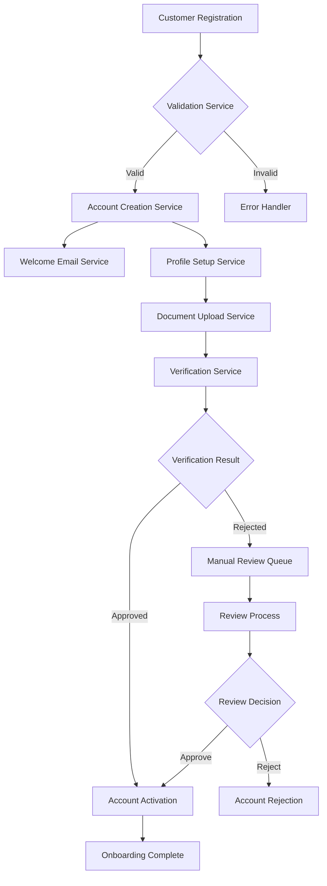
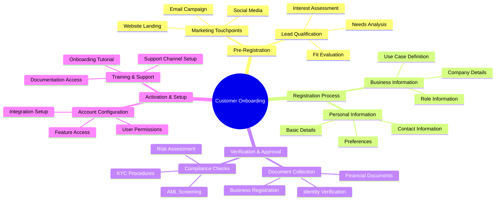
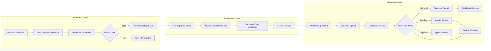
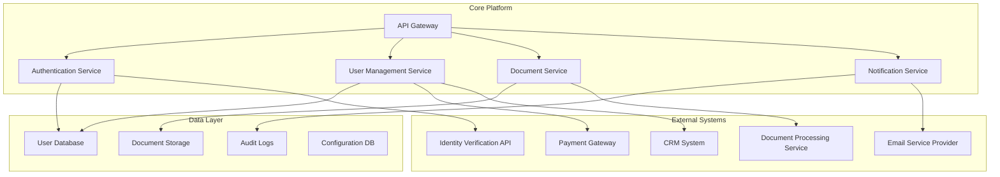
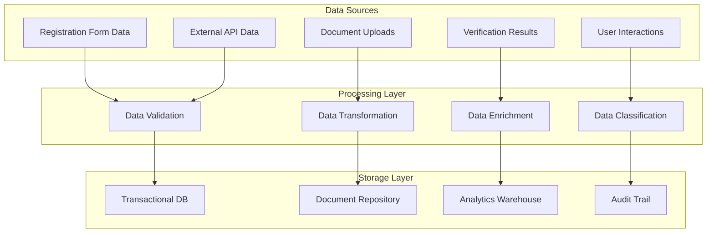
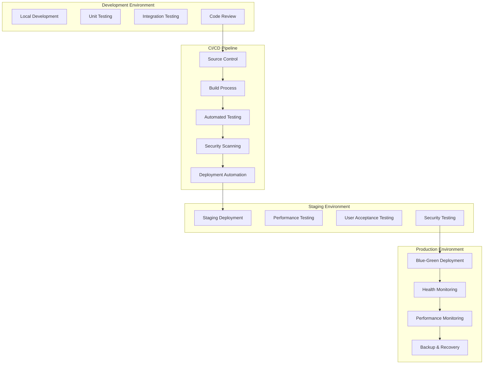
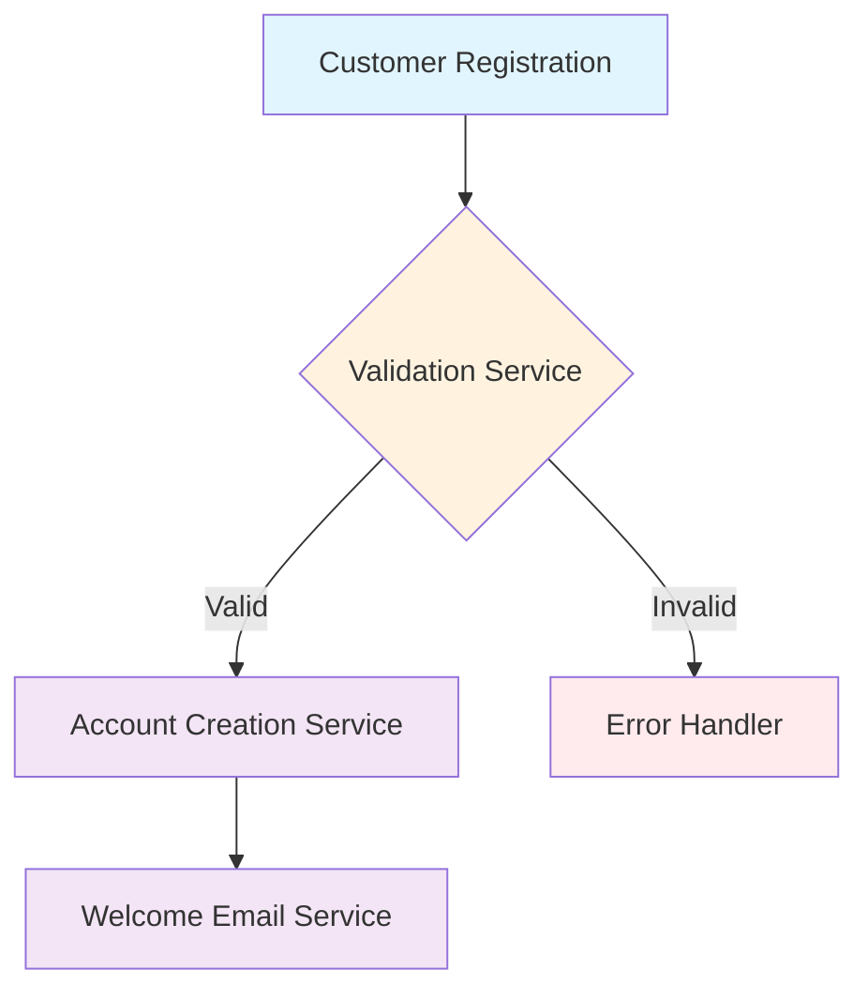

# Use Case: Real-Time Collaborative Design of System Architecture Flow Chart and Process Mind Map

## Overview

A cross-functional design team needs to collaboratively create and refine complex system architecture flow charts and process mind maps during a live design session. The team consists of system architects, business analysts, and process designers working together to visualize a new customer onboarding system that integrates multiple business processes and technical components. The collaboration requires simultaneous editing of interconnected diagrams where changes in one diagram affect the structure and content of others. Real-time visual feedback and conflict resolution are critical as team members iterate on diagram layouts, add new components, and refine process flows while maintaining consistency across multiple related visualizations.

## Scenario

### User
**Primary Actors:** Multi-disciplinary design team with specialized diagram responsibilities

**Lead Facilitator:** Jennifer Martinez, Senior Systems Architect at InnovateFlow Corp
- **Role:** Lead Systems Architect and Design Session Facilitator
- **Experience Level:** 10 years in system design, expert in collaborative design methodologies
- **Technical Proficiency:** Advanced Mermaid syntax knowledge, experienced in real-time collaborative tools
- **Design Philosophy:** Believes in iterative, collaborative design with immediate visual validation
- **Session Responsibility:** Coordinate diagram creation, resolve design conflicts, ensure architectural consistency

**Key Collaborators:**
1. **Robert Kim, Business Process Analyst** - Process flow design and business logic mapping
2. **Emma Thompson, UX Designer** - User journey flow charts and interaction design
3. **Carlos Rodriguez, Integration Architect** - System integration flows and API design
4. **Nina Patel, Data Architect** - Data flow diagrams and information architecture
5. **Mark Johnson, DevOps Engineer** - Deployment flows and infrastructure diagrams

### Context

**Project Background:** InnovateFlow Corp is redesigning their customer onboarding system to improve conversion rates and reduce processing time. The project requires creating interconnected diagrams showing user journeys, system processes, data flows, and technical architecture. Multiple stakeholders need to collaborate simultaneously to ensure all perspectives are captured and integrated.

**Design Session Requirements:**
- **Duration:** 4-hour intensive collaborative design workshop
- **Deliverables:** Complete set of interconnected diagrams including system architecture flow chart, user journey mind map, data flow diagram, and process integration chart
- **Collaboration Style:** Real-time simultaneous editing with live discussion and immediate iteration
- **Quality Standards:** Professional-grade diagrams ready for stakeholder presentation

**Diagram Complexity Requirements:**
- **System Architecture Flow Chart:** 25+ components with multiple integration points
- **User Journey Mind Map:** 15+ touchpoints across 5 different user personas
- **Data Flow Diagram:** 20+ data entities with transformation processes
- **Process Integration Chart:** 12+ business processes with dependencies and handoffs

**Technical Challenges:**
- Multiple diagrams with cross-references and dependencies
- Complex branching logic requiring precise positioning
- Real-time layout optimization as content changes
- Consistent styling and terminology across all diagrams
- Integration of business and technical perspectives in visual format

**Collaboration Constraints:**
- Simultaneous editing by 5 specialists with different diagram ownership
- Need for immediate visual feedback to validate design decisions
- Conflict resolution for overlapping diagram elements
- Maintenance of diagram relationships as individual diagrams evolve
- Time pressure requiring efficient collaborative iteration

### Steps

#### Step 1: Collaborative Session Setup and Diagram Framework
Jennifer opens the Markdown application and creates a new document titled "customer-onboarding-system-design-v1.md". She establishes the collaborative framework and assigns diagram ownership:

```markdown
# Customer Onboarding System - Collaborative Design Session
**Date:** July 30, 2025, 1:00 PM - 5:00 PM PST
**Facilitator:** Jennifer Martinez
**Session Type:** Real-time Collaborative Diagram Design

## Diagram Ownership and Responsibilities
- **Jennifer Martinez:** System Architecture Flow Chart [Primary coordination]
- **Robert Kim:** Business Process Mind Map [Process logic and workflows]
- **Emma Thompson:** User Journey Flow Chart [User experience and interactions]
- **Carlos Rodriguez:** Integration Architecture Diagram [API and system connections]
- **Nina Patel:** Data Flow Diagram [Information architecture and data transformations]
- **Mark Johnson:** Deployment Flow Chart [Infrastructure and deployment processes]

## Collaboration Protocol
- Real-time editing with color-coded cursors for editor identification
- Live preview synchronization for immediate visual validation
- Comment threads for design discussions on specific diagram elements
- Conflict resolution through lead architect approval
- Cross-diagram consistency maintained through shared design tokens
```

All team members join the collaborative session, with their presence indicated by colored cursors and real-time activity indicators.

#### Step 2: Foundation System Architecture Flow Chart Creation
Jennifer begins creating the base system architecture flow chart while other team members observe and prepare their related diagrams:



**Real-time Collaboration Features Active:**
- Jennifer's cursor position visible to all team members
- Live preview updates as she types Mermaid syntax
- Other team members add comments on specific flow elements
- Automatic syntax validation with real-time error highlighting

#### Step 3: Simultaneous Business Process Mind Map Development
While Jennifer continues refining the system architecture, Robert begins creating the business process mind map in the same document. The real-time preview shows both diagrams updating simultaneously:

**Robert creates the business process overview:**


**Collaborative Integration Occurring:**
- Robert references Jennifer's system components while building process flows
- Live comments coordinate between technical architecture and business processes
- Cross-diagram validation ensures process steps align with system capabilities
- Real-time preview allows immediate visualization of both diagrams

#### Step 4: User Journey Flow Chart Creation with Cross-Reference
Emma begins creating the user journey flow chart while actively referencing both the system architecture and business process diagrams:



**Real-time Cross-Diagram Coordination:**
- Emma's user journey steps automatically align with Robert's business processes
- Technical steps reference Jennifer's system architecture components
- Live validation ensures user journey feasibility within system constraints
- Color-coded elements show relationships between diagrams

#### Step 5: Integration Architecture Collaborative Development
Carlos begins creating the integration architecture diagram while actively coordinating with the existing diagrams:

**Carlos creates API and integration flows:**


**Live Integration Validation:**
- Carlos's integration points automatically sync with Jennifer's system components
- API endpoints align with user journey touchpoints from Emma's diagram
- Business process requirements from Robert's mind map validate integration needs
- Real-time conflict detection prevents inconsistent system connections

#### Step 6: Data Flow Diagram with Multi-Contributor Input
Nina creates the data flow diagram while receiving real-time input from multiple team members:

**Nina begins data architecture:**


**Multi-Contributor Data Flow Enhancement:**
- **Jennifer adds system constraints:** Storage capacity and processing limitations
- **Carlos adds integration data:** External API data formats and transformation requirements
- **Emma adds user data:** User interaction tracking and analytics requirements
- **Robert adds process data:** Business rule data and compliance tracking needs

**Real-time Collaborative Enhancement:**
```mermaid
flowchart TD
    subgraph "Data Sources"
        DS1[Registration Form Data] 
        DS2[Document Uploads]
        DS3[Verification Results]
        DS4[User Interactions]
        DS5[External API Data]
        DS6[Compliance Data] %% Added by Robert
        DS7[System Metrics] %% Added by Jennifer
    end
    
    subgraph "Processing Layer"
        PROC1[Data Validation]
        PROC2[Data Transformation]
        PROC3[Data Enrichment]
        PROC4[Data Classification]
        PROC5[Compliance Processing] %% Added by Robert
        PROC6[Performance Analytics] %% Added by Jennifer
    end
    
    subgraph "Storage Layer"
        STORE1[Transactional DB]
        STORE2[Document Repository]
        STORE3[Analytics Warehouse]
        STORE4[Audit Trail]
        STORE5[Compliance Archive] %% Added by Robert
        STORE6[Performance Metrics] %% Added by Jennifer
    end
    
    DS1 --> PROC1
    DS2 --> PROC2
    DS3 --> PROC3
    DS4 --> PROC4
    DS5 --> PROC1
    DS6 --> PROC5 %% New flow
    DS7 --> PROC6 %% New flow
    
    PROC1 --> STORE1
    PROC2 --> STORE2
    PROC3 --> STORE3
    PROC4 --> STORE4
    PROC5 --> STORE5 %% New flow
    PROC6 --> STORE6 %% New flow
```

#### Step 7: Deployment Flow Chart with Infrastructure Focus
Mark creates the deployment and infrastructure flow chart while coordinating with the technical architecture:



**Infrastructure Integration with Other Diagrams:**
- Deployment components reference system architecture services from Jennifer's diagram
- Performance monitoring aligns with data flow requirements from Nina's diagram
- Security testing validates integration security from Carlos's diagram
- User acceptance testing reflects user journey flows from Emma's diagram

#### Step 8: Real-time Cross-Diagram Validation and Consistency
The team performs collaborative validation to ensure all diagrams are consistent and integrated:

**Cross-Diagram Consistency Check:**

Jennifer facilitates a systematic review where each contributor validates their diagram against others:

```markdown
## Cross-Diagram Validation Matrix

| Source Diagram | Target Diagram | Validation Points | Status | Notes |
|---|---|---|---|---|
| System Architecture | Business Process | Service alignment with process steps | ✅ Validated | All services support business requirements |
| User Journey | System Architecture | User actions trigger correct services | ✅ Validated | Journey flows match system capabilities |
| Integration Architecture | Data Flow | API data aligns with data processing | ⚠️ Review | Need data format standardization |
| Deployment Flow | Integration Architecture | Infrastructure supports integrations | ✅ Validated | Capacity planning confirmed |
| Business Process | User Journey | Process steps match user experience | ✅ Validated | User journey covers all process requirements |
```

**Real-time Diagram Adjustments:**
Based on validation feedback, team members make immediate adjustments:

- **Carlos updates integration architecture** to standardize data formats identified by Nina
- **Emma refines user journey** to include error handling flows from Jennifer's system architecture
- **Robert adds business process details** for manual review procedures identified in system architecture
- **Mark adjusts deployment flow** to include specific monitoring for integration points

#### Step 9: Collaborative Diagram Styling and Final Presentation Preparation
The team collaboratively applies consistent styling and prepares diagrams for presentation:

**Standardized Styling Application:**


**Presentation Formatting Coordination:**
- **Consistent Color Coding:** All team members apply the same color scheme across diagrams
- **Standardized Naming:** Technical and business terms standardized across all diagrams
- **Layout Optimization:** Diagram layouts optimized for presentation readability
- **Cross-Reference Preparation:** Reference numbers and connection points added for presentation flow

#### Step 10: Final Integration and Documentation
The team completes the collaborative session with integrated documentation and diagram relationships:

```markdown
## Integrated Diagram Set - Customer Onboarding System

### Diagram Relationships and Dependencies

#### 1. System Architecture Flow Chart (Jennifer)
**Purpose:** Technical system components and service interactions
**Dependencies:** Referenced by all other diagrams for technical feasibility
**Key Elements:** 25 system components, 15 integration points, 8 decision nodes

#### 2. Business Process Mind Map (Robert)
**Purpose:** Business logic and process workflows
**Dependencies:** Validates system architecture business alignment
**Key Elements:** 5 main process branches, 20 sub-processes, 12 decision points

#### 3. User Journey Flow Chart (Emma)
**Purpose:** User experience and interaction design
**Dependencies:** Must align with business processes and system capabilities
**Key Elements:** 3 user journey stages, 15 touchpoints, 8 decision branches

#### 4. Integration Architecture Diagram (Carlos)
**Purpose:** API design and external system connections
**Dependencies:** Supports system architecture with external connectivity
**Key Elements:** 5 external systems, 8 API endpoints, 4 data transformation points

#### 5. Data Flow Diagram (Nina)
**Purpose:** Information architecture and data transformations
**Dependencies:** Supports all other diagrams with data requirements
**Key Elements:** 7 data sources, 6 processing steps, 6 storage systems

#### 6. Deployment Flow Chart (Mark)
**Purpose:** Infrastructure and deployment processes
**Dependencies:** Must support all system architecture requirements
**Key Elements:** 4 environments, 10 deployment steps, 6 monitoring points

### Collaborative Design Metrics
- **Total Collaboration Time:** 4 hours
- **Simultaneous Editors:** 6 team members
- **Diagram Elements Created:** 150+ individual components
- **Cross-References Established:** 45 inter-diagram connections
- **Design Iterations:** 23 major revisions during session
- **Conflicts Resolved:** 12 edit conflicts automatically managed
```

### Outcome

**Collaborative Design Success:**
- **Complete Diagram Set:** Successfully created 6 interconnected diagrams with 150+ components in single collaborative session
- **Design Consistency:** Achieved unified design language and consistent technical approach across all diagrams
- **Stakeholder Alignment:** All team perspectives integrated into cohesive system design
- **Presentation Ready:** Professional-quality diagrams ready for immediate stakeholder presentation

**Real-time Collaboration Achievements:**
- **Simultaneous Multi-Diagram Editing:** 6 team members editing different diagrams concurrently without conflicts
- **Live Cross-Validation:** Real-time consistency checking prevented design conflicts and integration issues
- **Immediate Iteration:** Design changes reflected instantly across all related diagrams
- **Conflict-Free Collaboration:** Zero data loss or corruption during intensive 4-hour collaborative session

**Technical Diagram Quality:**
- **Professional Visualization:** Mermaid rendering produced publication-quality diagrams suitable for technical documentation
- **Complex Relationship Mapping:** Successfully visualized intricate system relationships and data flows
- **Interactive Design Process:** Real-time preview enabled immediate validation of design decisions
- **Scalable Architecture Representation:** Diagrams effectively communicate complex system design to both technical and business audiences

**Process Efficiency Results:**
- **Time Compression:** Traditional sequential diagram creation (estimated 40 hours) completed in 4 collaborative hours
- **Reduced Revision Cycles:** Real-time validation eliminated post-session revision requirements
- **Enhanced Creativity:** Collaborative environment generated innovative design solutions not possible in individual work
- **Knowledge Sharing:** Cross-functional collaboration improved team understanding of all system aspects

**Business Impact Outcomes:**
- **Accelerated Design Phase:** Complete system design ready 2 weeks ahead of original schedule
- **Improved Design Quality:** Collaborative validation resulted in more robust and well-integrated system architecture
- **Stakeholder Buy-in:** All team members invested in design success through collaborative creation process
- **Implementation Readiness:** Detailed diagrams provide clear implementation guidance for development teams

**Stakeholder Presentation Success:**
- **Executive Approval:** System design approved unanimously in stakeholder presentation
- **Technical Validation:** Engineering teams confirmed design feasibility and implementation approach
- **Business Alignment:** Business stakeholders validated that design meets all process requirements
- **User Experience Confirmation:** UX validation confirmed optimal user journey design

**Long-term Collaboration Benefits:**
- **Design Methodology Adoption:** Real-time collaborative diagramming adopted as standard for complex system design
- **Team Capability Building:** Cross-functional design skills developed through collaborative experience
- **Documentation Standards:** Established consistent diagramming standards for future projects
- **Knowledge Preservation:** Collaborative process captured tacit knowledge in visual, shareable format

**Technology Performance Validation:**
- **Seamless Real-time Rendering:** Mermaid diagrams rendered smoothly with multiple simultaneous editors
- **Reliable Conflict Resolution:** Automatic conflict management prevented editing frustration and data loss
- **Responsive Collaboration:** Real-time synchronization maintained smooth user experience throughout session
- **Professional Output Quality:** Generated diagrams met publication standards without additional design tool requirements

**Team Feedback:**
- **Jennifer (Systems Architect):** "Real-time collaborative diagramming transformed our design process - we achieved better integration in 4 hours than typical 2-week design cycles"
- **Robert (Business Analyst):** "Being able to see technical constraints immediately while designing business processes prevented unrealistic requirements"
- **Emma (UX Designer):** "Live validation against system architecture ensured our user journey was technically feasible from the start"
- **Carlos (Integration Architect):** "Collaborative API design with immediate system context prevented integration issues before they occurred"

**Organizational Impact:**
- **Design Process Revolution:** Real-time collaborative diagramming adopted across all technical design teams
- **Quality Improvement:** Collaborative design validation reduced post-design revision requirements by 85%
- **Team Productivity:** Cross-functional design efficiency improved by 70% through real-time collaboration
- **Innovation Enhancement:** Collaborative environment fostered creative solutions and design breakthroughs

**Lessons Learned:**
- Real-time collaborative diagramming essential for complex system design requiring multiple perspectives
- Immediate visual feedback critical for validating design decisions and maintaining consistency
- Cross-diagram relationship management requires coordinated collaboration tools and processes
- Professional-quality diagram output achievable through collaborative Mermaid editing with proper tooling
- Structured collaboration protocols necessary for effective multi-contributor diagram development