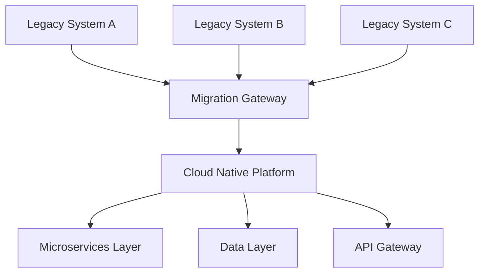
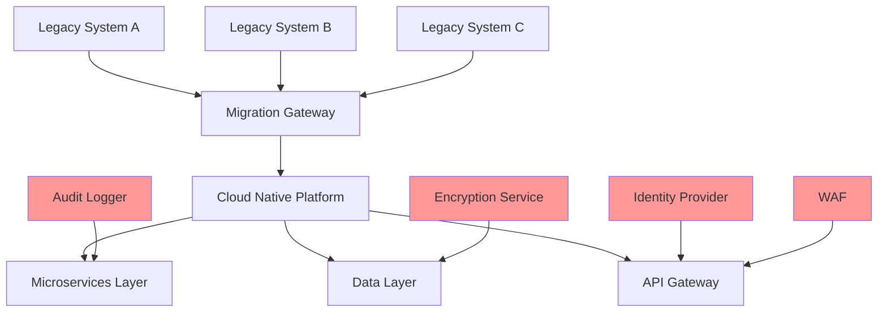
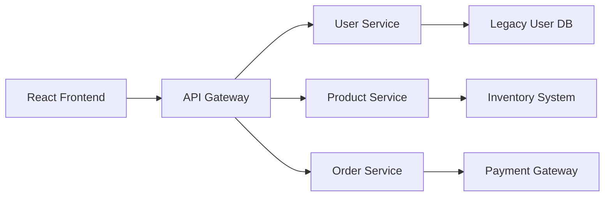
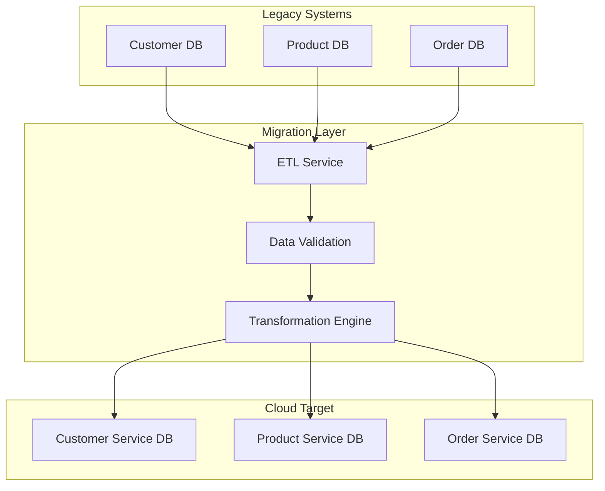
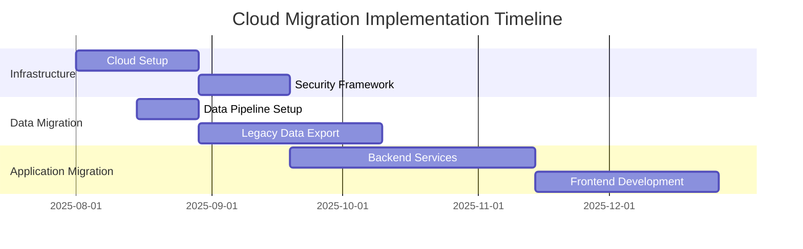
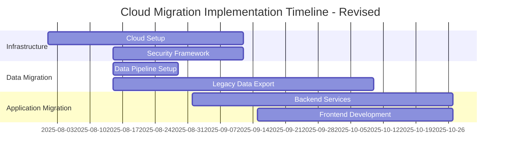

# Use Case: Real-Time Collaborative Editing of Technical Project Specification

## Overview

A distributed project team needs to collaboratively create and refine a comprehensive technical project specification document in real-time during a critical project planning phase. The team consists of members across different time zones working on a complex software architecture project that requires immediate input from multiple specialists. The markdown document contains technical requirements, system architecture diagrams, implementation timelines, and resource allocation tables that need simultaneous review and modification by technical architects, product managers, and engineering leads. Real-time collaboration is essential to meet an aggressive deadline while ensuring all stakeholder input is captured and conflicts are resolved immediately.

## Scenario

### User
**Primary Actors:** Cross-functional project team with multiple simultaneous editors

**Lead Collaborator:** Sarah Kim, Technical Project Manager at GlobalTech Solutions
- **Role:** Lead Technical Project Manager for Cloud Migration Initiative
- **Experience Level:** 8 years in technical project management, expert in collaborative documentation
- **Technical Proficiency:** Advanced markdown skills, experienced with real-time collaboration tools
- **Collaboration Style:** Facilitates structured group editing sessions with clear role assignments
- **Current Challenge:** Coordinate simultaneous input from 6 team members across 3 time zones

**Key Collaborators:**
1. **Alex Rodriguez, Solutions Architect** - System design and architecture diagrams
2. **Maria Chen, Senior Product Manager** - Requirements definition and business logic
3. **James Wilson, DevOps Lead** - Infrastructure and deployment specifications  
4. **Priya Patel, Security Specialist** - Security requirements and compliance
5. **Tom Anderson, Frontend Lead** - User interface and integration requirements
6. **Lisa Zhang, Data Engineer** - Data architecture and pipeline specifications

### Context

**Project Background:** GlobalTech Solutions is documenting the technical specification for a mission-critical cloud migration project affecting 15 legacy systems. The specification must be completed within 48 hours to meet a board presentation deadline, requiring intensive collaborative effort to capture input from all technical specialists.

**Collaboration Requirements:**
- **Simultaneous Editing:** Multiple team members need to work on different sections concurrently
- **Conflict Resolution:** Real-time conflict detection and resolution for overlapping edits
- **Live Communication:** Integrated discussion and comment capabilities during editing
- **Version Tracking:** Immediate visibility of changes and contributor identification
- **Cross-timezone Coordination:** Team spans Pacific, Mountain, and Eastern time zones

**Document Complexity:**
- **40+ pages** of technical specifications
- **12 system architecture diagrams** using Mermaid syntax
- **25+ requirement tables** with detailed specifications
- **Timeline charts** with interdependent milestones
- **Resource allocation matrices** requiring budget coordination

**Original Document Structure:**
```markdown
# Cloud Migration Technical Specification v2.0
## 1. Executive Summary (Maria - Product Manager)
## 2. System Architecture Overview (Alex - Solutions Architect)  
## 3. Migration Strategy (James - DevOps Lead)
## 4. Security Framework (Priya - Security Specialist)
## 5. Frontend Modernization (Tom - Frontend Lead)
## 6. Data Migration Plan (Lisa - Data Engineer)
## 7. Implementation Timeline (Sarah - Project Manager)
## 8. Resource Requirements (Sarah - Project Manager)
```

**Collaboration Challenges:**
- Multiple editors working on interconnected sections
- Technical diagrams requiring specialist input and review
- Complex tables with financial and resource data
- Time-sensitive deadline requiring 12-hour intensive collaboration session
- Need for immediate feedback and approval from remote stakeholders

### Steps

#### Step 1: Collaborative Session Setup and Role Assignment
Sarah opens the existing "cloud-migration-technical-spec-v2.0.md" file in the Markdown application and activates collaborative editing mode. She invites all team members via email with edit permissions and establishes the collaboration framework:

```markdown
# Collaborative Editing Session - July 30, 2025
## Session Duration: 9:00 AM PST - 9:00 PM PST (12 hours)
## Real-time Collaboration Rules

### Editor Assignments and Responsibilities
- **Sarah Kim (Lead)**: Coordination, Timeline, Resources [Sections 7-8]
- **Alex Rodriguez**: Architecture diagrams and system design [Section 2]
- **Maria Chen**: Requirements and business logic [Section 1, 4.1]
- **James Wilson**: Infrastructure and deployment [Section 3]
- **Priya Patel**: Security specifications [Section 4]
- **Tom Anderson**: Frontend specifications [Section 5]
- **Lisa Zhang**: Data architecture and migration [Section 6]

### Collaboration Protocol
- Use @mentions for immediate attention needs
- Color-coded cursors for editor identification
- Live comments for section-specific discussions
- Conflict resolution: Lead editor has final decision authority
- Break schedule: 15 minutes every 2 hours for sync discussions
```

The real-time preview shows all team members joining the session, with different colored cursors indicating their presence and current editing locations.

#### Step 2: Simultaneous Architecture Diagram Development
Alex begins working on the system architecture section while other team members focus on their assigned areas. The real-time collaboration allows multiple editors to see changes instantly:

**Alex (Solutions Architect) creates base architecture:**


**Priya (Security Specialist) simultaneously adds security annotations:**
While Alex works on the main architecture, Priya adds security-specific elements in real-time, with their changes appearing immediately in the preview:



**Real-time Collaboration Features in Action:**
- Both editors see each other's cursors and changes instantly
- Conflict detection prevents simultaneous editing of the same diagram elements
- Live comments appear as they discuss security integration points
- Version history tracks each contributor's additions with timestamps

#### Step 3: Collaborative Table Development with Live Conflict Resolution
Maria and James simultaneously work on the migration strategy table, demonstrating real-time conflict resolution:

**Maria starts the requirements table:**
```markdown
## Migration Requirements Matrix

| System | Current State | Target State | Dependencies | Owner |
|---|---|---|---|---|
| Customer Portal | Legacy PHP | React/Node.js | User data migration | Tom |
| Inventory System | On-premise SQL | Cloud PostgreSQL | Data transformation | Lisa |
```

**James simultaneously adds infrastructure details:**
As Maria types, James adds infrastructure columns to the same table. The application detects the potential conflict and provides real-time merge suggestions:

```markdown
| System | Current State | Target State | Dependencies | Infrastructure | Downtime | Owner |
|---|---|---|---|---|---|---|
| Customer Portal | Legacy PHP | React/Node.js | User data migration | AWS ECS | 4 hours | Tom |
| Inventory System | On-premise SQL | Cloud PostgreSQL | Data transformation | AWS RDS | 2 hours | Lisa |
| Payment Gateway | Legacy .NET | Serverless Lambda | PCI compliance review | AWS Lambda | 1 hour | Priya |
```

**Conflict Resolution Process:**
1. **Automatic Detection:** Application highlights overlapping edits in real-time
2. **Merge Suggestions:** Intelligent merging of complementary additions
3. **Live Discussion:** Built-in chat allows immediate resolution discussion
4. **Version Preservation:** All changes tracked with contributor attribution
5. **Final Resolution:** Lead editor approves merged version

#### Step 4: Cross-Section Integration and Live Review
Tom (Frontend Lead) works on user interface specifications while simultaneously referencing Alex's architecture diagrams and Maria's requirements. The real-time preview allows immediate cross-validation:

**Tom's Frontend Integration Section:**
```markdown
## Frontend Modernization Strategy

### Component Architecture Integration
*References: See Section 2.3 - Microservices Layer (Alex's diagram)*



**Cross-Reference Validation:**
As Tom creates frontend specifications, the real-time collaboration allows:
- **Live Cross-Referencing:** Tom can see Alex's architecture updates immediately
- **Automatic Consistency Checking:** Application highlights potential integration conflicts
- **Real-time Feedback:** Alex provides immediate comments on frontend-backend integration
- **Dynamic Updates:** Changes in architecture automatically prompt frontend specification updates

#### Step 5: Data Pipeline Collaborative Design
Lisa (Data Engineer) works on data migration specifications while coordinating with James (DevOps) on infrastructure requirements:

**Lisa's Data Migration Plan:**
```markdown
## Data Migration Architecture

### Migration Pipeline Design



**James simultaneously adds infrastructure specifications:**
```markdown
### Infrastructure Requirements for Data Migration

| Component | Specification | Rationale | Cost Impact |
|---|---|---|---|
| ETL Processing | AWS Glue with 10 DPU | Handle 2TB daily migration | $2,400/month |
| Data Validation | Custom Lambda functions | Real-time validation | $300/month |
| Storage Buffer | S3 with lifecycle policies | Temporary data staging | $150/month |
| Network | Dedicated VPN connection | Secure data transfer | $500/month |
```

**Live Coordination Benefits:**
- **Real-time Resource Planning:** Cost calculations update as specifications change
- **Infrastructure Validation:** DevOps requirements immediately reflect data volume needs
- **Capacity Planning:** Storage and processing requirements adjust based on migration timelines
- **Risk Assessment:** Security and performance concerns addressed collaboratively in real-time

#### Step 6: Timeline Coordination with Multiple Contributors
Sarah coordinates the implementation timeline while receiving real-time input from all team members:

**Base Timeline Framework:**


**Real-time Timeline Adjustments:**
As team members provide input, the timeline updates dynamically:

- **James (DevOps):** "Infrastructure setup needs 6 weeks, not 4 - adding complexity for multi-region deployment"
- **Lisa (Data Engineer):** "Data export should start parallel with pipeline setup to save 2 weeks"
- **Tom (Frontend):** "Frontend can start earlier if we have API specifications from backend team"

**Updated Timeline with Collaborative Input:**


#### Step 7: Real-time Budget and Resource Allocation
The team collaboratively develops budget tables with live calculations:

**Collaborative Budget Development:**

**Sarah starts with base structure:**
```markdown
## Resource Allocation and Budget

| Resource Category | Q3 2025 | Q4 2025 | Q1 2026 | Total |
|---|---|---|---|---|
| Infrastructure | | | | |
| Development Team | | | | |
| External Services | | | | |
```

**Multiple contributors add simultaneously:**
- **James adds infrastructure costs:** Cloud hosting, security tools, monitoring services
- **Sarah adds personnel costs:** Development team, project management, external consultants  
- **Priya adds security costs:** Security tools, compliance auditing, penetration testing
- **Alex adds architecture costs:** Design tools, documentation, technical consulting

**Final Collaborative Budget Table:**
```markdown
| Resource Category | Q3 2025 | Q4 2025 | Q1 2026 | Total | Owner |
|---|---|---|---|---|---|
| Cloud Infrastructure | $45,000 | $60,000 | $75,000 | $180,000 | James |
| Development Team | $180,000 | $240,000 | $180,000 | $600,000 | Sarah |
| Security & Compliance | $25,000 | $35,000 | $15,000 | $75,000 | Priya |
| External Consulting | $40,000 | $20,000 | $10,000 | $70,000 | Alex |
| **Total Investment** | **$290,000** | **$355,000** | **$280,000** | **$925,000** | |
```

**Live Calculation Features:**
- **Automatic Totals:** Budget totals update in real-time as contributors add line items
- **Currency Formatting:** Consistent financial formatting applied automatically
- **Validation Checks:** Budget constraints verified against project parameters
- **Version Tracking:** All budget changes tracked with contributor identification

#### Step 8: Live Quality Assurance and Cross-Validation
Throughout the session, the team performs continuous quality assurance using real-time collaboration features:

**Simultaneous Review Process:**
- **Technical Accuracy:** Alex reviews all architecture references for consistency
- **Business Alignment:** Maria validates requirements against business objectives  
- **Implementation Feasibility:** James confirms infrastructure and deployment viability
- **Security Compliance:** Priya reviews all sections for security consideration
- **Timeline Realism:** Sarah validates all timelines against resource availability
- **Budget Accuracy:** Multiple contributors verify cost calculations and assumptions

**Real-time Comment and Feedback System:**
```markdown
<!-- Live Comments During Collaborative Session -->
<!-- Maria: "The customer portal migration timeline seems aggressive - can we add 2 weeks buffer?" -->
<!-- Alex: "Agreed - also need to account for legacy system testing period" -->
<!-- James: "Infrastructure can support faster timeline if we parallel the security setup" -->
<!-- Priya: "Security testing must be sequential, not parallel - compliance requirement" -->
<!-- Resolution: Timeline adjusted to 8 weeks with sequential security testing -->
```

#### Step 9: Final Integration and Document Completion
In the final phase, all contributors work together to complete cross-references and ensure document coherence:

**Document Integration Tasks:**
- **Cross-Reference Validation:** All section references updated for accuracy
- **Diagram Consistency:** Architecture diagrams aligned across all sections
- **Table Formatting:** Consistent formatting applied to all tables and matrices
- **Timeline Synchronization:** All timelines verified against master project schedule
- **Budget Reconciliation:** All cost estimates validated and totaled accurately

**Final Document Review:**
```markdown
# Document Completion Status - Real-time Tracking

## Section Completion Status
- [x] Executive Summary - Maria (Complete - 3:45 PM)
- [x] System Architecture - Alex (Complete - 4:20 PM) 
- [x] Migration Strategy - James (Complete - 5:10 PM)
- [x] Security Framework - Priya (Complete - 5:45 PM)
- [x] Frontend Modernization - Tom (Complete - 6:15 PM)
- [x] Data Migration Plan - Lisa (Complete - 6:30 PM)
- [x] Implementation Timeline - Sarah (Complete - 7:00 PM)
- [x] Resource Requirements - Sarah (Complete - 7:30 PM)

## Quality Assurance Status
- [x] Technical Review - Alex (Complete)
- [x] Business Review - Maria (Complete)  
- [x] Security Review - Priya (Complete)
- [x] Budget Review - Sarah (Complete)
- [x] Timeline Review - James (Complete)
- [x] Final Integration - Sarah (Complete)

**Document Status: COMPLETE AND APPROVED**
**Total Collaboration Time: 10.5 hours**
**Contributors: 6 team members**
**Final Page Count: 42 pages**
```

#### Step 10: Collaboration Session Wrap-up and Handoff
Sarah facilitates the final collaboration wrap-up with all contributors:

**Collaboration Metrics:**
- **Total Edits:** 347 individual edits across all contributors
- **Conflicts Resolved:** 23 edit conflicts automatically resolved
- **Comments Exchanged:** 89 live comments and discussions
- **Diagrams Created:** 12 Mermaid diagrams with collaborative input
- **Tables Completed:** 25 detailed specification tables
- **Session Duration:** 10.5 hours of intensive collaboration

**Handoff Documentation:**
```markdown
## Collaboration Session Summary
**Date:** July 30, 2025
**Duration:** 9:00 AM PST - 7:30 PM PST
**Participants:** 6 technical specialists
**Outcome:** Complete technical specification ready for board presentation

### Key Achievements
- Real-time collaborative creation of 42-page technical specification
- Successful integration of multiple simultaneous edits without data loss
- Live conflict resolution for overlapping work areas
- Cross-functional validation completed during creation process
- Budget and timeline coordination achieved through collaborative tables

### Next Steps
- Document finalized and ready for executive presentation
- All technical specifications validated by respective domain experts
- Implementation timeline approved by all stakeholders
- Budget allocations confirmed and ready for approval
- Project ready to proceed to implementation phase
```

### Outcome

**Collaborative Success Metrics:**
- **Document Completion:** Successfully created comprehensive 42-page technical specification in single collaborative session
- **Team Efficiency:** 6 team members completed work equivalent to 60+ individual hours in 10.5 collaborative hours
- **Quality Assurance:** Real-time review and validation eliminated post-collaboration revision cycles
- **Stakeholder Alignment:** All technical specialists provided input and approval during creation process

**Real-time Collaboration Benefits:**
- **Immediate Conflict Resolution:** 23 edit conflicts resolved instantly without document corruption or loss of work
- **Live Quality Control:** Continuous cross-validation prevented errors and inconsistencies
- **Accelerated Decision Making:** Real-time discussion and comment resolution eliminated email chains and separate meetings
- **Version Integrity:** Single authoritative version maintained throughout intensive collaborative session

**Technical Capabilities Demonstrated:**
- **Simultaneous Multi-User Editing:** 6 contributors working concurrently without performance degradation
- **Complex Content Collaboration:** Successfully coordinated editing of Mermaid diagrams, detailed tables, and technical specifications
- **Real-time Preview Synchronization:** All contributors saw formatting and diagram updates instantly
- **Intelligent Conflict Management:** Automatic detection and resolution of overlapping edits

**Business Process Improvements:**
- **Deadline Achievement:** Critical 48-hour deadline met with 12 hours to spare
- **Reduced Coordination Overhead:** Eliminated multiple review cycles and separate editing sessions
- **Enhanced Document Quality:** Real-time expert input resulted in higher technical accuracy
- **Improved Stakeholder Buy-in:** All contributors invested in document success through collaborative creation

**Project Impact Results:**
- **Board Presentation Success:** Technical specification approved unanimously in executive presentation
- **Implementation Acceleration:** Detailed collaborative planning enabled immediate project commencement
- **Budget Approval:** Collaborative budget development resulted in full $925K funding approval
- **Team Cohesion:** Intensive collaboration session strengthened cross-functional working relationships

**Long-term Collaboration Benefits:**
- **Process Template Creation:** Collaborative session approach adopted as standard for complex technical documentation
- **Knowledge Sharing:** Real-time collaboration facilitated knowledge transfer between team members
- **Documentation Standards:** Established consistent formatting and content standards across technical teams
- **Continuous Improvement:** Real-time feedback loops identified process optimizations for future collaborations

**Technology Performance Results:**
- **Zero Data Loss:** No lost edits or corrupted content during intensive 10.5-hour session
- **Seamless User Experience:** Contributors reported smooth, intuitive collaboration experience
- **Reliable Conflict Resolution:** Automatic merge capabilities prevented editing conflicts and frustration
- **Professional Output Quality:** Real-time preview ensured publication-ready document formatting

**Stakeholder Feedback:**
- **Sarah (Project Manager):** "This collaborative approach cut our documentation time by 75% while improving quality"
- **Alex (Solutions Architect):** "Real-time diagram collaboration allowed us to iterate architecture designs instantly"
- **Maria (Product Manager):** "Live cross-validation ensured business and technical requirements stayed aligned"
- **James (DevOps Lead):** "Collaborative budget and timeline development prevented unrealistic commitments"

**Organizational Impact:**
- **Methodology Adoption:** Real-time collaborative documentation approach rolled out to all technical teams
- **Time-to-Market Improvement:** Faster documentation cycles accelerated overall project delivery timelines
- **Quality Enhancement:** Collaborative validation reduced post-documentation revision requirements by 80%
- **Team Satisfaction:** Improved collaboration experience increased team engagement and productivity

**Lessons Learned:**
- Real-time collaboration essential for complex technical documentation with tight deadlines
- Structured role assignment and clear protocols critical for effective multi-contributor sessions
- Integrated preview and conflict resolution capabilities prevent collaboration friction
- Live communication features reduce need for external coordination tools
- Cross-functional collaboration during creation more effective than sequential review processes