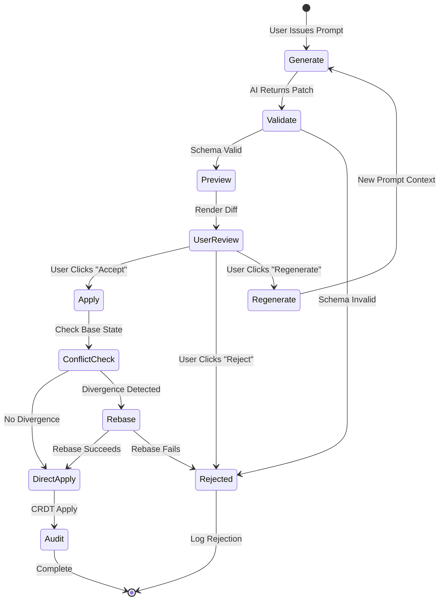

# AI Patch Protocol

**Version:** 2.0  
**Status:** Canonical Reference  
**Audience:** AI Integration Engineers, Security Reviewers  
**Last Updated:** December 2025

---

## Purpose

This document defines the protocol for AI-generated edits in MDReader. It specifies how AI agents propose changes, how changes are validated, and how they are applied to CRDT documents.

---

## Guiding Principles

### Principle 1: AI Never Mutates Silently

**Rule:** Every AI-generated change must be explicitly approved by a human user.

**Rationale:**
- User maintains full control over document content
- Prevents unintended or hallucinated modifications
- Enables learning (user sees what AI proposed)
- Legal/compliance requirement (human-in-the-loop)

**Enforcement:**
- All AI operations return patches (proposals), never apply directly
- Apply operation requires explicit user action (click "Accept" button)
- No auto-apply, no background sync, no silent commits

### Principle 2: Deterministic Replay

**Rule:** Patch application must be deterministic and reproducible.

**Rationale:**
- Audit trail integrity
- Debugging and rollback
- Compliance (explain why document changed)

**Enforcement:**
- Patches include base state vector (concurrency anchor)
- Patches include expected document hash (integrity check)
- Patches are immutable (stored as-is in audit log)

### Principle 3: Explicit Attribution

**Rule:** Every byte changed by AI must be traceable to a specific AI action.

**Rationale:**
- Blame/provenance for debugging
- Compliance (who/what changed document)
- Security (detect unauthorized AI actions)

**Enforcement:**
- CRDT updates record author_type = 'ai_agent'
- Audit log stores: prompt_hash, model, patch_id, user_who_approved
- Version snapshots include AI attribution metadata

### Principle 4: Fail-Safe Defaults

**Rule:** When in doubt, reject the patch.

**Rationale:**
- False positive (reject valid patch) is recoverable (user regenerates)
- False negative (accept invalid patch) may corrupt document or violate security

**Enforcement:**
- Schema validation is strict (no partial matches)
- Anchor resolution failures reject patch (no fuzzy fallback)
- Permission denied rejects patch (no downgrade to view-only)

---

## Patch Lifecycle



### Phase 1: Generate

**Input:**
- User prompt (string)
- Document ID (UUID)
- Current CRDT state vector (base for concurrency)
- Context (optional: multi-file references, selected text)

**Process:**
1. Server receives prompt
2. Rate limit check (50 prompts/hour per user)
3. Permission check (user has edit permission for document)
4. Load current CRDT state from database
5. Extract plain text + structure for LLM context
6. Send to AI model (e.g., Claude Sonnet 4.5) with instructions:
   ```
   You are an editor. Generate a JSON patch following this schema.
   Use node_id anchors only. Do not use line numbers.
   Return ONLY the JSON patch, no explanatory text.
   ```
7. Parse AI response (expect JSON)
8. Return patch to client

**Output:** Patch object (JSON)

**Failure Modes:**
- Rate limit exceeded → 429 Too Many Requests
- Permission denied → 403 Forbidden
- AI model timeout (> 30s) → 504 Gateway Timeout
- Invalid JSON from AI → 422 Unprocessable Entity (log as hallucination)

### Phase 2: Validate

**Input:** Patch object (JSON)

**Process:**
1. Schema validation (JSON Schema Draft-07)
2. Check required fields present
3. Check field types match schema
4. Check operation types are allowed
5. Check anchor types are supported
6. Check ranges are non-negative
7. Check base_state_vector is valid Yjs state vector

**Output:** `{valid: boolean, errors: string[]}`

**Rejection Criteria:**
- Missing required field → `errors: ["Missing field: patch_id"]`
- Wrong type → `errors: ["Expected string, got number for field: document_id"]`
- Unknown operation type → `errors: ["Unknown operation: 'magic_fix'"]`
- Invalid anchor → `errors: ["Anchor missing node_id"]`

### Phase 3: Preview

**Input:** Validated patch

**Process:**
1. Load current CRDT state
2. Resolve all anchors to ProseMirror positions
3. Dry-run: Apply operations to in-memory copy (do NOT persist)
4. Compute diff (before vs after)
5. Render diff in UI:
   - Deletions: red background, strikethrough
   - Insertions: green background
   - Replacements: red + green
6. Show metadata:
   - AI model used
   - Token cost
   - Confidence score (if available)
   - Warning if rebase required

**Output:** Rendered diff + metadata

**Failure Modes:**
- Anchor resolution fails → Show "Cannot apply (missing anchor)" + reject button
- Dry-run throws exception → Show "Patch invalid (error: ...)" + reject button

### Phase 4: User Review

**Input:** Preview UI

**User Actions:**
- **Accept:** Proceed to apply phase
- **Reject:** Discard patch, log rejection reason
- **Regenerate:** Send new prompt with feedback ("too aggressive", "wrong section", etc.)
- **Edit Patch:** Advanced users can manually modify JSON (re-validates)

**No Action = No Apply.** Patch expires after 5 minutes of inactivity.

### Phase 5: Apply

**Input:** User approval event

**Process:**
1. Re-validate patch (ensure schema still valid)
2. Re-check permissions (user still has edit access)
3. Load current CRDT state vector
4. Compare with patch.base_state_vector
5. **IF diverged:**
   - If patch.rebase_allowed = true → attempt rebase
   - If rebase fails OR rebase_allowed = false → reject with conflict error
6. **IF not diverged:**
   - Apply operations sequentially to CRDT
   - Generate Yjs updates
   - Persist updates to database (author_type = 'ai_agent', author_id = approved_by_user_id)
   - Broadcast updates to collaborators (WebSocket)
7. Audit log:
   - patch_id
   - prompt_hash (SHA-256 of prompt)
   - model_name
   - tokens_used
   - user_who_approved
   - applied_at (timestamp)
   - operations_count
   - bytes_changed

**Output:** `{status: 'applied' | 'rebased' | 'rejected_conflict'}`

**Failure Modes:**
- Conflict detected, no rebase → `rejected_conflict`
- Rebase failed → `rejected_conflict`
- CRDT apply throws exception → `error` (rollback, alert ops)

### Phase 6: Audit

**Input:** Applied patch

**Process:**
1. Write to `ai_audit_log` table (immutable, append-only)
2. Store full patch JSON (for replay)
3. Store user_id, document_id, timestamp
4. Increment user token quota usage
5. If quota > 80%, notify user
6. If quota >= 100%, disable AI features for user

**Output:** Audit record ID (UUID)

---

## Patch Schema v2

### JSON Schema

```json
{
  "$schema": "http://json-schema.org/draft-07/schema#",
  "type": "object",
  "required": [
    "patch_id",
    "document_id",
    "base_state_vector",
    "operations"
  ],
  "properties": {
    "patch_id": {
      "type": "string",
      "format": "uuid",
      "description": "Unique identifier for this patch (client-generated)"
    },
    "document_id": {
      "type": "string",
      "format": "uuid",
      "description": "Target document ID"
    },
    "base_state_vector": {
      "type": "object",
      "description": "Yjs state vector at time of patch generation (concurrency anchor)",
      "additionalProperties": {
        "type": "integer",
        "minimum": 0
      }
    },
    "expected_doc_hash": {
      "type": "string",
      "pattern": "^[a-f0-9]{64}$",
      "description": "SHA-256 of document plain text at base state (integrity check, optional)"
    },
    "rebase_allowed": {
      "type": "boolean",
      "default": false,
      "description": "If true, allow AI to rebase patch on conflict; if false, reject on conflict"
    },
    "operations": {
      "type": "array",
      "minItems": 1,
      "maxItems": 100,
      "description": "Ordered list of edit operations (applied sequentially)",
      "items": {
        "$ref": "#/definitions/operation"
      }
    },
    "metadata": {
      "type": "object",
      "description": "Optional metadata for auditing and display",
      "properties": {
        "model": {
          "type": "string",
          "description": "AI model used (e.g., 'claude-sonnet-4.5')"
        },
        "prompt_hash": {
          "type": "string",
          "pattern": "^[a-f0-9]{64}$",
          "description": "SHA-256 of user prompt (for deduplication)"
        },
        "rationale": {
          "type": "string",
          "maxLength": 500,
          "description": "AI's explanation for the change (shown in UI)"
        },
        "confidence": {
          "type": "number",
          "minimum": 0,
          "maximum": 1,
          "description": "AI's confidence in patch correctness (0.0-1.0)"
        }
      }
    }
  },
  "definitions": {
    "operation": {
      "type": "object",
      "required": ["type", "anchor"],
      "properties": {
        "type": {
          "type": "string",
          "enum": ["insert", "delete", "replace", "format"],
          "description": "Type of edit operation"
        },
        "anchor": {
          "$ref": "#/definitions/anchor",
          "description": "Position in document where operation applies"
        },
        "content": {
          "type": "string",
          "description": "New text content (for insert, replace)"
        },
        "length": {
          "type": "integer",
          "minimum": 1,
          "description": "Number of characters to delete (for delete, replace)"
        },
        "marks": {
          "type": "array",
          "description": "Formatting marks (for format operation)",
          "items": {
            "type": "object",
            "properties": {
              "type": {
                "type": "string",
                "enum": ["bold", "italic", "underline", "code", "link"]
              },
              "attrs": {
                "type": "object",
                "description": "Mark attributes (e.g., href for link)"
              }
            }
          }
        }
      }
    },
    "anchor": {
      "type": "object",
      "required": ["type"],
      "properties": {
        "type": {
          "type": "string",
          "enum": ["node_id", "node_path", "fuzzy"],
          "description": "Anchor strategy (node_id preferred)"
        },
        "node_id": {
          "type": "string",
          "format": "uuid",
          "description": "Stable node ID (for node_id anchor)"
        },
        "offset": {
          "type": "integer",
          "minimum": 0,
          "description": "Character offset within node"
        },
        "node_path": {
          "type": "array",
          "description": "Path from root to target node (for node_path anchor)",
          "items": {
            "type": "integer",
            "minimum": 0
          }
        },
        "before_text": {
          "type": "string",
          "maxLength": 50,
          "description": "Text before anchor (for fuzzy anchor, last resort)"
        },
        "after_text": {
          "type": "string",
          "maxLength": 50,
          "description": "Text after anchor (for fuzzy anchor)"
        }
      }
    }
  }
}
```

### Field Semantics

**patch_id:**
- Client-generated UUID
- Unique across all patches
- Used for deduplication (idempotent apply)
- Never reuse a patch_id

**document_id:**
- Target document UUID
- Must exist in database
- User must have edit permission

**base_state_vector:**
- Yjs state vector at time of patch generation
- Format: `{"client_id": clock, ...}` (e.g., `{"123456": 50, "789012": 30}`)
- Used for conflict detection
- If current state vector ≠ base state vector, document has diverged

**expected_doc_hash (optional):**
- SHA-256 of document plain text at base state
- Used for additional integrity check
- If provided and mismatch detected → reject patch

**rebase_allowed:**
- `false` (default): Reject patch if any divergence detected
- `true`: Allow AI to rebase patch if divergence is minor

**operations:**
- Ordered array (applied sequentially, not in parallel)
- Min 1, max 100 operations per patch (prevents abuse)
- Each operation is atomic (all-or-nothing)

---

## Base State Vector Semantics

### Purpose

The base state vector captures the CRDT state at the time the AI generated the patch. It serves as a **concurrency anchor** to detect if the document changed between patch generation and application.

### Divergence Detection

**Algorithm:**
```javascript
function hasDiverged(baseStateVector, currentStateVector) {
    // Check if any client has advanced beyond base state
    for (const [clientId, baseClock] of Object.entries(baseStateVector)) {
        const currentClock = currentStateVector[clientId] || 0
        if (currentClock > baseClock) {
            return true  // Document has new operations from this client
        }
    }
    
    // Check if new clients have joined
    for (const clientId of Object.keys(currentStateVector)) {
        if (!(clientId in baseStateVector)) {
            return true  // New client made edits
        }
    }
    
    return false  // No divergence
}
```

**Example:**
```javascript
// At patch generation:
baseStateVector = {
    "123456": 50,  // Alice's client
    "789012": 30   // Bob's client
}

// At patch application (5 seconds later):
currentStateVector = {
    "123456": 52,  // Alice made 2 more edits
    "789012": 30   // Bob idle
}

hasDiverged(baseStateVector, currentStateVector) // true
```

### Divergence Threshold

**Policy:** Any divergence is treated as conflict.

**Rationale:**
- AI-generated patches assume specific document structure
- Even minor changes (1 character) may invalidate patch anchors
- Conservative approach prevents corruption

**Exception:** If `rebase_allowed: true`, minor divergence may be tolerated (see Rebase Rules).

---

## Conflict Detection Rules

### Rule 1: State Vector Mismatch

**Condition:** `hasDiverged(base_state_vector, current_state_vector) == true`

**Action:**
- If `rebase_allowed == false` → Reject patch with status `rejected_conflict`
- If `rebase_allowed == true` → Attempt rebase (see Rebase Rules)

**User Message:** "Document has changed since this suggestion was generated. Regenerate the suggestion?"

### Rule 2: Expected Hash Mismatch

**Condition:** `sha256(current_plain_text) != expected_doc_hash`

**Action:** Reject patch with status `rejected_hash_mismatch`

**User Message:** "Document content has changed. Regenerate the suggestion?"

**Note:** This is a stricter check than state vector. Hash mismatch means content changed, even if state vector is identical (impossible in correct Yjs implementation, but guards against bugs).

### Rule 3: Anchor Resolution Failure

**Condition:** Cannot find node with `node_id` specified in anchor

**Action:** Reject patch with status `rejected_anchor_missing`

**User Message:** "Cannot apply suggestion (target location no longer exists). Regenerate?"

**Rationale:** If anchor node was deleted, patch is invalid. Fuzzy fallback is NOT used for AI patches (too risky).

### Rule 4: Permission Denied

**Condition:** User no longer has edit permission (permission revoked between preview and apply)

**Action:** Reject patch with status `rejected_permission_denied`

**User Message:** "You no longer have edit permission for this document."

### Rule 5: Schema Validation Failure

**Condition:** Patch JSON does not conform to schema (missing field, wrong type, etc.)

**Action:** Reject patch with status `rejected_schema_invalid`

**User Message:** "Patch is malformed. Regenerate?"

**Logging:** Log full patch JSON + validation errors for debugging (potential AI hallucination or bug)

---

## Rebase Rules and Limits

### When Rebase is Allowed

**Precondition:** `patch.rebase_allowed == true`

**Criteria for Attempting Rebase:**
1. Divergence is "minor" (heuristic: < 10% of document changed)
2. Diverged operations do not overlap with patch target ranges
3. Patch anchors still resolvable (nodes not deleted)

### Rebase Algorithm

```
INPUT: patch, base_state_vector, current_state_vector
OUTPUT: rebased_patch OR null (rebase failed)

PROCEDURE Rebase(patch):
    1. Load CRDT state at base_state_vector (reconstruct from snapshot + updates)
    2. Load CRDT state at current_state_vector
    3. Compute diff (operations applied between base and current)
    4. FOR EACH operation in patch:
        a. Resolve anchor in base state → pos_base
        b. Resolve same anchor in current state → pos_current
        c. IF pos_current is null:
            RETURN null (anchor deleted, rebase impossible)
        d. Compute position shift: delta = pos_current - pos_base
        e. Adjust operation position: op.position += delta
    5. Validate rebased patch (anchor resolution, ranges within bounds)
    6. RETURN rebased_patch
```

**Example:**
```
Base state: "Hello World"
Patch: Insert "Beautiful " at position 6 (before "World")

Between base and current:
- User inserted "Dear " at position 0

Current state: "Dear Hello World"

Rebase:
- Original anchor: position 6 (before "World")
- Current anchor: position 11 (before "World", shifted by +5)
- Rebased patch: Insert "Beautiful " at position 11

Result: "Dear Hello Beautiful World"
```

### Rebase Failure Conditions

**Fail if:**
1. Patch anchor node was deleted
2. Patch target range overlaps with diverged operations (ambiguous merge)
3. Divergence > 10% of document (too risky)
4. Rebased patch would exceed document size limit (100 MB)

**On Failure:**
- Return status `rejected_conflict`
- User must regenerate patch with current state

### Rebase Limits

**Limits (for safety):**
- Max rebase attempts per patch: 1 (no recursive rebase)
- Max divergence for rebase: 10% of document or 1,000 operations, whichever is smaller
- Timeout: 5 seconds (if rebase takes longer, abort)

**Rationale:** Rebase is a best-effort optimization. If it's complex or slow, safer to reject and regenerate.

---

## Allowed Operations

### Operation: Insert

**Purpose:** Insert new text at a specific position.

**Schema:**
```json
{
  "type": "insert",
  "anchor": {
    "type": "node_id",
    "node_id": "550e8400-e29b-41d4-a716-446655440000",
    "offset": 10
  },
  "content": "New text to insert"
}
```

**Semantics:**
- Insert `content` at position specified by `anchor`
- Position is before the character at offset (insertion point)
- If offset == node.text.length, append to end of node

**Validation:**
- `content` must be non-empty string
- `content` must not exceed 10,000 characters (per operation)
- Anchor must resolve to valid position

### Operation: Delete

**Purpose:** Delete a range of text.

**Schema:**
```json
{
  "type": "delete",
  "anchor": {
    "type": "node_id",
    "node_id": "550e8400-e29b-41d4-a716-446655440000",
    "offset": 5
  },
  "length": 10
}
```

**Semantics:**
- Delete `length` characters starting at `anchor` position
- If range exceeds node boundary, delete to end of node (partial delete is safe)

**Validation:**
- `length` must be positive integer
- Anchor must resolve to valid position
- If `anchor.offset + length > node.text.length`, truncate to node end (do NOT delete across nodes)

### Operation: Replace

**Purpose:** Delete a range and insert new text (atomic operation).

**Schema:**
```json
{
  "type": "replace",
  "anchor": {
    "type": "node_id",
    "node_id": "550e8400-e29b-41d4-a716-446655440000",
    "offset": 5
  },
  "length": 10,
  "content": "Replacement text"
}
```

**Semantics:**
- Delete `length` characters starting at `anchor`
- Insert `content` at same position
- Atomic (both delete and insert succeed or fail together)

**Validation:**
- All constraints from both `insert` and `delete` apply

### Operation: Format

**Purpose:** Apply formatting marks (bold, italic, etc.) to a range.

**Schema:**
```json
{
  "type": "format",
  "anchor": {
    "type": "node_id",
    "node_id": "550e8400-e29b-41d4-a716-446655440000",
    "offset": 5
  },
  "length": 10,
  "marks": [
    { "type": "bold" },
    { "type": "link", "attrs": { "href": "https://example.com" } }
  ]
}
```

**Semantics:**
- Apply all marks in `marks` array to range [anchor, anchor+length]
- Marks are additive (do not remove existing marks)
- To remove marks, use "unformat" operation (not yet implemented in v2.0)

**Validation:**
- `marks` array must be non-empty
- Each mark type must be in allowed list: `["bold", "italic", "underline", "code", "link"]`
- Link marks must include valid `href` (https:// or http://)

---

## Forbidden Operations

### Forbidden: Block-Level Operations

**Not Allowed:**
- Create new paragraph
- Delete entire heading
- Insert table
- Nest lists
- Reorder blocks

**Rationale:**
- Block operations are complex (affect document structure)
- High risk of corruption in collaborative editing
- Anchor resolution is unreliable for block boundaries

**Workaround:** AI can suggest block operations in natural language. User performs them manually.

### Forbidden: Multi-File Operations

**Not Allowed:**
- Patches spanning multiple documents
- Cross-document links (inline)

**Rationale:**
- Each document has independent CRDT state
- No atomic transaction across documents
- Complexity and failure modes too high

**Workaround:** Generate separate patch per document. User applies sequentially.

### Forbidden: Metadata Mutations

**Not Allowed:**
- Change document title
- Move document to different folder
- Change document tags
- Modify permissions

**Rationale:**
- Metadata is not CRDT-backed (uses optimistic locking)
- AI should not silently change organizational structure
- User must explicitly approve metadata changes via UI

**Workaround:** AI returns metadata change suggestions as structured JSON (separate from patch). User reviews and applies via metadata edit form.

### Forbidden: Binary Content

**Not Allowed:**
- Insert images (binary data in patch)
- Insert attachments
- Insert embedded media (video, audio)

**Rationale:**
- Patches are JSON (text-based)
- Large binary data would exceed size limits
- Upload/storage requires separate pipeline

**Workaround:** AI returns image URLs. User uploads images separately, AI inserts image node references (with URL).

### Forbidden: Destructive Operations Without Confirmation

**Not Allowed:**
- Delete > 50% of document (by character count)
- Delete all headings (makes document unnavigable)
- Delete all links (loses all references)

**Rationale:**
- Large-scale deletions may be hallucinations or misunderstandings
- User must explicitly confirm intent

**Enforcement:**
- Preview phase computes deletion ratio
- If > 50%, show warning dialog: "This will delete [X]% of the document. Proceed?"
- Require explicit confirmation (separate button click)

---

## Audit Logging Requirements

### Database Schema

```sql
CREATE TABLE ai_audit_log (
    id UUID PRIMARY KEY DEFAULT gen_random_uuid(),
    
    -- Patch metadata
    patch_id UUID NOT NULL,
    document_id UUID NOT NULL REFERENCES documents(id),
    user_id UUID NOT NULL REFERENCES users(id),  -- User who approved
    
    -- AI metadata
    model_name VARCHAR(100) NOT NULL,  -- e.g., 'claude-sonnet-4.5'
    prompt_hash CHAR(64) NOT NULL,     -- SHA-256 of user prompt
    tokens_used INTEGER NOT NULL,       -- Total tokens (input + output)
    
    -- Patch content
    patch_json JSONB NOT NULL,          -- Full patch (for replay)
    base_state_vector JSONB NOT NULL,   -- State vector at generation
    
    -- Outcome
    status VARCHAR(50) NOT NULL,        -- 'applied', 'rebased', 'rejected_conflict', etc.
    error_message TEXT,                 -- If rejected, reason
    
    -- Impact metrics
    operations_count INTEGER NOT NULL,
    characters_inserted INTEGER DEFAULT 0,
    characters_deleted INTEGER DEFAULT 0,
    
    -- Timestamps
    generated_at TIMESTAMP NOT NULL,    -- When AI generated patch
    applied_at TIMESTAMP,               -- When user applied (null if rejected)
    created_at TIMESTAMP NOT NULL DEFAULT NOW(),
    
    -- Indexes
    INDEX idx_ai_audit_document (document_id, created_at DESC),
    INDEX idx_ai_audit_user (user_id, created_at DESC),
    INDEX idx_ai_audit_status (status)
);
```

### Required Fields

**For Every Patch (Regardless of Outcome):**
- patch_id (deduplication)
- user_id (who initiated)
- document_id (what was edited)
- model_name (which AI)
- prompt_hash (what was asked, without storing sensitive data)
- tokens_used (cost tracking)
- patch_json (full patch for replay)
- status (applied, rejected, error)
- generated_at (when)

**For Applied Patches Only:**
- applied_at (when applied)
- characters_inserted (impact)
- characters_deleted (impact)

**For Rejected Patches:**
- error_message (why rejected: conflict, permission, etc.)

### Retention Policy

**Active Logs:** 90 days (queryable via API)

**Archived Logs:** 7 years (compliance requirement, write to cold storage)

**Deletion:** After 7 years, logs are permanently deleted (except if legal hold)

### Privacy Considerations

**Do NOT Log:**
- User prompts (may contain sensitive data)
- Document content (stored separately in documents table)
- API keys or tokens

**Do Log:**
- Prompt hash (for deduplication, no privacy leak)
- Patch JSON (operations only, no full document)
- User ID (for attribution, necessary for audit)

---

## Examples

### Example 1: Valid Patch (Insert Operation)

**Scenario:** User asks AI: "Add a conclusion paragraph"

**Patch Generated:**
```json
{
  "patch_id": "f47ac10b-58cc-4372-a567-0e02b2c3d479",
  "document_id": "7c9e6679-7425-40de-944b-e07fc1f90ae7",
  "base_state_vector": {
    "123456": 42,
    "789012": 15
  },
  "expected_doc_hash": "a3b5c7d9e1f2a3b4c5d6e7f8a9b0c1d2e3f4a5b6c7d8e9f0a1b2c3d4e5f6a7b8",
  "rebase_allowed": true,
  "operations": [
    {
      "type": "insert",
      "anchor": {
        "type": "node_id",
        "node_id": "550e8400-e29b-41d4-a716-446655440000",
        "offset": 250
      },
      "content": "\n\nIn conclusion, the findings demonstrate a clear correlation between the variables studied. Further research is warranted to explore the underlying mechanisms."
    }
  ],
  "metadata": {
    "model": "claude-sonnet-4.5",
    "prompt_hash": "b4e5f6a7c8d9e0f1a2b3c4d5e6f7a8b9c0d1e2f3a4b5c6d7e8f9a0b1c2d3e4f5",
    "rationale": "Added a conclusion paragraph summarizing the main findings.",
    "confidence": 0.92
  }
}
```

**Validation Result:** ✅ Valid

**Preview:** User sees green-highlighted conclusion paragraph at end of document.

**User Action:** Clicks "Accept"

**Apply Result:**
```json
{
  "status": "applied",
  "crdt_update_id": "e47ac10b-58cc-4372-a567-0e02b2c3d480",
  "characters_inserted": 156,
  "applied_at": "2025-12-15T10:30:45Z"
}
```

**Audit Log Entry:**
```sql
INSERT INTO ai_audit_log (
    patch_id, document_id, user_id, model_name, prompt_hash,
    tokens_used, patch_json, base_state_vector, status,
    operations_count, characters_inserted, generated_at, applied_at
) VALUES (
    'f47ac10b-58cc-4372-a567-0e02b2c3d479',
    '7c9e6679-7425-40de-944b-e07fc1f90ae7',
    'a1b2c3d4-e5f6-4a5b-8c7d-9e0f1a2b3c4d',
    'claude-sonnet-4.5',
    'b4e5f6a7c8d9e0f1a2b3c4d5e6f7a8b9c0d1e2f3a4b5c6d7e8f9a0b1c2d3e4f5',
    1250,
    '{"patch_id": "f47ac10b-...", ...}',
    '{"123456": 42, "789012": 15}',
    'applied',
    1,
    156,
    '2025-12-15T10:30:30Z',
    '2025-12-15T10:30:45Z'
);
```

---

### Example 2: Rejected Patch (Conflict)

**Scenario:** User asks AI: "Fix grammar in second paragraph". While AI is generating patch, another user edits the same paragraph.

**Patch Generated:**
```json
{
  "patch_id": "c4d5e6f7-a8b9-4c0d-9e1f-2a3b4c5d6e7f",
  "document_id": "7c9e6679-7425-40de-944b-e07fc1f90ae7",
  "base_state_vector": {
    "123456": 42,
    "789012": 15
  },
  "expected_doc_hash": "a3b5c7d9e1f2a3b4c5d6e7f8a9b0c1d2e3f4a5b6c7d8e9f0a1b2c3d4e5f6a7b8",
  "rebase_allowed": false,
  "operations": [
    {
      "type": "replace",
      "anchor": {
        "type": "node_id",
        "node_id": "a1b2c3d4-e5f6-4a5b-8c7d-9e0f1a2b3c4d",
        "offset": 0
      },
      "length": 120,
      "content": "The study examined the effects of variable X on outcome Y. Results showed a significant positive correlation (p < 0.05)."
    }
  ],
  "metadata": {
    "model": "claude-sonnet-4.5",
    "prompt_hash": "d5e6f7a8b9c0d1e2f3a4b5c6d7e8f9a0b1c2d3e4f5a6b7c8d9e0f1a2b3c4d5",
    "rationale": "Corrected grammar and improved clarity.",
    "confidence": 0.88
  }
}
```

**Validation Result:** ✅ Valid (schema correct)

**User Action:** Clicks "Accept"

**Apply Phase - Conflict Detection:**
```javascript
currentStateVector = {
    "123456": 45,  // Advanced from 42 → 45 (other user made edits)
    "789012": 15
}

hasDiverged(baseStateVector, currentStateVector) // true
patch.rebase_allowed // false

// Result: Reject patch
```

**Apply Result:**
```json
{
  "status": "rejected_conflict",
  "error_message": "Document has changed since this suggestion was generated. Please regenerate the suggestion.",
  "divergence_detected": {
    "client_id": "123456",
    "base_clock": 42,
    "current_clock": 45,
    "operations_missed": 3
  }
}
```

**User Message:** "Document has changed since this suggestion was generated. Regenerate the suggestion?"

**Audit Log Entry:**
```sql
INSERT INTO ai_audit_log (
    patch_id, document_id, user_id, model_name, prompt_hash,
    tokens_used, patch_json, base_state_vector, status,
    error_message, operations_count, generated_at
) VALUES (
    'c4d5e6f7-a8b9-4c0d-9e1f-2a3b4c5d6e7f',
    '7c9e6679-7425-40de-944b-e07fc1f90ae7',
    'a1b2c3d4-e5f6-4a5b-8c7d-9e0f1a2b3c4d',
    'claude-sonnet-4.5',
    'd5e6f7a8b9c0d1e2f3a4b5c6d7e8f9a0b1c2d3e4f5a6b7c8d9e0f1a2b3c4d5',
    980,
    '{"patch_id": "c4d5e6f7-...", ...}',
    '{"123456": 42, "789012": 15}',
    'rejected_conflict',
    'Document diverged: client 123456 advanced from clock 42 to 45',
    1,
    '2025-12-15T10:35:20Z'
);
```

**Next Action:** User clicks "Regenerate". New patch generated with updated base state vector.

---

### Example 3: Rejected Patch (Anchor Missing)

**Scenario:** User asks AI: "Expand the methodology section". Between generation and application, another user deletes the methodology heading.

**Patch Generated:**
```json
{
  "patch_id": "e6f7a8b9-c0d1-4e2f-9a3b-4c5d6e7f8a9b",
  "document_id": "7c9e6679-7425-40de-944b-e07fc1f90ae7",
  "base_state_vector": {
    "123456": 50,
    "789012": 20
  },
  "rebase_allowed": true,
  "operations": [
    {
      "type": "insert",
      "anchor": {
        "type": "node_id",
        "node_id": "b2c3d4e5-f6a7-4b8c-9d0e-1f2a3b4c5d6e",  // Methodology heading node
        "offset": 25
      },
      "content": " The sample size was calculated using power analysis to ensure 80% statistical power."
    }
  ],
  "metadata": {
    "model": "claude-sonnet-4.5",
    "rationale": "Added detail on sample size calculation methodology.",
    "confidence": 0.85
  }
}
```

**Validation Result:** ✅ Valid (schema correct)

**User Action:** Clicks "Accept"

**Apply Phase - Anchor Resolution:**
```javascript
nodeId = "b2c3d4e5-f6a7-4b8c-9d0e-1f2a3b4c5d6e"
node = ydoc.findNodeById(nodeId)  // Returns null (node was deleted)

// Result: Reject patch
```

**Apply Result:**
```json
{
  "status": "rejected_anchor_missing",
  "error_message": "Cannot apply suggestion: target location no longer exists.",
  "missing_anchor": {
    "node_id": "b2c3d4e5-f6a7-4b8c-9d0e-1f2a3b4c5d6e",
    "anchor_type": "node_id"
  }
}
```

**User Message:** "Cannot apply suggestion (target location no longer exists). Regenerate?"

**Audit Log Entry:**
```sql
INSERT INTO ai_audit_log (
    patch_id, document_id, user_id, model_name,
    tokens_used, patch_json, base_state_vector, status,
    error_message, operations_count, generated_at
) VALUES (
    'e6f7a8b9-c0d1-4e2f-9a3b-4c5d6e7f8a9b',
    '7c9e6679-7425-40de-944b-e07fc1f90ae7',
    'a1b2c3d4-e5f6-4a5b-8c7d-9e0f1a2b3c4d',
    'claude-sonnet-4.5',
    850,
    '{"patch_id": "e6f7a8b9-...", ...}',
    '{"123456": 50, "789012": 20}',
    'rejected_anchor_missing',
    'Anchor node not found: b2c3d4e5-f6a7-4b8c-9d0e-1f2a3b4c5d6e',
    1,
    '2025-12-15T10:40:15Z'
);
```

**Next Action:** User regenerates. AI uses current document state (without deleted heading) to generate new patch.

---

## Security Considerations

### Threat Model

**Threats:**
1. **Malicious AI Output:** AI generates patch that corrupts document or leaks data
2. **Prompt Injection:** User embeds commands in prompt to manipulate AI behavior
3. **Replay Attack:** Attacker replays old patch to overwrite recent edits
4. **Privilege Escalation:** User without edit permission tricks system into applying patch

**Mitigations:**

**1. Malicious AI Output:**
- Schema validation (reject malformed patches)
- Operation whitelist (only allow insert, delete, replace, format)
- Size limits (max 100 operations, max 10KB per operation)
- Anchor validation (reject invalid node IDs)
- Dry-run preview (user sees changes before commit)

**2. Prompt Injection:**
- Prompts are not logged (no sensitive data leak)
- AI is instructed to return ONLY JSON (no code execution)
- Schema validation rejects non-JSON responses
- Server-side prompt sanitization (remove control characters, limit length)

**3. Replay Attack:**
- Patch ID is unique (duplicate apply is idempotent, no effect)
- Base state vector prevents stale patch application
- Patches expire after 5 minutes of inactivity

**4. Privilege Escalation:**
- Permission check on every apply (not just generation)
- JWT token validated on every request
- User ID from token (not from patch JSON, untrusted)

### Data Privacy

**User Prompts:**
- NOT stored in database (privacy risk)
- Prompt hash stored (for deduplication, no data leak)
- Prompts sent to AI provider (requires user consent, enterprise tier has zero retention)

**Document Content:**
- Only relevant excerpt sent to AI (not full document)
- AI provider must have data processing agreement (DPA)
- User can opt-out of AI features (no data sent)

**Audit Logs:**
- User ID stored (required for attribution)
- Patch JSON stored (operations only, no full document)
- Logs retained 7 years (compliance requirement)
- Logs include only metadata (no sensitive content)

### Rate Limiting

**Per User:**
- 50 AI prompts per hour
- 100K tokens per month
- 10 concurrent patch previews (prevent UI spam)

**Per Document:**
- 100 AI edits per hour (prevent runaway automation)

**Global:**
- 10K AI requests per minute (prevent service overload)

**Enforcement:**
- Redis counters with sliding window
- 429 Too Many Requests on exceed
- User notified at 80% quota

---

## Implementation Checklist

**Backend (FastAPI):**
- [ ] `/api/v1/ai/generate-patch` endpoint (POST)
- [ ] `/api/v1/ai/apply-patch` endpoint (POST)
- [ ] Schema validation middleware
- [ ] Conflict detection logic
- [ ] Rebase algorithm
- [ ] Audit log writer
- [ ] Rate limiter (Redis)

**Frontend (React):**
- [ ] AI prompt input component
- [ ] Patch preview component (diff renderer)
- [ ] Accept/Reject/Regenerate buttons
- [ ] Conflict resolution dialog
- [ ] Token quota display
- [ ] Loading states (generation in progress)

**CRDT Integration:**
- [ ] Node ID assignment (ProseMirror plugin)
- [ ] Anchor resolution (node_id → ProseMirror position)
- [ ] Operation translator (patch operations → Yjs updates)
- [ ] State vector extraction

**Testing:**
- [ ] Schema validation tests (valid + invalid patches)
- [ ] Conflict detection tests (divergence scenarios)
- [ ] Rebase tests (simple + complex rebases)
- [ ] Anchor resolution tests (node_id, node_path, fuzzy)
- [ ] End-to-end tests (full lifecycle)

---

## Future Enhancements (Post-v2.0)

**v2.1:**
- Multi-file patches (atomic transactions across documents)
- Block-level operations (insert heading, delete paragraph)
- Unformat operation (remove marks)

**v2.2:**
- AI-driven code review (for code blocks in documents)
- Auto-rebase (AI regenerates patch on conflict without user prompt)
- Collaborative AI (multiple users + AI editing simultaneously)

**v3.0:**
- Real-time AI suggestions (as-you-type)
- AI agents (autonomous editing with user-defined rules)
- Provenance visualization (show AI vs human edits in timeline)

---

## References

**Related Documents:**
- `ARCHITECTURE.md` - System-level architecture
- `CRDT.md` - CRDT implementation details
- `docs/EDITOR_MASTERPIECE_V2_CONSOLIDATED.md` - Detailed implementation spec

**External Standards:**
- JSON Schema Draft-07: https://json-schema.org/draft-07/schema
- Yjs Documentation: https://docs.yjs.dev
- CRDT Papers: Shapiro et al. (2011)

---

**Document Version:** 2.0  
**Last Reviewed:** December 2025  
**Next Review:** March 2026 or after first AI patch applied in production  
**Owner:** AI Integration Team + Security Team

