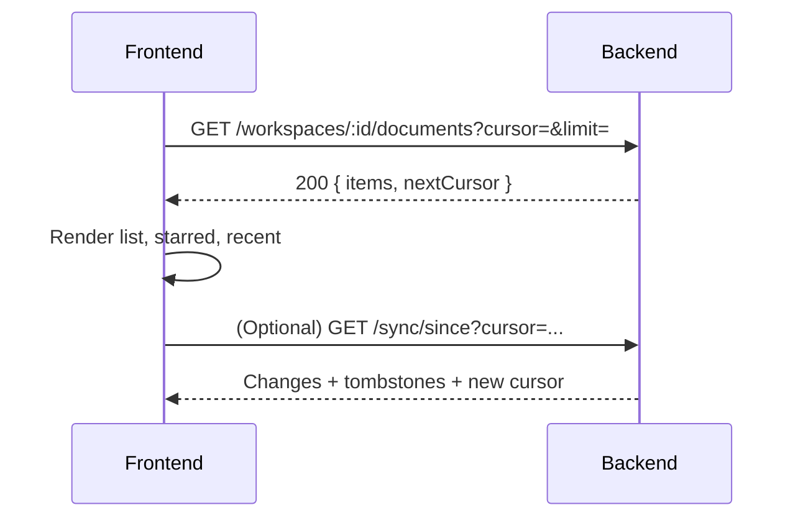
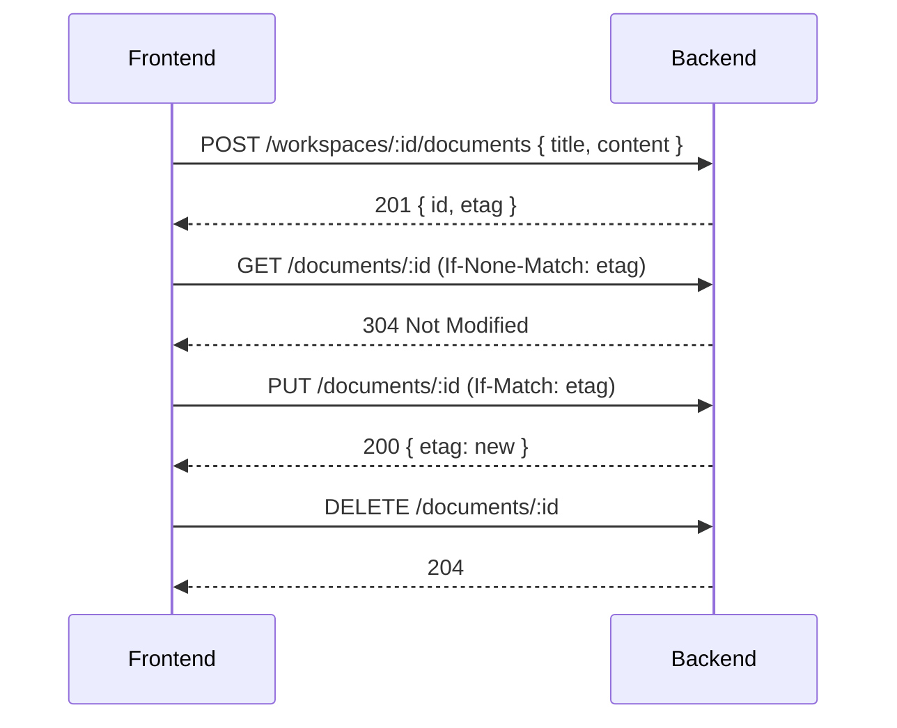
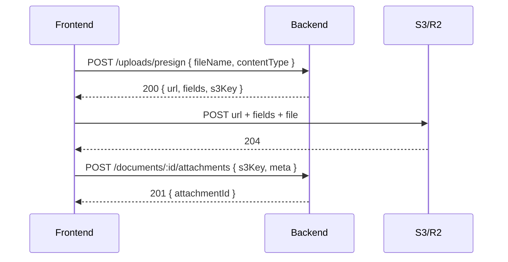
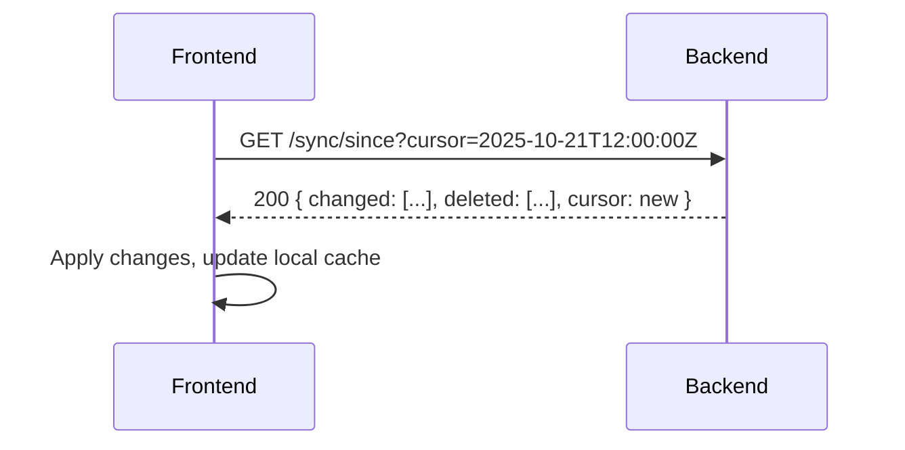

# 🔄 Backend & Frontend Flows (Mermaid)

This document visualizes key user journeys and the corresponding backend interactions. It covers login, navigation, document lifecycle, sharing/invites, attachments, sync, and future collaboration.

> Legend: FE = Frontend (Web/Tauri), BE = Backend (FastAPI), S3 = Object Storage

---

## 1) Login & Account Mode Selection

```mermaid
flowchart TD
  A[App Launch (FE)] --> B{Mode}
  B -- Guest --> C[Local Workspace]\n(localStorage or desktop folder)
  B -- Sign in --> D[Login Form]
  D -->|POST /auth/login| E[(BE: Auth JWT)]
  E --> F[Store tokens]\n(secure storage)
  F --> G[Fetch Workspaces]\nGET /workspaces
  G --> H[Workspace Home]
```

Notes:
- Desktop and Web both support Guest. Sign‑in is optional to unlock cloud features.

---

## 2) Navigation & Document List



---

## 3) Document Lifecycle (Create/Edit/Delete with ETag)



Conflict path:
- If `If-Match` fails → 412; FE shows merge UI with local vs server content.

---

## 4) Sharing & Invites (Workspace Members)

```mermaid
flowchart LR
  A[Owner FE] -->|POST /workspaces/:id/invite {email, role}| B[(BE)]
  B --> C[Email invite link]\n(JWT or code)
  C --> D[Invitee FE clicks link]
  D -->|Accept| E[POST /workspaces/:id/accept]
  E --> F[Member added]\n(role: member)
```

Notes:
- v1 can use simple invite code; v2 adds email delivery.

---

## 5) Attachments (Presigned Uploads)



---

## 6) Sync (Incremental, Cursor-Based)



---

## 7) Future: Collaboration (Roadmap)

```mermaid
flowchart TD
  A[FE Editor] -->|WebSocket| B[(BE Realtime)]
  B --> C[CRDT (Yjs) Doc]
  C -->|Broadcast| D[Other Clients]
  B --> E[Presence]\n(live cursors)
  B --> F[Comments/Threads]
```

---

## Screen Map (High-Level UX)

- Splash/Entry
  - Guest vs Sign‑in choice
- Workspace Home
  - Sidebar: Workspaces, Recent, Starred
  - Main: Document list, New Doc, Import/Export
- Editor
  - Top bar: AI, Diagram, Export, Mode toggle
  - Sidebar: Outline, Context Files (upload/search)
- Sharing/Invites
  - Invite modal: email + role
- Settings
  - Account, AI keys (BYO vs Managed), Sync status

---

## Desktop vs Web Differences
- Desktop: Folder selector, local files, optional watcher; Guest default
- Web: localStorage (with warning), or sign‑in to enable sync/attachments
- Both: Same React app, platform-aware behaviors

---

## Open Questions (to finalize behavior)
- Invite delivery: email service now vs code-only v1?
- BYO AI per workspace or per user? Priority order when both exist?
- Attachment quota and cleanup policy?
- Conflict resolution UI details (merge, diff, pick side)?
