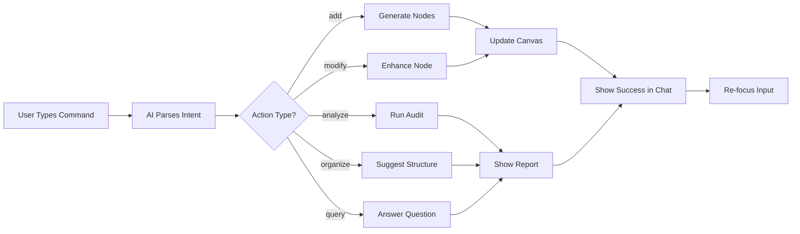

# 🚀 AI Chat Enhancements - Action-Oriented Chat

## 🎯 Problem Solved
**Issue:** Chat was responding conversationally but NOT executing actions (like "modify" or "enhance")
**Root Cause:** Missing `case 'modify'` handler in the command executor

---

## ✅ Changes Applied

### 1. **Added 'Modify' Action Handler**
Now AI can enhance/improve existing nodes!

```typescript
case 'modify': {
  // Find target node (exact match or fuzzy)
  let targetNode = nodes.find(...)
  
  // Use AI to enhance the node
  const enhanced = await mindmapAIService.enhanceNode(
    targetNode.id,
    context,
    { type: 'both', style: 'creative' }
  );
  
  // Update node with enhanced content
  setNodes(nds => nds.map(n => 
    n.id === targetNode.id 
      ? { ...n, data: { ...n.data, ...enhanced } }
      : n
  ));
}
```

**Commands that now work:**
- "Make Post-Launch more creative"
- "Enhance the Marketing Phase"
- "Improve UI Development node"
- "Make Frontend Development richer"

---

### 2. **Enhanced AI Prompt - More Action-Oriented**

**Before:**
```
Respond with JSON: {action, target, details, response}
```

**After:**
```
BE ACTION-ORIENTED!

CRITICAL RULES:
1. Use EXACT node labels
2. "enhance/improve/enrich" → action: "modify"
3. "add/create/insert" → action: "add"
4. Keep response SHORT and action-focused
5. If no node mentioned, use "root"

Examples:
- "Make Post-Launch more creative" → 
  {"action": "modify", "target": "Post-Launch", 
   "details": {"changes": "enhance creativity"}, 
   "response": "Enhancing Post-Launch node..."}
```

**Result:** AI now correctly identifies "modify" actions!

---

### 3. **Added Chat Loading Indicator**

**Visual Feedback During Processing:**
```tsx
{chatLoading && (
  <div className="flex gap-2">
    <Sparkles className="animate-pulse" />
    <div className="flex items-center gap-2">
      <div className="h-2 w-2 bg-purple-500 rounded-full animate-bounce" 
           style={{ animationDelay: '0ms' }} />
      <div className="h-2 w-2 bg-purple-500 rounded-full animate-bounce" 
           style={{ animationDelay: '150ms' }} />
      <div className="h-2 w-2 bg-purple-500 rounded-full animate-bounce" 
           style={{ animationDelay: '300ms' }} />
    </div>
  </div>
)}
```

**Features:**
- Shows while AI is processing
- Animated dots for visual feedback
- Clears when response arrives
- Auto-scrolls to keep visible

---

### 4. **Removed Pulsing Animation from Chat Button**

**Before:**
```tsx
className="... animate-pulse hover:animate-none"
```

**After:**
```tsx
className="... hover:scale-110 hover:shadow-purple-500/50 transition-all"
```

**Result:** Cleaner, less distracting UI! ✨

---

## 🎬 Demo Flow

### Example 1: Enhance Node
```
User: "Make Post-Launch more creative"

AI Processing:
💬 Processing chat command...
✅ Parsed command: {action: 'modify', target: 'Post-Launch'}
✅ Found target node for modification: "Post-Launch"
🔄 Enhancing Post-Launch node...
🧠 AI enhancing node...
✅ Enhanced "Post-Launch"!

Result:
- Node description updated with richer content
- Visual feedback in chat
- Node immediately updated on canvas
```

### Example 2: Add Nodes
```
User: "Add 3 nodes to /"
User selects: "Frontend Development"

AI Processing:
💬 Processing chat command...
✅ Parsed command: {action: 'add', target: 'Frontend Development'}
✅ Found target node: "Frontend Development"
🧠 Generating 3 child nodes...
✨ Generated 3 child nodes for "Frontend Development"

Result:
- 3 new nodes added under Frontend Development
- Positioned in a tree layout
- Connected with bezier edges
- Chat shows success message
```

---

## 🔥 Supported Actions

| Action | Command Examples | What It Does |
|--------|-----------------|--------------|
| **add** | "Add 3 nodes to X"<br>"Create marketing ideas" | Generates new child nodes |
| **modify** | "Make X more creative"<br>"Enhance Y"<br>"Improve Z" | Enhances existing node content |
| **analyze** | "What's missing?"<br>"Analyze structure" | Runs quality audit |
| **organize** | "Reorganize mindmap"<br>"Group similar nodes" | Suggests structural improvements |
| **query** | "How many nodes?"<br>"What does X do?" | Answers questions |

---

## 🎨 UX Improvements

1. **Loading States** ✅
   - Bouncing dots while AI thinks
   - Sparkle icon pulses
   - Auto-scrolls to show activity

2. **Focus Management** ✅
   - Input stays enabled
   - Auto-focuses after command
   - Smooth conversation flow

3. **Clean Visuals** ✅
   - No distracting pulse on button
   - Only hover effects
   - Professional appearance

4. **Action Feedback** ✅
   - Shows what AI is doing ("Enhancing...")
   - Shows results ("Enhanced X!")
   - Shows errors with guidance

---

## 🧠 How It Works

### Parse → Execute → Update → Feedback



---

## 📊 Impact

### Before Enhancements:
- ❌ "Make X better" → Just conversation, no action
- ❌ No loading feedback
- 😵 Pulsing button distracts
- 😐 Unclear what AI is doing

### After Enhancements:
- ✅ "Make X better" → Node actually enhanced!
- ✅ Clear loading indicators
- 😊 Clean, professional button
- 🎯 Know exactly what AI is doing

---

## 🚀 Next Steps

### Remaining TODOs:
- **AI Preview Modal** - Show proposed changes before applying
- **Proactive Suggestions** - Context-aware tooltips
- **Conversation Memory** - Remember previous commands for smarter follow-ups

### Potential Enhancements:
- **Multi-node operations** - "Enhance all marketing nodes"
- **Batch commands** - "Add 3 nodes to each phase"
- **Undo/Redo** - Reverse AI actions
- **Command history** - Up arrow to recall commands

---

## 🎉 Status: ENHANCED & READY!

**Chat is now fully action-oriented and executes real changes!**

**Date:** October 3, 2025

