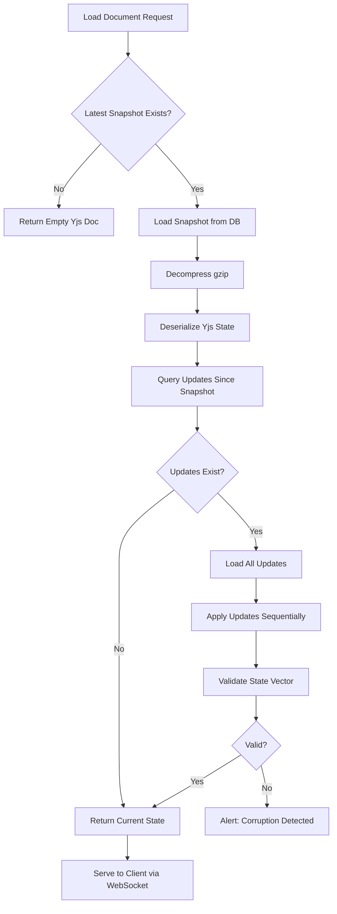
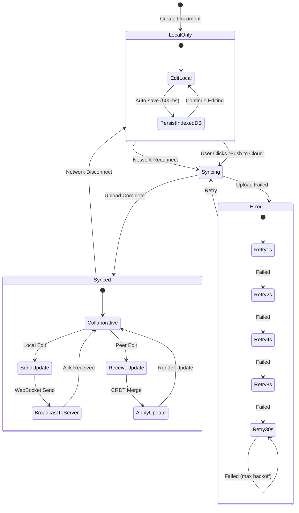
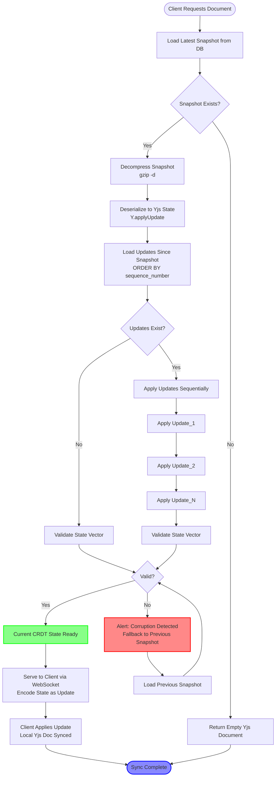

# CRDT Implementation

**Audience:** Distributed Systems Engineers, Correctness Reviewers  
**Scope:** CRDT properties, guarantees, and limitations in MDReader  
**Last Updated:** December 2025

---

## Purpose

This document defines the Conflict-Free Replicated Data Type (CRDT) implementation used for document synchronization in MDReader. It specifies what correctness properties hold and which do not.

---

## Why CRDT

MDReader uses CRDTs to solve the fundamental problem of distributed collaborative editing:

**Problem Statement:**
```
Alice and Bob both edit document D while offline.
Alice: Inserts "Hello" at position 0
Bob: Inserts "World" at position 0

When they reconnect:
- What is the final state?
- Is it deterministic?
- Do both see the same result?
```

**Without CRDT:**
- Last-write-wins (LWW): One edit is lost
- Operational Transformation (OT): Requires central server, complex transformation functions
- Manual merge: Requires user intervention (git-style conflict resolution)

**With CRDT:**
- Both operations preserved
- Deterministic merge (always produces same result)
- No central coordination required
- No user intervention required

**Formal Guarantee:**

For any two replicas R1 and R2, if they receive the same set of operations O (regardless of order), they will converge to identical state S.

```
R1 receives {Op_A, Op_B, Op_C} → State S
R2 receives {Op_C, Op_A, Op_B} → State S  (same S)
```

This property is called **Strong Eventual Consistency (SEC)**.

---

## Why Yjs Specifically

MDReader uses Yjs, a state-based CRDT with operation-based synchronization.

### Evaluation Criteria

| Property | Yjs | Automerge | Diamond Types | LSEQ |
|----------|-----|-----------|---------------|------|
| **Structured documents** | ✅ XmlFragment | ✅ | ❌ (text-only) | ❌ (text-only) |
| **Tombstone GC** | ✅ | ❌ | ✅ | ❌ |
| **Binary format** | ✅ (compact) | ✅ (Columnar) | ✅ | ❌ |
| **Snapshot + delta** | ✅ | ✅ | ❌ | ❌ |
| **Production adoption** | ✅ (Notion, Figma) | ⚠️ (smaller) | ❌ (research) | ❌ (research) |
| **TypeScript native** | ✅ | ✅ | ❌ (Rust) | ❌ (research) |
| **ProseMirror binding** | ✅ (y-prosemirror) | ⚠️ (community) | ❌ | ❌ |
| **File size (100KB doc)** | ~50KB | ~80KB | N/A | N/A |
| **Merge performance** | O(n) | O(n log n) | O(n) | O(n) |

### Decision

Yjs selected for:

1. **Structured document support:** XmlFragment maps directly to ProseMirror/TipTap document model
2. **Garbage collection:** Tombstones can be removed (Automerge cannot, grows unbounded)
3. **Binary efficiency:** Compact encoding reduces network and storage cost
4. **Ecosystem:** Mature bindings for editor frameworks
5. **Battle-tested:** Used in production by large-scale collaborative editors

**Trade-offs Accepted:**
- Yjs history cannot be cryptographically signed (Automerge can)
- Yjs requires state vector for sync (Automerge has causal history)
- Yjs interleaving semantics are non-intuitive for simultaneous edits (acceptable for our use case)

---

## CRDT Guarantees (What Applies)

### Guarantee 1: Eventual Consistency

**Definition:** If all replicas receive all operations and no new operations occur, all replicas converge to identical state.

**Applies to:**
- Document content (text, formatting, structure)
- Block-level operations (insert paragraph, delete heading)
- Formatting marks (bold, italic, links)

**Condition:** All replicas must receive all operations. Network partitions delay convergence but do not violate it.

**Proof:** Yjs implements a state-based CRDT with join-semilattice properties. The merge operation is commutative, associative, and idempotent.

### Guarantee 2: Commutativity

**Definition:** Order of operation application does not affect final state.

**Applies to:**
- Text insertion at different positions
- Independent formatting changes
- Concurrent deletions of different ranges

**Example:**
```
Initial: "Hello"

Op_A: Insert "X" at position 0 → "XHello"
Op_B: Insert "Y" at position 5 → "HelloY"

Replica 1: Apply A then B → "XHelloY"
Replica 2: Apply B then A → "XHelloY"  (same result)
```

### Guarantee 3: Associativity

**Definition:** Grouping of operations does not affect final state.

**Applies to:**
- Batch operations
- Offline queue playback
- Incremental sync

**Example:**
```
(Op_A ∪ Op_B) ∪ Op_C = Op_A ∪ (Op_B ∪ Op_C)
```

### Guarantee 4: Idempotence

**Definition:** Applying the same operation multiple times produces the same result as applying it once.

**Applies to:**
- Duplicate WebSocket messages (network retry)
- Redundant sync operations

**Example:**
```
State_0 + Op_A = State_1
State_1 + Op_A = State_1  (no change on second application)
```

**Implementation:** Yjs uses Lamport timestamps and operation IDs. Each operation is uniquely identified. Re-applying the same operation ID is a no-op.

### Guarantee 5: Causal Consistency

**Definition:** If operation A causally precedes operation B (A → B), all replicas apply A before B.

**Applies to:**
- Sequential edits by same user
- Operations generated after observing previous operations

**Example:**
```
Alice types "H" → sees "H" → types "i"
The "i" operation causally depends on "H" operation.
All replicas will apply "H" before "i".
```

**Implementation:** Yjs state vectors encode causal history. Operations include vector clock of dependencies.

---

## CRDT Guarantees (What Does NOT Apply)

### Non-Guarantee 1: Intention Preservation

**Definition:** The semantic intent of an operation is NOT preserved across concurrent edits.

**Does NOT apply to:**
- Relative positioning (e.g., "insert at end of paragraph" may resolve differently if paragraph is concurrently deleted)
- Semantic anchors (e.g., "replace all instances of X" - some instances may be concurrently modified)

**Example:**
```
Initial: "Hello World"

Alice: Delete "World" (intent: remove last word)
Bob: Insert "Beautiful " before "World" (intent: add adjective)

Result: "Hello Beautiful " (Bob's adjective is orphaned, Alice's intent violated)
```

**Yjs Behavior:** Operations resolve at character positions based on Yjs ordering. Intent is not modeled.

### Non-Guarantee 2: Interleaving Behavior

**Definition:** Concurrent insertions at the same position produce non-deterministic interleaving.

**Does NOT apply to:**
- Simultaneous typing at same cursor position by multiple users

**Example:**
```
Initial: "Hello"

Alice: Insert "X" at position 5 (end)
Bob: Insert "Y" at position 5 (end)

Result: "HelloXY" OR "HelloYX" (depends on Yjs client IDs, not arrival order)
```

**Yjs Behavior:** Client ID breaks ties. Lower client ID sorts first. This is deterministic but arbitrary (not based on wall-clock time).

### Non-Guarantee 3: Metadata Convergence

**CRDT applies to document content ONLY.**

**Does NOT apply to:**
- Document title (string, not CRDT)
- Folder assignment (reference, not CRDT)
- Tags (array, not CRDT)
- Permissions (access control list, not CRDT)
- View count (counter, but not implemented as CRDT)

**Resolution:** Metadata conflicts use **optimistic locking** (version number). Last write wins after server arbitration.

### Non-Guarantee 4: Real-Time Ordering

**Definition:** Operations are NOT guaranteed to appear in the order they were issued by users.

**Does NOT apply to:**
- Display of "who is typing" indicators
- Undo/redo across users (each user's undo stack is local)

**Example:**
```
Alice types "A" at t=100ms
Bob types "B" at t=50ms (but due to network delay, arrives at t=200ms)

Result: "BA" (Bob's earlier timestamp does not guarantee earlier position)
```

**Yjs Behavior:** Yjs uses logical clocks (state vectors), not wall-clock time. Ordering is based on causal dependencies, not timestamps.

### Non-Guarantee 5: Snapshot Consistency

**Definition:** Snapshots are NOT guaranteed to represent a causally consistent cut.

**Does NOT apply to:**
- Version history snapshots (may capture partial states during concurrent edits)

**Explanation:** Snapshots are materialized from server-side CRDT state at time T. If Alice and Bob are editing concurrently, snapshot may include Alice's Op_1 and Bob's Op_3, but not Alice's Op_2 (which was in-flight).

**Mitigation:** Snapshots are labeled with state vector, allowing reconstruction of causal dependencies.

---

## Browser Boundary Definition

### What Executes in Browser

**CRDT Engine:**
- Yjs document state (in-memory JavaScript object)
- Operation generation (text edits → Yjs operations)
- Operation application (Yjs operations → state update)
- State vector computation (causality tracking)
- Delta encoding (incremental sync payload)

**Persistence:**
- IndexedDB provider (y-indexeddb): Persists Yjs state locally
- Automatic on every change (debounced: 500ms)

**Synchronization:**
- WebSocket provider (y-websocket): Sends/receives updates
- Awareness protocol (cursor positions, user presence)

### What Does NOT Execute in Browser

**Compaction:**
- Snapshot generation (server-side background job)
- Update log garbage collection (server-side)
- Tombstone removal (server-side)

**Conflict Resolution:**
- CRDT merge is automatic (no resolution needed)
- Metadata conflicts resolved server-side (optimistic locking)

**Validation:**
- Permission checks (server enforces)
- Rate limiting (server enforces)
- Schema validation (server enforces, client assumes valid)

### Browser Trust Model

**Browser is NOT trusted for:**
- Correctness of operations (server validates)
- Timestamp accuracy (server uses server-side time)
- User identity (server validates JWT)

**Browser IS trusted for:**
- CRDT operation generation (assumed correctly implemented)
- Local state consistency (IndexedDB assumed durable)
- Network retry logic (exponential backoff)

**Implication:** Server must re-apply CRDT operations even if client claims they were already merged. Idempotence guarantees this is safe.

---

## Persistence Model: Snapshot + Updates

### Logical Model

CRDT state is persisted in two forms:

1. **Snapshot:** Full CRDT state at time T (compressed binary)
2. **Updates:** Incremental operations since snapshot (ordered sequence)

**Reconstruction Formula:**

```
Current_State(T+N) = Snapshot(T) + Update(T+1) + Update(T+2) + ... + Update(T+N)
```

### Database Schema

```sql
-- Full CRDT state snapshots
CREATE TABLE document_crdt_snapshots (
    id UUID PRIMARY KEY,
    document_id UUID NOT NULL REFERENCES documents(id),
    snapshot_version INTEGER NOT NULL,
    yjs_state BYTEA NOT NULL,              -- gzip-compressed Yjs state
    state_vector BYTEA NOT NULL,           -- Yjs state vector (causality)
    uncompressed_size INTEGER NOT NULL,
    compressed_size INTEGER NOT NULL,
    created_at TIMESTAMP NOT NULL DEFAULT NOW(),
    UNIQUE(document_id, snapshot_version)
);

-- Incremental CRDT operations since last snapshot
CREATE TABLE document_crdt_updates (
    id UUID PRIMARY KEY,
    document_id UUID NOT NULL REFERENCES documents(id),
    sequence_number BIGSERIAL,             -- Monotonic ordering
    yjs_update BYTEA NOT NULL,             -- Single Yjs update
    author_id UUID NOT NULL REFERENCES users(id),
    client_id BIGINT NOT NULL,             -- Yjs client ID
    clock INTEGER NOT NULL,                -- Yjs logical clock
    created_at TIMESTAMP NOT NULL DEFAULT NOW(),
    INDEX(document_id, sequence_number)
);
```

### Storage Efficiency

**Example: 10,000-word document**

| Representation | Size |
|----------------|------|
| Plain text | 50 KB |
| HTML | 80 KB |
| Yjs state (uncompressed) | 120 KB |
| Yjs state (gzip -6) | 40 KB |
| Yjs update (single edit) | 50-200 bytes |

**Implication:** After 500 edits, incremental updates = ~50KB. Snapshot = 40KB. Compaction reduces storage by 20%.

### Reconstruction Flow



### Immutability Guarantees

**Snapshots:**
- Once written, never modified
- Snapshot version is immutable
- Old snapshots remain until garbage collected (retention: 100 snapshots)

**Updates:**
- Once written, never modified
- Deleted only during compaction (after materializing new snapshot)
- Updates are never reordered (sequence_number is authoritative)

**Audit Trail:**
- `document_crdt_updates.author_id` is append-only
- Provides operational blame (who issued this update)
- Retained even after compaction (can be moved to archive table)

---

## Compaction Strategy

### Why Compaction is Required

**Problem:** Unbounded growth of `document_crdt_updates` table.

**Example:**
```
Day 1: 100 edits → 100 update rows (10 KB)
Day 30: 3,000 edits → 3,000 update rows (300 KB)
Day 365: 100,000 edits → 100,000 update rows (10 MB)
```

**Impact:**
- Slow document load (must apply 100,000 updates)
- High storage cost
- Increased backup size

**Solution:** Periodically materialize current state as new snapshot, delete redundant updates.

### Compaction Trigger Conditions

Compaction initiates when **ANY** condition is met:

| Trigger | Threshold | Rationale |
|---------|-----------|-----------|
| **Update count** | 500 updates | Prevents slow reconstruction |
| **Update size** | 5 MB | Prevents storage bloat |
| **Time elapsed** | 24 hours | Ensures regular snapshots even for idle docs |
| **Manual request** | On-demand | Admin override for problem docs |

### Compaction Algorithm

```
INPUT: document_id
OUTPUT: New snapshot, deleted updates

PROCEDURE Compact(document_id):
    1. Acquire distributed lock (Redis: "compact:{document_id}", TTL=60s)
       IF lock acquisition fails (timeout 5s):
           RETURN error "Compaction already in progress"
    
    2. Load latest snapshot (S_old) and all updates since snapshot
       snapshot := SELECT * FROM document_crdt_snapshots 
                   WHERE document_id = ? 
                   ORDER BY snapshot_version DESC LIMIT 1
       updates := SELECT * FROM document_crdt_updates
                  WHERE document_id = ? 
                  AND sequence_number > snapshot.last_sequence_number
                  ORDER BY sequence_number ASC
    
    3. Reconstruct current CRDT state
       ydoc := Y.Doc()
       ydoc.applySnapshot(snapshot.yjs_state)
       FOR EACH update IN updates:
           ydoc.applyUpdate(update.yjs_update)
    
    4. Materialize new snapshot
       state := Y.encodeStateAsUpdate(ydoc)
       state_vector := Y.encodeStateVector(ydoc)
       compressed := gzip(state, level=6)
    
    5. Persist new snapshot (S_new)
       INSERT INTO document_crdt_snapshots (
           document_id, 
           snapshot_version = snapshot.snapshot_version + 1,
           yjs_state = compressed,
           state_vector = state_vector,
           uncompressed_size = len(state),
           compressed_size = len(compressed)
       )
    
    6. Garbage collect updates
       DELETE FROM document_crdt_updates
       WHERE document_id = ?
       AND sequence_number <= MAX(updates.sequence_number)
    
    7. Update metadata
       UPDATE documents SET 
           last_compaction_at = NOW(),
           compaction_count = compaction_count + 1
       WHERE id = document_id
    
    8. Release lock
       REDIS DEL "compact:{document_id}"
    
    9. RETURN success
```

### Concurrent Edit Handling

**Question:** What happens if a user is editing while compaction runs?

**Answer:** Compaction is non-blocking for clients.

**Timeline:**
```
t=0: Compaction starts, acquires lock
t=1: Client sends Update_500 (new edit)
t=2: Server receives Update_500, persists to document_crdt_updates
t=3: Compaction completes, creates Snapshot_v6 from Updates 1-499
t=4: Updates 1-499 are deleted
t=5: Update_500 remains (it's after the snapshot)
```

**Key Property:** Lock prevents concurrent compactions, NOT concurrent edits. Edits continue to append to `document_crdt_updates` table.

**Correctness:** New updates (500+) are preserved. Snapshot captures state at time T. Updates after T remain in the table.

### Failure Scenarios

**Scenario 1: Compaction interrupted mid-process**

- Snapshot partially written (transaction aborted)
- Old snapshot remains valid
- Updates NOT deleted (transaction rolled back)
- Next compaction cycle will retry

**Scenario 2: Lock timeout during compaction**

- Redis lock expires after 60 seconds
- Compaction process continues (may take up to 5 minutes for large docs)
- Another compaction job may start (detects in-progress snapshot write, aborts)
- No data corruption (snapshot writes are atomic transactions)

**Scenario 3: State vector mismatch after compaction**

- Snapshot state vector differs from expected (indicates bug or corruption)
- Compaction aborts without deleting updates
- Alert sent to ops team
- Manual investigation required

### Performance Targets

| Metric | Target | P95 | P99 |
|--------|--------|-----|-----|
| Compaction time | < 3s | 5s | 10s |
| Lock hold time | < 5s | 8s | 15s |
| Document load time after compaction | < 200ms | 500ms | 1s |
| Storage reduction | 30-50% | - | - |

---

## Convergence Guarantees

### Theorem

**Strong Eventual Consistency (SEC):**

For any two replicas R1 and R2, if:
1. Both replicas are correct (no Byzantine faults)
2. Both replicas eventually receive all updates
3. No new updates are generated

Then: `State(R1) = State(R2)` (bitwise identical)

### Proof Sketch

Yjs implements a **state-based CRDT** with the following properties:

1. **Join-Semilattice:** The merge operation forms a join-semilattice (⊔)
   - Commutative: `A ⊔ B = B ⊔ A`
   - Associative: `(A ⊔ B) ⊔ C = A ⊔ (B ⊔ C)`
   - Idempotent: `A ⊔ A = A`

2. **Monotonicity:** State vectors only increase (never decrease)
   - `StateVector(T+1) ≥ StateVector(T)` for all T

3. **Causal Delivery:** Operations respect causal dependencies
   - If `Op_A → Op_B` (A causally precedes B), then `Apply(A)` before `Apply(B)`

4. **Total Order on Concurrent Ops:** Yjs imposes arbitrary total order using (client_id, clock)
   - Concurrent operations are deterministically ordered
   - All replicas apply same ordering

**Conclusion:** Given same set of operations, all replicas converge to identical state. ∎

### Convergence Time

**Definition:** Time elapsed from last operation to all replicas reaching identical state.

**Bounds:**
- **Best case:** Network RTT + operation application time (~200ms)
- **Typical case:** < 1 second (including retries)
- **Worst case:** Unbounded (if network partition persists)

**Factors:**
- Network latency (RTT)
- WebSocket message queue depth
- Number of concurrent replicas
- Operation batch size

**Guarantee:** Convergence time is finite IF network eventually heals.

### Divergence Scenarios (Temporary)

**Scenario 1: Network Partition**

```
Alice and Bob both offline.
Alice: 10 edits (state vector: {Alice: 10, Bob: 0})
Bob: 5 edits (state vector: {Alice: 0, Bob: 5})

States DIVERGE while partitioned.

Alice reconnects → sends 10 updates → Bob applies → converges
Bob reconnects → sends 5 updates → Alice applies → converges
```

**Outcome:** Temporary divergence, eventual convergence.

**Scenario 2: Out-of-Order Delivery**

```
Server broadcasts: Op_A, Op_B, Op_C
Alice receives: Op_A, Op_C (Op_B delayed)
Bob receives: Op_A, Op_B, Op_C

States DIVERGE temporarily.

Alice receives Op_B (delayed) → applies → converges
```

**Outcome:** Temporary divergence, eventual convergence.

**Scenario 3: Duplicate Delivery**

```
Network retry causes duplicate WebSocket message.
Alice receives: Op_A, Op_A (duplicate)
Bob receives: Op_A

States remain IDENTICAL (idempotence).
```

**Outcome:** No divergence.

---

## Failure Scenarios

### Failure Mode 1: Network Loss During Edit

**Setup:**
```
Alice is editing, connected via WebSocket.
Alice types "Hello".
Before WebSocket send completes, network disconnects.
```

**Behavior:**
1. Yjs generates operation locally
2. IndexedDB provider persists operation (500ms debounce)
3. WebSocket provider attempts send → fails
4. WebSocket provider queues operation in memory
5. Exponential backoff: retry after 1s, 2s, 4s, 8s, max 30s
6. When network returns, queued operations are sent
7. Server receives operations, broadcasts to other clients
8. Convergence achieved

**Guarantee:** No data loss (operation persisted locally before network failure).

**Caveat:** If browser crashes before IndexedDB write completes, operation is lost (< 500ms window).

### Failure Mode 2: Duplicate Message Delivery

**Setup:**
```
Alice sends Update_A via WebSocket.
Server receives Update_A, broadcasts to Bob.
Network glitch causes retry.
Alice sends Update_A again (duplicate).
```

**Behavior:**
1. Bob receives Update_A (first time) → applies → state changes
2. Bob receives Update_A (duplicate) → Yjs detects duplicate via operation ID → no-op
3. State remains identical

**Guarantee:** Idempotence prevents duplicate application.

**Implementation:** Yjs operations include (client_id, clock). Each (client_id, clock) pair is unique. Applying same pair twice is a no-op.

### Failure Mode 3: Out-of-Order Delivery

**Setup:**
```
Server broadcasts: Update_A, Update_B, Update_C
Network reorders: Bob receives A, C, B (B delayed)
```

**Behavior:**
1. Bob receives Update_A → applies → state S1
2. Bob receives Update_C → applies → state S2 (but C depends on B)
3. Yjs detects missing dependency (state vector mismatch)
4. Yjs buffers Update_C (does not apply yet)
5. Bob receives Update_B (delayed) → applies → state S2'
6. Yjs now applies buffered Update_C → state S3
7. Convergence achieved

**Guarantee:** Causal consistency preserved (operations applied in causal order, not arrival order).

**Implementation:** Yjs state vectors track causal dependencies. If operation O depends on state vector V, it is buffered until local state vector ≥ V.

### Failure Mode 4: Server Restart During Collaboration

**Setup:**
```
Alice and Bob are collaborating.
Alice sends Update_A.
Server receives, persists to database.
Server crashes before broadcasting to Bob.
Server restarts.
```

**Behavior:**
1. Alice's WebSocket disconnects (detects server down)
2. Bob's WebSocket disconnects
3. Server restarts, loads CRDT state from database (includes Update_A)
4. Alice reconnects, sends state vector
5. Server computes diff (Alice has Update_A locally, Bob does not)
6. Alice: No sync needed
7. Bob reconnects, sends state vector
8. Server sends Update_A to Bob
9. Bob applies Update_A
10. Convergence achieved

**Guarantee:** No data loss (Update_A was persisted before crash).

**Caveat:** If server crashes BEFORE persisting Update_A, Alice still has it locally (IndexedDB). On reconnect, Alice resends Update_A.

### Failure Mode 5: State Vector Mismatch (Corruption)

**Setup:**
```
Database corruption or bug causes state vector inconsistency.
Server believes Bob has Updates 1-50.
Bob actually has Updates 1-49 (missing Update_50).
```

**Behavior:**
1. Bob reconnects, sends state vector {Alice: 30, Bob: 49}
2. Server computes diff, believes Bob has Update_50
3. Server sends Update_51 (which depends on Update_50)
4. Bob's Yjs instance detects missing dependency
5. Bob buffers Update_51, requests missing update
6. Server resends Update_50
7. Bob applies Update_50, then Update_51
8. Convergence achieved

**Guarantee:** Self-healing (missing dependencies are automatically requested).

**Fallback:** If missing update is not available (deleted during compaction), server sends full snapshot. Bob rebuilds state from snapshot.

---

## Safe vs Unsafe Operations

### Safe Operations (CRDT-Backed)

These operations are guaranteed to merge correctly:

**Text Insertion:**
```
Alice: Insert "X" at position 5
Bob: Insert "Y" at position 10
Result: Deterministic (both edits preserved)
```

**Text Deletion:**
```
Alice: Delete range [5, 10]
Bob: Delete range [15, 20]
Result: Deterministic (non-overlapping ranges)
```

**Overlapping Deletion:**
```
Alice: Delete range [5, 15]
Bob: Delete range [10, 20]
Result: Deterministic (union of ranges deleted: [5, 20])
```

**Formatting:**
```
Alice: Bold [0, 10]
Bob: Italic [5, 15]
Result: Deterministic ([0, 5] = bold, [5, 10] = bold+italic, [10, 15] = italic)
```

**Block Operations:**
```
Alice: Insert heading at position 0
Bob: Insert paragraph at position 100
Result: Deterministic (both blocks present)
```

### Unsafe Operations (NOT CRDT-Backed)

These operations may produce unexpected results or require manual resolution:

**Title Rename:**
```
Alice: Rename to "Report Q4"
Bob: Rename to "Report 2024"
Result: LAST WRITE WINS (server timestamp arbitrates)
```

**Folder Move:**
```
Alice: Move document to Folder_A
Bob: Move document to Folder_B
Result: LAST WRITE WINS (optimistic locking, higher version wins)
```

**Permission Change:**
```
Alice: Set document to private
Bob: Set document to public
Result: LAST WRITE WINS (server arbitrates)
```

**Delete vs Edit Race:**
```
Alice: Edits document content (CRDT operation)
Bob: Soft-deletes document (metadata flag: is_deleted=true)
Result: UNDEFINED BEHAVIOR
  - Alice's edit persists in CRDT state
  - Document marked deleted
  - UI hides document, but CRDT content exists
  - Restore document → Alice's edit is present
```

**Tag Modification:**
```
Alice: Add tag "urgent"
Bob: Add tag "reviewed"
Result: DEPENDS ON IMPLEMENTATION
  - If tags are array: both tags added (eventual consistency)
  - If tags are set: both tags added
  - If tags are string: LAST WRITE WINS
```

---

## CRDT Lifecycle Diagram



### Lifecycle States

**LocalOnly:**
- CRDT state exists in memory (Yjs document)
- Persisted to IndexedDB every 500ms
- No network communication
- Edits are not visible to other users

**Syncing:**
- WebSocket connection in progress
- Sending queued operations to server
- Receiving operations from server
- Transient state (< 2 seconds typically)

**Synced:**
- WebSocket connected
- Local state matches server state (state vectors aligned)
- Bidirectional sync active
- Edits propagate in real-time (< 200ms)

**Error:**
- WebSocket connection failed
- Exponential backoff in progress
- Edits continue locally (buffered)
- Will retry until success or max attempts

---

## Snapshot + Update Reconstruction Flow



### Reconstruction Steps (Detailed)

**Step 1: Load Snapshot**
```sql
SELECT yjs_state, state_vector, snapshot_version
FROM document_crdt_snapshots
WHERE document_id = ?
ORDER BY snapshot_version DESC
LIMIT 1;
```

**Step 2: Decompress**
```javascript
const compressed = snapshot.yjs_state  // BYTEA from database
const decompressed = gzip.decompress(compressed)  // Binary Yjs state
```

**Step 3: Deserialize**
```javascript
const ydoc = new Y.Doc()
Y.applyUpdate(ydoc, decompressed)  // Reconstruct CRDT state
```

**Step 4: Load Updates**
```sql
SELECT yjs_update, sequence_number
FROM document_crdt_updates
WHERE document_id = ?
AND sequence_number > ?  -- Greater than snapshot's last sequence
ORDER BY sequence_number ASC;
```

**Step 5: Apply Updates**
```javascript
for (const update of updates) {
    Y.applyUpdate(ydoc, update.yjs_update)
}
```

**Step 6: Validate**
```javascript
const currentStateVector = Y.encodeStateVector(ydoc)
const expectedStateVector = computeExpectedStateVector(snapshot, updates)

if (!stateVectorsEqual(currentStateVector, expectedStateVector)) {
    throw new Error("State vector mismatch - possible corruption")
}
```

**Step 7: Serve**
```javascript
const fullUpdate = Y.encodeStateAsUpdate(ydoc)
websocket.send(fullUpdate)  // Client will merge with local state
```

---

## Implementation Notes

### Yjs Configuration

**Document Structure:**
```javascript
const ydoc = new Y.Doc()
const yXmlFragment = ydoc.getXmlFragment('prosemirror')  // TipTap content
const yMap = ydoc.getMap('metadata')  // Node IDs, attributes
```

**Providers:**
```javascript
// Local persistence
new IndexeddbPersistence('mdreader-local', ydoc)

// Server sync (WebSocket)
new WebsocketProvider('wss://api.mdreader.com/collab', documentId, ydoc, {
    connect: isAuthenticated && isOnline,
    params: { token: jwt }
})
```

**Awareness (Presence):**
```javascript
const awareness = provider.awareness
awareness.setLocalState({
    user: { id, name, color },
    cursor: { anchor, head }
})
```

### State Vector Semantics

**State Vector:** A compact representation of which operations a replica has seen.

**Format:** Map of `client_id → clock`

**Example:**
```javascript
{
    123456: 50,  // This replica has seen operations 0-49 from client 123456
    789012: 30   // This replica has seen operations 0-29 from client 789012
}
```

**Diff Computation:**
```javascript
const missing = Y.encodeStateAsUpdate(ydoc, remoteStateVector)
// Returns only operations that remote replica is missing
```

**Sync Protocol:**
```
Client → Server: "My state vector is {A: 10, B: 5}"
Server → Client: [Update containing operations A:11-15, B:6-10, C:1-20]
Client applies update, state vector becomes {A: 15, B: 10, C: 20}
```

### Clock Semantics

**Clock:** Logical timestamp for a client's operations.

**Properties:**
- Monotonically increasing per client
- Starts at 0 for each client
- Increments by 1 per operation
- Independent across clients (no global clock)

**Example:**
```
Alice (client_id=123):
  Op_1: clock=0
  Op_2: clock=1
  Op_3: clock=2

Bob (client_id=456):
  Op_1: clock=0  // Same clock value, different client
  Op_2: clock=1
```

**Total Ordering:**
Operations are ordered by `(client_id, clock)` lexicographically:
```
(123, 0) < (123, 1) < (456, 0) < (456, 1)
```

---

## Testing CRDT Properties

### Convergence Test

**Property:** Two replicas with same operations converge to same state.

```javascript
test('convergence', () => {
    const ydoc1 = new Y.Doc()
    const ydoc2 = new Y.Doc()
    
    // Generate 100 random operations
    const ops = generateRandomOps(100)
    
    // Apply in different orders
    applyOps(ydoc1, shuffle(ops))
    applyOps(ydoc2, shuffle(ops))
    
    // Assert identical state
    expect(Y.encodeStateAsUpdate(ydoc1)).toEqual(Y.encodeStateAsUpdate(ydoc2))
})
```

### Idempotence Test

**Property:** Applying same operation twice produces same result as once.

```javascript
test('idempotence', () => {
    const ydoc = new Y.Doc()
    const op = generateOp()
    
    Y.applyUpdate(ydoc, op)
    const state1 = Y.encodeStateAsUpdate(ydoc)
    
    Y.applyUpdate(ydoc, op)  // Apply again
    const state2 = Y.encodeStateAsUpdate(ydoc)
    
    expect(state1).toEqual(state2)
})
```

### Commutativity Test

**Property:** Order of operation application does not matter.

```javascript
test('commutativity', () => {
    const ydoc1 = new Y.Doc()
    const ydoc2 = new Y.Doc()
    
    const opA = generateOp()
    const opB = generateOp()
    
    Y.applyUpdate(ydoc1, opA)
    Y.applyUpdate(ydoc1, opB)
    
    Y.applyUpdate(ydoc2, opB)
    Y.applyUpdate(ydoc2, opA)
    
    expect(Y.encodeStateAsUpdate(ydoc1)).toEqual(Y.encodeStateAsUpdate(ydoc2))
})
```

### Fuzz Test

**Property:** System handles arbitrary operation sequences without crashing.

```javascript
test('fuzz', () => {
    const ydoc = new Y.Doc()
    
    for (let i = 0; i < 10000; i++) {
        const op = generateRandomOp()
        expect(() => Y.applyUpdate(ydoc, op)).not.toThrow()
    }
})
```

---

## Limitations and Trade-offs

### Memory Usage

Yjs maintains in-memory CRDT state. For large documents:

| Document Size | Memory Usage |
|---------------|--------------|
| 10 KB text | ~50 KB |
| 100 KB text | ~500 KB |
| 1 MB text | ~5 MB |
| 10 MB text | ~50 MB |

**Mitigation:** Hard limit at 100 MB document size (enforced server-side).

### Bandwidth Usage

Real-time collaboration incurs bandwidth cost:

| Scenario | Bandwidth per Operation |
|----------|-------------------------|
| Single character insert | ~50 bytes |
| Paste 1 KB text | ~1.5 KB |
| Bold 1 paragraph | ~200 bytes |
| Insert image | ~100 bytes (metadata, image uploaded separately) |

**Mitigation:** Operations batched (debounced 100ms), compressed (gzip).

### History Retention

Yjs does not store full history. After compaction:
- Individual operations are lost (only snapshots remain)
- Fine-grained undo is not possible across compaction boundary

**Mitigation:** Snapshots created frequently (every 50 ops or 5 min). Version history provides coarse-grained restore.

### Tombstone Accumulation

Yjs uses tombstones for deletions. These accumulate until garbage collected (compaction).

**Example:**
```
Insert 1000 characters → State size: 1 KB
Delete all 1000 characters → State size: 2 KB (tombstones remain)
Compaction → State size: 0.1 KB (tombstones removed)
```

**Mitigation:** Automatic compaction prevents unbounded growth.

---

## References

**Yjs Documentation:**
- [https://docs.yjs.dev](https://docs.yjs.dev)
- [State-based CRDT paper](https://arxiv.org/abs/1608.03960)

**CRDT Theory:**
- Shapiro et al., "A Comprehensive Study of CRDTs" (2011)
- Kleppmann & Beresford, "A Conflict-Free Replicated JSON Datatype" (2017)

**MDReader Architecture:**
- `ARCHITECTURE.md` - System-level architecture
- `planning_docs/EDITOR_MASTERPIECE_V2_CONSOLIDATED.md` - Detailed implementation spec

---

**Document Version:** 1.0  
**Last Reviewed:** December 2025  
**Reviewers Required:** Distributed Systems Lead, Security Architect  
**Review Frequency:** Quarterly or after major CRDT changes

