# 🚀 MD Creator - Complete Demo Document

This document showcases all the amazing features of MD Creator, including Mermaid diagrams, markdown formatting, and more!

---

## 📝 Basic Markdown Features

### Text Formatting

**Bold text** and *italic text* and ***bold italic***

~~Strikethrough~~ and `inline code`

> This is a blockquote
> It can span multiple lines

### Lists

**Unordered List:**
- Item 1
- Item 2
  - Nested item 2.1
  - Nested item 2.2
- Item 3

**Ordered List:**
1. First step
2. Second step
3. Third step

**Task List:**
- [x] Completed task
- [ ] Pending task
- [ ] Another pending task

### Code Blocks

```javascript
// JavaScript example
function greet(name) {
  console.log(`Hello, ${name}!`);
  return `Welcome to MD Creator`;
}

greet('World');
```

```python
# Python example
def calculate_fibonacci(n):
    if n <= 1:
        return n
    return calculate_fibonacci(n-1) + calculate_fibonacci(n-2)

print(calculate_fibonacci(10))
```

---

## 🎨 Mermaid Diagrams

### 1. Flowchart - User Journey

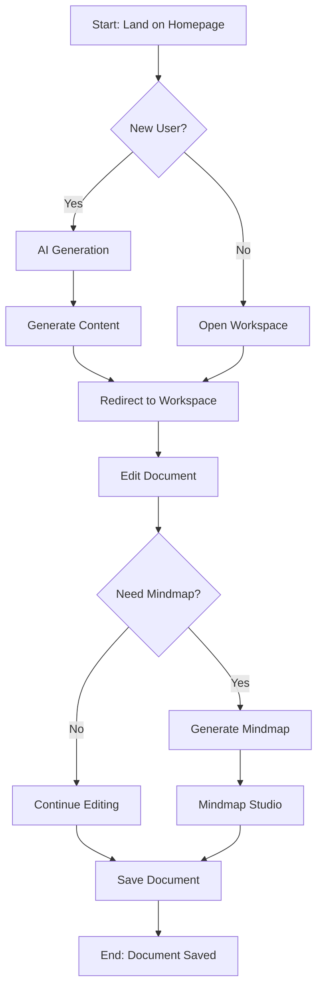

### 2. Sequence Diagram - API Flow

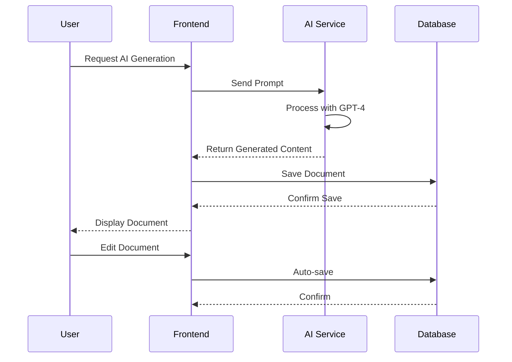

### 3. Class Diagram - Architecture

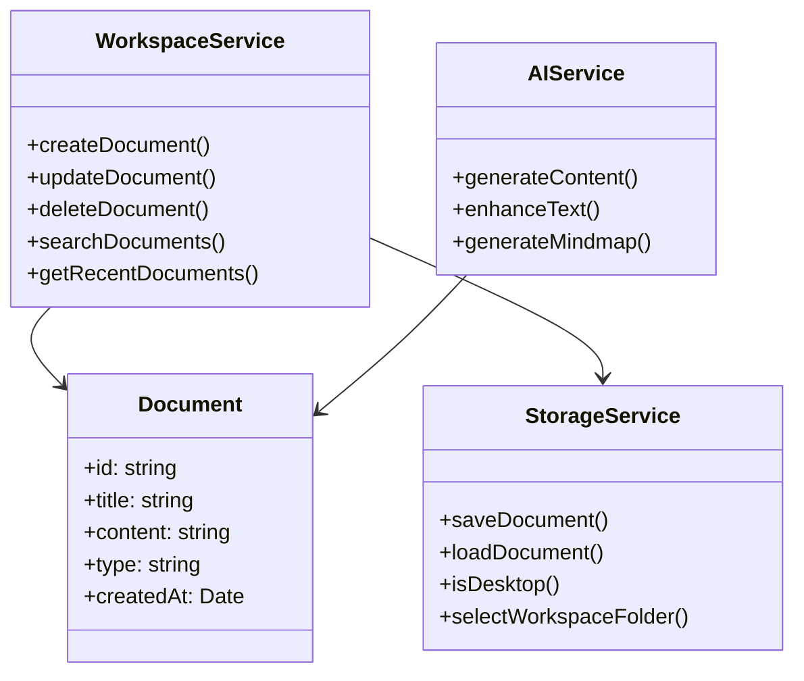

### 4. State Diagram - Document Lifecycle

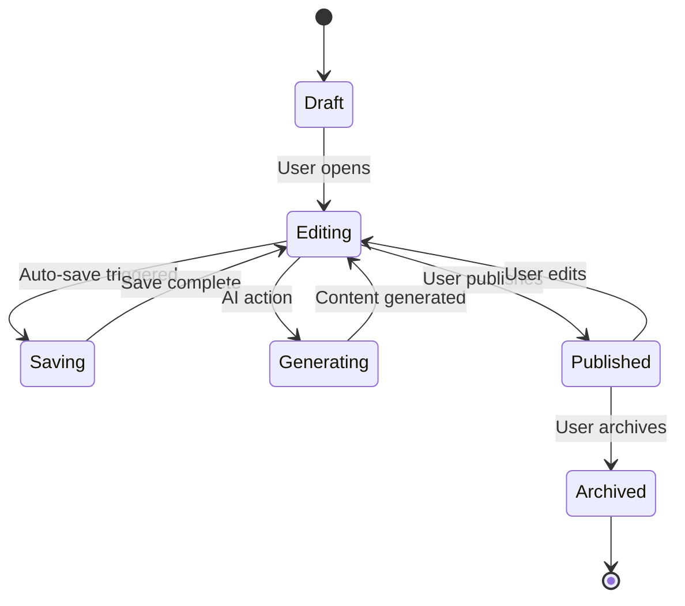

### 5. Gantt Chart - Project Timeline

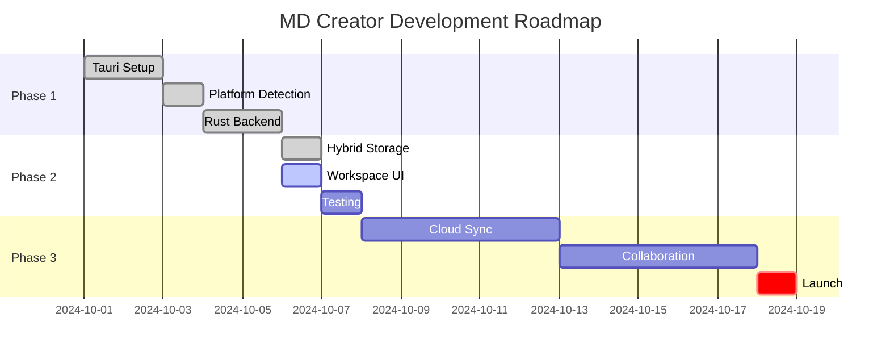

### 6. Pie Chart - Feature Usage

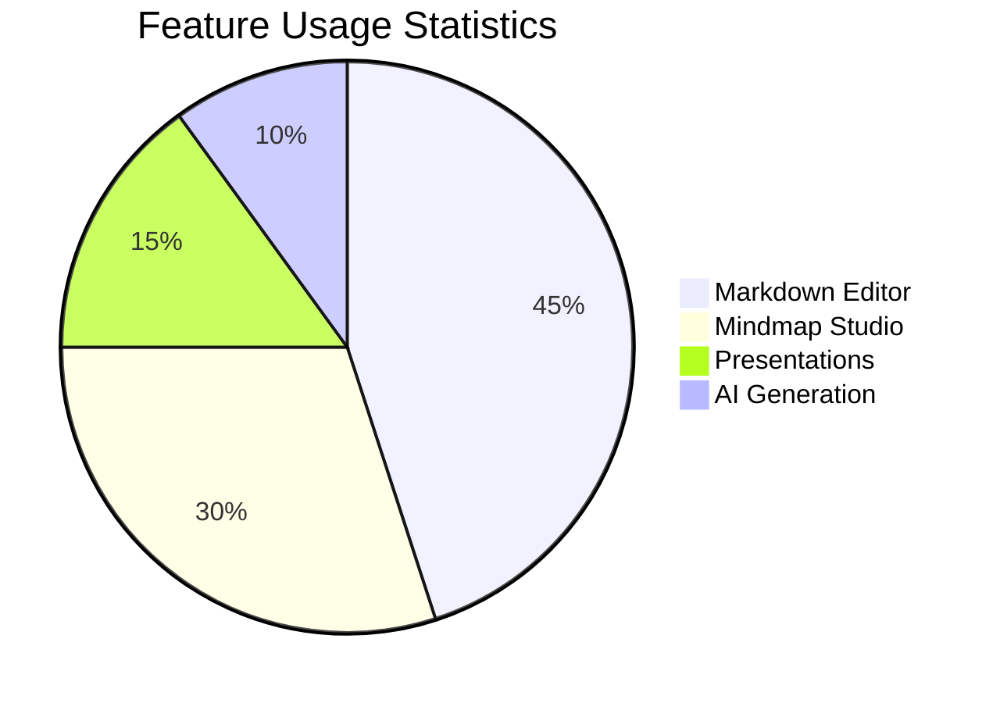

### 7. Git Graph - Version Control

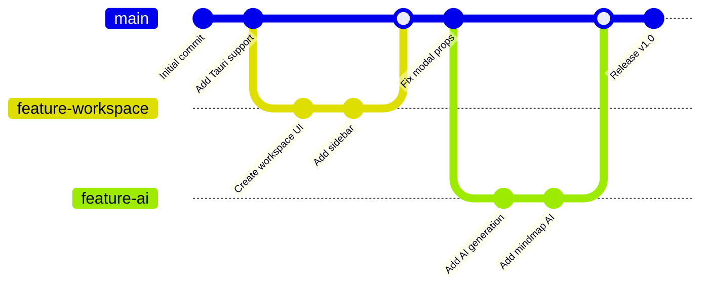

### 8. Entity Relationship Diagram

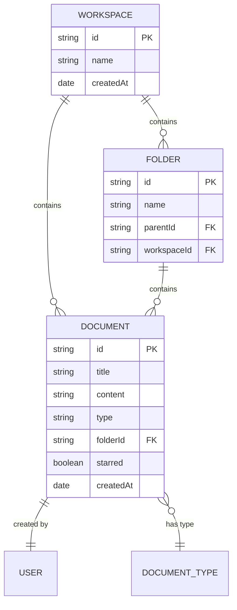

### 9. Mindmap - Feature Overview

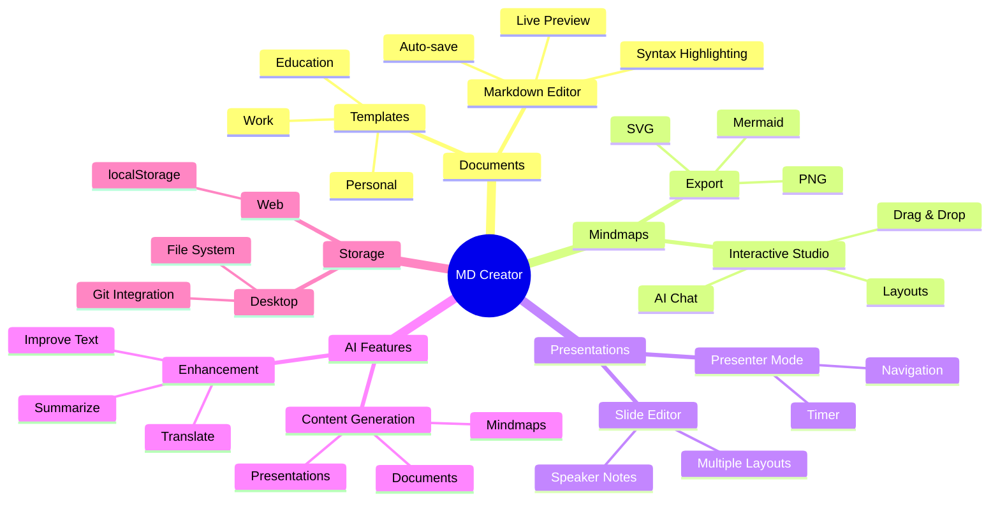

### 10. Timeline - Company Milestones

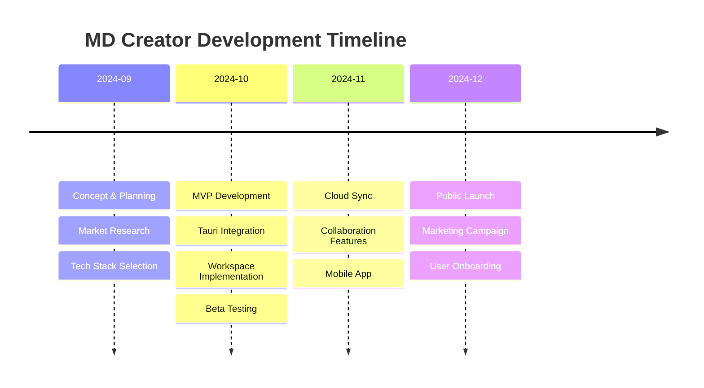

### 11. Quadrant Chart - Feature Priority

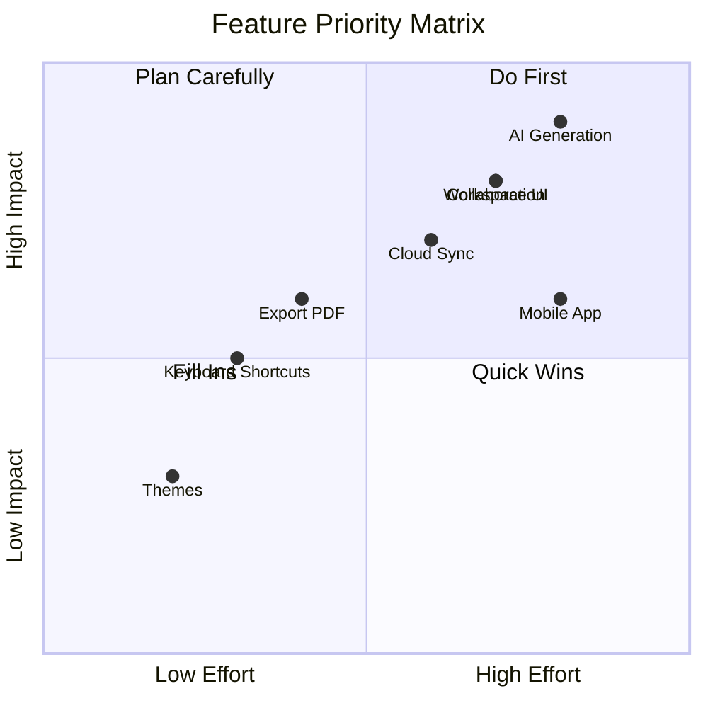

### 12. Sankey Diagram - User Flow

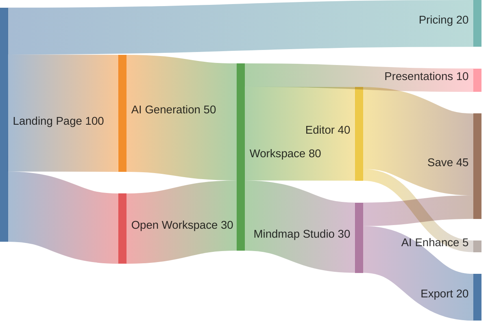

---

## 📊 Tables

| Feature | Status | Priority | Effort |
|---------|--------|----------|--------|
| Markdown Editor | ✅ Complete | High | Medium |
| Mindmap Studio | ✅ Complete | High | High |
| Presentations | ✅ Complete | Medium | High |
| Cloud Sync | 🚧 In Progress | High | High |
| Mobile App | 📋 Planned | Medium | Very High |
| Collaboration | 📋 Planned | High | Very High |

---

## 🔗 Links

- [MD Creator Website](https://mdcreator.com)
- [Documentation](https://docs.mdcreator.com)
- [GitHub Repository](https://github.com/mdcreator/app)
- [Discord Community](https://discord.gg/mdcreator)

---

## 📸 Images (Placeholder)


---

## 🎯 Callouts

> **💡 Pro Tip:** Use Cmd+K to quickly search and switch between documents!

> **⚠️ Warning:** Make sure to save your work regularly, especially when working offline.

> **✅ Success:** Your document has been saved successfully!

> **❌ Error:** Failed to connect to the server. Please check your internet connection.

---

## 📝 Footnotes

Here's a sentence with a footnote[^1].

Here's another with a longer footnote[^2].

[^1]: This is the first footnote.
[^2]: This is the second footnote with more details.

---

## 🧪 Advanced Features

### Math Equations (if supported)

Inline math: $E = mc^2$

Block math:

$$
\int_{-\infty}^{\infty} e^{-x^2} dx = \sqrt{\pi}
$$

### Horizontal Rules

---

***

___

---

## 🎉 Conclusion

This document demonstrates the full power of MD Creator:

✅ **Rich Markdown Support** - All standard markdown features
✅ **12 Mermaid Diagram Types** - Visualize anything
✅ **Beautiful Formatting** - Professional-looking documents
✅ **AI Integration** - Generate and enhance content
✅ **Multi-Platform** - Web and Desktop
✅ **Unlimited Storage** - Desktop file system support

**Ready to create amazing documents?** Start now! 🚀

---

*Last updated: October 6, 2024*
*Version: 1.0*
*Author: MD Creator Team*
