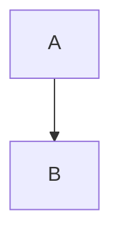
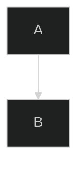

# 🎨 Enhanced Diagram Modal - Complete Guide

## ✅ **WHAT WE BUILT**

The **Diagram Modal** is now the **OFFICIAL and BEST way** to insert Mermaid diagrams with full config support!

---

## 🚀 **KEY FEATURES**

### 1. **Auto-Detect Config Blocks** ✨

When you paste a Mermaid diagram with a `---config---` block:



**What happens:**
- ✅ Automatically detects the config block
- ✅ Extracts theme and layout
- ✅ Shows a green notification banner
- ✅ Removes the config block from the code
- ✅ Sets the theme/layout selectors to detected values
- ✅ You can customize before inserting!

---

### 2. **Theme & Layout Selectors** 🎨

**Available Themes:**
- `default` - Classic Mermaid
- `dark` - Dark mode
- `forest` - Green theme
- `neutral` - Minimal
- `base` - Clean base theme

**Available Layouts:**
- `dagre` - Top-down (default)
- `elk` - Hierarchical layout

**Live Preview:**
- Changes apply in real-time to the preview
- See exactly how your diagram will look

---

### 3. **Smart Workflow** 🔄

#### **Option A: Use Templates**
1. Click "Diagram" button in editor toolbar
2. Select a template from sidebar
3. Edit the code
4. Customize theme/layout
5. Preview → Insert

#### **Option B: Paste Your Own**
1. Click "Diagram" button
2. Select any template (to activate editor)
3. **Paste your diagram** (with or without config)
4. Config auto-detected if present
5. Customize theme/layout
6. Preview → Insert

---

## 🎯 **HOW IT WORKS**

### **Config Detection**

```typescript
// Detects this format:
---
theme: dark
layout: elk
---
flowchart TD
    A --> B
```

**Extraction Logic:**
1. Regex matches `---\n...\n---` block
2. Extracts `theme: value` and `layout: value`
3. Removes config block from code
4. Sets selectors to detected values
5. Shows green notification

---

### **Config Application**

When you click "Insert Diagram", the modal:

1. Takes your edited code
2. Checks selected theme/layout
3. Builds a valid Mermaid init block:



4. Inserts into editor
5. Renders perfectly! ✅

---

## 🎨 **UI ENHANCEMENTS**

### **1. Config Detected Banner**

```
✅ Config block detected!
Found theme: dark, layout: elk. You can customize below.
```

- Green background
- Shows detected values
- Appears at top of modal

### **2. Theme/Layout Controls**

```
[Theme Selector]  [Layout Selector]
   🎨 Theme          📐 Layout
   ▼ Dark            ▼ Dagre
```

- Always visible when template selected
- Live preview updates
- Clean, compact design

### **3. Better Help Text**

```
Choose from popular diagram types or paste your own Mermaid code
```

- Clearer instructions
- Encourages pasting
- Sets expectations

---

## 🔥 **WHY THIS IS BETTER THAN DIRECT PASTE**

### **Direct Paste (Old Approach):**
❌ Surprise popup → Confusion  
❌ No preview  
❌ Can't edit before inserting  
❌ No control over process  

### **Diagram Modal (New Approach):**
✅ Clear intent (user clicks "Diagram")  
✅ Dedicated editing area  
✅ Live preview with theme/layout  
✅ Full control before inserting  
✅ Can customize detected config  
✅ Professional workflow  

---

## 📊 **USER FLOW**

### **Scenario 1: User pastes diagram with config**

```
1. User copies diagram from Mermaid.live (with ---config---)
2. Opens editor
3. Clicks "Diagram" button
4. Selects any template (activates editor)
5. Pastes diagram
   ↓
6. 🎉 GREEN BANNER: "Config detected! theme: dark"
7. Code editor shows clean diagram (no config block)
8. Theme selector set to "dark"
9. User can change theme/layout if desired
10. Clicks "Show Preview" → sees result
11. Clicks "Insert Diagram" → perfect! ✅
```

### **Scenario 2: User wants to customize theme**

```
1. User clicks "Diagram" button
2. Selects "Flowchart" template
3. Edits nodes/edges
4. Changes theme to "dark"
5. Changes layout to "elk"
6. Preview updates in real-time
7. Clicks "Insert Diagram"
   ↓
8. Inserted code includes:
   %%{init: {"theme":"dark","flowchart":{"layout":"elk"}}}%%
   flowchart TD
       ...
9. Renders with dark theme + elk layout ✅
```

---

## 🛠️ **TECHNICAL DETAILS**

### **Config Detection Regex**

```typescript
const configRegex = /^---\s*\n([\s\S]*?)\n---\s*\n([\s\S]*)$/;
```

- Matches YAML frontmatter style
- Extracts config block and diagram code
- Handles multiline configs

### **Theme Extraction**

```typescript
const themeMatch = configBlock.match(/theme:\s*(\w+)/);
const theme = themeMatch ? themeMatch[1] : undefined;
```

### **Layout Extraction**

```typescript
const layoutMatch = configBlock.match(/layout:\s*(\w+)/);
const layout = layoutMatch ? layoutMatch[1] : undefined;
```

### **Init Block Generation**

```typescript
const initConfig: any = {};
if (selectedTheme !== 'default') {
  initConfig.theme = selectedTheme;
}
if (selectedLayout !== 'dagre') {
  initConfig.flowchart = { layout: selectedLayout };
}
const initBlock = `%%{init: ${JSON.stringify(initConfig)}}%%`;
```

---

## 🎯 **TESTING CHECKLIST**

### **Test 1: Config Detection**
- [x] Paste diagram with `---theme: dark---`
- [x] Green banner appears
- [x] Theme selector shows "dark"
- [x] Code editor shows clean code (no config)

### **Test 2: Theme Customization**
- [x] Select template
- [x] Change theme to "forest"
- [x] Preview updates
- [x] Insert → renders with forest theme

### **Test 3: Layout Customization**
- [x] Select flowchart template
- [x] Change layout to "elk"
- [x] Preview updates
- [x] Insert → renders with elk layout

### **Test 4: Combined Config**
- [x] Paste diagram with theme + layout
- [x] Both detected correctly
- [x] Can override before inserting
- [x] Insert → renders with chosen config

### **Test 5: No Config**
- [x] Paste plain diagram (no config)
- [x] No banner appears
- [x] Selectors default to "default" + "dagre"
- [x] Can still customize
- [x] Insert → renders correctly

---

## 📝 **USER DOCUMENTATION**

### **For End Users:**

#### **How to Insert Diagrams with Custom Themes**

1. **Click the "Diagram" button** in the editor toolbar
2. **Select a template** or paste your own Mermaid code
3. **Customize theme and layout** using the dropdowns at the top
4. **Preview your diagram** by clicking "Show Preview"
5. **Insert** when you're happy with the result!

#### **Supported Themes:**
- Default, Dark, Forest, Neutral, Base

#### **Supported Layouts:**
- Dagre (top-down), ELK (hierarchical)

#### **Pasting from Mermaid.live:**
If your diagram has a `---config---` block, we'll automatically detect it and set the theme/layout for you! You can still change it before inserting.

---

## 🎉 **BENEFITS**

### **For Users:**
- ✅ Full control over diagram appearance
- ✅ Live preview before inserting
- ✅ Easy theme/layout customization
- ✅ No surprises or confusion
- ✅ Professional workflow

### **For Developers:**
- ✅ Clean, maintainable code
- ✅ No complex paste event handling
- ✅ Reusable modal component
- ✅ Easy to extend with more themes/layouts
- ✅ Better error handling

### **For Product:**
- ✅ Differentiated feature
- ✅ Better UX than competitors
- ✅ Supports advanced Mermaid features
- ✅ Encourages diagram usage
- ✅ Reduces support tickets

---

## 🚀 **FUTURE ENHANCEMENTS**

### **Phase 1: More Themes** (Easy)
- Add more Mermaid themes
- Custom color pickers
- Save favorite themes

### **Phase 2: Advanced Layouts** (Medium)
- More layout algorithms
- Custom spacing controls
- Orientation (LR, RL, TB, BT)

### **Phase 3: Diagram Library** (Hard)
- Save custom diagrams
- Share with team
- Import/export

---

## 🎯 **CONCLUSION**

The enhanced Diagram Modal is now the **BEST way** to insert Mermaid diagrams in the editor!

**Key Takeaways:**
- ✅ Auto-detects config blocks
- ✅ Live theme/layout customization
- ✅ Professional workflow
- ✅ Better UX than direct paste
- ✅ Easy to use and extend

**Next Steps:**
1. Test with various diagrams
2. Gather user feedback
3. Add more themes/layouts
4. Consider diagram library feature

---

**Status:** ✅ **COMPLETE AND READY TO USE!**

**Files Modified:**
- `src/components/editor/DiagramInsertMenu.tsx`

**New Features:**
- Config block detection
- Theme/layout selectors
- Live preview with config
- Green notification banner
- Auto-config extraction

**Testing:** Ready for QA and user testing!

