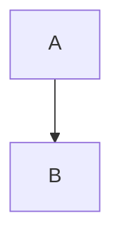

# 🎨 Diagram Modal - Quick User Guide

## 🚀 **HOW TO USE**

### **Step 1: Open the Diagram Modal**
Click the **"Diagram"** button in the editor toolbar.

---

### **Step 2: Choose Your Approach**

#### **Option A: Use a Template**
1. Select a template from the left sidebar (Flowchart, Sequence, etc.)
2. Edit the code in the text area
3. Customize theme and layout

#### **Option B: Paste Your Own**
1. Select any template (to activate the editor)
2. Clear the code and paste your own Mermaid diagram
3. If your diagram has a `---config---` block, it will be auto-detected!

---

### **Step 3: Customize Theme & Layout**

At the top of the modal, you'll see two dropdowns:

```
🎨 Theme          📐 Layout
▼ Default         ▼ Dagre
```

**Available Themes:**
- Default (classic)
- Dark (dark mode)
- Forest (green)
- Neutral (minimal)
- Base (clean)

**Available Layouts:**
- Dagre (top-down)
- ELK (hierarchical)

**💡 Tip:** Changes apply to the preview in real-time!

---

### **Step 4: Preview Your Diagram**

Click **"Show Preview"** to see how your diagram will look with the selected theme and layout.

**Preview Features:**
- ✅ Live rendering
- ✅ Applies your theme/layout
- ✅ Shows syntax errors if any
- ✅ Click "Show Code" to go back to editing

---

### **Step 5: Insert**

When you're happy with the result, click **"Insert Diagram"**.

Your diagram will be inserted into the editor with the correct config applied!

---

## 🎉 **SPECIAL FEATURE: Config Detection**

### **What is it?**

If you copy a diagram from **Mermaid.live** or another source that includes a config block like this:



**We'll automatically detect it!**

---

### **What happens?**

1. **Green banner appears:**
   ```
   ✅ Config block detected!
   Found theme: dark, layout: elk. You can customize below.
   ```

2. **Config is extracted:**
   - Theme selector → "dark"
   - Layout selector → "elk"

3. **Code is cleaned:**
   - The `---config---` block is removed
   - You see only the diagram code

4. **You can still customize:**
   - Change theme/layout if you want
   - Preview updates in real-time

5. **Insert with correct config:**
   - Click "Insert Diagram"
   - Config is applied as `%%{init: {...}}%%`
   - Renders perfectly! ✅

---

## 📊 **EXAMPLE WORKFLOW**

### **Scenario: Pasting from Mermaid.live**

1. **Copy this from Mermaid.live:**
   ```mermaid
   ---
   theme: dark
   ---
   flowchart LR
       A[Start] --> B{Decision}
       B -->|Yes| C[End]
       B -->|No| D[Loop]
       D --> A
   ```

2. **Open Diagram Modal** in the editor

3. **Select any template** (e.g., Flowchart)

4. **Paste your diagram**

5. **See the magic:**
   - ✅ Green banner: "Config detected! theme: dark"
   - ✅ Theme selector shows "Dark"
   - ✅ Code editor shows clean flowchart (no config)

6. **Preview:**
   - Click "Show Preview"
   - See your diagram with dark theme

7. **Customize (optional):**
   - Change theme to "Forest" if you want
   - Preview updates

8. **Insert:**
   - Click "Insert Diagram"
   - Done! ✅

---

## 🎯 **PRO TIPS**

### **Tip 1: Preview Before Inserting**
Always preview your diagram to catch syntax errors before inserting!

### **Tip 2: Experiment with Themes**
Try different themes to see which looks best with your content.

### **Tip 3: Use ELK for Complex Diagrams**
If your flowchart has many nodes, try the ELK layout for better organization.

### **Tip 4: AI Diagram Help**
Click the **"AI Diagram Help"** button to generate diagrams from text descriptions!

### **Tip 5: Edit After Inserting**
You can always click on an inserted diagram to edit it again.

---

## ❓ **FAQ**

### **Q: What if my diagram doesn't have a config block?**
**A:** No problem! Just use the theme/layout selectors to customize it.

### **Q: Can I change the config after detecting it?**
**A:** Yes! The selectors are always editable. Change them before inserting.

### **Q: What if I paste invalid Mermaid code?**
**A:** The preview will show a syntax error. Fix the code and try again.

### **Q: Can I save my favorite theme?**
**A:** Not yet, but it's on the roadmap! For now, just select it each time.

### **Q: Does this work with all diagram types?**
**A:** Yes! Flowcharts, sequence diagrams, class diagrams, etc.

---

## 🎉 **ENJOY!**

The Diagram Modal is designed to make inserting beautiful, customized diagrams **easy and fun**!

**Key Features:**
- ✅ Auto-detect config blocks
- ✅ Live theme/layout preview
- ✅ Professional workflow
- ✅ AI assistance
- ✅ No surprises!

**Happy diagramming!** 🚀

