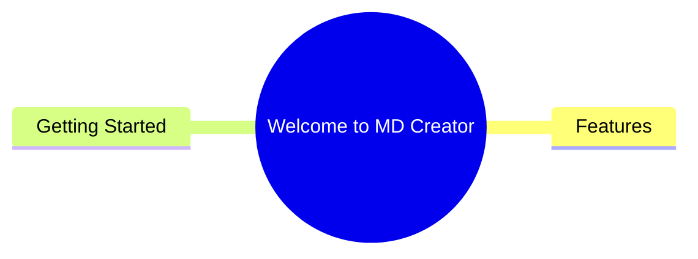
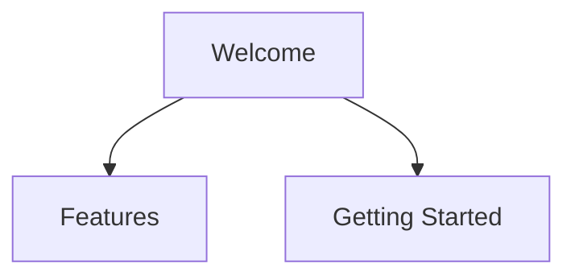
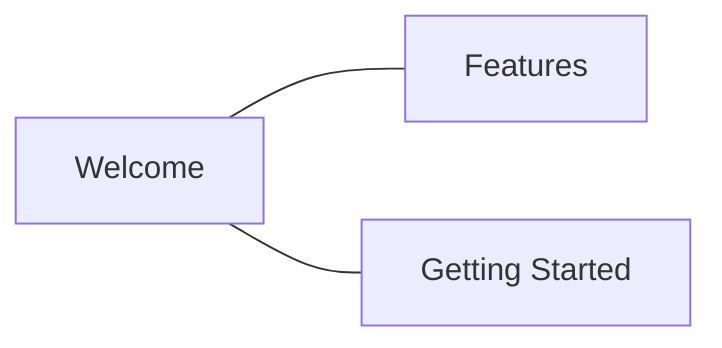
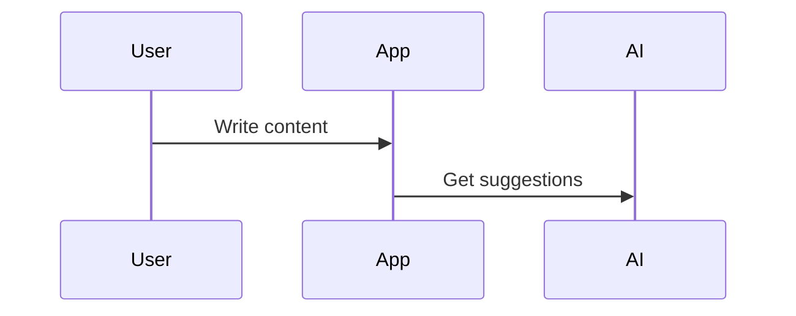
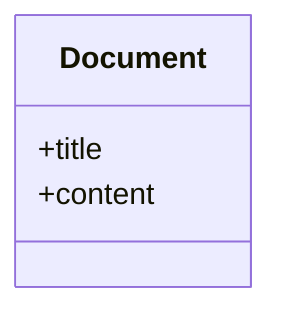

# ✅ Added Visual Mermaid Diagram Previews!

## 🎯 **WHAT YOU WANTED:**

> "Can I have preview of the diagrams here, not only the code?"

## ✅ **WHAT I DID:**

Added **LIVE MERMAID DIAGRAM PREVIEWS** for every format!

---

## 🔍 **THE CONFUSION EXPLAINED:**

### **Before:**
- **Top Section** → Markmap (JavaScript interactive mindmap) 🔵
- **Bottom Section** → Mermaid code (text only) 📝
- **Problem** → They looked different because Markmap ≠ Mermaid!

### **Now:**
- **Top Section** → Markmap (for reference/comparison) 🔵
- **Format Buttons** → Choose your format ✅
- **VISUAL PREVIEW** → See the ACTUAL Mermaid diagram 🎨
- **Code Section** → Collapsible (hidden by default) 📝

---

## 🎨 **NEW USER EXPERIENCE:**

### **Step 1: Click "Mindmap" Button**
→ Modal opens with Markmap preview at top (reference)

### **Step 2: Choose Format**
→ Click "Mindmap" button at bottom  
→ **BOOM! Live Mermaid diagram appears!** 🎨

### **Step 3: Try Other Formats**
→ Click "Flowchart" button  
→ **See different diagram style!** 🎨

→ Click "Graph" button  
→ **See another style!** 🎨

### **Step 4: Insert What You See**
→ Click "Insert into Editor"  
→ **EXACT diagram you saw gets inserted!** ✅

---

## 🆕 **NEW FEATURES:**

### **1. Live Mermaid Rendering**
```typescript
// Real-time Mermaid rendering
useEffect(() => {
  const renderDiagram = async () => {
    const { svg } = await mermaid.render(uniqueId, generatedCode);
    mermaidPreviewRef.current.innerHTML = svg;
  };
  renderDiagram();
}, [generatedCode, showPreviewCode]);
```

### **2. Visual Diagram Preview**
- **Beautiful rendered diagram** (not just code!)
- **Automatic sizing** - fits in modal perfectly
- **Scrollable** - for large diagrams
- **Error handling** - shows friendly message if render fails

### **3. Collapsible Code Section**
```html
<details className="group">
  <summary>▶ View Mermaid Code</summary>
  <pre>{generatedCode}</pre>
</details>
```
- **Hidden by default** - focus on visual
- **Click to expand** - see code if needed
- **Smooth animation** - professional UX

### **4. Format Comparison**
- **Try different formats** without inserting
- **See visual differences** between diagram types
- **Make informed choice** before committing

---

## 📊 **DIAGRAM TYPES YOU CAN PREVIEW:**

### **1. Mindmap**

→ **Circular/radial layout**

### **2. Flowchart**

→ **Top-down boxes and arrows**

### **3. Graph**

→ **Network-style connections**

### **4. Sequence**

→ **Timeline/process flow**

### **5. Class Diagram**

→ **Object-oriented structure**

---

## 🎯 **BENEFITS:**

### ✅ **Visual Clarity**
- See the ACTUAL diagram, not just code
- Understand what you're inserting
- No surprises in the editor

### ✅ **Format Comparison**
- Try all formats visually
- See which looks best
- Easy to switch between styles

### ✅ **Confidence**
- Know exactly what you're getting
- Preview = Insert (WYSIWYG)
- No guesswork

### ✅ **Professional UX**
- Clean, modern interface
- Collapsible code section
- Smooth interactions

---

## 🔧 **TECHNICAL IMPLEMENTATION:**

### **Mermaid Integration**
```typescript
import mermaid from "mermaid";

// Initialize once
useEffect(() => {
  mermaid.initialize({ 
    startOnLoad: false, 
    theme: 'default',
    securityLevel: 'loose',
  });
}, []);

// Render on format change
useEffect(() => {
  const { svg } = await mermaid.render(uniqueId, generatedCode);
  mermaidPreviewRef.current.innerHTML = svg;
}, [generatedCode, showPreviewCode]);
```

### **Error Handling**
```typescript
try {
  setMermaidError(null);
  const { svg } = await mermaid.render(uniqueId, generatedCode);
  // ... render
} catch (err) {
  setMermaidError(err.message);
  // Show user-friendly error
}
```

### **Responsive Design**
```html
<div className="min-h-[200px] max-h-[500px] overflow-auto">
  <div className="[&_svg]:max-w-full [&_svg]:h-auto">
    {/* Mermaid SVG */}
  </div>
</div>
```

---

## 📋 **TESTING:**

### **Test 1: Mindmap Preview**
1. ✅ Click "Mindmap" button in toolbar
2. ✅ Modal opens with Markmap at top
3. ✅ Click "Mindmap" button at bottom
4. ✅ See **VISUAL Mermaid mindmap** appear
5. ✅ Click "Insert into Editor"
6. ✅ Same diagram appears in editor

### **Test 2: Format Switching**
1. ✅ Click "Mindmap" button in toolbar
2. ✅ Click "Mindmap" → See mindmap diagram
3. ✅ Click "Flowchart" → See flowchart diagram
4. ✅ Click "Graph" → See graph diagram
5. ✅ Click "Sequence" → See sequence diagram
6. ✅ Each looks different and correct

### **Test 3: Code Viewing**
1. ✅ Click "Mindmap" button in toolbar
2. ✅ Click "Mindmap" format
3. ✅ See visual diagram
4. ✅ Click "▶ View Mermaid Code"
5. ✅ Code section expands
6. ✅ Click again to collapse

### **Test 4: Error Handling**
1. ✅ If diagram fails to render
2. ✅ See friendly error message
3. ✅ Can still view code
4. ✅ Can still insert (if you want)

---

## 🎉 **THE RESULT:**

### **Before:**
- ❌ Only saw code (text)
- ❌ Couldn't compare formats visually
- ❌ Unclear what would be inserted
- ❌ Markmap vs Mermaid confusion

### **After:**
- ✅ See LIVE Mermaid diagrams
- ✅ Compare formats visually
- ✅ WYSIWYG (What You See Is What You Get)
- ✅ Clear distinction: Markmap = reference, Mermaid = what gets inserted

---

## 🚀 **TRY IT NOW:**

1. **Go to editor** → http://localhost:8080/dashboard/editor
2. **Click "Mindmap"** button in toolbar
3. **See Markmap preview** at top (reference)
4. **Click "Mindmap"** button at bottom
5. **BOOM!** → Beautiful Mermaid diagram appears! 🎨
6. **Try other formats** → Click Flowchart, Graph, etc.
7. **See different styles** → All rendered visually!
8. **Click "Insert"** → Exact diagram inserted!

---

## 💡 **KEY INSIGHT:**

### **The Confusion:**
- **Markmap** = Interactive JavaScript mindmap library (pretty but not Mermaid)
- **Mermaid** = Diagram syntax that works in Markdown/editor

### **The Solution:**
- **Keep Markmap** at top as a reference/preview
- **Add Mermaid rendering** below for format selection
- **User sees BOTH** and understands the difference
- **Insert Mermaid** (the one that works in editor)

---

## 📝 **FILES CHANGED:**

**`MindmapPreviewModal.tsx`**
- ✅ Added `mermaid` import
- ✅ Added `useEffect` for Mermaid initialization
- ✅ Added `useEffect` for diagram rendering
- ✅ Added `mermaidPreviewRef` for SVG container
- ✅ Added visual diagram preview section
- ✅ Added collapsible code section
- ✅ Added error handling for render failures

---

## 🎯 **CONCLUSION:**

**You now have the BEST mindmap workflow:**

1. **Visual reference** (Markmap) - See structure
2. **Format selection** - Choose style
3. **Live preview** (Mermaid) - See exact diagram
4. **Code access** - View if needed
5. **Insert** - WYSIWYG guaranteed

**NO MORE CONFUSION!** ✨  
**NO MORE SURPRISES!** 🎉  
**PERFECT WORKFLOW!** 🚀

