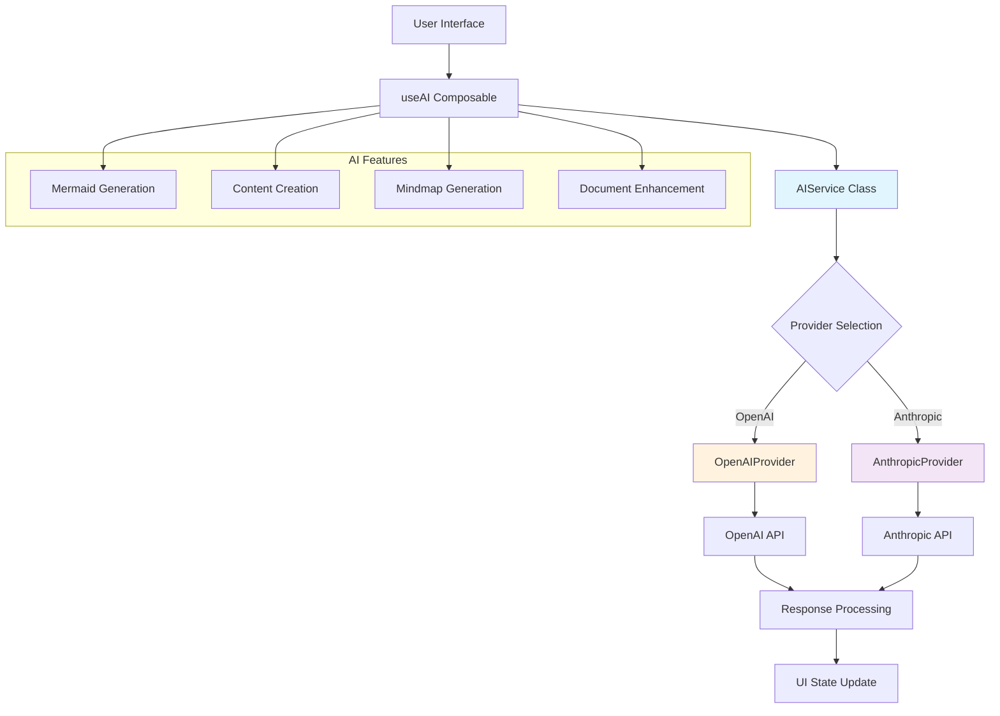
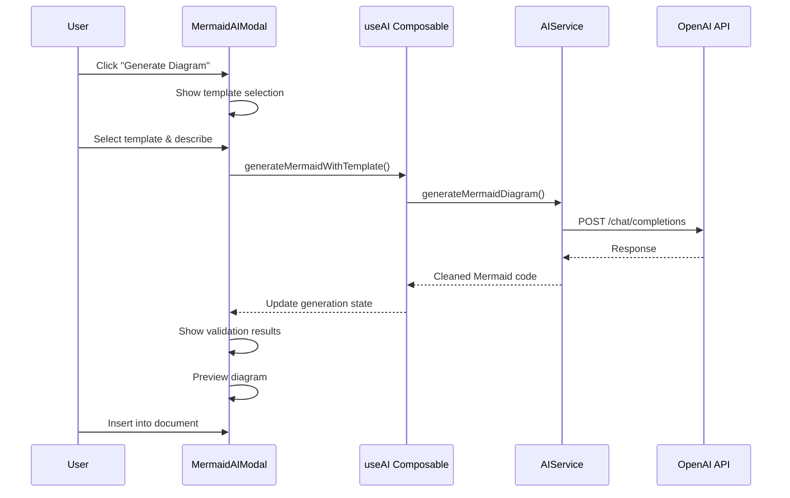

# 🤖 AI Integration Architecture

This document details how MD Creator integrates with AI services (OpenAI, Anthropic) for content generation, diagram creation, and document enhancement.

## 🎯 Overview

MD Creator's AI system is designed for:
- **Multiple Providers**: OpenAI, Anthropic (Claude), extensible for more
- **Flexible Configuration**: Environment-based API key management
- **Platform Agnostic**: Works identically on desktop and web
- **Production Ready**: Error handling, rate limiting, timeout protection

## 🏗️ Architecture Diagram



## ⚙️ Configuration System

### **Environment Variables**

```bash
# .env.local (auto-ignored by git)
VITE_OPENAI_API_KEY=sk-proj-your-openai-key-here
VITE_ANTHROPIC_API_KEY=your-anthropic-key-here
VITE_AI_ENABLED=true
VITE_AI_DEFAULT_PROVIDER=openai
VITE_AI_MAX_TOKENS=2000
VITE_AI_TEMPERATURE=0.7
VITE_AI_DEBUG=false
VITE_AI_TIMEOUT_MS=30000
```

### **Configuration Loading**

```javascript
// src/config/aiConfig.js
const AI_ENV = {
  OPENAI_API_KEY: import.meta.env.VITE_OPENAI_API_KEY,
  AI_ENABLED: import.meta.env.VITE_AI_ENABLED === 'true',
  AI_DEFAULT_PROVIDER: import.meta.env.VITE_AI_DEFAULT_PROVIDER || 'openai',
  AI_MAX_TOKENS: parseInt(import.meta.env.VITE_AI_MAX_TOKENS) || 2000,
  AI_TEMPERATURE: parseFloat(import.meta.env.VITE_AI_TEMPERATURE) || 0.7
}

export const AI_CONFIG = {
  enabled: AI_ENV.AI_ENABLED,
  defaultProvider: AI_ENV.AI_DEFAULT_PROVIDER,
  maxTokens: AI_ENV.AI_MAX_TOKENS,
  temperature: AI_ENV.AI_TEMPERATURE,
  providers: {
    openai: {
      apiKey: AI_ENV.OPENAI_API_KEY,
      baseUrl: 'https://api.openai.com/v1',
      defaultModel: 'gpt-4'
    },
    anthropic: {
      apiKey: AI_ENV.ANTHROPIC_API_KEY,
      baseUrl: 'https://api.anthropic.com',
      defaultModel: 'claude-3-sonnet-20240229'
    }
  }
}
```

## 🔌 Provider System

### **Base Provider Interface**

```javascript
// src/services/AIService.js
export class AIProvider {
  constructor(name, config) {
    this.name = name
    this.config = config
    this.requestCount = 0
    this.lastRequestTime = 0
  }

  // Abstract methods (implemented by providers)
  async generateContent(prompt, options = {}) {
    throw new Error('generateContent must be implemented by provider')
  }

  async generateMermaidDiagram(description) {
    throw new Error('generateMermaidDiagram must be implemented by provider')
  }

  async validateDiagram(content, diagramType) {
    throw new Error('validateDiagram must be implemented by provider')
  }

  // Built-in features
  isConfigured() {
    return !!(this.config.apiKey && 
              !this.config.apiKey.includes('your_') && 
              !this.config.apiKey.includes('_here'))
  }

  async checkRateLimit() {
    const now = Date.now()
    const timeWindow = 60000 // 1 minute
    
    if (now - this.lastRequestTime < timeWindow && 
        this.requestCount >= AI_CONFIG.rateLimit) {
      throw new Error(`Rate limit exceeded. Maximum ${AI_CONFIG.rateLimit} requests per minute.`)
    }
    
    if (now - this.lastRequestTime >= timeWindow) {
      this.requestCount = 0
    }
    
    this.requestCount++
    this.lastRequestTime = now
  }
}
```

### **OpenAI Provider Implementation**

```javascript
export class OpenAIProvider extends AIProvider {
  async generateContent(prompt, options = {}) {
    await this.checkRateLimit()

    const {
      temperature = AI_CONFIG.temperature,
      maxTokens = AI_CONFIG.maxTokens,
      model = this.config.defaultModel || 'gpt-4',
      systemPrompt = 'You are a professional technical writer helping create high-quality documentation.'
    } = options

    const requestBody = {
      model,
      messages: [
        { role: 'system', content: systemPrompt },
        { role: 'user', content: prompt }
      ],
      temperature,
      max_tokens: maxTokens
    }

    const controller = new AbortController()
    const timeoutId = setTimeout(() => controller.abort(), AI_CONFIG.timeout)

    const response = await fetch(`${this.baseUrl}/chat/completions`, {
      method: 'POST',
      headers: {
        'Content-Type': 'application/json',
        'Authorization': `Bearer ${this.config.apiKey}`
      },
      body: JSON.stringify(requestBody),
      signal: controller.signal
    })

    clearTimeout(timeoutId)

    if (!response.ok) {
      const errorData = await response.json().catch(() => ({}))
      throw new Error(errorData.error?.message || `HTTP ${response.status}`)
    }

    const data = await response.json()
    return data.choices[0]?.message?.content || ''
  }
}
```

## 🎨 AI Features Implementation

### **1. Mermaid Diagram Generation**

```javascript
// Feature: Generate diagrams from natural language
const generateMermaidDiagram = async (description) => {
  const prompt = `Create a Mermaid diagram for: ${description}

Requirements:
- Return ONLY the Mermaid code, no explanations
- Use proper Mermaid syntax
- Choose the most appropriate diagram type (flowchart, sequence, class, etc.)
- Keep it clean and readable

Generate the diagram:`

  const result = await aiService.generateContent(prompt, {
    systemPrompt: 'You are an expert at creating Mermaid diagrams. Generate only valid Mermaid syntax.',
    temperature: 0.3, // Lower temperature for consistent syntax
    maxTokens: 1000
  })

  // Clean response (remove markdown wrappers)
  let cleanCode = result.trim()
  cleanCode = cleanCode.replace(/```mermaid\n?/g, '')
  cleanCode = cleanCode.replace(/```\n?/g, '')
  
  return cleanCode.trim()
}
```

### **2. AI-Powered Mindmap Generation**

```javascript
// Feature: Generate structured mindmaps as JSON
const generateAIMindmap = async (description, options = {}) => {
  const {
    template = 'project',
    maxNodes = 15,
    includeDetails = true
  } = options

  const prompt = `Create a project structure mindmap for: ${description}

Generate a mindmap structure with:
- Maximum ${maxNodes} nodes
- Clear hierarchical relationships
- ${includeDetails ? 'Detailed descriptions for each node' : 'Concise node labels'}

Return JSON format:
{
  "title": "Mindmap Title",
  "nodes": [
    {
      "id": "unique_id",
      "text": "Node Text",
      "level": 0,
      "parent": null,
      "description": "Optional description",
      "type": "concept|task|milestone|note"
    }
  ],
  "connections": [
    {
      "from": "parent_id",
      "to": "child_id",
      "type": "hierarchy|association|flow"
    }
  ]
}`

  const result = await aiService.generateContent(prompt, {
    systemPrompt: 'You are an expert at creating structured mindmaps. Return only valid JSON.',
    temperature: 0.7,
    maxTokens: 2000
  })

  return JSON.parse(result.trim())
}
```

### **3. Document Enhancement**

```javascript
// Feature: Enhance existing content
const enhanceContent = async (content, enhancement) => {
  const prompt = `Enhance this content: ${enhancement}

CURRENT CONTENT:
${content}

ENHANCEMENT REQUEST: ${enhancement}

Please improve the content while maintaining the original structure and style.`

  return await aiService.generateContent(prompt, {
    systemPrompt: 'You are a professional editor. Enhance content while preserving the original voice.',
    temperature: 0.6,
    maxTokens: 2000
  })
}
```

## 🔄 State Management

### **Reactive AI State**

```javascript
// src/composables/useAI.js
export function useAI() {
  // Individual states for each AI feature
  const contentGeneration = createGenerationState()
  const mermaidGeneration = createGenerationState()
  const validation = createGenerationState()
  const mindmapGeneration = createGenerationState()

  // Global computed states
  const isAnyGenerating = computed(() => 
    contentGeneration.isGenerating || 
    mermaidGeneration.isGenerating || 
    validation.isGenerating || 
    mindmapGeneration.isGenerating
  )

  const totalTokensUsed = computed(() => 
    contentGeneration.tokensUsed + 
    mermaidGeneration.tokensUsed + 
    validation.tokensUsed + 
    mindmapGeneration.tokensUsed
  )

  return {
    contentGeneration,
    mermaidGeneration,
    validation,
    mindmapGeneration,
    isAnyGenerating,
    totalTokensUsed,
    // ... methods
  }
}
```

### **Generation State Object**

```javascript
const createGenerationState = () => reactive({
  isGenerating: false,
  progress: 0,           // 0-100
  stage: '',            // Human-readable progress
  error: null,          // Error message if failed
  lastResult: null,     // Last successful result
  tokensUsed: 0,        // Estimated token consumption
  cost: 0               // Estimated cost in USD
})
```

## 🎯 User Interface Integration

### **AI Modal Component Flow**



### **Progress Feedback**

```javascript
// Real-time progress updates
const generateWithProgress = async (generationFn) => {
  state.isGenerating = true
  state.progress = 0
  state.stage = 'Initializing...'

  try {
    state.progress = 25
    state.stage = 'Processing request...'
    
    const result = await generationFn()
    
    state.progress = 75
    state.stage = 'Finalizing...'
    
    await new Promise(resolve => setTimeout(resolve, 200))
    
    state.progress = 100
    state.stage = 'Complete'
    state.lastResult = result
    
    return result
  } catch (error) {
    state.error = error.message
    state.stage = 'Error'
    throw error
  } finally {
    state.isGenerating = false
  }
}
```

## 🛡️ Security & Error Handling

### **API Key Security**

```javascript
// Never log API keys
const sanitizeError = (error) => {
  let message = error.message || error.toString()
  
  // Remove potential API keys from error messages
  message = message.replace(/sk-[a-zA-Z0-9]{48}/g, 'sk-***')
  message = message.replace(/claude-[a-zA-Z0-9-]+/g, 'claude-***')
  
  return message
}
```

### **Rate Limiting**

```javascript
// Built-in rate limiting (20 requests/minute default)
async checkRateLimit() {
  const now = Date.now()
  const timeWindow = 60000 // 1 minute
  
  if (now - this.lastRequestTime < timeWindow && 
      this.requestCount >= AI_CONFIG.rateLimit) {
    throw new Error(`Rate limit exceeded. Maximum ${AI_CONFIG.rateLimit} requests per minute.`)
  }
  
  if (now - this.lastRequestTime >= timeWindow) {
    this.requestCount = 0
  }
  
  this.requestCount++
  this.lastRequestTime = now
}
```

### **Timeout Protection**

```javascript
// 30-second timeout by default
const controller = new AbortController()
const timeoutId = setTimeout(() => controller.abort(), AI_CONFIG.timeout)

const response = await fetch(url, {
  method: 'POST',
  headers,
  body: JSON.stringify(requestBody),
  signal: controller.signal // Enables cancellation
})

clearTimeout(timeoutId)
```

## 📊 Cost Management

### **Token Estimation**

```javascript
// Basic token estimation (4 chars ≈ 1 token)
const estimateTokens = (text) => Math.ceil(text.length / 4)

// Track usage
state.tokensUsed += estimateTokens(result)
state.cost += state.tokensUsed * 0.002 // Rough estimate
```

### **Provider Pricing**

| Provider | Model | Input (per 1K tokens) | Output (per 1K tokens) |
|----------|-------|-------------------|---------------------|
| OpenAI | GPT-4 | $0.03 | $0.06 |
| OpenAI | GPT-4 Turbo | $0.01 | $0.03 |
| OpenAI | GPT-3.5 Turbo | $0.0005 | $0.0015 |
| Anthropic | Claude 3 Opus | $0.015 | $0.075 |
| Anthropic | Claude 3 Sonnet | $0.003 | $0.015 |
| Anthropic | Claude 3 Haiku | $0.00025 | $0.00125 |

## 🧪 Testing Strategy

### **Unit Tests**

```javascript
// Test AI service methods
describe('AIService', () => {
  it('should generate valid Mermaid diagrams', async () => {
    const mockProvider = new MockAIProvider()
    const service = new AIService()
    service.setProvider(mockProvider)
    
    const result = await service.generateMermaidDiagram('user login flow')
    
    expect(result).toContain('flowchart')
    expect(result).toMatch(/^[a-zA-Z0-9\s\-\[\]()>]+$/) // Valid Mermaid syntax
  })
})
```

### **Integration Tests**

```javascript
// Test with real API (in CI only)
describe('OpenAI Integration', () => {
  it('should generate content with real API', async () => {
    if (!process.env.CI) return // Skip locally
    
    const provider = new OpenAIProvider({
      apiKey: process.env.OPENAI_TEST_KEY
    })
    
    const result = await provider.generateContent('Write a haiku about testing')
    expect(result).toBeTruthy()
    expect(result.split('\n')).toHaveLength(3)
  })
})
```

## 🚀 Performance Optimization

### **Response Caching**

```javascript
// Cache AI responses to avoid repeated API calls
const responseCache = new Map()

const generateWithCache = async (prompt, options) => {
  const cacheKey = JSON.stringify({ prompt, options })
  
  if (responseCache.has(cacheKey)) {
    return responseCache.get(cacheKey)
  }
  
  const result = await actualGenerate(prompt, options)
  responseCache.set(cacheKey, result)
  
  return result
}
```

### **Request Debouncing**

```javascript
// Debounce rapid requests (e.g., while user is typing)
const debouncedGenerate = debounce(async (prompt) => {
  return await aiService.generateContent(prompt)
}, 500) // Wait 500ms after user stops typing
```

## 📈 Future Enhancements

### **Phase 1: Current Features**
- ✅ OpenAI & Anthropic integration
- ✅ Mermaid diagram generation
- ✅ Mindmap creation
- ✅ Content enhancement

### **Phase 2: Advanced AI**
- 🔄 Local AI models (via Ollama)
- 🔄 Custom fine-tuned models
- 🔄 Multi-modal support (images)

### **Phase 3: Smart Features**
- 📅 Context-aware suggestions
- 📅 Document structure analysis
- 📅 Automated tagging
- 📅 Smart templates

---

## 📚 Related Documentation

- [Storage & Auth System](storage-auth-system.md)
- [API Documentation](../api/ai-services.md)
- [Development Setup](../development/setup.md)

**Last Updated**: September 2024  
**Next Review**: October 2024
