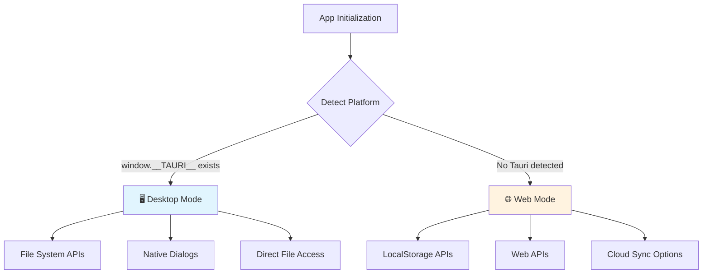
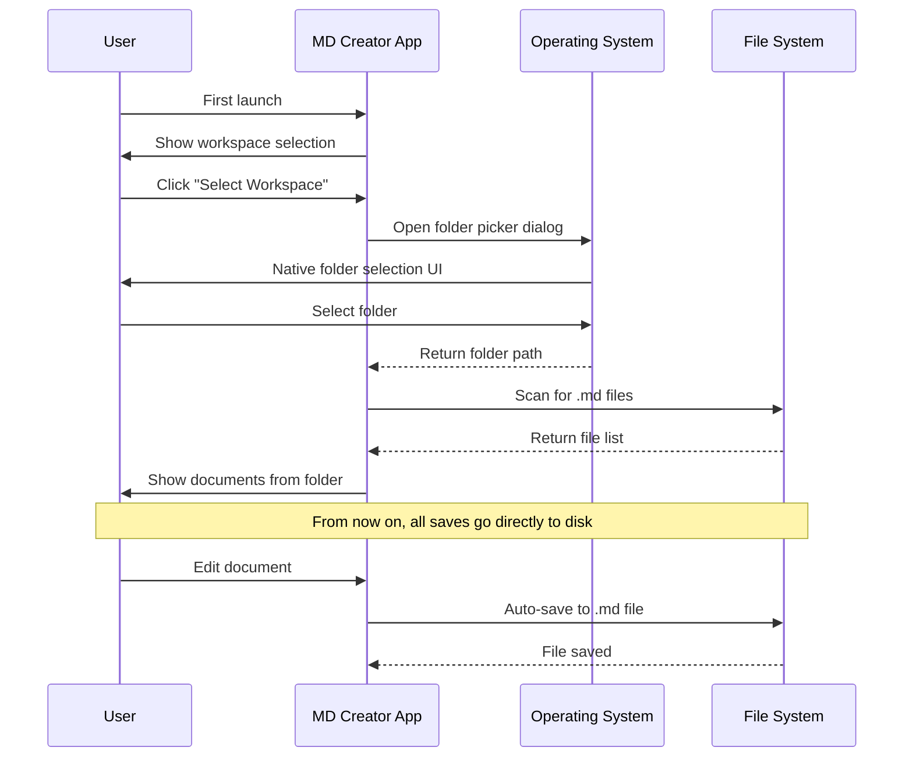
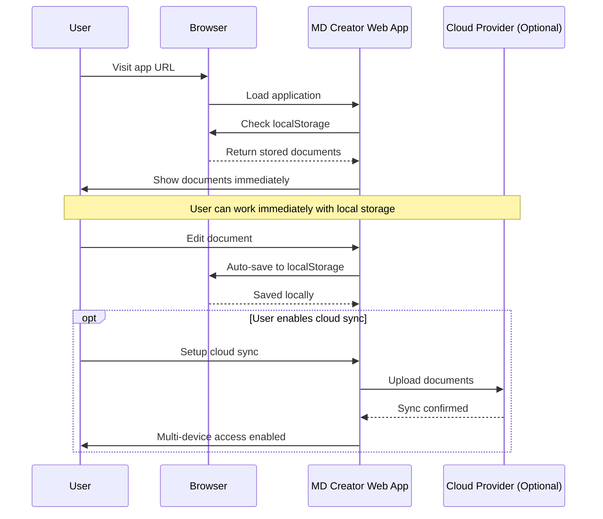

# 🖥️🌐 Platform Differences: Desktop vs Web

This document explains how MD Creator adapts its behavior, features, and user experience across desktop (Tauri) and web platforms.

## 🎯 Philosophy: Platform-Optimized Experience

Instead of a one-size-fits-all approach, MD Creator provides **platform-native experiences**:

- **🖥️ Desktop**: Full file system access, native performance, offline-first
- **🌐 Web**: Instant access, cloud sync options, cross-device compatibility

## 📊 Feature Comparison Matrix

| Feature | Desktop (Tauri) | Web (Browser) | Notes |
|---------|----------------|---------------|-------|
| **🗂️ File Storage** | Native file system | localStorage + cloud sync | Desktop = unlimited, Web = ~10MB local |
| **📁 Workspace Management** | Folder selection | Virtual workspace | Desktop picks real folders |
| **💾 Auto-save** | Direct to `.md` files | Browser storage | Desktop creates actual files |
| **🔄 Backup** | User choice (Git, Dropbox) | Export ZIP + cloud sync | Desktop integrates with existing tools |
| **🌐 Offline Access** | Full offline | Cache-dependent | Desktop never needs internet |
| **🚀 Performance** | Native speed | Web-optimized | Desktop = faster, Web = responsive |
| **🔐 Privacy** | Complete local | Local + optional cloud | Desktop never sends data anywhere |
| **📱 Multi-device** | Manual sync | Cloud sync available | Web better for device switching |
| **⚡ Startup Time** | ~2-3 seconds | Instant | Web loads immediately |
| **📦 Installation** | Download & install | Bookmark URL | Web = no installation needed |

## 🔍 Platform Detection & Adaptation

### **Automatic Platform Detection**

```javascript
// Platform detection in code
const isDesktop = () => window.__TAURI__ !== undefined
const platform = isDesktop() ? 'desktop' : 'web'

// Automatic adaptation
const documentsStore = useDocumentsStore()
await documentsStore.initialize() // Adapts behavior automatically
```

### **Runtime Behavior Switching**



## 🖥️ Desktop Platform (Tauri)

### **File System Integration**

**Direct File Access:**
```javascript
// Save document directly to file system
await invoke('save_document_to_file', {
  filePath: '/Users/john/Documents/notes/project.md',
  content: '# Project Plan\n\nThis is my project...'
})
// Result: Actual .md file created on disk
```

**Native Workspace Management:**
```javascript
// Open native folder picker
const workspacePath = await invoke('select_workspace_folder')
// Result: "/Users/john/Documents/my-notes"

// List real files in folder
const files = await invoke('list_workspace_files', { workspacePath })
// Result: Array of actual .md files and folders
```

### **Desktop-Specific Features**

| Feature | Implementation | User Benefit |
|---------|----------------|--------------|
| **Workspace Folder Selection** | Native OS folder picker | Choose any folder on computer |
| **Real File Creation** | Direct filesystem writes | Files work with any editor |
| **Native Auto-save** | Write to disk on changes | No data loss, works offline |
| **Git Integration** | Files are in chosen folder | Version control just works |
| **Backup Integration** | User's existing backup solution | Dropbox, OneDrive, etc. sync automatically |
| **No Size Limits** | Limited only by disk space | Store unlimited documents |
| **Native Performance** | Rust backend + native UI | Faster than web version |

### **Desktop User Experience Flow**



### **Desktop Advantages**

✅ **File System Native**: Works like VS Code, Obsidian, or any native app  
✅ **No Accounts Required**: No sign-ups, no servers, no auth complexity  
✅ **Unlimited Storage**: Only limited by available disk space  
✅ **Complete Privacy**: Files never leave your machine unless you choose  
✅ **Tool Integration**: Works with Git, backup tools, cloud folders  
✅ **Offline First**: Never needs internet connection  
✅ **Performance**: Native Rust backend for fast file operations  

## 🌐 Web Platform (Browser)

### **Browser Storage System**

**LocalStorage Integration:**
```javascript
// Save to browser storage
const documents = [
  { id: 1, name: "Project", content: "# My Project..." }
]

localStorage.setItem('md-creator-documents', JSON.stringify({
  documents,
  storage: { 
    version: '1.0',
    lastSync: new Date().toISOString()
  }
}))
```

**Export Capability:**
```javascript
// Export as ZIP for backup
import JSZip from 'jszip'

const zip = new JSZip()
documents.forEach(doc => {
  zip.file(`${doc.name}.md`, doc.content)
})

const blob = await zip.generateAsync({ type: 'blob' })
// User downloads: md-creator-documents.zip
```

### **Web-Specific Features**

| Feature | Implementation | User Benefit |
|---------|----------------|--------------|
| **Instant Access** | No installation required | Open URL and start writing |
| **Cross-Device Sync** | Cloud provider integration | Access from any device |
| **Export/Import** | ZIP download/upload | Easy backup and migration |
| **Share Links** | Document sharing URLs | Collaboration features (future) |
| **Version History** | Cloud-based versioning | Never lose changes |
| **Device Independence** | Works on any modern browser | No platform restrictions |

### **Web Storage Tiers**

#### **Tier 1: Local Storage (Default)**
```javascript
// Automatic local storage
const webStorage = {
  documents: [...],
  settings: { theme: 'light', autoSave: true },
  lastSync: null,
  version: '1.0'
}

// Persisted across browser sessions
localStorage.setItem('md-creator', JSON.stringify(webStorage))
```

**Benefits:**
- ✅ No setup required
- ✅ Works immediately  
- ✅ Private to user's browser
- ✅ Fast access

**Limitations:**
- ⚠️ ~10MB storage limit
- ⚠️ Single device only
- ⚠️ Lost if browser data cleared

#### **Tier 2: Cloud Sync (Optional)**
```javascript
// GitHub Gist integration
const cloudSync = {
  provider: 'github',
  config: {
    token: 'ghp_xxxxxxxxxxxx',
    gistId: 'private-gist-id',
    autoSync: true
  }
}

// Automatic sync on changes
await syncToCloud(documents, cloudSync)
```

**Supported Providers:**
- **GitHub Gist**: Private gists for document storage
- **Dropbox**: File sync via Dropbox API  
- **Google Drive**: Google Drive API integration

**Benefits:**
- ✅ Multi-device access
- ✅ Automatic backups
- ✅ Larger storage limits
- ✅ Simple token-based auth

### **Web User Experience Flow**



### **Web Advantages**

✅ **Zero Installation**: Open URL and start working immediately  
✅ **Cross-Platform**: Works on any device with a modern browser  
✅ **Automatic Updates**: Always latest version  
✅ **Multi-Device**: Optional cloud sync for device switching  
✅ **Sharing Ready**: Built for collaboration features  
✅ **Low Commitment**: Try without installing anything  

## 🔄 Migration Between Platforms

### **Web → Desktop Migration**

```javascript
// 1. Export from web
const exportDocuments = () => {
  const documents = JSON.parse(localStorage.getItem('md-creator-documents'))
  const zip = new JSZip()
  
  documents.forEach(doc => {
    zip.file(`${doc.name}.md`, doc.content)
  })
  
  return zip.generateAsync({ type: 'blob' })
}

// 2. User downloads ZIP file
// 3. User installs desktop app
// 4. User extracts ZIP to chosen workspace folder
// 5. Desktop app automatically discovers files
```

### **Desktop → Web Migration**

```javascript
// 1. Copy .md files from workspace folder
// 2. Open web app
// 3. Import documents (drag & drop or file picker)
// 4. Optionally set up cloud sync

const importDocuments = (files) => {
  const documents = files.map(file => ({
    id: Date.now() + Math.random(),
    name: file.name.replace('.md', ''),
    content: file.content,
    lastModified: new Date()
  }))
  
  localStorage.setItem('md-creator-documents', JSON.stringify({ documents }))
}
```

## ⚡ Performance Characteristics

### **Desktop Performance**

| Operation | Desktop (Tauri) | Notes |
|-----------|----------------|--------|
| **App Startup** | 2-3 seconds | Native binary startup |
| **File Loading** | < 100ms | Direct filesystem access |
| **Document Save** | < 50ms | Native file write |
| **Search** | < 10ms | Native string operations |
| **Large Files** | No limit | Limited only by RAM |
| **Concurrent Operations** | Unlimited | Native threading |

### **Web Performance**

| Operation | Web (Browser) | Notes |
|-----------|---------------|-------|
| **App Startup** | Instant | Already loaded in browser |
| **File Loading** | < 50ms | localStorage access |
| **Document Save** | < 20ms | In-memory storage |
| **Search** | < 50ms | JavaScript operations |
| **Large Files** | ~10MB limit | localStorage constraints |
| **Concurrent Operations** | Limited | Single-threaded JavaScript |

## 🎯 When to Choose Which Platform

### **Choose Desktop When:**

✅ **You work with large documents** (>1MB each)  
✅ **You want unlimited storage** (GB+ of documents)  
✅ **You need offline access** (no internet dependency)  
✅ **You use version control** (Git integration)  
✅ **You have existing backup solutions** (Dropbox, OneDrive)  
✅ **You prefer native app performance**  
✅ **You want complete privacy** (no cloud dependency)  

### **Choose Web When:**

✅ **You switch between devices frequently**  
✅ **You want instant access** (no installation)  
✅ **You prefer cloud-based workflows**  
✅ **You need to share/collaborate** (future features)  
✅ **You're trying the app** (low commitment)  
✅ **You use public/shared computers**  
✅ **You want automatic updates**  

### **Use Both When:**

✅ **Primary work on desktop** + **quick edits on mobile/web**  
✅ **Home desktop** + **work web browser**  
✅ **Local development** + **shared review documents**  

## 🔮 Future Platform Enhancements

### **Desktop Roadmap**

- **📱 Mobile App**: React Native version with file sync
- **🔗 Deep Linking**: Open files from other apps
- **🖼️ Rich Media**: Images, PDFs, embedded content
- **🔍 Global Search**: Search across all workspace files
- **📊 File Analytics**: Document metrics and insights

### **Web Roadmap**

- **👥 Real-time Collaboration**: Multiple users editing simultaneously
- **💬 Comments System**: Feedback and review workflows
- **📋 Team Workspaces**: Shared document collections
- **🔄 Advanced Sync**: Conflict resolution, merge strategies
- **📱 PWA Features**: Install as app, offline support

---

## 📚 Related Documentation

- [Storage & Auth System](storage-auth-system.md)
- [Development Setup](../development/setup.md)
- [Tauri Commands API](../api/tauri-commands.md)

**Last Updated**: September 2024  
**Next Review**: October 2024
