# 🗄️ Storage & Authentication Architecture

This document explains how MD Creator handles file storage and authentication across desktop and web platforms.

## 🎯 Core Philosophy

**Different platforms deserve different solutions.** Instead of forcing a one-size-fits-all approach, we implement platform-optimized storage strategies:

- **🖥️ Desktop**: Direct file system access (like VS Code, Obsidian)
- **🌐 Web**: Progressive storage options (localStorage → cloud sync)

## 📊 Architecture Overview

```mermaid
flowchart TD
    A[User Opens MD Creator] --> B{Platform Detection}
    B -->|Desktop/Tauri| C[🖥️ Native File System]
    B -->|Web Browser| D[🌐 Browser Storage]
    
    C --> E[Workspace Folder Selection]
    E --> F[Direct File Access]
    F --> G[Auto-save to .md files]
    G --> H[Native file management]
    
    D --> I{Storage Strategy}
    I -->|Local Only| J[📱 Browser LocalStorage]
    I -->|Cloud Sync| K[☁️ Cloud Integration]
    
    J --> L[Export ZIP backups]
    K --> M[GitHub Gist / Dropbox]
    K --> N[Multi-device sync]
    
    style C fill:#e1f5fe
    style D fill:#fff3e0
    style F fill:#e8f5e8
    style J fill:#fff9c4
    style K fill:#f3e5f5
```



## 🖥️ Desktop Platform (Tauri)

### **No Authentication Required**

Desktop version uses direct file system access - no user accounts, no servers, no auth complexity.

### **Workspace Folder Approach**

```typescript
// User selects any folder on their system
const workspacePath = await invoke('select_workspace_folder')
// Example: /Users/john/Documents/my-notes/

// All documents saved as .md files
const document = {
  name: "Project Plan",
  content: "# Project Plan\n\n..."
}
// Saves to: /Users/john/Documents/my-notes/project-plan.md
```

### **File System Operations**

| Operation | Implementation | Security |
|-----------|----------------|----------|
| **Save Document** | Direct file write to workspace | OS file permissions |
| **Load Document** | Direct file read from workspace | OS file permissions |
| **List Files** | Directory traversal (`.md` only) | Sandboxed to workspace |
| **Delete Document** | File system delete | User confirmation |
| **Backup** | User handles (Git, Dropbox, etc.) | User's choice |

### **Desktop Storage Benefits**

✅ **No size limits** - Limited only by available disk space  
✅ **Works offline** - No internet dependency  
✅ **Git-friendly** - Version control just works  
✅ **Backup-friendly** - Use any backup solution  
✅ **Privacy** - Files never leave your machine  
✅ **Performance** - Native file system speed  
✅ **Interoperability** - Open files in any editor  

## 🌐 Web Platform (Browser)

### **Three-Tier Storage Strategy**

#### **Tier 1: Local Storage (Default - No Auth)**

```javascript
// Automatic storage in browser
const documents = [
  { id: 1, name: "Notes", content: "..." }
]

// Persisted in localStorage
localStorage.setItem('md-creator-documents', JSON.stringify({
  documents,
  storage: { lastSync: new Date(), version: '1.0' }
}))

// Export capability
const zip = new JSZip()
documents.forEach(doc => {
  zip.file(`${doc.name}.md`, doc.content)
})
const blob = await zip.generateAsync({ type: 'blob' })
// User downloads: md-creator-export.zip
```

**Benefits**:
- ✅ No setup required
- ✅ Works immediately
- ✅ Private to user's browser
- ✅ Persists between sessions

**Limitations**:
- ⚠️ Single device only
- ⚠️ Browser storage limits (~10MB)
- ⚠️ Lost if browser data cleared

#### **Tier 2: Cloud Sync (Optional - Simple Auth)**

For users who want multi-device access:

```javascript
// GitHub Gist Integration
const cloudSync = {
  provider: 'github',
  auth: {
    token: 'ghp_xxxxxxxxxxxx', // Personal access token
    gistId: 'abc123...'         // Private gist ID
  }
}

// Sync process
await syncToCloud({
  documents: localDocuments,
  provider: cloudSync.provider,
  credentials: cloudSync.auth
})
```

**Supported Providers**:
- **GitHub Gist** - Private gists for document storage
- **Dropbox** - File sync via Dropbox API
- **Google Drive** - Google Drive API integration

**Benefits**:
- ✅ Multi-device sync
- ✅ Automatic backups
- ✅ Larger storage limits
- ✅ Simple token-based auth

#### **Tier 3: Team Collaboration (Future)**

Advanced features for team use:
- Real-time collaboration
- User accounts and permissions
- Comment system
- Change tracking

## 🔧 Implementation Details

### **Platform Detection**

```javascript
// Automatic platform detection
const isDesktop = () => window.__TAURI__ !== undefined
const platform = isDesktop() ? 'desktop' : 'web'

// Store initialization
const documentsStore = useDocumentsStore()
await documentsStore.initialize() // Adapts to platform automatically
```

### **Hybrid Document Store**

Our document store automatically adapts to the platform:

```javascript
// stores/documentsHybrid.js
export const useDocumentsStore = defineStore('documents', () => {
  const platform = ref(isDesktop() ? 'desktop' : 'web')
  
  const saveDocument = async (id) => {
    if (platform.value === 'desktop') {
      // Save to file system
      await invoke('save_document_to_file', { 
        filePath: doc.filePath, 
        content: doc.content 
      })
    } else {
      // Save to localStorage
      localStorage.setItem('md-creator-documents', JSON.stringify(documents.value))
    }
  }
})
```

### **File Operations (Desktop)**

```rust
// src-tauri/src/commands/file_operations.rs

#[command]
pub async fn save_document_to_file(file_path: String, content: String) -> Result<(), String> {
    fs::write(&file_path, content)
        .map_err(|e| format!("Failed to save file: {}", e))
}

#[command]
pub async fn select_workspace_folder() -> Result<String, String> {
    let folder = FileDialogBuilder::new()
        .set_title("Select Workspace Folder")
        .pick_folder();
    
    match folder {
        Some(path) => Ok(path.to_string_lossy().to_string()),
        None => Err("No folder selected".to_string()),
    }
}
```

## 🛡️ Security Considerations

### **Desktop Security**

- **File System Sandboxing**: Limited to user-selected workspace
- **OS Permissions**: Leverages operating system file permissions
- **No Network Access**: Files never transmitted (unless user explicitly syncs)

### **Web Security**

- **LocalStorage Isolation**: Data isolated to domain
- **HTTPS Only**: All cloud sync over encrypted connections
- **Token-Based Auth**: No password storage, revocable tokens
- **CORS Protection**: Proper CORS headers for API calls

## 🚀 User Experience Flows

### **Desktop First-Time Setup**

1. User opens MD Creator desktop app
2. **Workspace Selection Screen** appears
3. Options:
   - **"Select Workspace Folder"** → Opens folder picker
   - **"Start with Demo Content"** → Uses temp storage
4. If folder selected:
   - Scans for existing `.md` files
   - Loads them into document list
   - Auto-saves future changes to folder
5. User starts working immediately

### **Web First-Time Experience**

1. User visits MD Creator web app
2. **Automatic initialization** with localStorage
3. Demo documents loaded immediately
4. User can:
   - Start writing right away
   - Export documents as ZIP
   - Optionally set up cloud sync later

### **Cloud Sync Setup (Web)**

1. User clicks **"Enable Cloud Sync"**
2. Provider selection: GitHub / Dropbox / Google Drive
3. Simple token setup (guided instructions)
4. One-click sync to cloud
5. Automatic sync on changes

## 📊 Storage Comparison

| Feature | Desktop | Web Local | Web Cloud |
|---------|---------|-----------|-----------|
| **Setup Time** | 30 seconds | Instant | 2 minutes |
| **Storage Limit** | Unlimited | ~10MB | 100MB+ |
| **Multi-device** | Manual sync | No | Yes |
| **Offline Access** | Full | Full | Cached |
| **Privacy** | Complete | High | Medium |
| **Backup** | User choice | Export ZIP | Automatic |
| **Collaboration** | Manual | No | Future |

## 🔄 Migration Paths

### **Web → Desktop**

1. Export documents from web app as ZIP
2. Download and install desktop app
3. Create workspace folder
4. Extract ZIP contents to workspace
5. Desktop app automatically discovers files

### **Desktop → Web**

1. Copy `.md` files from workspace
2. Open web app
3. Import documents (drag & drop or paste)
4. Optionally set up cloud sync

## 🎯 Design Decisions

### **Why No Universal Auth?**

**Problem**: Traditional apps force the same auth model everywhere  
**Our Solution**: Platform-appropriate storage strategies

**Benefits**:
- **Desktop users** get native file access without account creation
- **Web users** start immediately, upgrade to cloud if needed
- **Developers** can optimize for each platform's strengths

### **Why Hybrid Storage?**

**Problem**: One storage solution can't be optimal for all platforms  
**Our Solution**: Detect platform and adapt automatically

**Benefits**:
- **Better UX** on each platform
- **Performance** optimized for platform capabilities
- **Future-proof** - can add new platforms easily

## 📈 Future Enhancements

### **Phase 1: Current Implementation**
- ✅ Desktop file system access
- ✅ Web localStorage with export
- ✅ Platform auto-detection

### **Phase 2: Cloud Sync**
- 🔄 GitHub Gist integration
- 🔄 Dropbox API sync
- 🔄 Google Drive support

### **Phase 3: Advanced Features**
- 📅 Real-time collaboration
- 📅 Team workspaces
- 📅 Comment system
- 📅 Change tracking

---

## 📚 Related Documentation

- [Development Setup](../development/setup.md)
- [Tauri Commands API](../api/tauri-commands.md)
- [Building Guide](../development/building.md)

**Last Updated**: September 2024  
**Next Review**: October 2024
